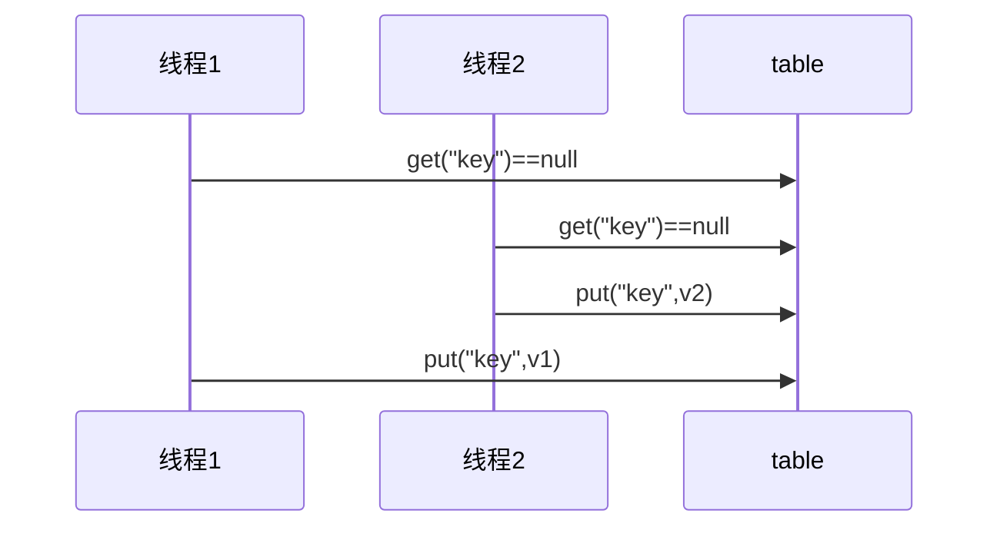

## 3.3 变量的线程安全分析

对于成员变量和静态变量而言：如果没有变量没有在线程间共享，那么变量是安全的。如果变量在线程间共享，且只有读操作则线程安全；如果有读写操作，则这段代码是临界区，需要考虑线程安全。

### 3.3.1 局部变量线程安全分析

对于局部变量而言：

- 局部变量【局部变量被初始化为基本数据类型】是安全的
- 局部变量引用的对象未必是安全的
  - 如果局部变量引用的对象没有引用线程共享的对象，那么是线程安全的
  - 如果局部变量引用的对象引用了一个线程共享的对象，那么要考虑线程安全的

局部变量【局部变量被初始化为基本数据类型】是安全的，示例如下：

```java
public static void test1() {
     int i = 10;
     i++;
}
```

每个线程调用 `test1()` 方法时，会在每个线程创建一份栈帧，每个线程的栈帧内存中创建局部变量i，因此不存在共享。


局部变量的引用则有一些不同：

- 如果局部变量引用的对象没有引用线程共享的对象，那么是线程安全的
- 如果局部变量引用的对象引用了一个线程共享的对象，那么要考虑线程安全的

首先来看一个成员变量的例子：

```java
class ThreadUnsafe {
    ArrayList<String> list = new ArrayList<>();
    public void method1(int loopNumber) {
        for (int i = 0; i < loopNumber; i++) {
            // { 临界区, 会产生竞态条件
            method2();
            method3();
            // } 临界区
        }
    }
    private void method2() {
        list.add("1");
    }
    private void method3() {
        list.remove(0);
    }
}
```

```java
static final int THREAD_NUMBER = 2;
static final int LOOP_NUMBER = 200;
public static void main(String[] args) {
    ThreadUnsafe test = new ThreadUnsafe();
    for (int i = 0; i < THREAD_NUMBER; i++) {
        new Thread(() -> {
            test.method1(LOOP_NUMBER);
        }, "Thread" + i).start();
    }
}
```

其中一种情况是，如果线程2 还未 add，线程1 remove 就会报错：

```apl
Exception in thread "Thread1" java.lang.IndexOutOfBoundsException: Index: 0, Size: 0 
     at java.util.ArrayList.rangeCheck(ArrayList.java:657) 
     at java.util.ArrayList.remove(ArrayList.java:496) 
     at cn.itcast.n6.ThreadUnsafe.method3(TestThreadSafe.java:35) 
     at cn.itcast.n6.ThreadUnsafe.method1(TestThreadSafe.java:26) 
     at cn.itcast.n6.TestThreadSafe.lambda$main$0(TestThreadSafe.java:14) 
     at java.lang.Thread.run(Thread.java:748) 
```

分析的原因如下：无论哪个线程中的 method2 引用的都是同一个对象中的 list 成员变量，method3 与 method2 分析相同。


可以将list修改成局部变量，那么就不会有上述问题了

```java
class ThreadSafe {
    public final void method1(int loopNumber) {
        ArrayList<String> list = new ArrayList<>();
        for (int i = 0; i < loopNumber; i++) {
            method2(list);
            method3(list);
        }
    }
    private void method2(ArrayList<String> list) {
        list.add("1");
    }
    private void method3(ArrayList<String> list) {
        list.remove(0);
    }
}
```

分析如下：list 是局部变量，每个线程调用时会创建其不同实例，没有共享。而 method2和method3的参数是从 method1 中传递过来的，与 method1 中引用同一个对象。


接下来来思考一下访问修饰符修改后的影响：如果把 method2 和 method3 的方法修改为 public 会不会导致线程安全问题？

- 情况1：有其它线程调用 method2 和 method3；这种情况没有什么问题，不同的线程创建不同的List对象调用方法，不会出现线程安全问题。
- 情况2：在情况1 的基础上，为 ThreadSafe 类添加子类，子类覆盖 method2 或 method3 方法。这种情况下就会出现线程安全问题。即如下所示：

```java
class ThreadSafe {
    public final void method1(int loopNumber) {
        ArrayList<String> list = new ArrayList<>();
        for (int i = 0; i < loopNumber; i++) {
            method2(list);
            method3(list);
        }
    }
    private void method2(ArrayList<String> list) {
        list.add("1");
    }
    private void method3(ArrayList<String> list) {
        list.remove(0);
    }
}
class ThreadSafeSubClass extends ThreadSafe{
    @Override
    public void method3(ArrayList<String> list) {
        new Thread(() -> {
            list.remove(0);
        }).start();
    }
}
```

 从这个例子可以看出 private 或 final 提供【安全（线程安全）】的意义所在，请体会开闭原则中的【闭】。

### 3.3.2 常见线程安全类

1. String
2. Integer
3. StringBuffer
4. Random
5. Vector
6. Hashtable
7. java.util.concurrent 包下的类

这里说它们是线程安全的是指，多个线程调用它们同一个实例的某个方法时，是线程安全的。也可以理解为它们的每个方法是原子的。查看源码就可以发现，他们的方法都加了synchronized。

**线程安全类方法的组合**

虽然每个方法都是线程安全的，每个方法是原子的，但注意它们多个方法的组合不是原子的，见下面分析：

```java
Hashtable table = new Hashtable();
// 线程1，线程2
if( table.get("key") == null) {
    table.put("key", value);
}
```



**不可变类的线程安全**

`String`和`Integer`类都是不可变的类，因为其类内部状态（属性）是不可改变的，因此它们的方法都是线程安全的。有同学或许有疑问，`String` 有 `replace`，`substring` 等方法【可以】改变值啊，其实调用这些方法返回的已经是一个新创建的对象了！

```java
public class Immutable{
    private int value = 0;
    public Immutable(int value){
        this.value = value;
    }
    public int getValue(){
        return this.value;
    }
    public Immutable add(int v){
        return new Immutable(this.value + v);
    }
}
```

### 3.3.3 示例分析

分析线程是否安全，先对类的成员变量，类变量，局部变量进行考虑，如果变量会在各个线程之间共享，那么就得考虑线程安全问题了，如果变量A引用的是线程安全类的实例，并且只调用该线程安全类的一个方法，那么该变量A是线程安全的的。

示例一：

```java
// Servlet运行在Tomcat中，只有一个运行实例，会被多个线程使用，因此存在共享问题。接下来我们具体分析一下：
public class MyServlet extends HttpServlet {
    // 是否安全？ 否，线程安全的是Hashtable，HashMap不是线程安全的。
    Map<String,Object> map = new HashMap<>();
    // 是否安全？ 是，字符串不可变，线程安全的。
    String S1 = "...";
    // 是否安全？ 是，final字符串，线程安全。
    final String S2 = "...";
    // 是否安全？ 否，日期类Date不是线程安全的，该方法被多个线程共享。
    Date D1 = new Date();
    // 是否安全？ 否，日期类可变，里面有属性可以被修改，不是线程安全的。
    final Date D2 = new Date();

    public void doGet(HttpServletRequest request, HttpServletResponse response) {
        // 使用上述变量
    }
}
```

实例二：

```java
public class MyServlet extends HttpServlet {
    // 是否安全？ 否，不是线程安全的，servelt只有一份实例对象，userService是成员变量，所以也是只有一份。所以会存在多线程共享使用，所以会出现线程安全问题。
    private UserService userService = new UserServiceImpl();

    public void doGet(HttpServletRequest request, HttpServletResponse response) {
        userService.update(...);
    }
}
public class UserServiceImpl implements UserService {
    // 记录调用次数
    private int count = 0;

    public void update() {
        // ...
        count++;
    }
}
```

实例三：

此类不是线程安全的，`MyAspect`切面类只有一个实例，成员变量`start` 会被多个线程同时进行读写操作

```java
@Aspect
@Component
public class MyAspect {
    // 是否安全？ 否，该类是单例的，所以成员变量也是单例的，所以会被多个线程进行操作。
    private long start = 0L;

    @Before("execution(* *(..))")
    public void before() {
        start = System.nanoTime();
    }

    @After("execution(* *(..))")
    public void after() {
        long end = System.nanoTime();
        System.out.println("cost time:" + (end-start));
    }
}
```

示例四：

此例是典型的三层模型调用，`MyServlet` `UserServiceImpl` `UserDaoImpl`类都只有一个实例。我们从下向上一层一层的看：

* `UserDaoImpl`类中没有成员变量，因此不存在被修改操作，不会被修改属性（也就是状态），因此即使多线程也不会存在线程安全问题。而对于Connection它是属于方法内的局部变量，每次线程访问都会独自创建一个对象，所以不会存在线程安全问题。
* `UserServiceImpl`类中只有一个线程安全的`UserDaoImpl`类的实例，虽然该实例是成员变量，但是它里面没有什么可以被修改的，所以是线程安全的。
* 同理 `MyServlet`也是线程安全的。

```java
public class MyServlet extends HttpServlet {
    // 是否安全
    private UserService userService = new UserServiceImpl();

    public void doGet(HttpServletRequest request, HttpServletResponse response) {
        userService.update(...);
    }
}
public class UserServiceImpl implements UserService {
    // 是否安全
    private UserDao userDao = new UserDaoImpl();
    public void update() {
        userDao.update();
    }
}
public class UserDaoImpl implements UserDao {
    public void update() {
        String sql = "update user set password = ? where username = ?";
        // 是否安全
        try (Connection conn = DriverManager.getConnection("","","")){
            // ...
        } catch (Exception e) {
            // ...
        }
    }
}
```

实例五：

跟示例四大体相似，`UserDaoImpl`类中有成员变量，那么多个线程可以对成员变量`conn` 同时进行操作，故是不安全的。三个都是线程不安全。

```java
public class MyServlet extends HttpServlet {
    // 是否安全
    private UserService userService = new UserServiceImpl();

    public void doGet(HttpServletRequest request, HttpServletResponse response) {
        userService.update(...);
    }
}
public class UserServiceImpl implements UserService {
    // 是否安全
    private UserDao userDao = new UserDaoImpl();
    public void update() {
        userDao.update();
    }
}
public class UserDaoImpl implements UserDao {
    // 是否安全
    private Connection conn = null;
    public void update() throws SQLException {
        String sql = "update user set password = ? where username = ?";
        conn = DriverManager.getConnection("","","");
        // ...
        conn.close();
    }
}
```

示例六：

跟示例五大体相似，`UserServiceImpl`类的update方法中 UserDao是作为局部变量存在的，所以每个线程访问的时候都会新建有一个`UserDao`对象，新建的对象是线程独有的，所以是线程安全的。

就这个例子而言，可以这么写，但是不推荐，这样有隐患。

```java
public class MyServlet extends HttpServlet {
    // 是否安全
    private UserService userService = new UserServiceImpl();
    public void doGet(HttpServletRequest request, HttpServletResponse response) {
        userService.update(...);
    }
}
public class UserServiceImpl implements UserService {
    // 是否安全 是，线程安全。
    public void update() {
        UserDao userDao = new UserDaoImpl();
        userDao.update();
    }
}
public class UserDaoImpl implements UserDao {
    // 是否安全
    private Connection = null;
    public void update() throws SQLException {
        String sql = "update user set password = ? where username = ?";
        conn = DriverManager.getConnection("","","");
        // ...
        conn.close();
    }
}
```

示例七：

```java
public abstract class Test {
    public void bar() {
        // 是否安全 否，虽然是局部变量，但是暴露给了foo方法，就有可能暴露给其他线程。
        SimpleDateFormat sdf = new SimpleDateFormat("yyyy-MM-dd HH:mm:ss");
        foo(sdf);
    }
    public abstract foo(SimpleDateFormat sdf);
    public static void main(String[] args) {
        new Test().bar();
    }
}
```

其中 foo 的行为是不确定的，可能导致不安全的发生，被称之为**外星方法**，因为foo方法可以被重写，导致线程不安全。在String类中就考虑到了这一点，String类是`finally`的，子类不能重写它的方法。

```java
public void foo(SimpleDateFormat sdf) {
    String dateStr = "1999-10-11 00:00:00";
    for (int i = 0; i < 20; i++) {
        new Thread(() -> {
            try {
                sdf.parse(dateStr);
            } catch (ParseException e) {
                e.printStackTrace();
            }
        }).start();
    }
}
```

## 3.4 练习


## 3.5 Monitor 概念

### 3.5.1 Java 对象头

以 32 位虚拟机为例,普通对象的对象头结构如下，其中的Klass Word为指针，指向对应的Class对象；


数组对象


其中 Mark Word 结构为


所以一个对象的结构如下：


 

### 3.5.2 Monitor 原理

Monitor被翻译为监视器或者说管程

每个java对象都可以关联一个Monitor，如果使用`synchronized`给对象上锁（重量级），该对象头的Mark Word中就被设置为指向Monitor对象的指针


- 刚开始时Monitor中的Owner为null
- 当Thread-2 执行synchronized(obj){}代码时就会将Monitor的所有者Owner 设置为 Thread-2，上锁成功，Monitor中同一时刻只能有一个Owner
- 当Thread-2 占据锁时，如果线程Thread-3，Thread-4也来执行synchronized(obj){}代码，就会进入EntryList中变成BLOCKED状态
- Thread-2 执行完同步代码块的内容，然后唤醒 EntryList 中等待的线程来竞争锁，竞争时是非公平的
- 图中 WaitSet 中的 Thread-0，Thread-1 是之前获得过锁，但条件不满足进入 WAITING 状态的线程，后面讲wait-notify 时会分析

> 注意：synchronized 必须是进入同一个对象的 monitor 才有上述的效果不加 synchronized 的对象不会关联监视器，不遵从以上规则

### 3.5.3 synchronized原理

代码如下 Test17.java

```java
    static final Object lock=new Object();
    static int counter = 0;
    public static void main(String[] args) {
        synchronized (lock) {
            counter++;
        }
    }
```

反编译后的部分字节码

```properties
 0 getstatic #2 <com/concurrent/test/Test17.lock>
 # 取得lock的引用（synchronized开始了）
 3 dup    
 # 复制操作数栈栈顶的值放入栈顶，即复制了一份lock的引用
 4 astore_1
 # 操作数栈栈顶的值弹出，即将lock的引用存到局部变量表中
 5 monitorenter
 # 将lock对象的Mark Word置为指向Monitor指针
 6 getstatic #3 <com/concurrent/test/Test17.counter>
 9 iconst_1
10 iadd
11 putstatic #3 <com/concurrent/test/Test17.counter>
14 aload_1
# 从局部变量表中取得lock的引用，放入操作数栈栈顶
15 monitorexit
# 将lock对象的Mark Word重置，唤醒EntryList
16 goto 24 (+8)
# 下面是异常处理指令，可以看到，如果出现异常，也能自动地释放锁
19 astore_2
20 aload_1
21 monitorexit
22 aload_2
23 athrow
24 return
 
```

> 注意：方法级别的 synchronized 不会在字节码指令中有所体现

### 3.5.4 synchronized 原理进阶

#### 轻量级锁

轻量级锁的使用场景是：如果一个对象虽然有多个线程要对它进行加锁，但是加锁的时间是错开的（也就是没有人可以竞争的），那么可以使用轻量级锁来进行优化。轻量级锁对使用者是透明的，即语法仍然是`synchronized`，假设有两个方法同步块，利用同一个对象加锁

```java
static final Object obj = new Object();
public static void method1() {
     synchronized( obj ) {
         // 同步块 A
         method2();
     }
}
public static void method2() {
     synchronized( obj ) {
         // 同步块 B
     }
}
```

1. 每次指向到synchronized代码块时，都会创建锁记录（Lock Record）对象，每个线程都会包括一个锁记录的结构，锁记录内部可以储存对象的Mark Word和对象引用reference

   1. 

2. 让锁记录中的Object reference指向对象，并且尝试用cas(compare and sweep)替换Object对象的Mark Word ，将Mark Word 的值存入锁记录中

   1. 

3. 如果cas替换成功，那么对象的对象头储存的就是锁记录的地址和状态00，如下所示

   1. 

4. 如果cas失败，有两种情况

   1. 如果是其它线程已经持有了该Object的轻量级锁，那么表示有竞争，将进入锁膨胀阶段
   2. 如果是自己的线程已经执行了synchronized进行加锁，那么那么再添加一条 Lock Record 作为重入的计数
      1. 

5. 当线程退出synchronized代码块的时候，

   如果获取的是取值为 null 的锁记录 

   ，表示有重入，这时重置锁记录，表示重入计数减一

   1. 

6. 当线程退出synchronized代码块的时候，如果获取的锁记录取值不为 null，那么使用cas将Mark Word的值恢复给对象

   1. 成功则解锁成功
   2. 失败，则说明轻量级锁进行了锁膨胀或已经升级为重量级锁，进入重量级锁解锁流程

#### 锁膨胀

如果在尝试加轻量级锁的过程中，cas操作无法成功，这是有一种情况就是其它线程已经为这个对象加上了轻量级锁，这是就要进行锁膨胀，将轻量级锁变成重量级锁。

1. 当 Thread-1 进行轻量级加锁时，Thread-0 已经对该对象加了轻量级锁
   1. 
2. 这时 Thread-1 加轻量级锁失败，进入锁膨胀流程
   1. 即为对象申请Monitor锁，让Object指向重量级锁地址，然后自己进入Monitor 的EntryList 变成BLOCKED状态
   2. 
3. 当Thread-0 推出synchronized同步块时，使用cas将Mark Word的值恢复给对象头，失败，那么会进入重量级锁的解锁过程，即按照Monitor的地址找到Monitor对象，将Owner设置为null，唤醒EntryList 中的Thread-1线程

#### 自旋优化

重量级锁竞争的时候，还可以使用自旋来进行优化，如果当前线程自旋成功（即在自旋的时候持锁的线程释放了锁），那么当前线程就可以不用进行上下文切换就获得了锁

1. 自旋重试成功的情况
   1. 
2. 自旋重试失败的情况，自旋了一定次数还是没有等到持锁的线程释放锁
   1. 

自旋会占用 CPU 时间，单核 CPU 自旋就是浪费，多核 CPU 自旋才能发挥优势。在 Java 6 之后自旋锁是自适应的，比如对象刚刚的一次自旋操作成功过，那么认为这次自旋成功的可能性会高，就多自旋几次；反之，就少自旋甚至不自旋，总之，比较智能。Java 7 之后不能控制是否开启自旋功能

#### 偏向锁

在轻量级的锁中，我们可以发现，如果同一个线程对同一个2对象进行重入锁时，也需要执行CAS操作，这是有点耗时滴，那么java6开始引入了偏向锁的东东，只有第一次使用CAS时将对象的Mark Word头设置为入锁线程ID，**之后这个入锁线程再进行重入锁时，发现线程ID是自己的，那么就不用再进行CAS了**


 

##### 偏向状态


一个对象的创建过程

1. 如果开启了偏向锁（默认是开启的），那么对象刚创建之后，Mark Word 最后三位的值101，并且这是它的Thread，epoch，age都是0，在加锁的时候进行设置这些的值.

2. 偏向锁默认是延迟的，不会在程序启动的时候立刻生效，如果想避免延迟，可以添加虚拟机参数来禁用延迟：-`XX:BiasedLockingStartupDelay=0`来禁用延迟

3. 注意：处于偏向锁的对象解锁后，线程 id 仍存储于对象头中

4. 实验Test18.java，加上虚拟机参数-XX:BiasedLockingStartupDelay=0进行测试

   1. ```java
      public static void main(String[] args) throws InterruptedException {
              Test1 t = new Test1();
              test.parseObjectHeader(getObjectHeader(t))；
              synchronized (t){
                  test.parseObjectHeader(getObjectHeader(t));
              }
              test.parseObjectHeader(getObjectHeader(t));
          }
      ```

      1. 输出结果如下，三次输出的状态码都为101

      ```properties
      biasedLockFlag (1bit): 1
      	LockFlag (2bit): 01
      biasedLockFlag (1bit): 1
      	LockFlag (2bit): 01
      biasedLockFlag (1bit): 1
      	LockFlag (2bit): 01
      ```

       

测试禁用：如果没有开启偏向锁，那么对象创建后最后三位的值为001，这时候它的hashcode，age都为0，hashcode是第一次用到`hashcode`时才赋值的。在上面测试代码运行时在添加 VM 参数`-XX:-UseBiasedLocking`禁用偏向锁（禁用偏向锁则优先使用轻量级锁），退出`synchronized`状态变回001

1. 测试代码Test18.java 虚拟机参数`-XX:-UseBiasedLocking`

2. 输出结果如下，最开始状态为001，然后加轻量级锁变成00，最后恢复成001

   ```properties
   biasedLockFlag (1bit): 0
   	LockFlag (2bit): 01
   LockFlag (2bit): 00
   biasedLockFlag (1bit): 0
   	LockFlag (2bit): 01
   ```

##### 撤销偏向锁-hashcode方法

测试 `hashCode`：当调用对象的hashcode方法的时候就会撤销这个对象的偏向锁，因为使用偏向锁时没有位置存`hashcode`的值了

1. 测试代码如下，使用虚拟机参数

   ```
   -XX:BiasedLockingStartupDelay=0
   ```

    ，确保我们的程序最开始使用了偏向锁！但是结果显示程序还是使用了轻量级锁。 Test20.java

   ```java
       public static void main(String[] args) throws InterruptedException {
           Test1 t = new Test1();
           t.hashCode();
           test.parseObjectHeader(getObjectHeader(t));
    
           synchronized (t){
               test.parseObjectHeader(getObjectHeader(t));
           }
           test.parseObjectHeader(getObjectHeader(t));
       }
   ```

2. 输出结果

   ```properties
   biasedLockFlag (1bit): 0
   	LockFlag (2bit): 01
   LockFlag (2bit): 00
   biasedLockFlag (1bit): 0
   	LockFlag (2bit): 01
   ```

##### 撤销偏向锁-其它线程使用对象

这里我们演示的是偏向锁撤销变成轻量级锁的过程，那么就得满足轻量级锁的使用条件，就是没有线程对同一个对象进行锁竞争，我们使用`wait` 和 `notify` 来辅助实现

1. 代码 Test19.java，虚拟机参数`-XX:BiasedLockingStartupDelay=0`确保我们的程序最开始使用了偏向锁！

2. 输出结果，最开始使用的是偏向锁，但是第二个线程尝试获取对象锁时，发现本来对象偏向的是线程一，那么偏向锁就会失效，加的就是轻量级锁

   ```properties
   biasedLockFlag (1bit): 1
   	LockFlag (2bit): 01
   biasedLockFlag (1bit): 1
   	LockFlag (2bit): 01
   biasedLockFlag (1bit): 1
   	LockFlag (2bit): 01
   biasedLockFlag (1bit): 1
   	LockFlag (2bit): 01
   LockFlag (2bit): 00
   biasedLockFlag (1bit): 0
   	LockFlag (2bit): 01
   ```

    

##### 撤销 - 调用 wait/notify

会使对象的锁变成重量级锁，因为wait/notify方法之后重量级锁才支持

##### 批量重偏向

如果对象被多个线程访问，但是没有竞争，这时候偏向了线程一的对象又有机会重新偏向线程二，即可以不用升级为轻量级锁，可这和我们之前做的实验矛盾了呀，其实要实现重新偏向是要有条件的：就是超过20对象对同一个线程如线程一撤销偏向时，那么第20个及以后的对象才可以将撤销对线程一的偏向这个动作变为将第20个及以后的对象偏向线程二。Test21.java

 

 

## 3.6 wait和notify

建议先看看wait和notify方法的javadoc文档

#### sleep(long n) 和 wait(long n) 的区别

1. sleep是Thread方法，而wait是Object的方法
2. sleep不需要强制和synchronize配合使用，但wait需要和synchronize一起用
3. sleep在睡眠的同时，不会释放对象锁的，但wait在等待的时候会释放对象锁
4. 他们的状态都是`TIMED_WAITING`

### 4.6.1同步模式之保护性暂停

即 Guarded Suspension，用在一个线程等待另一个线程的执行结果，要点：

1. 有一个结果需要从一个线程传递到另一个线程，让他们关联同一个 GuardedObject
2. 如果有结果不断从一个线程到另一个线程那么可以使用消息队列（见生产者/消费者）
3. JDK 中，join 的实现、Future 的实现，采用的就是此模式
4. 因为要等待另一方的结果，因此归类到同步模式

代码：Test22.java Test23.java这是带超时时间的


Test23.java中jiang'dao'de关于超时的增强，在join(long millis) 的源码中得到了体现：

```java
    public final synchronized void join(long millis)
    throws InterruptedException {
        long base = System.currentTimeMillis();
        long now = 0;
 
        if (millis < 0) {
            throw new IllegalArgumentException("timeout value is negative");
        }
		
        if (millis == 0) {
            while (isAlive()) {
                wait(0);
            }
        } else {
        // join一个指定的时间
            while (isAlive()) {
                long delay = millis - now;
                if (delay <= 0) {
                    break;
                }
                wait(delay);
                now = System.currentTimeMillis() - base;
            }
        }
    }
```

 

多任务版 GuardedObject图中 Futures 就好比居民楼一层的信箱（每个信箱有房间编号），左侧的 t0，t2，t4 就好比等待邮件的居民，右侧的 t1，t3，t5 就好比邮递员如果需要在多个类之间使用 GuardedObject 对象，作为参数传递不是很方便，因此设计一个用来解耦的中间类，这样不仅能够解耦【结果等待者】和【结果生产者】，还能够同时支持多个任务的管理。和生产者消费者模式的区别就是：这个生产者和消费者之间是一一对应的关系，但是生产者消费者模式并不是。rpc框架的调用中就使用到了这种模式。 Test24.java


 

 

### 4.6.2异步模式之生产者/消费者

要点

1. 与前面的保护性暂停中的 GuardObject 不同，不需要产生结果和消费结果的线程一一对应
2. 消费队列可以用来平衡生产和消费的线程资源
3. 生产者仅负责产生结果数据，不关心数据该如何处理，而消费者专心处理结果数据
4. 消息队列是有容量限制的，满时不会再加入数据，空时不会再消耗数据
5. JDK 中各种[阻塞队列](https://blog.csdn.net/yanpenglei/article/details/79556591)，采用的就是这种模式

“异步”的意思就是生产者产生消息之后消息没有被立刻消费，而“同步模式”中，消息在产生之后被立刻消费了。


我们写一个线程间通信的消息队列，要注意区别，像rabbit mq等消息框架是进程间通信的。

 

## 3.7 park & unpack

### 4.7.1 基本使用

它们是 LockSupport 类中的方法 Test26.java

```java
// 暂停当前线程
LockSupport.park();
// 恢复某个线程的运行
LockSupport.unpark;
```

 

### 4.7.2 park unpark 原理

每个线程都有自己的一个 Parker 对象，由三部分组成 _counter， _cond和 _mutex

1. 打个比喻线程就像一个旅人，Parker 就像他随身携带的背包，条件变量 _ cond就好比背包中的帐篷。_counter 就好比背包中的备用干粮（0 为耗尽，1 为充足）
2. 调用 park 就是要看需不需要停下来歇息
   1. 如果备用干粮耗尽，那么钻进帐篷歇息
   2. 如果备用干粮充足，那么不需停留，继续前进
3. 调用 unpark，就好比令干粮充足
   1. 如果这时线程还在帐篷，就唤醒让他继续前进
   2. 如果这时线程还在运行，那么下次他调用 park 时，仅是消耗掉备用干粮，不需停留继续前进
      1. 因为背包空间有限，多次调用 unpark 仅会补充一份备用干粮

可以不看例子，直接看实现过程

#### 先调用park再调用upark的过程

1.先调用park

1. 当前线程调用 Unsafe.park() 方法
2. 检查 _counter ，本情况为 0，这时，获得 _mutex 互斥锁(mutex对象有个等待队列 _cond)
3. 线程进入 _cond 条件变量阻塞
4. 设置 _counter = 0


2.调用upark

1. 调用 Unsafe.unpark(Thread_0) 方法，设置 _counter 为 1
2. 唤醒 _cond 条件变量中的 Thread_0
3. Thread_0 恢复运行
4. 设置 _counter 为 0


#### 先调用upark再调用park的过程

1. 调用 Unsafe.unpark(Thread_0) 方法，设置 _counter 为 1
2. 当前线程调用 Unsafe.park() 方法
3. 检查 _counter ，本情况为 1，这时线程无需阻塞，继续运行
4. 设置 _counter 为 0


 

## 3.8 线程状态转换


1. RUNNABLE <--> WAITING

   1. 线程用synchronized(obj)获取了对象锁后
      1. 调用obj.wait()方法时，t 线程从RUNNABLE --> WAITING
      2. 调用obj.notify()，obj.notifyAll()，t.interrupt()时
         1. 竞争锁成功，t 线程从WAITING --> RUNNABLE
         2. 竞争锁失败，t 线程从WAITING --> BLOCKED
   2. Test27.java

2. RUNNABLE <--> WAITING

   1. 当前线程调用 LockSupport.park() 方法会让当前线程从 RUNNABLE --> WAITING
   2. 调用 LockSupport.unpark(目标线程) 或调用了线程 的 interrupt() ，会让目标线程从 WAITING --> RUNNABLE

3. RUNNABLE <--> WAITING

   1. 当前线程调用 t.join() 方法时，当前线程从 RUNNABLE --> WAITING 注意是当前线程在t 线程对象的监视器上等待
   2. t 线程运行结束，或调用了当前线程的 interrupt() 时，当前线程从 WAITING --> RUNNABLE

4. RUNNABLE <--> TIMED_WAITING

   t 线程用 synchronized(obj) 获取了对象锁后

   1. 调用 obj.wait(long n) 方法时，t 线程从 RUNNABLE --> TIMED_WAITING
   2. t 线程等待时间超过了 n 毫秒，或调用 obj.notify() ， obj.notifyAll() ， t.interrupt() 时
      1. 竞争锁成功，t 线程从 TIMED_WAITING --> RUNNABLE
      2. 竞争锁失败，t 线程从 TIMED_WAITING --> BLOCKED

5. RUNNABLE <--> TIMED_WAITING

   1. 当前线程调用 t.join(long n) 方法时，当前线程从 RUNNABLE --> TIMED_WAITING 注意是当前线程在t 线程对象的监视器上等待
   2. 当前线程等待时间超过了 n 毫秒，或t 线程运行结束，或调用了当前线程的 interrupt() 时，当前线程从 TIMED_WAITING --> RUNNABLE

6. RUNNABLE <--> TIMED_WAITING

   1. 当前线程调用 Thread.sleep(long n) ，当前线程从 RUNNABLE --> TIMED_WAITING
   2. 当前线程等待时间超过了 n 毫秒或调用了线程 的 interrupt() ，当前线程从 TIMED_WAITING --> RUNNABLE

7. RUNNABLE <--> TIMED_WAITING

   1. 当前线程调用 LockSupport.parkNanos(long nanos) 或 LockSupport.parkUntil(long millis) 时，当前线 程从 RUNNABLE --> TIMED_WAITING
   2. 调用 LockSupport.unpark(目标线程) 或调用了线程 的 interrupt() ，或是等待超时，会让目标线程从 TIMED_WAITING--> RUNNABLE

    

 

## 3.9 活跃性

活跃性相关的一系列问题都可以用ReentrantLock进行解决。

### 4.9.1 死锁

有这样的情况：一个线程需要同时获取多把锁，这时就容易发生死锁t1 线程获得A对象锁，接下来想获取B对象的锁；t2 线程获得B对象锁，接下来想获取A对象的锁例。Test28.java

### 4.9.2 检测死锁

检测死锁可以使用 jconsole工具；或者使用 jps 定位进程 id，再用 jstack 定位死锁：Test28.java

下面使用jstack工具进行演示

```
D:\我的项目\JavaLearing\java并发编程\jdk8>jps
1156 RemoteMavenServer36
20452 Test25
9156 Launcher
23544 Jps
23848
22748 Test28
 
D:\我的项目\JavaLearing\java并发编程\jdk8>jstack 22748
2020-07-12 18:54:44
Full thread dump Java HotSpot(TM) 64-Bit Server VM (25.211-b12 mixed mode):
 
"DestroyJavaVM" #14 prio=5 os_prio=0 tid=0x0000000002a03800 nid=0x5944 waiting on condition [0x0000000000000000]
   java.lang.Thread.State: RUNNABLE
 
//................省略了大部分内容.............//
Found one Java-level deadlock:
=============================
"线程二":
  waiting to lock monitor 0x0000000002afc0e8 (object 0x00000000db9f76d0, a java.lang.Object),
  which is held by "线程1"
"线程1":
  waiting to lock monitor 0x0000000002afe1e8 (object 0x00000000db9f76e0, a java.lang.Object),
  which is held by "线程二"
 
Java stack information for the threads listed above:
===================================================
"线程二":
        at com.concurrent.test.Test28.lambda$main$1(Test28.java:39)
        - waiting to lock <0x00000000db9f76d0> (a java.lang.Object)
        - locked <0x00000000db9f76e0> (a java.lang.Object)
        at com.concurrent.test.Test28$$Lambda$2/326549596.run(Unknown Source)
        at java.lang.Thread.run(Thread.java:748)
"线程1":
        at com.concurrent.test.Test28.lambda$main$0(Test28.java:23)
        - waiting to lock <0x00000000db9f76e0> (a java.lang.Object)
        - locked <0x00000000db9f76d0> (a java.lang.Object)
        at com.concurrent.test.Test28$$Lambda$1/1343441044.run(Unknown Source)
        at java.lang.Thread.run(Thread.java:748)
 
 
```

 

### 4.9.3 哲学家就餐问题


有五位哲学家，围坐在圆桌旁。 他们只做两件事，思考和吃饭，思考一会吃口饭，吃完饭后接着思考。 吃饭时要用两根筷子吃，桌上共有 5 根筷子，每位哲学家左右手边各有一根筷子。 如果筷子被身边的人拿着，自己就得等待 Test29.java

当每个哲学家即线程持有一根筷子时，他们都在等待另一个线程释放锁，因此造成了死锁。这种线程没有按预期结束，执行不下去的情况，归类为【活跃性】问题，除了死锁以外，还有活锁和饥饿者两种情 况

### 4.9.4 饥饿

很多教程中把饥饿定义为，一个线程由于优先级太低，始终得不到 CPU 调度执行，也不能够结束，饥饿的情况不易演示，讲读写锁时会涉及饥饿问题下面我讲一下一个线程饥饿的例子，先来看看使用顺序加锁的方式解决之前的死锁问题，就是两个线程对两个不同的对象加锁的时候都使用相同的顺序进行加锁。 但是会产生饥饿问题Test29


顺序加锁的解决方案


 

## 3.10 ReentrantLock

相对于 synchronized 它具备如下特点

1. 可中断
2. 可以设置超时时间
3. 可以设置为公平锁
4. 支持多个条件变量，即对与不满足条件的线程可以放到不同的集合中等待

与 synchronized 一样，都支持可重入

基本语法

```java
// 获取锁
reentrantLock.lock();
try {
 // 临界区
} finally {
 // 释放锁
 reentrantLock.unlock();
}
 
```

### 可重入

可重入是指同一个线程如果首次获得了这把锁，那么因为它是这把锁的拥有者，因此有权利再次获取这把锁。如果是不可重入锁，那么第二次获得锁时，自己也会被锁挡住

 

### 可打断

直接看例子：Test31.java

```java
/**
 * 测试使用lock.lock加锁时线程被打断时的效果
 */
public class Test31 {
 
 
    public static void main(String[] args) {
        ReentrantLock lock = new ReentrantLock();
    
 
        new Thread(()->{
            lock.lock();
            try{
                utils.sleep(20);
            }finally {
                lock.unlock();
            }
        }).start();
 
        new Thread(()->{
            lock.lock();
            try{
                utils.sleep(20);
            }finally {
                lock.unlock();
            }
        },"线程一").start();
 
        new Thread(()->{
            lock.lock();
            try{
                utils.sleep(20);
            }finally {
                lock.unlock();
            }
        },"线程一").start();
 
        Thread t1 = new Thread(()->{
            lock.lock();
            try{
//                utils.sleep(20);
                System.out.println(1111);
            }finally {
                lock.unlock();
            }
        },"线程一");
        t1.start();
        
        t1.interrupt(); 
    }
    
}
```

 

### 锁超时

直接看例子：Test32.java

```java
public class Test32 {
 
    public static void main(String[] args) {
 
        Lock lock = new ReentrantLock();
        
        Thread thread = new Thread(() -> {
            try {
                if (!lock.tryLock(2, TimeUnit.SECONDS)){
                    log.debug("获取等待指定时间后失败，返回");
                    // 这里如果出了错不要再往下执行了
                    return;
                }
            } catch (InterruptedException e) {
                e.printStackTrace();
                log.info("被打断啦");
                // 这里如果出了错不要再往下执行了
                return;
            }
            try{
                log.info("执行完啦，获取到了锁，没被打断");
            }finally {
                lock.unlock();
            }
        }, "thread-1");
        log.info("主线程获取");
        lock.lock();
        thread.start();
        try {
            Thread.sleep(500);
        } catch (InterruptedException e) {
            e.printStackTrace();
        }
        log.info("主线程释放锁");
        lock.unlock();
 
        log.info("主线程执行结束");
    }
    
}
```

使用锁超时解决哲学家就餐死锁问题：Test33.java

```java
@Slf4j
/**
 * 使用reentrantlock中的tryLock来获取锁来解决哲学家就餐问题，这样就不会造成死锁！
 */
public class Test33 extends Thread{
 
    public static void main(String[] args) {
        Chopstick2 c1 = new Chopstick2("1");
        Chopstick2 c2 = new Chopstick2("2");
        Chopstick2 c3 = new Chopstick2("3");
        Chopstick2 c4 = new Chopstick2("4");
        Chopstick2 c5 = new Chopstick2("5");
        new Philosopher2("苏格拉底", c1, c2).start();
        new Philosopher2("柏拉图", c2, c3).start();
        new Philosopher2("亚里士多德", c3, c4).start();
        new Philosopher2("赫拉克利特", c4, c5).start();
        new Philosopher2("阿基米德", c5, c1).start();
    }
    
}
 
@Slf4j(topic = "Philosopher")
class Philosopher2 extends Thread{
    Chopstick2 left;
    Chopstick2 right;
    public Philosopher2(String name, Chopstick2 left, Chopstick2 right) {
        super(name);
        this.left = left;
        this.right = right;
    }
    private void eat() {
        log.debug("eating...");
        try {
            Thread.sleep(1000);
        } catch (InterruptedException e) {
            e.printStackTrace();
        }
    }
 
    @Override
    public void run() {
        while (true) {
            try {
                if (left.tryLock(2, TimeUnit.SECONDS)){
                    try {
                        if (right.tryLock(2, TimeUnit.SECONDS)){
                            try {
                                eat();    
                            }finally {
                                right.unlock();
                            }
                        }
                    }finally {
                        left.unlock();
                    }
                }
            } catch (InterruptedException e) {
                e.printStackTrace();
            }
 
 
        }
    }
}
 
class Chopstick2 extends ReentrantLock {
    private String name ;
 
    public Chopstick2(String name) {
        this.name = name;
    }
 
 
    @Override
    public String toString() {
        return "Chopstick{" +
                "name='" + name + '\'' +
                '}';
    }
}
```

 

### 公平锁

synchronized锁中，在entrylist等待的锁在竞争时不是按照先到先得来获取锁的，所以说synchronized锁时不公平的；ReentranLock锁默认是不公平的，但是可以通过设置实现公平锁。本意是为了解决之前提到的饥饿问题，但是公平锁一般没有必要，会降低并发度，使用trylock也可以实现。

 

 

### 条件变量

synchronized 中也有条件变量，就是我们讲原理时那个 waitSet 休息室，当条件不满足时进入 waitSet 等待 ReentrantLock 的条件变量比 synchronized 强大之处在于，它是支持多个条件变量的，这就好比

1. synchronized 是那些不满足条件的线程都在一间休息室等消息
2. 而 ReentrantLock 支持多间休息室，有专门等烟的休息室、专门等早餐的休息室、唤醒时也是按休息室来唤 醒

使用要点： Test34.java

1. await 前需要获得锁
2. await 执行后，会释放锁，进入 conditionObject 等待
3. await 的线程被唤醒（或打断、或超时）取重新竞争 lock 锁，执行唤醒的线程爷必须先获得锁
4. 竞争 lock 锁成功后，从 await 后继续执行

 

### 同步模式之顺序控制

1. 固定运行顺序，比如，必须先 2 后 1 打印
   1. wait notify 版 Test35.java
   2. Park Unpark 版 Test36.java
2. 交替输出，线程 1 输出 a 5 次，线程 2 输出 b 5 次，线程 3 输出 c 5 次。现在要求输出 abcabcabcabcabc 怎么实现
   1. wait notify 版 Test37.java
   2. Lock 条件变量版 Test38.java
   3. Park Unpark 版 Test39.java

 

## 本章小结

本章我们需要重点掌握的是

1. 分析多线程访问共享资源时，哪些代码片段属于临界区
2. 使用 synchronized 互斥解决临界区的线程安全问题
   1. 掌握 synchronized 锁对象语法
   2. 掌握 synchronzied 加载成员方法和静态方法语法
   3. 掌握 wait/notify 同步方法
3. 使用 lock 互斥解决临界区的线程安全问题 掌握 lock 的使用细节：可打断、锁超时、公平锁、条件变量
4. 学会分析变量的线程安全性、掌握常见线程安全类的使用
5. 了解线程活跃性问题：死锁、活锁、饥饿
6. 应用方面
   1. **互斥：使用 synchronized 或 Lock 达到共享资源互斥效果，实现原子性效果，保证线程安全。**
   2. **同步：使用 wait/notify 或 Lock 的条件变量来达到线程间通信效果。**
7. 原理方面
   1. monitor、synchronized 、wait/notify 原理
   2. synchronized 进阶原理
   3. park & unpark 原理
8. 模式方面
   1. 同步模式之保护性暂停
   2. 异步模式之生产者消费者
   3. 同步模式之顺序控制

# 问题

 

1. 集合并发遇到的报错 Test24.java [参考博客，未看](https://www.cnblogs.com/snowater/p/8024776.html)