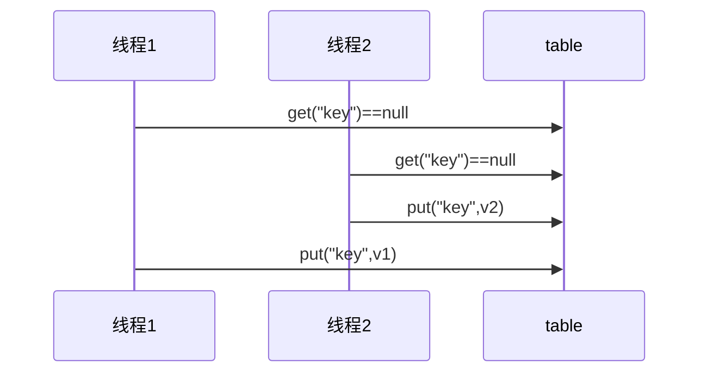

# 第三章 共享模型之管程

- 一个程序运行多线程本身是没有问题的

- 问题出现在多个线程共享资源的时候。多个线程同时对共享资源进行读操作本身也没有问题，但是多个线程对共享资源同时进行读写操作时就有问题了


**临界区**：一段代码内如果存在对共享资源的多线程读写操作，那么称这段代码为临界区。

```java
static int counter = 0;

static void increment()
// 临界区
{
    counter++;
}
static void decrement()
// 临界区
{
    counter--;
}
```

**竞态条件**：多个线程在临界区执行，那么由于代码指令的执行不确定而导致的结果问题，称为竞态条件。

## 3.1 线程安全问题

线程出现问题的根本原因是因为线程上下文切换，导致线程里的指令没有执行完就切换执行其它线程了，下面举一个例子：

```java
public class Demo01 {
    static int count = 0;
    public static void main(String[] args) throws InterruptedException {
        Thread t1 = new Thread(() -> {
            for (int i = 0; i < 5000; i++) {
                count++;
            }
        });

        Thread t2 = new Thread(() -> {
            for (int i = 0; i < 5000; i++) {
                count--;
            }
        });

        t1.start();
        t2.start();
        // 等待t1和t2线程运行完之后再打印count结果值
        t1.join();
        t2.join();
        System.out.println("count: " + count);
    }
}
```

两个线程对初始值为 0 的静态变量一个做自增，一个做自减，各做 5000 次，结果是 0 吗？以上的结果可能是正数、负数、零。为什么呢？因为 Java 中对静态变量的自增，自减并不是原子操作。

例如对于 `i++` 而言（i 为静态变量），实际会产生如下的 JVM 字节码指令：

```java
getstatic i 				// 获取静态变量i的值
iconst_1 					// 准备常量1
iadd 						// 加法
putstatic i 				// 将修改后的值存入静态变量i
```

而对应 `i--` 也是类似：

```java
getstatic i 				// 获取静态变量i的值
iconst_1 					// 准备常量1
isub					 	// 减法
putstatic i 				// 将修改后的值存入静态变量i
```

而 Java 的内存模型如下，完成静态变量的自增，自减需要在主存和线程内存中进行数据交换：


如果是单线程以上 8 行代码是顺序执行（不会交错）没有问题：

```java
// 假设i的初始值为0
getstatic i 		// 线程1-获取静态变量i的值 线程内i=0
iconst_1 			// 线程1-准备常量1
iadd 				// 线程1-自增 线程内i=1
putstatic i 		// 线程1-将修改后的值存入静态变量i 静态变量i=1
getstatic i 		// 线程1-获取静态变量i的值 线程内i=1
iconst_1 			// 线程1-准备常量1
isub 				// 线程1-自减 线程内i=0
putstatic i 		// 线程1-将修改后的值存入静态变量i 静态变量i=0
```


但多线程下这 8 行代码可能交错运行：

出现负数的情况：

```java
// 假设i的初始值为0
getstatic i 		// 线程2-获取静态变量i的值 线程内i=0
iconst_1 			// 线程2-准备常量1
isub 				// 线程2-自减 线程内i=-1
getstatic i 		// 线程1-获取静态变量i的值 线程内i=0
iconst_1 			// 线程1-准备常量1
iadd 				// 线程1-自增 线程内i=1
putstatic i 		// 线程1-将修改后的值存入静态变量i 静态变量i=1
putstatic i 		// 线程2-将修改后的值存入静态变量i 静态变量i=-1
```


出现正数的情况：

```java
// 假设i的初始值为0
getstatic i 			// 线程1-获取静态变量i的值 线程内i=0
iconst_1 				// 线程1-准备常量1
iadd 					// 线程1-自增 线程内i=1
getstatic i 			// 线程2-获取静态变量i的值 线程内i=0
iconst_1 				// 线程2-准备常量1
isub 					// 线程2-自减 线程内i=-1
putstatic i 			// 线程2-将修改后的值存入静态变量i 静态变量i=-1
putstatic i 			// 线程1-将修改后的值存入静态变量i 静态变量i=1
```


## 3.2 synchronized

为了避免临界区中的竞态条件发生，有多种手段可以达到

- 阻塞式解决方案：synchronized ，Lock
- 非阻塞式解决方案：原子变量

现在讨论使用synchronized来进行解决，即俗称的对象锁，它采用互斥的方式让同一时刻至多只有一个线程持有对象锁，其他线程如果想获取这个锁就会阻塞住，这样就能保证拥有锁的线程可以安全的执行临界区内的代码，不用担心线程上下文切换。

虽然 java 中互斥和同步都可以采用 synchronized 关键字来完成，但它们还是有区别的：

- 互斥是保证临界区的竞态条件避免发生，同一时刻只能有一个线程执行临界区的代码。
- 同步是由于线程执行的先后，顺序不同但是需要一个线程等待其它线程运行到某个点。

synchronized语法如下：

```java
synchronized(对象) // 线程1获得锁， 那么线程2的状态是(blocked)
{
 临界区
}
```

### 3.2.1 synchronized语法

将之前的程序使用synchronized后计算的结果就没毛病了，当然因为加了锁，所以肯定会对性能有一定的影响。

```java
public class Demo01 {
    static int count = 0;
    static Object room = new Object();
    public static void main(String[] args) throws InterruptedException {
        Thread t1 = new Thread(() -> {
            for (int i = 0; i < 5000; i++) {
                synchronized(room) {
                    count++;
                }    
            }
        });

        Thread t2 = new Thread(() -> {
            for (int i = 0; i < 5000; i++) {
                synchronized(room) {
                    count--;
                }
            }
        });

        t1.start();
        t2.start();
        // 等待t1和t2线程运行完之后再打印count结果值
        t1.join();
        t2.join();
        System.out.println("count: " + count);
    }
}
```

我们可以做这样的类比：

- `synchronized(对象)` 中的对象，可以想象为一个房间（room），有唯一入口（门）房间只能一次进入一人进行计算，线程 t1，t2 想象成两个人。
- 当线程 t1 执行到 `synchronized(room)` 时就好比 t1 进入了这个房间，并锁住了门拿走了钥匙，在门内执行`count++` 代码。
- 这时候如果 t2 也运行到了 `synchronized(room)` 时，它发现门被锁住了，只能在门外等待。这就是发生了上下文切换，阻塞住了。
- 这中间即使 t1 的 cpu 时间片不幸用完，被踢出了门外（不要错误理解为锁住了对象就能一直执行下去哦），这时门还是锁住的，t1 仍拿着钥匙，t2 线程还在阻塞状态进不来，只有下次轮到 t1 自己再次获得时间片时才能开门进入。
- 当 t1 执行完 `synchronized{}` 块内的代码，这时候才会从 obj 房间出来并解开门上的锁，唤醒 t2 线程把钥匙给他。t2 线程这时才可以进入 obj 房间，锁住了门拿上钥匙，执行它的 `count--` 代码。

synchronized实际上利用对象保证了临界区代码的原子性，临界区内的代码在外界看来是不可分割的，不会被线程切换所打断。

来思考下面的问题

- 如果把 `synchronized(obj)` 放在 for 循环的外面，如何理解？
  原子性，一条count++或者count--对应的字节码是4条，5000此循环绑定在一起，那么就是这2万条指令都被加上了锁。
- 如果 t1 `synchronized(obj1)` 而 t2 `synchronized(obj2)` 会怎样运作？
  锁对象，他们两个分别为不同的对象加了锁，也就相当于进入了不同的房间。根本不会有任何作用。
- 如果 t1 `synchronized(obj)` 而 t2 没有加会怎么样？如何理解？
  锁对象，并没有任何作用。

### 3.2.2 面向对象优化

```java
class Room{
    public int count = 0;

    public void increment() {
        synchronized(this) {
            count++;
        }
    }

    public void decrement() {
        synchronized(this) {
            count--;
        }
    }

    public int getCount() {
        return count;
    }
}
```

```java
@Slf4j
public class Demo01 {

    static Room room = new Room();

    public static void main(String[] args) throws InterruptedException {
        Thread t1 = new Thread(() -> {
            for (int i = 0; i < 5000; i++) {
                room.increment();
            }
        });

        Thread t2 = new Thread(() -> {
            for (int i = 0; i < 5000; i++) {
                room.decrement();
            }
        });

        t1.start();
        t2.start();
        // 等待t1和t2线程运行完之后再打印count结果值
        t1.join();
        t2.join();
        System.out.println("count: " + room.getCount());
    }
}
```

### 3.2.3 方法上的synchronized

> 方法被哪个对象调用，方法中的this就代表那个对象。即谁在调用，this就代表谁。

可以加在两种方法上面，一种是静态方法，另一种是普通方法。

* 加在普通方法上面。这种方法锁住的对象是this对象，this对象就是谁调用我就是谁。

  ```java
  class Test{
      public synchronized void test() {
  
      }
  }
  //等价于
  class Test{
      public void test() {
          synchronized(this) {
  
          }
      }
  }
  ```

* 加在静态方法上面。这种方法锁住的是Class对象。

  ```java
  class Test{
      public synchronized static void test() {
      }
  }
  // 等价于
  class Test{
      public static void test() {
          synchronized(Test.class) {
  
          }
      }
  }
  ```

 不加 synchronzied 的方法就好比不遵守规则的人，不去老实排队（好比翻窗户进去的）

### 3.2.4 线程八锁练习题

其实就是考察 `synchronized` 锁住的是哪个对象

* 情况1，出现的情况为`12 或 21`。

  ```java
  public class Demo02 {
      public static void main(String[] args) {
          Number n1 = new Number();
          new Thread(() -> {
              n1.a();
          }).start();
          new Thread(() -> {
              n1.b();
          }).start();
      }
  }
  ```

  ```java
  @Slf4j
  class Number {
      public synchronized void a() {
          log.debug("1");
      }
  
      public synchronized void b() {
          log.debug("2");
      }
  }
  ```

* 情况2，出现的情况为`1s后12，或 2 1s后 1`

  ```java
  public class Demo02 {
      public static void main(String[] args) {
          Number n1 = new Number();
          new Thread(() -> {
              n1.a();
          }).start();
          new Thread(() -> {
              n1.b();
          }).start();
      }
  }
  ```

  ```java
  @Slf4j
  class Number {
      public synchronized void a() {
          try {
              Thread.sleep(1000);
          } catch (InterruptedException e) {
              e.printStackTrace();
          }
          log.debug("1");
      }
  
      public synchronized void b() {
          log.debug("2");
      }
  }
  ```

* 情况3，出现的情况为`3 1s后 12 或 23 1s后 1 或 32 1s后 1`。没有加上synchronized代表不会出现互斥请款，所以任何时候都可以执行。

  ```java
  public class Demo02 {
      public static void main(String[] args) {
          Number n1 = new Number();
          new Thread(() -> {
              n1.a();
          }).start();
          new Thread(() -> {
              n1.b();
          }).start();
          new Thread(() -> {
              n1.c();
          }).start();
      }
  }
  ```

  ```java
  @Slf4j
  class Number {
      public synchronized void a() {
          try {
              Thread.sleep(1000);
          } catch (InterruptedException e) {
              e.printStackTrace();
          }
          log.debug("1");
      }
  
      public synchronized void b() {
          log.debug("2");
      }
  
      public void c() {
          log.debug("3");
      }
  }
  ```

* 情况4，出现的情况为：`2 1s后 1`。因为加的锁对象都不一样，所以这两个方法不存在互斥。

  ```java
  public class Demo02 {
      public static void main(String[] args) {
          Number n1 = new Number();
          Number n2 = new Number();
          new Thread(() -> {
              n1.a();
          }).start();
          new Thread(() -> {
              n2.b();
          }).start();
      }
  }
  ```

  ```java
  @Slf4j
  class Number {
      public synchronized void a() {
          try {
              Thread.sleep(1000);
          } catch (InterruptedException e) {
              e.printStackTrace();
          }
          log.debug("1");
      }
  
      public synchronized void b() {
          log.debug("2");
      }
  }
  ```

* 情况5，出现的情况为：`2 1s后 1`。静态方法锁住的是Class类对象，普通方法锁住的是方法调用的对象，锁住对象不一样，所以不会出现互斥。

  ```java
  public static void main(String[] args) {
      Number n1 = new Number();
      new Thread(()->{ n1.a(); }).start();
      new Thread(()->{ n1.b(); }).start();
  }
  ```

  ```java
  @Slf4j(topic = "c.Number")
  class Number{
      public static synchronized void a() {
          try {
              Thread.sleep(1000);
          } catch (InterruptedException e) {
              e.printStackTrace();
          }
          log.debug("1");
      }
      public synchronized void b() {
          log.debug("2");
      }
  }
  ```

* 情况6，出现的情况为：`1s后12 或 2 1s后 1`。二者都是静态方法，所以锁住的随想都是Class类对象，互斥。

  ```java
  public static void main(String[] args) {
      Number n1 = new Number();
      new Thread(()->{ n1.a(); }).start();
      new Thread(()->{ n1.b(); }).start();
  }
  ```

  ```java
  @Slf4j(topic = "c.Number")
  class Number{
      public static synchronized void a() {
          try {
              Thread.sleep(1000);
          } catch (InterruptedException e) {
              e.printStackTrace();
          }
          log.debug("1");
      }
      public static synchronized void b() {
          log.debug("2");
      }
  }
  ```

* 情况7，出现的情况为`2 1s后 1`。n1.a()方法锁住的对象是Class类对象，b方法锁住的对象为n2对象，所以二者不会互斥。

  ```java
  public static void main(String[] args) {
      Number n1 = new Number();
      Number n2 = new Number();
      new Thread(()->{ n1.a(); }).start();
      new Thread(()->{ n2.b(); }).start();
  }
  ```

  ```java
  @Slf4j(topic = "c.Number")
  class Number{
      public static synchronized void a() {
          try {
              Thread.sleep(1000);
          } catch (InterruptedException e) {
              e.printStackTrace();
          }
          log.debug("1");
      }
      public synchronized void b() {
          log.debug("2");
      }
  }
  ```

* 情况8，出现的情况为`1s后 12， 或 2 1s后 1`。二者都是静态方法，锁住的都是同一个对象，所以会出现互斥。

  ```java
  public static void main(String[] args) {
      Number n1 = new Number();
      Number n2 = new Number();
      new Thread(()->{ n1.a(); }).start();
      new Thread(()->{ n2.b(); }).start();
  }
  ```

  ```java
  @Slf4j(topic = "c.Number")
  class Number{
      public static synchronized void a() {
          try {
              Thread.sleep(1000);
          } catch (InterruptedException e) {
              e.printStackTrace();
          }
          log.debug("1");
      }
      public static synchronized void b() {
          log.debug("2");
      }
  }
  ```

## 3.3 变量的线程安全分析

对于成员变量和静态变量而言：如果没有变量没有在线程间共享，那么变量是安全的。如果变量在线程间共享，且只有读操作则线程安全；如果有读写操作，则这段代码是临界区，需要考虑线程安全。

### 3.3.1 局部变量线程安全分析

对于局部变量而言：

- 局部变量【局部变量被初始化为基本数据类型】是安全的
- 局部变量引用的对象未必是安全的
  - 如果局部变量引用的对象没有引用线程共享的对象，那么是线程安全的
  - 如果局部变量引用的对象引用了一个线程共享的对象，那么要考虑线程安全的

局部变量【局部变量被初始化为基本数据类型】是安全的，示例如下：

```java
public static void test1() {
     int i = 10;
     i++;
}
```

每个线程调用 `test1()` 方法时，会在每个线程创建一份栈帧，每个线程的栈帧内存中创建局部变量i，因此不存在共享。


局部变量的引用则有一些不同：

- 如果局部变量引用的对象没有引用线程共享的对象，那么是线程安全的
- 如果局部变量引用的对象引用了一个线程共享的对象，那么要考虑线程安全的

首先来看一个成员变量的例子：

```java
class ThreadUnsafe {
    ArrayList<String> list = new ArrayList<>();
    public void method1(int loopNumber) {
        for (int i = 0; i < loopNumber; i++) {
            // { 临界区, 会产生竞态条件
            method2();
            method3();
            // } 临界区
        }
    }
    private void method2() {
        list.add("1");
    }
    private void method3() {
        list.remove(0);
    }
}
```

```java
static final int THREAD_NUMBER = 2;
static final int LOOP_NUMBER = 200;
public static void main(String[] args) {
    ThreadUnsafe test = new ThreadUnsafe();
    for (int i = 0; i < THREAD_NUMBER; i++) {
        new Thread(() -> {
            test.method1(LOOP_NUMBER);
        }, "Thread" + i).start();
    }
}
```

其中一种情况是，如果线程2 还未 add，线程1 remove 就会报错：

```apl
Exception in thread "Thread1" java.lang.IndexOutOfBoundsException: Index: 0, Size: 0 
     at java.util.ArrayList.rangeCheck(ArrayList.java:657) 
     at java.util.ArrayList.remove(ArrayList.java:496) 
     at cn.itcast.n6.ThreadUnsafe.method3(TestThreadSafe.java:35) 
     at cn.itcast.n6.ThreadUnsafe.method1(TestThreadSafe.java:26) 
     at cn.itcast.n6.TestThreadSafe.lambda$main$0(TestThreadSafe.java:14) 
     at java.lang.Thread.run(Thread.java:748) 
```

分析的原因如下：无论哪个线程中的 method2 引用的都是同一个对象中的 list 成员变量，method3 与 method2 分析相同。


可以将list修改成局部变量，那么就不会有上述问题了

```java
class ThreadSafe {
    public final void method1(int loopNumber) {
        ArrayList<String> list = new ArrayList<>();
        for (int i = 0; i < loopNumber; i++) {
            method2(list);
            method3(list);
        }
    }
    private void method2(ArrayList<String> list) {
        list.add("1");
    }
    private void method3(ArrayList<String> list) {
        list.remove(0);
    }
}
```

分析如下：list 是局部变量，每个线程调用时会创建其不同实例，没有共享。而 method2和method3的参数是从 method1 中传递过来的，与 method1 中引用同一个对象。


接下来来思考一下访问修饰符修改后的影响：如果把 method2 和 method3 的方法修改为 public 会不会导致线程安全问题？

- 情况1：有其它线程调用 method2 和 method3；这种情况没有什么问题，不同的线程创建不同的List对象调用方法，不会出现线程安全问题。
- 情况2：在情况1 的基础上，为 ThreadSafe 类添加子类，子类覆盖 method2 或 method3 方法。这种情况下就会出现线程安全问题。即如下所示：

```java
class ThreadSafe {
    public final void method1(int loopNumber) {
        ArrayList<String> list = new ArrayList<>();
        for (int i = 0; i < loopNumber; i++) {
            method2(list);
            method3(list);
        }
    }
    private void method2(ArrayList<String> list) {
        list.add("1");
    }
    private void method3(ArrayList<String> list) {
        list.remove(0);
    }
}
class ThreadSafeSubClass extends ThreadSafe{
    @Override
    public void method3(ArrayList<String> list) {
        new Thread(() -> {
            list.remove(0);
        }).start();
    }
}
```

 从这个例子可以看出 private 或 final 提供【安全（线程安全）】的意义所在，请体会开闭原则中的【闭】。

### 3.3.2 常见线程安全类

1. String
2. Integer
3. StringBuffer
4. Random
5. Vector
6. Hashtable
7. java.util.concurrent 包下的类

这里说它们是线程安全的是指，多个线程调用它们同一个实例的某个方法时，是线程安全的。也可以理解为它们的每个方法是原子的。查看源码就可以发现，他们的方法都加了synchronized。

**线程安全类方法的组合**

虽然每个方法都是线程安全的，每个方法是原子的，但注意它们多个方法的组合不是原子的，见下面分析：

```java
Hashtable table = new Hashtable();
// 线程1，线程2
if( table.get("key") == null) {
    table.put("key", value);
}
```



**不可变类的线程安全**

`String`和`Integer`类都是不可变的类，因为其类内部状态（属性）是不可改变的，因此它们的方法都是线程安全的。有同学或许有疑问，`String` 有 `replace`，`substring` 等方法【可以】改变值啊，其实调用这些方法返回的已经是一个新创建的对象了！

```java
public class Immutable{
    private int value = 0;
    public Immutable(int value){
        this.value = value;
    }
    public int getValue(){
        return this.value;
    }
    public Immutable add(int v){
        return new Immutable(this.value + v);
    }
}
```

### 3.3.3 示例分析

分析线程是否安全，先对类的成员变量，类变量，局部变量进行考虑，如果变量会在各个线程之间共享，那么就得考虑线程安全问题了，如果变量A引用的是线程安全类的实例，并且只调用该线程安全类的一个方法，那么该变量A是线程安全的的。

示例一：

```java
// Servlet运行在Tomcat中，只有一个运行实例，会被多个线程使用，因此存在共享问题。接下来我们具体分析一下：
public class MyServlet extends HttpServlet {
    // 是否安全？ 否，线程安全的是Hashtable，HashMap不是线程安全的。
    Map<String,Object> map = new HashMap<>();
    // 是否安全？ 是，字符串不可变，线程安全的。
    String S1 = "...";
    // 是否安全？ 是，final字符串，线程安全。
    final String S2 = "...";
    // 是否安全？ 否，日期类Date不是线程安全的，该方法被多个线程共享。
    Date D1 = new Date();
    // 是否安全？ 否，日期类可变，里面有属性可以被修改，不是线程安全的。
    final Date D2 = new Date();

    public void doGet(HttpServletRequest request, HttpServletResponse response) {
        // 使用上述变量
    }
}
```

实例二：

```java
public class MyServlet extends HttpServlet {
    // 是否安全？ 否，不是线程安全的，servelt只有一份实例对象，userService是成员变量，所以也是只有一份。所以会存在多线程共享使用，所以会出现线程安全问题。
    private UserService userService = new UserServiceImpl();

    public void doGet(HttpServletRequest request, HttpServletResponse response) {
        userService.update(...);
    }
}
public class UserServiceImpl implements UserService {
    // 记录调用次数
    private int count = 0;

    public void update() {
        // ...
        count++;
    }
}
```

实例三：

此类不是线程安全的，`MyAspect`切面类只有一个实例，成员变量`start` 会被多个线程同时进行读写操作

```java
@Aspect
@Component
public class MyAspect {
    // 是否安全？ 否，该类是单例的，所以成员变量也是单例的，所以会被多个线程进行操作。
    private long start = 0L;

    @Before("execution(* *(..))")
    public void before() {
        start = System.nanoTime();
    }

    @After("execution(* *(..))")
    public void after() {
        long end = System.nanoTime();
        System.out.println("cost time:" + (end-start));
    }
}
```

示例四：

此例是典型的三层模型调用，`MyServlet` `UserServiceImpl` `UserDaoImpl`类都只有一个实例。我们从下向上一层一层的看：

* `UserDaoImpl`类中没有成员变量，因此不存在被修改操作，不会被修改属性（也就是状态），因此即使多线程也不会存在线程安全问题。而对于Connection它是属于方法内的局部变量，每次线程访问都会独自创建一个对象，所以不会存在线程安全问题。
* `UserServiceImpl`类中只有一个线程安全的`UserDaoImpl`类的实例，虽然该实例是成员变量，但是它里面没有什么可以被修改的，所以是线程安全的。
* 同理 `MyServlet`也是线程安全的。

```java
public class MyServlet extends HttpServlet {
    // 是否安全
    private UserService userService = new UserServiceImpl();

    public void doGet(HttpServletRequest request, HttpServletResponse response) {
        userService.update(...);
    }
}
public class UserServiceImpl implements UserService {
    // 是否安全
    private UserDao userDao = new UserDaoImpl();
    public void update() {
        userDao.update();
    }
}
public class UserDaoImpl implements UserDao {
    public void update() {
        String sql = "update user set password = ? where username = ?";
        // 是否安全
        try (Connection conn = DriverManager.getConnection("","","")){
            // ...
        } catch (Exception e) {
            // ...
        }
    }
}
```

实例五：

跟示例四大体相似，`UserDaoImpl`类中有成员变量，那么多个线程可以对成员变量`conn` 同时进行操作，故是不安全的。三个都是线程不安全。

```java
public class MyServlet extends HttpServlet {
    // 是否安全
    private UserService userService = new UserServiceImpl();

    public void doGet(HttpServletRequest request, HttpServletResponse response) {
        userService.update(...);
    }
}
public class UserServiceImpl implements UserService {
    // 是否安全
    private UserDao userDao = new UserDaoImpl();
    public void update() {
        userDao.update();
    }
}
public class UserDaoImpl implements UserDao {
    // 是否安全
    private Connection conn = null;
    public void update() throws SQLException {
        String sql = "update user set password = ? where username = ?";
        conn = DriverManager.getConnection("","","");
        // ...
        conn.close();
    }
}
```

示例六：

跟示例五大体相似，`UserServiceImpl`类的update方法中 UserDao是作为局部变量存在的，所以每个线程访问的时候都会新建有一个`UserDao`对象，新建的对象是线程独有的，所以是线程安全的。

就这个例子而言，可以这么写，但是不推荐，这样有隐患。

```java
public class MyServlet extends HttpServlet {
    // 是否安全
    private UserService userService = new UserServiceImpl();
    public void doGet(HttpServletRequest request, HttpServletResponse response) {
        userService.update(...);
    }
}
public class UserServiceImpl implements UserService {
    // 是否安全 是，线程安全。
    public void update() {
        UserDao userDao = new UserDaoImpl();
        userDao.update();
    }
}
public class UserDaoImpl implements UserDao {
    // 是否安全
    private Connection = null;
    public void update() throws SQLException {
        String sql = "update user set password = ? where username = ?";
        conn = DriverManager.getConnection("","","");
        // ...
        conn.close();
    }
}
```

示例七：

```java
public abstract class Test {
    public void bar() {
        // 是否安全 否，虽然是局部变量，但是暴露给了foo方法，就有可能暴露给其他线程。
        SimpleDateFormat sdf = new SimpleDateFormat("yyyy-MM-dd HH:mm:ss");
        foo(sdf);
    }
    public abstract foo(SimpleDateFormat sdf);
    public static void main(String[] args) {
        new Test().bar();
    }
}
```

其中 foo 的行为是不确定的，可能导致不安全的发生，被称之为**外星方法**，因为foo方法可以被重写，导致线程不安全。在String类中就考虑到了这一点，String类是`finally`的，子类不能重写它的方法。

```java
public void foo(SimpleDateFormat sdf) {
    String dateStr = "1999-10-11 00:00:00";
    for (int i = 0; i < 20; i++) {
        new Thread(() -> {
            try {
                sdf.parse(dateStr);
            } catch (ParseException e) {
                e.printStackTrace();
            }
        }).start();
    }
}
```

## 3.4 练习

### 3.4.1 卖票练习

```java
/*
 * 买票窗口
 */
class TicketWindow {
    private int count;

    public TicketWindow(int count) {
        this.count = count;
    }

    public int getCount() {
        return count;
    }

    public int sell(int amount) {
        if (this.count >= amount) {
            this.count -= amount;
            return amount;
        } else {
            return 0;
        }
    }
}
```

```java
@Slf4j
public class ExerciseSell {
    public static void main(String[] args) {
        TicketWindow ticketWindow = new TicketWindow(2000);
        List<Thread> list = new ArrayList<>();
        // 用来存储买出去多少张票
        List<Integer> sellCount = new Vector<>();
        for (int i = 0; i < 2000; i++) {
            Thread t = new Thread(() -> {
                // 分析这里的竞态条件 这里是临界区
                int count = ticketWindow.sell(randomAmount());
                // 这里是add方法，对变量进行修改，但是因为是Vector，它是线程安全的，所以不用考虑。
                sellCount.add(count);
            });
            list.add(t);
            t.start();
        }
        list.forEach((t) -> {
            try {
                t.join();
            } catch (InterruptedException e) {
                e.printStackTrace();
            }
        });
        // 买出去的票求和
        log.debug("selled count:{}", sellCount.stream().mapToInt(c -> c).sum());
        // 剩余票数
        log.debug("remainder count:{}", ticketWindow.getCount());
    }

    // Random 为线程安全
    static Random random = new Random();

    // 随机 1~5
    public static int randomAmount() {
        return random.nextInt(5) + 1;
    }
}
```

通过cmd命令窗口（必须cmd，powershell和其他不行）执行如下指令：

```sh
D:\Java\vscode-java\JUC\target\classes>for /L %n in (1, 1, 10) do java -cp ".;E:\Maven\apache-maven-3.6.0\mvn_repository\ch\qos\logback\logback-classic\1.2.3\logback-classic-1.2.3.jar;E:\Maven\apache-maven-3.6.0\mvn_repository\ch\qos\logback\logback-core\1.2.3\logback-core-1.2.3.jar;E:\Maven\apache-maven-3.6.0\mvn_repository\org\slf4j\slf4j-api\1.7.25\slf4j-api-1.7.25.jar" com.linxuan.demo01.ExerciseSell
```

* `for /L %n in (1, 1, 10) do java -cp` ：十次运行该程序
* `E:\Maven\apache-maven-3.6.0\mvn_repository\ch\qos\logback\logback-classic\1.2.3\logback-classic-1.2.3.jar`：slf4j依赖jar包，该程序需要依赖一些jar包。
* `com.linxuan.demo01.ExerciseSell`：字节码程序

通过运行程序可以发现有的数据不正确

```java
D:\Java\vscode-java\JUC\target\classes>java -cp ".;E:\Maven\apache-maven-3.6.0\mvn_repository\ch\qos\logback\logback-classic\1.2.3\logback-classic-1.2.3.jar;E:\Maven\apache-maven-3.6.0\mvn_repository\ch\qos\logback\logback-core\1.2.3\logback-core-1.2.3.jar;E:\Maven\apache-maven-3.6.0\mvn_repository\org\slf4j\slf4j-api\1.7.25\slf4j-api-1.7.25.jar" com.linxuan.demo01.ExerciseSell
18:53:31.347 [main] DEBUG com.linxuan.demo01.ExerciseSell - selled count:2003
18:53:31.356 [main] DEBUG com.linxuan.demo01.ExerciseSell - remainder count:0
```

线程不安全。

### 3.4.2 转账练习

测试下面代码是否存在线程安全问题，并尝试改正

```java
class Account {
    private int money;

    public Account(int money) {
        this.money = money;
    }

    public int getMoney() {
        return money;
    }

    public void setMoney(int money) {
        this.money = money;
    }

    public void transfer(Account target, int amount) {
        if (this.money > amount) {
            this.setMoney(this.getMoney() - amount);
            target.setMoney(target.getMoney() + amount);
        }
    }
}
```

```java
@Slf4j
public class ExerciseTransfer {
    public static void main(String[] args) throws InterruptedException {
        Account a = new Account(1000);
        Account b = new Account(1000);
        Thread t1 = new Thread(() -> {
            for (int i = 0; i < 1000; i++) {
                a.transfer(b, randomAmount());
            }
        }, "t1");
        Thread t2 = new Thread(() -> {
            for (int i = 0; i < 1000; i++) {
                b.transfer(a, randomAmount());
            }
        }, "t2");
        t1.start();
        t2.start();
        t1.join();
        t2.join();
        // 查看转账2000次后的总金额
        log.debug("total:{}", (a.getMoney() + b.getMoney()));
    }

    // Random 为线程安全
    static Random random = new Random();

    // 随机 1~100
    public static int randomAmount() {
        return random.nextInt(100) + 1;
    }
}
```

上面是存在线程安全的：

```java
PS D:\Java\vscode-java\JUC>  & 'E:\JAVA\jdk1.8.0_144\bin\java.exe' '-cp' 'C:\Users\林轩\AppData\Local\Temp\cp_c3wr1lug2z26l3uv7l9vaj7yg.jar' 'com.linxuan.demo01.ExerciseTransfer'
19:10:55.822 [main] DEBUG com.linxuan.demo01.ExerciseTransfer - total:15404
```

如果根据下面的这种方式修改肯定是不可以的，因为`synchronized`关键字在普通方法上等于给`this`加上锁。这段临界区的代码有两个地方存在线程安全问题`this.setMoney`和`target.setMoney`，肯定是不能给this加锁，这样没有任何作用。

```java
public synchronized void transfer(Account target, int amount) {
    if (this.money > amount) {
        this.setMoney(this.getMoney() - amount);
        target.setMoney(target.getMoney() + amount);
    }
}
```

所以我们要给Class对象加锁

```java
public void transfer(Account target, int amount) {
    synchronized(Account.class) {
        if (this.money > amount) {
            this.setMoney(this.getMoney() - amount);
            target.setMoney(target.getMoney() + amount);
        }
    }
}
```

## 3.5 Monitor 概念

### 3.5.1 Java 对象头

Java对象在内存中有两部分组成，对象头和对象中的成员变量。

以 32 位虚拟机为例，普通对象的对象头结构如下，其中的Klass Word为指针，指向对应的Class对象；

```ruby
|--------------------------------------------------------------|
|                     Object Header (64 bits)                  |
|------------------------------------|-------------------------|
|        Mark Word (32 bits)         |    Klass Word (32 bits) |
|------------------------------------|-------------------------|
```

数组对象

```ruby
|---------------------------------------------------------------------------------|
|                              Object Header (96 bits)                            |
|--------------------------------|-----------------------|------------------------|
|      Mark Word(32bits)         |   Klass Word(32bits)  |  array length(32bits)  |
|--------------------------------|-----------------------|------------------------|        
```

其中 Mark Word 结构为

```ruby
|-------------------------------------------------------|--------------------|
|                      Mark Word (32 bits)              |      State         |
|-------------------------------------------------------|--------------------|
|   hashcode:25            | age:4 | biased_lock:0 | 01 |      Normal        |
|-------------------------------------------------------|--------------------|
|    thread:23   | epoch:2 | age:4 | biased_lock:1 | 01 |      Biased        |
|-------------------------------------------------------|--------------------|
|                            ptr_to_lock_record:30 | 00 | Lightweight Locked |
|-------------------------------------------------------|--------------------|
|                    ptr_to_heavyweight_monitor:30 | 10 | Heavyweight Locked |
|-------------------------------------------------------|--------------------|
|                                                  | 11 |   Marked for GC    |
|-------------------------------------------------------|--------------------|
```

* `hashcode:25`：每个对象都有属于自己的哈希码
* `age:4`：垃圾回收时用到的分代年龄
* `biased_lock:0`：控制是否是偏向锁，后面的两位代表了加锁状态。
* 下面的代表了不同状态下Mark Word的每一位所代表的含义，这里我们先看Normal状态的。

64 位虚拟机 Mark Word

```ruby
|--------------------------------------------------------------------|--------------------|
|                                                Mark Word (64 bits) |       State        |
|--------------------------------------------------------------------|--------------------|
|    unused:25 | hashcode:31 | unused:1 | age:4 | biased_lock:0 | 01 |       Normal       |
|--------------------------------------------------------------------|--------------------|
|        thread:54 | epoch:2 | unused:1 | age:4 | biased_lock:1 | 01 |       Biased       |
|--------------------------------------------------------------------|--------------------|
|                                         ptr_to_lock_record:62 | 00 | Lightweight Locked |
|--------------------------------------------------------------------|--------------------|
|                                 ptr_to_heavyweight_monitor:62 | 10 | Heavyweight Locked |
|--------------------------------------------------------------------|--------------------|
|                                                               | 11 |    Marked for GC   |
|--------------------------------------------------------------------|--------------------|
```

所以一个对象的结构如下：


### 3.5.2 Monitor 原理

Monitor被翻译为**监视器**或者说**管程**，通俗的讲就是**锁**。

每个java对象都可以关联一个Monitor，如果使用`synchronized`给对象上锁（重量级），该对象头的Mark Word中就被设置为指向Monitor对象的指针。

Monitor是系统级别的，是操作系统给我们的，所以在Java中无法查看。


- 刚开始时Monitor中的Owner为null
- 当Thread-2 执行`synchronized(obj){}`代码时就会将Monitor的所有者Owner 设置为 Thread-2，上锁成功，Monitor中同一时刻只能有一个Owner
- 当Thread-2 占据锁时，如果线程Thread-3，Thread-4也来执行`synchronized(obj){}`代码，就会进入EntryList中变成BLOCKED状态
- Thread-2 执行完同步代码块的内容，然后唤醒 EntryList 中等待的线程来竞争锁，竞争时是非公平的
- 图中 WaitSet 中的 Thread-0，Thread-1 是之前获得过锁，但条件不满足进入 WAITING 状态的线程，后面讲wait-notify 时会分析

synchronized 必须是进入同一个对象的 monitor 才有上述的效果，也就是synchronized(obj)中的obj对象必须是同一个。因为Java中每一个对象的对象头只会关联一个monitor，并且不会与其他monitor相同。

不加 synchronized 的对象不会关联监视器，不遵从以上规则

### 3.5.3 synchronized字节码

代码如下

```java
static final Object lock=new Object();
static int counter = 0;
public static void main(String[] args) {
    synchronized (lock) {
        counter++;
    }
}
```

反编译后的部分字节码

```java
PS D:\Java\vscode-java\JUC\target\classes\com\linxuan\demo02> javap -v .\Demo01.class
// 省略了一些字节码
Code:
     stack=2, locals=3, args_size=1
         0: getstatic #2 			// <- lock引用 （synchronized开始）
         3: dup
         4: astore_1 				// lock引用 -> slot 1
         5: monitorenter 			// 将 lock对象 MarkWord 置为 Monitor 指针
         6: getstatic #3 			// <- i
         9: iconst_1 				// 准备常数 1
         10: iadd 					// +1
         11: putstatic #3 			// -> i
         14: aload_1 				// <- lock引用
         15: monitorexit 			// 将 lock对象 MarkWord 重置, 唤醒 EntryList
         16: goto 24
         19: astore_2				 // e -> slot 2 
         20: aload_1 				// <- lock引用
         21: monitorexit 			// 将 lock对象 MarkWord 重置, 唤醒 EntryList
         22: aload_2 				// <- slot 2 (e)
         23: athrow 				// throw e
         24: return
 Exception table:
     from    to    target type
        6    16    19     any
        19   22    19     any
```

> 注意：方法级别的 synchronized 不会在字节码指令中有所体现

## 3.6 synchronized进阶

先看一个小故事，故事角色如下：

- 老王 - JVM，操作系统
- 小南 - 线程
- 小女 - 线程
- 房间 - 对象
- 房间门上 - 防盗锁 - Monitor
- 房间门上 - 小南书包 - 轻量级锁
- 房间门上 - 刻上小南大名 - 偏向锁
- 批量重刻名 - 一个类的偏向锁撤销到达 20 阈值
- 不能刻名字 - 批量撤销该类对象的偏向锁，设置该类不可偏向

小南要使用房间保证计算不被其它人干扰（原子性），最初，他用的是防盗锁，当上下文切换时，锁住门。这样，
即使他离开了，别人也进不了门，他的工作就是安全的。

但是，很多情况下没人跟他来竞争房间的使用权。小女是要用房间，但使用的时间上是错开的，小南白天用，小女
晚上用。每次上锁太麻烦了，有没有更简单的办法呢？

小南和小女商量了一下，约定不锁门了，而是谁用房间，谁把自己的书包挂在门口，但他们的书包样式都一样，因
此每次进门前得翻翻书包，看课本是谁的，如果是自己的，那么就可以进门，这样省的上锁解锁了。万一书包不是
自己的，那么就在门外等，并通知对方下次用锁门的方式。

后来，小女回老家了，很长一段时间都不会用这个房间。小南每次还是挂书包，翻书包，虽然比锁门省事了，但仍
然觉得麻烦。

于是，小南干脆在门上刻上了自己的名字：【小南专属房间，其它人勿用】，下次来用房间时，只要名字还在，那
么说明没人打扰，还是可以安全地使用房间。如果这期间有其它人要用这个房间，那么由使用者将小南刻的名字擦
掉，升级为挂书包的方式。

同学们都放假回老家了，小南就膨胀了，在 20 个房间刻上了自己的名字，想进哪个进哪个。后来他自己放假回老
家了，这时小女回来了（她也要用这些房间），结果就是得一个个地擦掉小南刻的名字，升级为挂书包的方式。老
王觉得这成本有点高，提出了一种批量重刻名的方法，他让小女不用挂书包了，可以直接在门上刻上自己的名字
后来，刻名的现象越来越频繁，老王受不了了：算了，这些房间都不能刻名了，只能挂书包。

### 3.6.1 轻量级锁

轻量级锁的使用场景是：如果一个对象虽然有多个线程要对它进行加锁，但是加锁的时间是错开的（也就是没有人可以竞争的），那么可以使用轻量级锁来进行优化。轻量级锁对使用者是透明的，即语法仍然是`synchronized`。

轻量级锁不同于重量级锁，它是不用Monitor锁的，用了一个线程栈中的锁记录，来充当轻量级锁。

下面来分析一下，假设有两个方法同步块，利用同一个对象加锁：

```java
static final Object obj = new Object();
public static void method1() {
     synchronized( obj ) {
         // 同步块 A
         method2();
     }
}
public static void method2() {
     synchronized( obj ) {
         // 同步块 B
     }
}
```

每次指向到synchronized代码块时，都会创建锁记录（Lock Record）对象，每个线程都会包括一个锁记录的结构，锁记录内部可以储存对象的Mark Word和对象引用reference。


让锁记录中的Object reference指向对象，并且尝试用cas(compare and sweep)替换Object对象的Mark Word ，将Mark Word 的值存入锁记录中。


如果cas替换成功，那么对象的对象头储存的就是`锁记录的地址和状态00`，状态00就代表了轻量级锁。如下所示


如果cas失败，有两种情况

1. 如果是其它线程已经持有了该Object的轻量级锁，那么表示有竞争，将进入锁膨胀阶段。

2. 如果是自己的线程已经执行了synchronized进行加锁，那么那么再添加一条Lock Record作为重入的计数。

   

当线程退出`synchronized`代码块的时候，如果获取的是取值为 null 的锁记录 ，表示有重入，这时重置锁记录，表示重入计数减一。


当线程退出synchronized代码块的时候，如果获取的锁记录取值不为 null，那么使用cas将Mark Word的值恢复给对象。

* 成功则解锁成功
* 失败，则说明轻量级锁进行了锁膨胀或已经升级为重量级锁，进入重量级锁解锁流程。

### 3.6.2 锁膨胀

如果在尝试加轻量级锁的过程中，cas操作无法成功，这是有一种情况就是其它线程已经为这个对象加上了轻量级锁，这时就要进行锁膨胀，将轻量级锁变成重量级锁。

当 Thread-1 进行轻量级加锁时，Thread-0 已经对该对象加了轻量级锁


这时 Thread-1 加轻量级锁失败，进入锁膨胀流程。即为对象申请Monitor锁，让Object指向重量级锁地址，然后自己进入Monitor 的EntryList 变成BLOCKED状态。


当Thread-0 退出synchronized同步块时，使用cas将Mark Word的值恢复给对象头。这时会失败，因为现在已经锁膨胀了，对象的Mark Word值已经改成了重量级锁，后两位已经变成10，代表重量级锁。

所以这时会进入重量级锁的解锁过程，即按照Monitor的地址找到Monitor对象，将Owner设置为null，唤醒EntryList 中的Thread-1线程。

### 3.6.3 自旋优化

重量级锁竞争的时候，还可以使用自旋来进行优化，如果当前线程自旋成功（即在自旋的时候持锁的线程释放了锁），那么当前线程就可以不用进行阻塞状态，也就是不用进行上下文切换就获得了锁。毕竟上下文切换浪费的资源多，所以尽量避免这种情况。

自旋操作有两种情况，一种是成功，另一种是失败。

* 自旋重试成功的情况：

  | 线程 1 （cpu 1 上）      | 对象 Mark              | 线程 2 （cpu 2 上）      |
  | ------------------------ | ---------------------- | ------------------------ |
  | -                        | 10（重量锁）           | -                        |
  | 访问同步块，获取 monitor | 10（重量锁）重量锁指针 | -                        |
  | 成功（加锁）             | 10（重量锁）重量锁指针 | -                        |
  | 执行同步块               | 10（重量锁）重量锁指针 | -                        |
  | 执行同步块               | 10（重量锁）重量锁指针 | 访问同步块，获取 monitor |
  | 执行同步块               | 10（重量锁）重量锁指针 | 自旋重试                 |
  | 执行完毕                 | 10（重量锁）重量锁指针 | 自旋重试                 |
  | 成功（解锁）             | 01（无锁）             | 自旋重试                 |
  | -                        | 10（重量锁）重量锁指针 | 成功（加锁）             |
  | -                        | 10（重量锁）重量锁指针 | 执行同步块               |
  | -                        | ...                    | ...                      |

* 自旋重试失败的情况，自旋了一定次数还是没有等到持锁的线程释放锁：

  | 线程 1 （cpu 1 上）      | 对象 Mark              | 线程 2 （cpu 2 上）      |
  | ------------------------ | ---------------------- | ------------------------ |
  | -                        | 10（重量锁）           | -                        |
  | 访问同步块，获取 monitor | 10（重量锁）重量锁指针 | -                        |
  | 成功（加锁）             | 10（重量锁）重量锁指针 | -                        |
  | 执行同步块               | 10（重量锁）重量锁指针 | -                        |
  | 执行同步块               | 10（重量锁）重量锁指针 | 访问同步块，获取 monitor |
  | 执行同步块               | 10（重量锁）重量锁指针 | 自旋重试                 |
  | 执行同步块               | 10（重量锁）重量锁指针 | 自旋重试                 |
  | 执行同步块               | 10（重量锁）重量锁指针 | 自旋重试                 |
  | 执行同步块               | 10（重量锁）重量锁指针 | 阻塞                     |
  | -                        | ...                    | ...                      |

在 Java 6 之后自旋锁是自适应的，比如对象刚刚的一次自旋操作成功过，那么认为这次自旋成功的可能性会高，就多自旋几次；反之，就少自旋甚至不自旋，总之，比较智能。

- 自旋会占用 CPU 时间，单核 CPU 自旋就是浪费，多核 CPU 自旋才能发挥优势。
- 好比等红灯时汽车是不是熄火，不熄火相当于自旋（等待时间短了划算），熄火了相当于阻塞（等待时间长了划算）
- Java 7 之后不能控制是否开启自旋功能

### 3.6.4 偏向锁

在轻量级的锁中，我们可以发现，如果同一个线程对同一个对象进行重入锁时，也需要执行CAS操作，这也有性能损耗。

那么java6开始引入了偏向锁的：只有第一次使用CAS时将对象的Mark Word头设置为入锁线程ID，之后这个入锁线程再进行重入锁时，发现线程ID是自己的，那么就不用再进行CAS了


#### 偏向状态

```ruby
|--------------------------------------------------------------------|--------------------|
|                                                Mark Word (64 bits) |       State        |
|--------------------------------------------------------------------|--------------------|
|    unused:25 | hashcode:31 | unused:1 | age:4 | biased_lock:0 | 01 |       Normal       |
|--------------------------------------------------------------------|--------------------|
|        thread:54 | epoch:2 | unused:1 | age:4 | biased_lock:1 | 01 |       Biased       |
|--------------------------------------------------------------------|--------------------|
|                                         ptr_to_lock_record:62 | 00 | Lightweight Locked |
|--------------------------------------------------------------------|--------------------|
|                                 ptr_to_heavyweight_monitor:62 | 10 | Heavyweight Locked |
|--------------------------------------------------------------------|--------------------|
|                                                               | 11 |    Marked for GC   |
|--------------------------------------------------------------------|--------------------|
```

`thread:54`：线程ID。`biased_lock:1`：偏向锁。`age`：分代年龄。

一个对象的创建过程

1. 如果开启了偏向锁（默认是开启的），那么对象刚创建之后，Mark Word 最后三位的值101，并且这时它的`Thread`，`epoch`，`age`都是0，在加锁的时候进行设置这些的值.

2. 偏向锁默认是延迟的，不会在程序启动的时候立刻生效，如果想避免延迟，可以添加虚拟机参数来禁用延迟：`-XX:BiasedLockingStartupDelay=0`来禁用延迟

3. 如果没有开启偏向锁，那么对象创建后，markword 值为 0x01 即最后 3 位为 001，这时它的 `hashcode`、 `age` 都为 0，第一次用到 `hashcode` 时才会赋值

4. 处于偏向锁的对象解锁后，线程 id 仍存储于对象头中

测试一下，偏向锁的特性：

Maven工程导入可以打印Mark Word的依赖：

```xml
<dependency>
    <groupId>org.openjdk.jol</groupId>
    <artifactId>jol-core</artifactId>
    <version>0.16</version>
</dependency>
```

* 首先来测试一下偏向锁的延迟特性

  ```java
  @Slf4j
  public class Demo01 {
      public static void main(String[] args) throws InterruptedException {
          Dog dog = new Dog();
          ClassLayout classLayout = ClassLayout.parseInstance(dog);
          log.debug(classLayout.toPrintable());
          
          // 偏向锁默认是延迟的，不会在程序启动的时候立刻生效，所以睡眠一会 或者加上参数。这里没有加参数
          Thread.sleep(4000);
          log.debug(ClassLayout.parseInstance(new Dog()).toPrintable());
      }
  }
  ```

  ```java
  15:57:17.812 [main] DEBUG com.linxuan.demo01.Demo01 - com.linxuan.demo01.Dog object internals:
  OFF  SZ   TYPE DESCRIPTION               VALUE
    0   8        (object header: mark)     0x0000000000000001 (non-biasable; age: 0)
    8   4        (object header: class)    0x2000ef03
   12   4        (object alignment gap)
  Instance size: 16 bytes
  Space losses: 0 bytes internal + 4 bytes external = 4 bytes total
  
  15:57:21.827 [main] DEBUG com.linxuan.demo01.Demo01 - com.linxuan.demo01.Dog object internals:
  OFF  SZ   TYPE DESCRIPTION               VALUE
    0   8        (object header: mark)     0x0000000000000005 (biasable; age: 0)
    8   4        (object header: class)    0x2000ef03
   12   4        (object alignment gap)
  Instance size: 16 bytes
  Space losses: 0 bytes internal + 4 bytes external = 4 bytes total
  ```

  可以看到最先开始的Mark Word为`0x0000000000000001`，它是十六进制的，所以换算成二进制，最后三位就是001。主线程睡眠一会后，等待偏向锁加载，这时变成了`0x0000000000000005`，最后三位就是101了。

* 取消偏向锁的延迟特性，VScode中设置参数：

  ```json
  // lunch.json文件内容如下：
  {
      "configurations": [
          {
              "name": "Java: Current File",
              "type": "java",
              "request": "launch",
              "mainClass": "com.linxuan.demo01.Demo01",
              "vmArgs": "-XX:BiasedLockingStartupDelay=0"
          }
      ]
  }
  ```

  这时启动就是直接开启偏向锁了，后三位为101。

* 测试偏向锁，上面只是测试了可以偏向锁，但是我们一直没有加锁，所以接下来加锁：

  ```java
  @Slf4j
  public class Demo01 {
      public static void main(String[] args) throws InterruptedException {
          Dog dog = new Dog();
          ClassLayout classLayout = ClassLayout.parseInstance(dog);
          log.debug(classLayout.toPrintable());
          
          synchronized (dog) {
              log.debug(classLayout.toPrintable());
          }
  
          log.debug(classLayout.toPrintable()); 
      }
  }
  ```

  ```java
  16:49:17.766 [main] DEBUG com.linxuan.demo01.Demo01 - com.linxuan.demo01.Dog object internals:
  OFF  SZ   TYPE DESCRIPTION               VALUE
    0   8        (object header: mark)     0x0000000000000005 (biasable; age: 0)
  
  16:49:17.770 [main] DEBUG com.linxuan.demo01.Demo01 - com.linxuan.demo01.Dog object internals:
  OFF  SZ   TYPE DESCRIPTION               VALUE
    0   8        (object header: mark)     0x00000000035b2805
  
  16:49:17.772 [main] DEBUG com.linxuan.demo01.Demo01 - com.linxuan.demo01.Dog object internals:
  OFF  SZ   TYPE DESCRIPTION               VALUE
    0   8        (object header: mark)     0x00000000035b2805
  ```

  * 第一次打印最后三位101代表启用了偏向锁，同时也设置了参数，偏向锁立刻生效。
  * 第二次打印发现中间多了许多，并不是0，这就是线程ID了。在64位虚拟机中前面的54位代表了线程ID，可以看看上面的对象头格式，上面已经标出了。这个线程ID是操作系统设置的唯一标识，和Java中返回的肯定是不一样的。
  * 第三次打印可以发现线程ID并没有消失。这就说明了偏向锁，也就是以后这个对象就给这个线程使用了，所以以后Mark Word的头里面始终存储该线程的ID，等其他线程使用该对象的时候，才会改变。

* 测试禁用：如果没有开启偏向锁，那么对象创建后最后三位的值为001，这时候它的hashcode，age都为0，hashcode是第一次用到`hashcode`时才赋值的。在上面测试代码运行时在添加 VM 参数`-XX:-UseBiasedLocking`禁用偏向锁（禁用偏向锁则优先使用轻量级锁），退出`synchronized`状态变回001

  ```java
  17:01:03.229 [main] DEBUG com.linxuan.demo01.Demo01 - com.linxuan.demo01.Dog object internals:
  OFF  SZ   TYPE DESCRIPTION               VALUE
    0   8        (object header: mark)     0x0000000000000001 (non-biasable; age: 0)
  
  17:01:03.232 [main] DEBUG com.linxuan.demo01.Demo01 - com.linxuan.demo01.Dog object internals:
  OFF  SZ   TYPE DESCRIPTION               VALUE
    0   8        (object header: mark)     0x000000000277f848 (thin lock: 0x000000000277f848)   
  
  17:01:03.234 [main] DEBUG com.linxuan.demo01.Demo01 - com.linxuan.demo01.Dog object internals:
  OFF  SZ   TYPE DESCRIPTION               VALUE
    0   8        (object header: mark)     0x0000000000000001 (non-biasable; age: 0)
  ```

  * 第一次打印是001，正常情况，未加锁。
  * 第二次打印是000，轻量级锁。
  * 第三次打印又是001，恢复到正常情况了。

#### 撤销偏向锁

有三种情况会撤销偏向锁：对象调用hashcode方法、其他线程使用对象、wait/notify。接下来介绍一下。

> 撤销偏向需要将持锁线程升级为轻量级锁，这个过程中所有线程需要暂停（STW）

**hashcode方法**

* 测试 `hashCode`：当调用对象的hashcode方法的时候就会撤销这个对象的偏向锁，因为使用偏向锁时没有位置存`hashcode`的值了

  ```ruby
  |--------------------------------------------------------------------|--------------------|
  |                                                Mark Word (64 bits) |       State        |
  |--------------------------------------------------------------------|--------------------|
  |    unused:25 | hashcode:31 | unused:1 | age:4 | biased_lock:0 | 01 |       Normal       |
  |--------------------------------------------------------------------|--------------------|
  |        thread:54 | epoch:2 | unused:1 | age:4 | biased_lock:1 | 01 |       Biased       |
  |--------------------------------------------------------------------|--------------------|
  |                                         ptr_to_lock_record:62 | 00 | Lightweight Locked |
  |--------------------------------------------------------------------|--------------------|
  |                                 ptr_to_heavyweight_monitor:62 | 10 | Heavyweight Locked |
  |--------------------------------------------------------------------|--------------------|
  |                                                               | 11 |    Marked for GC   |
  |--------------------------------------------------------------------|--------------------|
  ```

  可以看到正常情况下是可以存放hashcode的，但是一旦进入偏向状态，那么就没有未知存放了。所以如果调用了对象的hashCode方法，那么就会撤销偏向状态。

  > 轻量级锁和重量级锁调用并不会丢失状态，轻量级锁的hashcode可以存放在线程栈帧的锁记录里面，重量级锁的hashcode会存放在monitor里面，将来解锁还会还原回来。就偏向锁没有额外的存储空间了。

**其它线程使用对象加锁**

* 其他线程使用该对象，那么偏向锁就会向轻量级锁转变。

  ```java
  @Slf4j
  public class Demo01 {
      public static void main(String[] args) {
          Dog dog = new Dog();
          
          Thread t1 = new Thread(() -> {
              synchronized (dog) {
                  log.debug(ClassLayout.parseInstance(dog).toPrintable());
              }
              synchronized (Demo01.class) {
                  Demo01.class.notify();
              }
          }, "t1");
          t1.start();
  
          Thread t2 = new Thread(() -> {
              synchronized(Demo01.class) {
                  try {
                      Demo01.class.wait();
                  } catch (InterruptedException e) {
                      e.printStackTrace();
                  }
              }
              log.debug(ClassLayout.parseInstance(dog).toPrintable());
              synchronized(dog) {
                  log.debug(ClassLayout.parseInstance(dog).toPrintable());
              }
              log.debug(ClassLayout.parseInstance(dog).toPrintable());
          }, "t2");
          t2.start();
      }
  }
  ```

  ```java
  07:31:11.223 [t1] DEBUG com.linxuan.demo01.Demo01 - com.linxuan.demo01.Dog object internals:
  OFF  SZ   TYPE DESCRIPTION               VALUE
    0   8        (object header: mark)     0x000000001a318805 (biased: 0x0000000000068c62 )
  
  07:31:11.230 [t2] DEBUG com.linxuan.demo01.Demo01 - com.linxuan.demo01.Dog object internals:
  OFF  SZ   TYPE DESCRIPTION               VALUE
    0   8        (object header: mark)     0x000000001a318805 (biased: 0x0000000000068c62 )
  
  07:31:11.232 [t2] DEBUG com.linxuan.demo01.Demo01 - com.linxuan.demo01.Dog object internals:
  OFF  SZ   TYPE DESCRIPTION               VALUE
    0   8        (object header: mark)     0x000000001b72f110 (thin lock: 0x000000001b72f110)
  
  07:31:11.235 [t2] DEBUG com.linxuan.demo01.Demo01 - com.linxuan.demo01.Dog object internals:
  OFF  SZ   TYPE DESCRIPTION               VALUE
    0   8        (object header: mark)     0x0000000000000001 (non-biasable; age: 0)
  ```

  第一个打印的是t1线程的Mark Word，最后三位是101，偏向锁状态。

  第二个打印的是t2线程的Mark Word，最后三位是101，偏向锁状态。

  第三个因为t2线程使用了t1线程的dog对象，导致偏向锁晋升位轻量级锁，00。

  第四个锁状态变为正常。

**调用 wait/notify**

* 会使对象的锁变成重量级锁，因为wait/notify方法只有重量级锁才支持

  ```java
  public static void main(String[] args) throws InterruptedException {
      Dog d = new Dog();
      Thread t1 = new Thread(() -> {
          log.debug(ClassLayout.parseInstance(d).toPrintableSimple(true));
          synchronized (d) {
              log.debug(ClassLayout.parseInstance(d).toPrintableSimple(true));
              try {
                  d.wait();
              } catch (InterruptedException e) {
                  e.printStackTrace();
              }
              log.debug(ClassLayout.parseInstance(d).toPrintableSimple(true));
          }
      }, "t1");
      t1.start();
      new Thread(() -> {
          try {
              Thread.sleep(6000);
          } catch (InterruptedException e) {
              e.printStackTrace();
          }
          synchronized (d) {
              log.debug("notify");
              d.notify();
          }
      }, "t2").start();
  }
  ```

  ```java
  [t1] - 00000000 00000000 00000000 00000000 00000000 00000000 00000000 00000101 
  [t1] - 00000000 00000000 00000000 00000000 00011111 10110011 11111000 00000101 
  [t2] - notify 
  [t1] - 00000000 00000000 00000000 00000000 00011100 11010100 00001101 11001010 
  ```

#### 批量重偏向

如果对象虽然被多个线程访问，但没有竞争，这时偏向了线程 T1 的对象仍有机会重新偏向 T2，重偏向会重置对象的 Thread ID

当撤销偏向锁阈值超过 20 次后，jvm 会这样觉得，我是不是偏向错了呢，于是会在给这些对象加锁时重新偏向至加锁线程

```java
private static void test3() throws InterruptedException {
    Vector<Dog> list = new Vector<>();
    Thread t1 = new Thread(() -> {
        for (int i = 0; i < 30; i++) {
            Dog d = new Dog();
            list.add(d);
            synchronized (d) {
                log.debug(i + "\t" + ClassLayout.parseInstance(d).toPrintableSimple(true));
            }
        }
        synchronized (list) {
            list.notify();
        } 
    }, "t1");
    t1.start();

    Thread t2 = new Thread(() -> {
        synchronized (list) {
            try {
                list.wait();
            } catch (InterruptedException e) {
                e.printStackTrace();
            }
        }
        log.debug("===============> ");
        for (int i = 0; i < 30; i++) {
            Dog d = list.get(i);
            log.debug(i + "\t" + ClassLayout.parseInstance(d).toPrintableSimple(true));
            synchronized (d) {
                log.debug(i + "\t" + ClassLayout.parseInstance(d).toPrintableSimple(true));
            }
            log.debug(i + "\t" + ClassLayout.parseInstance(d).toPrintableSimple(true));
        }
    }, "t2");
    t2.start();
}
```

```java
[t1] - 0 00000000 00000000 00000000 00000000 00011111 11110011 11100000 00000101 
[t1] - 1 00000000 00000000 00000000 00000000 00011111 11110011 11100000 00000101 
// ×30
    
[t2] - ===============> 
[t2] - 0 00000000 00000000 00000000 00000000 00011111 11110011 11100000 00000101 
[t2] - 0 00000000 00000000 00000000 00000000 00100000 01011000 11110111 00000000 
[t2] - 0 00000000 00000000 00000000 00000000 00000000 00000000 00000000 00000001 
// ×19次

[t2] - 19 00000000 00000000 00000000 00000000 00011111 11110011 11100000 00000101 
[t2] - 19 00000000 00000000 00000000 00000000 00011111 11110011 11110001 00000101 
[t2] - 19 00000000 00000000 00000000 00000000 00011111 11110011 11110001 00000101 
// ×11次
```

分析如下：

- t1线程的30个对象加锁状态都是偏向锁
- t2线程前19次循环都是：偏向锁->轻量级锁->无锁
- t2线程从第20次循环开始：t1线程的偏向锁->t2线程的偏向锁

#### 批量撤销

当撤销偏向锁阈值超过 40 次后，jvm 会这样觉得，自己确实偏向错了，根本就不该偏向。于是整个类的所有对象都会变为不可偏向的，新建的对象也是不可偏向的。

```java
static Thread t1,t2,t3;
private static void test4() throws InterruptedException {
    Vector<Dog> list = new Vector<>();
    int loopNumber = 39;
    t1 = new Thread(() -> {
        for (int i = 0; i < loopNumber; i++) {
            Dog d = new Dog();
            list.add(d);
            synchronized (d) {
                log.debug(i + "\t" + ClassLayout.parseInstance(d).toPrintableSimple(true));
            }
        }
        LockSupport.unpark(t2);
    }, "t1");
    t1.start();
    t2 = new Thread(() -> {
        LockSupport.park();
        log.debug("===============> ");
        for (int i = 0; i < loopNumber; i++) {
            Dog d = list.get(i);
            log.debug(i + "\t" + ClassLayout.parseInstance(d).toPrintableSimple(true));
            synchronized (d) {
                log.debug(i + "\t" + ClassLayout.parseInstance(d).toPrintableSimple(true));
            }
            log.debug(i + "\t" + ClassLayout.parseInstance(d).toPrintableSimple(true));
        }
        LockSupport.unpark(t3);
    }, "t2");
    t2.start();
    t3 = new Thread(() -> {
        LockSupport.park();
        log.debug("===============> ");
        for (int i = 0; i < loopNumber; i++) {
            Dog d = list.get(i);
            log.debug(i + "\t" + ClassLayout.parseInstance(d).toPrintableSimple(true));
            synchronized (d) {
                log.debug(i + "\t" + ClassLayout.parseInstance(d).toPrintableSimple(true));
            }
            log.debug(i + "\t" + ClassLayout.parseInstance(d).toPrintableSimple(true));
        }
    }, "t3");
    t3.start();
    t3.join();
    log.debug(ClassLayout.parseInstance(new Dog()).toPrintableSimple(true));
}
```

### 3.6.5 锁清除

> JVM里面有介绍

我们知道线程同步锁是非常牺牲性能的，当编译器确定当前对象只有当前线程使用，那么就会移除该对象的同步锁

例如，StringBuffer 和 Vector 都是用 synchronized 修饰线程安全的，但大部分情况下，它们都只是在当前线程中用到，这样编译器就会优化移除掉这些锁操作

JMH测试一下：

```java
@Fork(1)
@BenchmarkMode(Mode.AverageTime)
@Warmup(iterations=3)
@Measurement(iterations=5)
@OutputTimeUnit(TimeUnit.NANOSECONDS)
public class MyBenchmark {
    static int x = 0;
    @Benchmark
    public void a() throws Exception {
        x++;
    }
    @Benchmark
    public void b() throws Exception {
        Object o = new Object();
        synchronized (o) {
            x++;
        }
    }
}
```

`java -jar benchmarks.jar`，时间几乎没有差别。

```java
Benchmark Mode Samples Score Score error Units 
c.i.MyBenchmark.a avgt 5 1.542 0.056 ns/op 
c.i.MyBenchmark.b avgt 5 1.518 0.091 ns/op 
```

`java -XX:-EliminateLocks -jar benchmarks.jar`，时间相差16倍。

```java
Benchmark Mode Samples Score Score error Units 
c.i.MyBenchmark.a avgt 5 1.507 0.108 ns/op 
c.i.MyBenchmark.b avgt 5 16.976 1.572 ns/op 
```

锁消除的 JVM 参数如下：

- 开启锁消除：`-XX:+EliminateLocks`
- 关闭锁消除：`-XX:-EliminateLocks`

锁消除在 JDK8 中都是默认开启的，并且锁消除都要建立在逃逸分析的基础上。

### 3.6.6 锁粗化

锁粗化：对相同对象多次加锁，导致线程发生多次重入，可以使用锁粗化方式来优化，这不同于之前讲的细分锁的粒度。

多次循环进入同步块不如同步块内多次循环

另外 JVM 可能会做如下优化，把多次 append 的加锁操作粗化为一次（因为都是对同一个对象加锁，没必要重入多次）

```java
new StringBuffer().append("a").append("b").append("c");		// 锁重入
```

```java
new StringBuffer().append("abc");						// 优化
```
