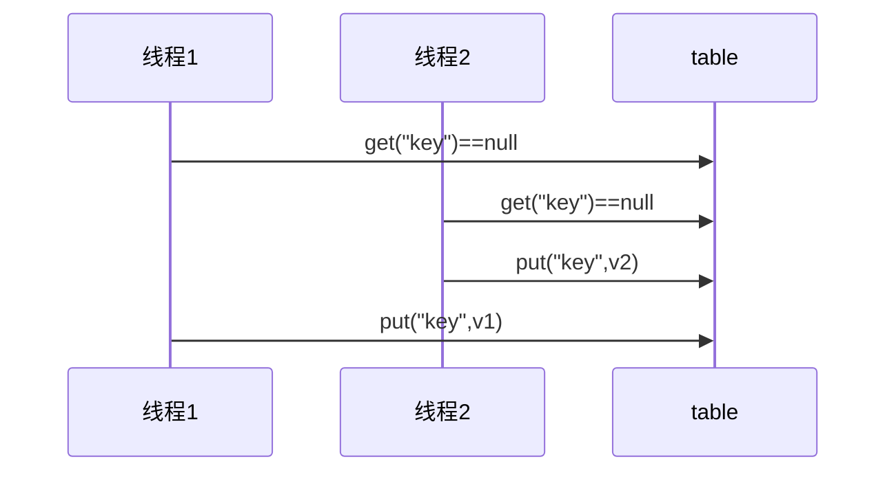

本系列代码在JDK8下实现：

```xml
<properties>
    <maven.compiler.source>1.8</maven.compiler.source>
    <maven.compiler.target>1.8</maven.compiler.target>
</properties>
<dependencies>
    <!--导入Lombok，简化JavaBean的编写-->
    <dependency>
        <groupId>org.projectlombok</groupId>
        <artifactId>lombok</artifactId>
        <version>1.18.10</version>
    </dependency>
    <!--使用Logback日志来实现-->
    <dependency>
        <groupId>ch.qos.logback</groupId>
        <artifactId>logback-classic</artifactId>
        <version>1.2.3</version>
    </dependency>
</dependencies>
```

```xml
<!--logback.xml配置文件-->
<?xml version="1.0" encoding="UTF-8"?>
<configuration xmlns="http://ch.qos.logback/xml/ns/logback"
               xmlns:xsi="http://www.w3.org/2001/XMLSchema-instance" 
               xsi:schemaLocation="http://ch.qos.logback/xml/ns/logback logback.xsd">
    <!-- Appender设置日志信息的去向。ch.qos.logback.core.ConsoleAppender代表打印至控制台。-->
    <appender name="STDOUT" class="ch.qos.logback.core.ConsoleAppender">
        <!-- 日志格式配置 -->
        <encoder>
            <!-- %d{HH:mm:ss.SSS}时间 %thread/%t线程名称 -->
            <pattern>%d{HH:mm:ss.SSS} [%t] %logger - %m%n</pattern>
        </encoder>
    </appender>

    <!-- root是根logger元素，设置所有类的日志打印。默认级别为debug，level配置级别 -->
    <root level="DEBUG">
        <!-- 配置appender，这里调用的是上面哪个 -->
        <appender-ref ref="STDOUT"/>
    </root>
</configuration>
```

# 第一章 基础概念

## 1.1 进程与线程

进程是资源分配的最小单位，线程是CPU调度的最小单位。

**进程**

程序由指令和数据组成，但这些指令要运行，数据要读写，就必须将指令加载至 CPU，数据加载至内存。在指令运行过程中还需要用到磁盘、网络等设备。进程就是用来加载指令、管理内存、管理 IO 的。

当一个程序被运行，从磁盘加载这个程序的代码至内存，这时就开启了一个进程。进程就可以视为程序的一个实例。大部分程序可以同时运行多个实例进程（例如记事本、画图、浏览器 等），也有的程序只能启动一个实例进程（例如网易云音乐、360 安全卫士等）。

在 Java 中，当我们启动 main 函数时其实就是启动了一个 JVM 的进程，而 main 函数所在的线程就是这个进程中的一个线程，也称主线程。

```apl
# 使用JDK自带的一些命令来查看Java进程
# jps查看运行的进程
C:\Windows\System32>jps
13472 Jps
13160 Demo01
2680 org.eclipse.equinox.launcher_1.6.400.v20210924-0641.jar

# jstack 查看某个 Java 进程（PID）的所有线程状态
C:\Windows\System32>jstack 13160
2023-03-29 16:49:37
Full thread dump Java HotSpot(TM) 64-Bit Server VM (25.144-b01 mixed mode):
"VM Thread" os_prio=2 tid=0x00000000176e9800 nid=0xf98 runnable
"GC task thread#0 (ParallelGC)" os_prio=0 tid=0x00000000027a7000 nid=0xb5c runnable
"GC task thread#1 (ParallelGC)" os_prio=0 tid=0x00000000027a8800 nid=0x7e4 runnable
"GC task thread#2 (ParallelGC)" os_prio=0 tid=0x00000000027aa000 nid=0x3408 runnable
"GC task thread#3 (ParallelGC)" os_prio=0 tid=0x00000000027ab800 nid=0x348c runnable
"GC task thread#4 (ParallelGC)" os_prio=0 tid=0x00000000027ae000 nid=0x2dd0 runnable
"GC task thread#5 (ParallelGC)" os_prio=0 tid=0x00000000027af000 nid=0x28a4 runnable
"GC task thread#6 (ParallelGC)" os_prio=0 tid=0x00000000027b2000 nid=0x1d58 runnable
"GC task thread#7 (ParallelGC)" os_prio=0 tid=0x00000000027b4800 nid=0x361c runnable
"VM Periodic Task Thread" os_prio=2 tid=0x0000000019762800 nid=0x1cc0 waiting on condition
JNI global references: 6

# jconsole 来查看某个 Java 进程中线程的运行情况（图形界面）
C:\Windows\System32>jconsole
```

```apl
# windows查看进程和线程数
# 通过windeow命令 tasklist 查看与Java相关的进程
D:\Java\vscode-java\JUC>tasklist | findstr java
java.exe                      5284 Console                    3    368,928 K
java.exe                      8964 Console                    3     17,428 K
java.exe                      2860 Console                    3    238,616 K
java.exe                      9032 Console                    3     21,252 K

# 通过JDK自带的命令jps查看查看运行的进程，详细看一下这些进程都是什么
D:\Java\vscode-java\JUC>jps
5284 org.eclipse.equinox.launcher_1.6.400.v20210924-0641.jar
8964 XMLServerLauncher
9032 Demo02
2860 BootLanguageServerBootApp
4076 Jps

# 通过windeow命令 taskkill 杀死进程
D:\Java\vscode-java\JUC>taskkill /F /PID 9032
成功: 已终止 PID 为 9032 的进程。
```

```apl
# Linux相关命令
# ps -ef查看所有进程信息，ps -ef | grep java 查看所有与Java相关进程
[root@linxuanVM ~]# ps -ef | grep java
root     22671 22639  0 16:57 pts/0    00:00:00 java Demo01
root     22699 22681  0 16:57 pts/1    00:00:00 grep --color=auto java

# ps -fT [端口号] 查看该端口号所对应进程所包含的线程
[root@linxuanVM ~]# ps -fT 22671
UID        PID  SPID  PPID  C STIME TTY      STAT   TIME CMD
root     22671 22671 22639  0 16:57 pts/0    Sl+    0:00 java Demo01
root     22671 22672 22639  0 16:57 pts/0    Sl+    0:00 java Demo01
root     22671 22673 22639  0 16:57 pts/0    Sl+    0:00 java Demo01
root     22671 22674 22639  0 16:57 pts/0    Sl+    0:00 java Demo01
root     22671 22675 22639  0 16:57 pts/0    Sl+    0:00 java Demo01
root     22671 22676 22639  0 16:57 pts/0    Sl+    0:00 java Demo01
root     22671 22677 22639  0 16:57 pts/0    Sl+    0:00 java Demo01
root     22671 22678 22639  0 16:57 pts/0    Sl+    0:00 java Demo01
root     22671 22679 22639  0 16:57 pts/0    Sl+    0:00 java Demo01
root     22671 22680 22639  0 16:57 pts/0    Sl+    0:00 java Demo01

# kill [端口号] 杀死22671端口后代表进程
[root@linxuanVM ~]# kill 22671
# 查看CPU实时信息
[root@linxuanVM ~]# top
```

**线程**

一个进程之内可以分为一到多个线程。一个线程就是一个指令流，将指令流中的一条条指令以一定的顺序交给 CPU 执行 。

Java 中，进程是资源分配的最小单位，线程是CPU调度的最小单位。Java 程序天生就是多线程程序，我们可以通过 JMX 来看看一个普通的 Java 程序有哪些线程：

```java
public static void main(String[] args) {
    // 获取 Java 线程管理 MXBean
    ThreadMXBean threadMXBean = ManagementFactory.getThreadMXBean();
    // 不需要获取同步的 monitor 和 synchronizer 信息，仅获取线程和线程堆栈信息
    ThreadInfo[] threadInfos = threadMXBean.dumpAllThreads(false, false);
    // 遍历线程信息，仅打印线程 ID 和线程名称信息
    for (ThreadInfo threadInfo : threadInfos) {
        System.out.println("[" + threadInfo.getThreadId() + "] " + threadInfo.getThreadName());
    }
}
```

```apl
[5] Attach Listener   # 添加事件
[4] Signal Dispatcher # 分发处理给 JVM 信号的线程
[3] Finalizer         # 调用对象 finalize 方法的线程
[2] Reference Handler # 清除 reference 线程
[1] main              # main 线程,程序入口
```

**进程和线程对比**

- 进程基本上相互独立的，而线程存在于进程内，是进程的一个子集
- 进程拥有共享的资源，如内存空间等，供其内部的线程共享
- 进程间通信较为复杂
  - 同一台计算机的进程通信称为 `IPC`（`Inter-process communication`）
  - 不同计算机之间的进程通信，需要通过网络，并遵守共同的协议，例如 HTTP
- 线程通信相对简单，因为它们共享进程内的内存。例如多个线程可以访问同一个共享变量。
- 线程更轻量，线程上下文切换成本一般上要比进程上下文切换低。进程切换涉及内存空间的切换而线程不会。因为每个进程都有自己的内存空间，而线程是共享所在进程的内存空间的，因此同一个进程中的线程进行线程切换时不涉及内存空间的转换。所以线程上下文切换成本低。

## 1.2 并发与并行

* **并发**

  在单核 cpu 下，线程实际还是串行执行的。
  操作系统中有一个组件叫做任务调度器，将 cpu 的时间片（windows 下时间片最小约为 15 毫秒）分给不同的程序使用，只是由于 cpu 在线程间（时间片很短）的切换非常快，人类感觉是同时运行的 。一般会将这种线程轮流使用 CPU 的做法称为并发（concurrent）。
  两个及两个以上的作业在同一时间段内执行。

* **并行**

  多核 cpu下，每个核（core）都可以调度运行线程，这时候线程可以是并行的，不同的线程同时使用不同的cpu在执行。
  两个及两个以上的作业在同一时刻执行。

引用 Rob Pike 的一段描述：并发是同一时间应对（dealing with）多件事情的能力，并行（parallel）是同一时间动手做（doing）多件事情的能力。

举个例子：

- 家庭主妇做饭、打扫卫生、给孩子喂奶，她一个人轮流交替做这多件事，这时就是并发。
- 雇了3个保姆，一个专做饭、一个专打扫卫生、一个专喂奶，互不干扰，这时是并行。
- 家庭主妇雇了个保姆，她们一起这些事，这时既有并发，也有并行（这时会产生竞争，例如锅只有一口，一 个人用锅时，另一个人就得等待）。

## 1.3 同步与异步

- 同步 ： 发出一个调用之后，在没有得到结果之前， 该调用就不可以返回，一直等待。
- 异步 ：调用在发出之后，不用等待返回结果，该调用直接返回。

## 1.4 多线程优缺点

 **多线程优点**

先从总体上来说：

- 从计算机底层来说：线程可以比作是轻量级的进程，是程序执行的最小单位，线程间的切换和调度的成本远远小于进程。另外，多核 CPU 时代意味着多个线程可以同时运行，这减少了线程上下文切换的开销。
- 从当代互联网发展趋势来说：现在的系统动不动就要求百万级甚至千万级的并发量，而多线程并发编程正是开发高并发系统的基础，利用好多线程机制可以大大提高系统整体的并发能力以及性能。

再深入到计算机底层来探讨：

- 单核时代： 在单核时代多线程主要是为了提高单进程利用 CPU 和 IO 系统的效率。 假设只运行了一个 Java 进程的情况，当我们请求 IO 的时候，如果 Java 进程中只有一个线程，此线程被 IO 阻塞则整个进程被阻塞。CPU 和 IO 设备只有一个在运行，那么可以简单地说系统整体效率只有 50%。当使用多线程的时候，一个线程被 IO 阻塞，其他线程还可以继续使用 CPU。从而提高了 Java 进程利用系统资源的整体效率。
- 多核时代: 多核时代多线程主要是为了提高进程利用多核 CPU 的能力。举个例子：假如我们要计算一个复杂的任务，我们只用一个线程的话，不论系统有几个 CPU 核心，都只会有一个 CPU 核心被利用到。而创建多个线程，这些线程可以被映射到底层多个 CPU 上执行，在任务中的多个线程没有资源竞争的情况下，任务执行的效率会有显著性的提高，约等于（单核时执行时间/CPU 核心数）

**多线程缺点**

并发编程的目的就是为了能提高程序的执行效率提高程序运行速度，但是并发编程并不总是能提高程序运行速度的，而且并发编程可能会遇到很多问题，比如：内存泄漏、死锁、线程不安全等等

## 1.5 操作系统线程五种状态

五种状态的划分主要是从操作系统的层面进行划分的：新建、就绪、运行、阻塞、死亡。


1. 初始状态，仅仅是在语言层面上创建了线程对象`Thead thread = new Thead();`还未与操作系统线程关联。

2. 可运行状态，也称就绪状态。指该线程已经被创建，与操作系统相关联，等待cpu给它分配时间片就可运行。

3. 运行状态，指线程获取了CPU时间片，正在运行

   当CPU时间片用完，线程会转换至【可运行状态】，等待 CPU再次分配时间片，会导致我们前面讲到的上下文切换

4. 阻塞状态

   如果调用了阻塞API，如BIO读写文件，那么线程实际上不会用到CPU，不会分配CPU时间片，会导致上下文切换，进入【阻塞状态】

   等待BIO操作完毕，会由操作系统唤醒阻塞的线程，转换至【可运行状态】

   与【可运行状态】的区别是，只要操作系统一直不唤醒线程，调度器就一直不会考虑调度它们，CPU就一直不会分配时间片

5. 终止状态，表示线程已经执行完毕，生命周期已经结束，不会再转换为其它状态

# 第二章 java线程

Java 程序天生就是多线程程序，我们可以通过 JMX 来看看一个普通的 Java 程序有哪些线程：

```java
public static void main(String[] args) {
    // 获取 Java 线程管理 MXBean
    ThreadMXBean threadMXBean = ManagementFactory.getThreadMXBean();
    // 不需要获取同步的 monitor 和 synchronizer 信息，仅获取线程和线程堆栈信息
    ThreadInfo[] threadInfos = threadMXBean.dumpAllThreads(false, false);
    // 遍历线程信息，仅打印线程 ID 和线程名称信息
    for (ThreadInfo threadInfo : threadInfos) {
        System.out.println("[" + threadInfo.getThreadId() + "] " + threadInfo.getThreadName());
    }
}
// 输出信息如下：
[5] Attach Listener   // 添加事件
[4] Signal Dispatcher // 分发处理给 JVM 信号的线程
[3] Finalizer         // 调用对象 finalize 方法的线程
[2] Reference Handler // 清除 reference 线程
[1] main              // main 线程,程序入口
```

## 2.1 创建线程三种方法

一共三种：Thread、Runnable 配合 Thread、FutureTask 配合 Callable。

**Thread**

```java
public static void main(String[] args) {
    // 构造方法的参数是给线程指定名字，推荐给线程起个名字
    Thread t1 = new Thread("t1") {
        @Override
        // run 方法内实现了要执行的任务
        public void run() {
            // 需要在类上面导入Slf4j注解来使用该日志功能
            log.debug("hello");
        }
    };
    t1.start();
}
```

**Runnable配合Thread**

把【线程】和【任务】分开，Thread 代表线程，Runnable 表示可运行的任务。方法 1 是把线程和任务合并在了一起，方法 2 是把线程和任务分开了，用 Runnable 更容易与线程池等高级 API 配合，并且让任务类脱离了 Thread 继承体系，更灵活。设计模式里面提到组合优先于继承。

```java
public static void main(String[] args) {
    // 创建任务对象
    Runnable task2 = new Runnable() {
        @Override
        public void run() {
            // 需要在类上面导入Slf4j注解来使用该日志功能
            log.debug("hello");
        }
    };
    // 参数1 是任务对象; 参数2 是线程名字，推荐给线程起个名字
    Thread t2 = new Thread(task2, "t2");
    t2.start();
}
```

**FutureTask配合Thread**

FutureTask 能够接收 Callable 类型的参数，用来处理有返回结果的情况。

```java
// 需要在类上面导入Slf4j注解来使用该日志功能
@Slf4j
public class Demo01 {
    public static void main(String[] args) throws ExecutionException, InterruptedException {
        // 实现多线程的第三种方法可以返回数据
        FutureTask<Integer> futureTask = new FutureTask<>(new Callable<Integer>() {
            @Override
            public Integer call() throws Exception {
                log.debug("多线程任务");
                Thread.sleep(100);
                return 100;
            }
        });
        // 主线程阻塞，同步等待 task 执行完毕的结果
        new Thread(futureTask, "linxuan").start();
        log.debug("主线程");
        log.debug("{}",futureTask.get());
    }
}
```

Future 就是对于具体的 Runnable 或者 Callable 任务的执行结果进行取消、查询是否完成、获取结果。必要时可以通过 get 方法获取执行结果，该方法会阻塞直到任务返回结果。

追踪一下源码：

```java
public class FutureTask<V> implements RunnableFuture<V> {
    // 省略类中内容
}
```

```java
public interface RunnableFuture<V> extends Runnable, Future<V> {
    void run();
}
```

```java
public interface Future<V> {
    boolean cancel(boolean mayInterruptIfRunning);
    boolean isCancelled();
    boolean isDone();
    V get() throws InterruptedException, ExecutionException;
    V get(long timeout, TimeUnit unit) 
        throws InterruptedException, ExecutionException, TimeoutException;
}
```

Future提供了三种功能：判断任务是否完成、能够中断任务、能够获取任务执行结果。可以看一下这篇文章：[FutureTask是Future和Runable的实现](https://mp.weixin.qq.com/s/RX5rVuGr6Ab0SmKigmZEag)。


## 2.2 线程上下文切换

线程上下文切换（Thread Context Switch）：因为以下一些原因导致 cpu 不再执行当前的线程，转而执行另一个线程的代码

- 线程的 cpu 时间片用完(每个线程轮流执行，看前面并行的概念)
- 垃圾回收
- 有更高优先级的线程需要运行
- 线程自己调用了 `sleep`、`yield`、`wait`、`join`、`park`、`synchronized`、`lock` 等方法

当 Context Switch 发生时，需要由操作系统保存当前线程的状态，并恢复另一个线程的状态，Java 中对应的概念 就是程序计数器（Program Counter Register），它的作用是记住下一条 jvm 指令的执行地址，是线程私有的。

操作系统需要保存的状态信息包括程序计数器、虚拟机栈中每个栈帧的信息，如局部变量表、操作数栈、动态链接、方法返回地址。Context Switch 频繁发生会影响性能。

## 2.3 Thread类常见方法

**构造方法**

| 方法                                 | 说明                                                        |
| ------------------------------------ | ----------------------------------------------------------- |
| Thread()                             | 创建线程对象。以”Thread-"作为前缀加数字作为线程的默认名字。 |
| Thread(Runnable target)              | 使⽤ Runnable 对象创建线程对象                              |
| Thread(String name)                  | 创建线程对象，并命名                                        |
| Thread(Runnable target, String name) | 使⽤ Runnable 对象创建线程对象，并命名                      |

**非静态方法**

| 方法名           | 功能说明                                                    |
| ---------------- | ----------------------------------------------------------- |
| start()          | 启动一个新线程，运行线程内的run方法。                       |
| run()            | 新线程启用后会调用的方法                                    |
| join()           | 等待线程运行结束                                            |
| join(long n)     | 等待线程运行结束，最多等待n毫秒                             |
| getId()          | 获取线程长整型的id，id唯一                                  |
| getName()        | 获取线程名                                                  |
| setName(String)  | 修改线程名                                                  |
| getPriority()    | 获取线程优先级                                              |
| setPriority(int) | 修改线程优先级(1~10)，大的优先级能提高该线程被CPU调用的几率 |
| getState()       | 获取线程状态                                                |
| isAlive()        | 判断线程是否存活 ，是否运行完毕                             |
| interrupt()      | 打断线程                                                    |
| isInterrupted()  | 判断线程是否被打断，不会清除 `"打断标记"`                   |

**静态方法**

| 方法名          | 功能说明                                                 | 注意事项           |
| --------------- | -------------------------------------------------------- | ------------------ |
| interrupted()   | 判断当前线程是否被打断                                   | 会清除打断标记     |
| currentThread() | 获取当前正在执行的线程                                   |                    |
| sleep(long n)   | 当前执行的线程休眠n毫秒，休眠时让出cpu的时间片给其它线程 |                    |
| yield()         | 提示线程调度器，让出当前线程对 CPU的使用                 | 主要为了测试和调试 |

### 2.3.1 start方法

调用start方法会启动一个新线程，运行线程内的run方法。该方法只是让线程进入`RNNABLE`就绪(可运行)状态，代码不一定运行，比如CUP的时间片还没有分配给该线程。

每个线程对象的start方法只能调用一次，这是因为当调用start方法，线程状态会由“`NEW`”变为“`RUNABLE`”，此时再次调用start方法会报错`IllegalThreadStateException`非法的状态异常。

```java
public static void main(String[] args) throws InterruptedException {
    Thread thread = new Thread(){
        @Override
        public void run(){
            // 需要在类上面导入Slf4j注解来使用该日志功能
            log.debug("我是一个新建的线程正在运行中");
        }
    };
    thread.setName("新建线程");
    thread.start();
    // 该静态方法可能会抛出InterruptedException异常，所以在方法签名上面声明一下
    Thread.sleep(1000);
    log.debug("主线程");
}
// 09:12:24.559 [新建线程] DEBUG com.linxuan.demo01.Demo01 - 我是一个新建的线程正在运行中
// 09:12:25.563 [main] DEBUG com.linxuan.demo01.Demo01 - 主线程
```

### 2.3.2 run方法

```java
public static void main(String[] args) throws InterruptedException {
    Thread thread = new Thread(){
        @Override
        public void run(){
            // 需要在类上面导入Slf4j注解来使用该日志功能
            log.debug("我是一个新建的线程正在运行中");
        }
    };
    thread.setName("新建线程");
    thread.run();
    // 该静态方法可能会抛出InterruptedException异常，所以在方法签名上面声明一下
    Thread.sleep(1000);
    log.debug("主线程");
}
// 09:17:07.175 [main] DEBUG com.linxuan.demo01.Demo01 - 我是一个新建的线程正在运行中
// 09:17:08.185 [main] DEBUG com.linxuan.demo01.Demo01 - 主线程
```

可以发现程序仍在 main 线程运行， `run()`方法里面内容的调用还是同步的。直接调用 `run()` 是在主线程中执行了 `run()`，没有启动新的线程。使用 `start()` 是启动新的线程，通过新的线程间接执行 `run()`方法 中的代码

new 一个 `Thread`，线程进入了新建状态。调用 `start()`方法，会启动一个线程并使线程进入了就绪状态，当分配到时间片后就可以开始运行了。 `start()` 会执行线程的相应准备工作，然后自动执行 `run()` 方法的内容，这是真正的多线程工作。 但是，直接执行 `run()` 方法，会把 `run()` 方法当成一个 main 线程下的普通方法去执行，并不会在某个线程中执行它，所以这并不是多线程工作。

调用 `start()` 方法方可启动线程并使线程进入就绪状态，直接执行 `run()` 方法的话不会以多线程的方式执行。

### 2.3.3 sleep方法

sleep方法是静态的，所以调用的时候直接`Thread.sleep(long n);单位是毫秒`就可以了，sleep方法在哪个线程使用那么就是哪个线程睡眠阻塞。

1. 调用 sleep 会让当前线程从 `Running` 进入 `Timed Waiting`计时等待状态。

2. 可以使用`interrupt`方法打断正在睡眠的线程，那么被打断的线程这时就会抛出 `InterruptedException`异常。

3. 睡眠结束后的线程未必会立刻得到执行。时间到达之后该线程会进入`RUNNABLE`就绪(可运行)状态，该状态不一定代表线程在运行，这取决于CPU是否分配给该线程时间片。

4. sleep抛出异常后，会清除掉“线程打断状态”。所以在catch的代码块里，执行`Thread.interrupted()`得到的结果永远都是`false`。

5. sleep不会丢掉`monitors`，也就是不会释放锁。

6. 可以使用sleep方法来限制程序的CPU的使用。在没有利用 cpu 来计算时，不要让 `while(true)` 空转浪费 cpu，这时可以使用 yield 或 sleep 来让出 cpu 的使用权给其他程序

   ```java
   while(true) {
       try {
           Thread.sleep(50);
       } catch (InterruptedException e) {
           e.printStackTrace();
       }
   }
   // 加上sleep方法后CPU占用为4%，不加sleep方法CPU占用为100%
   ```

   可以用 wait 或 条件变量达到类似的效果，不同的是，后两种都需要加锁，并且需要相应的唤醒操作，一般适用于要进行同步的场景。sleep 适用于无需锁同步的场景。

建议用 TimeUnit 的 `sleep()` 代替 Thread 的 `sleep()`来获得更好的可读性。TimeUnit有时间单位，例如：`TimeUnit.SECONDS.sleep(1);`。当然二者效果一样。

这里我们封装一个sleep方法自己使用，以后再次使用sleep的时候直接导包就可以了：

```java
public class Sleeper {
    public static void sleep(int i) {
        try {
            TimeUnit.SECONDS.sleep(i);
        } catch (InterruptedException e) {
            e.printStackTrace();
        }
    }

    public static void sleep(double i) {
        try {
            TimeUnit.MILLISECONDS.sleep((int) (i * 1000));
        } catch (InterruptedException e) {
            e.printStackTrace();
        }
    }
}
```

### 2.3.4 yield方法

<!-- yield 让步; 放弃; 缴出 -->

调用 `yield()` 会让当前线程重新进入 `Runnable` 就绪状态，然后调度执行其它线程。`Runnable` 就绪状态不同于 `Timed Waiting` 阻塞状态，`Runnable`就绪状态有可能分配时间片，而`Timed Waiting`阻塞状态在阻塞期间内不会分配时间片。

yiled 不释放锁、释放cpu。

具体的实现依赖于操作系统的任务调度器。假如当前线程调用了`yield()`方法之后没有其他线程需要执行，那么CPU依然会执行当前线程。

### 2.3.5 join方法

`join()`：等待该线程运行结束，非静态方法，哪个线程调用join方法就会等待哪个线程运行结束。如果加上参数 n 那么就是最多等待n毫秒该线程运行结束，如果超过时间那么就不等了。

join方法会释放锁，但是会开始抢占CPU。

下面代码不加上join方法那么结果为0，加上join方法结果为10。在主线程中调用`t1.join`，则主线程会等待t1线程执行完之后再继续执行。

```java
@Slf4j
public class Demo {
    static int num = 0;

    public static void main(String[] args) throws InterruptedException {
        log.debug("开始");

        Thread t1 = new Thread(() -> {
            log.debug("开始");
            // 调用我们自己封装的方法，让该线程睡眠1秒，进入TIMED_WAITING状态
            Sleeper.sleep(1);
            log.debug("结束");
            num = 10;
        }, "t1");
        t1.start();

        // 如果不调用该方法，那么会直接打印结果。如果调用该方法，会等待t1线程运行之后打印结果。
        t1.join();

        log.debug("结果为:{}", num);
        log.debug("结束");
    }
}
```

上面是单个线程的join方法调用，下面我们来看一下多个线程的join方法调用：

```java
// jdk1.5特性，静态导入。导入我们上面编写的Sleeper类
import static com.linxuan.util.Sleeper.sleep;

@Slf4j
public class Demo01 {
    
    public static void main(String[] args) throws InterruptedException {
        Thread t1 = new Thread(() -> {
            // 睡眠1秒
            sleep(1);
        });
        Thread t2 = new Thread(() -> {
            // 睡眠2秒
            sleep(2);
        });
        t1.start();
        t2.start();

        log.debug("join开始了");
        // 主线程等待t1线程结束运行，等待1秒。但是这个时候t2线程也正在运行，没有任何影响
        t1.join();
        log.debug("t1.join结束");
        // 主线程再等待t2线程1秒
        t2.join();
        log.debug("t2.join结束");
    }
}
```

来分析一下，主线程共需要等待多少时间：

- 第一个 join：等待 t1 时，t2 并没有停止, 而在运行。也就是等待t1线程1s，这时候t2线程也运行了1s。
- 第二个 join：t2在之前运行了1s，因此也只需再等待 1s。
- 也就是一共需要等待2秒。

```properties
08:34:07.002 [main] DEBUG com.linxuan.demo01.Demo01 - join开始了
08:34:08.013 [main] DEBUG com.linxuan.demo01.Demo01 - t1.join结束
08:34:09.014 [main] DEBUG com.linxuan.demo01.Demo01 - t2.join结束
```

### 3.3.6 interrupt

在Java中如果想停止一个线程，有三种方法

- 采用退出标志，使得 run 方法执行完之后线程自然终止
- 使用 stop 强行终止线程，但该方法由于安全问题已经被deprecated
- 使用中断机制。`interrupt`方法。

借助于中断机制对一个运行中的线程进行处理，会进行中断标志置位，并不会对线程的运行产生影响，到底有何影响，重点要看到底你面对中断标志位会做什么处理。

| 方法                         | 作用                                         |
| ---------------------------- | -------------------------------------------- |
| void interrupt()             | 打断线程。对于不同的线程会有不同的处理方法。 |
| boolean isInterrupted()      | 判断线程是否被打断，不会清除打断标记。       |
| static boolean interrupted() | 判断当前线程是否被打断，会清除打断标记。     |

`void interrupt()`：打断线程。如果被打断线程在`sleep、wait和join`状态则会导致被打断的线程抛出`InterruptedException`异常，并清除打断标记 ；如果打断的是正在运行的线程，则会设置打断标记 ；`park`的线程被打断，也会设置打断标记。

**打断阻塞状态线程**

sleep，wait，join 的线程，这几个方法都会让线程进入阻塞状态，而interrupt方法会打断阻塞线程。

```java
@Slf4j
public class Demo02 {
    public static void main(String[] args) throws InterruptedException {
        Thread t1 = new Thread(() -> {
            log.debug("t1线程睡眠");
            // 睡眠5000毫秒
            Thread.sleep(5000);
        }, "t1");
        t1.start();
        
        // 主线程睡眠1000毫秒
        Thread.sleep(1000);
        log.debug("interrupted");
        t1.interrupt();
        // 打断标记 true为打断、false为非打断。但是sleep join wait方法会重置打断标记 所以最后结果为false.
        log.debug("打断标记结果为：" + t1.isInterrupted());
    }
}
```

```apl
09:01:23.994 [t1] DEBUG com.linxuan.demo01.Demo02 - t1线程睡眠
09:01:24.996 [main] DEBUG com.linxuan.demo01.Demo02 - interrupted
09:01:24.997 [main] DEBUG com.linxuan.demo01.Demo02 - 打断标记结果为：false
java.lang.InterruptedException: sleep interrupted
        at java.lang.Thread.sleep(Native Method)
        at com.linxuan.demo01.Demo02.lambda$0(Demo02.java:11)
        at java.lang.Thread.run(Thread.java:748)
```

**打断正常运行的线程**

打断正常运行的线程，不会清空打断状态，也不会停止线程，因此我们需要自己来根据打断标记手动停止线程。

借助于中断机制对一个运行中的线程进行处理，会进行中断标志置位，并不会对线程的运行产生影响，到底有何影响，重点要看到底你面对中断标志位会做什么处理。

```java
public static void main(String[] args) throws InterruptedException {
    Thread t1 = new Thread(() -> {
        while(true) {
            if (Thread.currentThread().isInterrupted()) {
                log.debug("线程被打断了");
                break;
            }
        }
    }, "t1");
    t1.start();

    // 主线程睡眠1秒后打断t1线程
    Thread.sleep(1000);
    log.debug("interrupt");
    t1.interrupt();
}
```

**打断 park 线程**

打断 park 线程，不会清空打断状态。

```java
@Slf4j
public class Demo02 {
    public static void main(String[] args) {
        Thread t1 = new Thread(() -> {
            log.debug("park...");
            // 调用该方法之后线程也会进入休眠状态
            LockSupport.park();
            log.debug("unpark...");
            log.debug("打断状态：{}", Thread.currentThread().isInterrupted());
        }, "t1");
        t1.start();
        
        sleep(0.5);
        t1.interrupt();
    }
}
```

```apl
17:40:12.308 [t1] DEBUG com.linxuan.demo01.Demo02 - park...
17:40:12.817 [t1] DEBUG com.linxuan.demo01.Demo02 - unpark...
17:40:12.817 [t1] DEBUG com.linxuan.demo01.Demo02 - 打断状态：true
```

如果打断标记已经是 true, 则 park 会失效

```java
@Slf4j
public class Demo02 {
    public static void main(String[] args) {
        Thread t1 = new Thread(() -> {
            for (int i = 0; i < 5; i++) {
                log.debug("park...");
                LockSupport.park();
                log.debug("打断状态：{}", Thread.currentThread().isInterrupted());
            }
        });
        t1.start();
        sleep(1);
        t1.interrupt();

    }
}
```

```apl
17:41:16.022 [Thread-0] DEBUG com.linxuan.demo01.Demo02 - park...
17:41:17.030 [Thread-0] DEBUG com.linxuan.demo01.Demo02 - 打断状态：true
17:41:17.034 [Thread-0] DEBUG com.linxuan.demo01.Demo02 - park...
17:41:17.035 [Thread-0] DEBUG com.linxuan.demo01.Demo02 - 打断状态：true
17:41:17.036 [Thread-0] DEBUG com.linxuan.demo01.Demo02 - park...
17:41:17.037 [Thread-0] DEBUG com.linxuan.demo01.Demo02 - 打断状态：true
17:41:17.038 [Thread-0] DEBUG com.linxuan.demo01.Demo02 - park...
17:41:17.039 [Thread-0] DEBUG com.linxuan.demo01.Demo02 - 打断状态：true
17:41:17.040 [Thread-0] DEBUG com.linxuan.demo01.Demo02 - park...
17:41:17.041 [Thread-0] DEBUG com.linxuan.demo01.Demo02 - 打断状态：true
```

可以使用 `Thread.interrupted()` 清除打断状态。

## 2.4 线程休眠方法

一共有三种：`Thread.sleep()`、`Object.wait()`、`LockSupport.park()`（这里就先不搞了）。

**wait方法**

wait方法会导致当前线程睡眠。使用wait方法的前提是当前线程获取到了锁对象，调用wait方法线程会释放锁，之后会进入WAITING状态睡眠。除非该线程被`notify`或者`notifyall`唤醒，否则会一直处于WAITING状态等待。

如果当前线程没有获取到锁对象调用`wait`方法，会抛出 `IllegalMonitorStateException`异常。当其他线程打断该线程的时候，会抛出`InterruptedException`异常， 当异常抛出的时候，打断状态就会被清除掉。

```java
public class Demo {
    // 创建锁对象
    private final static Object monitor = new Object();

    public static void main(String[] args) throws InterruptedException {

        // 创建一个 t1 线程
        Thread t1 = new Thread(() -> {
            // 获取锁对象
            synchronized (monitor) {
                try {
                    System.out.println("t1 线程调用wait方法，进入休眠");
                    // 调用wait方法并释放锁对象
                    monitor.wait();
                    System.out.println("t1 线程，被唤醒了，继续执行");
                } catch (InterruptedException e) {
                    e.printStackTrace();
                }
            }
        }, "t1-thread");
        // 启动t1线程
        t1.start();

        // 主线程睡眠3000毫秒
        Thread.sleep(3000L);
        System.out.println("查看一下 t1 线程当前的状态：" + t1.getState());

        // 主线程获取锁，调用 notify 方法唤醒 t1 线程
        synchronized (monitor) {
            System.out.println("main 线程获得了锁，然后调用 notify 方法");
            monitor.notify();
        }
    }
}
```

```apl
t1 线程调用wait方法，进入休眠
查看一下 t1 线程当前的状态：WAITING
main 线程获得了锁，然后调用 notify 方法
t1 线程，被唤醒了，继续执行
```

## 2.4 两阶段终止模式

终止模式之两阶段终止模式 Two Phase Termination，就是考虑在一个线程 T1 中如何优雅地终止另一个线程T2。这里的优雅指的是给 T2 一个料理后事的机会（如释放锁）。

先来看一下两种错误的思路：

- 使用线程对象的 `stop()` 方法停止线程。`stop` 方法会真正杀死线程。但是如果这时线程锁住了共享资源，那么当它被杀死后就再也没有机会释放锁，其它线程将永远无法获取锁。因此stop方法已经过时，不要使用了。
- 使用 `System.exit(int)` 方法停止线程。我们目的仅是停止一个线程，但这种做法会让整个程序都停止。

正确思路如下：线程的`isInterrupted()`方法可以取得线程的打断标记，如果线程在睡眠`sleep`期间被打断，打断标记虽然被重置为`false`，但是`sleep`期间被打断会抛出异常，我们据此手动设置打断标记为`true`；如果是在程序正常运行期间被打断的，那么打断标记就被自动设置为`true`。


代码实现如下：

```java
@Slf4j
public class Demo02 {
    public static void main(String[] args) throws InterruptedException {
        // 两阶段终止模式TwoParseTermination
        TwoParseTermination tpt = new TwoParseTermination();
        tpt.start();
        Thread.sleep(3500);
        tpt.stop();        
    }
}
```

```java
@Slf4j
public class TwoParseTermination {
    Thread thread;

    // 启动监控线程
    public void start() {
        thread = new Thread(() -> {
            while (true) {
                Thread currentThread = Thread.currentThread();
                // 如果当前运行线程被打断，那么就开始料理后事
                if (currentThread.isInterrupted()) {
                    log.debug("料理后事");
                    break;
                }
                try {
                    // 让线程睡眠 如果有异常那么捕获抛出打印
                    Thread.sleep(1000);
                    // 线程没有异常 执行监控记录
                    log.debug("执行监控记录");
                } catch (InterruptedException e) {
                    e.printStackTrace();
                    // 因为打断标记会被重置 所以这里我们重新打断一下 设置为true
                    currentThread.interrupt();
                }
            }
        });
        thread.start();
    }

    // 停止监控线程
    public void stop() {
        thread.interrupt();
    }
}
```

```apl
17:11:01.652 [t1] DEBUG com.linxuan.demo01.TwoParseTermination - 执行监控记录
17:11:02.666 [t1] DEBUG com.linxuan.demo01.TwoParseTermination - 执行监控记录
17:11:03.668 [t1] DEBUG com.linxuan.demo01.TwoParseTermination - 执行监控记录
java.lang.InterruptedException: sleep interrupted
        at java.lang.Thread.sleep(Native Method)
        at com.linxuan.demo01.TwoParseTermination.lambda$0(Demo02.java:30)
        at java.lang.Thread.run(Thread.java:748)
17:11:04.146 [t1] DEBUG com.linxuan.demo01.TwoParseTermination - 料理后事
```

## 2.5 守护线程daemon

<!-- daemon: 守护线程 -->

所谓守护线程，是指在程序运行的时候在后台提供一种通用服务的线程，比如垃圾回收线程就是一个很称职的守护者，并且这种线程并不属于程序中不可或缺的部分。因此，当所有的非守护线程结束时，程序也就终止了，同时会杀死进程中的所有守护线程。反过来说，只要任何非守护线程还在运行，程序就不会终止。

- 垃圾回收器线程就是一种守护线程。
- Tomcat 中的 Acceptor 和 Poller 线程都是守护线程，所以 Tomcat 接收到 shutdown 命令后，不会等待它们处理完当前请求

```java
@Slf4j
public class Demo02 {
    public static void main(String[] args) {
        log.debug("开始运行...");

        Thread t1 = new Thread(() -> {
            log.debug("开始运行...");
            sleep(2);
            // 这个守护线程的 “运行结束” 没有打印整个线程就被终止了
            log.debug("运行结束...");
        }, "daemon");
        // 设置该线程为守护线程
        t1.setDaemon(true);
        t1.start();

        sleep(1);
        log.debug("运行结束...");
    }
}
```

```apl
18:02:44.128 [main] DEBUG com.linxuan.demo01.Demo02 - 开始运行...
18:02:44.202 [daemon] DEBUG com.linxuan.demo01.Demo02 - 开始运行...
18:02:45.205 [main] DEBUG com.linxuan.demo01.Demo02 - 运行结束...
```

当所有的非守护线程结束时，程序也就终止了，同时会杀死进程中的所有守护线程。

## 2.6 线程六种状态及转换

根据 `Thread.State` 枚举，分为六种状态。

```java
public enum State {
    /**
    * Thread state for a thread which has not yet started.
    * 线程是还没有开始运行的状态
    */
    NEW,

    /**
    * Thread state for a runnable thread.  A thread in the runnable
    * state is executing in the Java virtual machine but it may
    * be waiting for other resources from the operating system
    * such as processor.
    * 线程是可运行的状态。在该状态的线程运行在JVM上面，但是可能在等待操作系统分配给他的其他资源，例如CPU
    */
    RUNNABLE,

    /**
     * Thread state for a thread blocked waiting for a monitor lock.
     * A thread in the blocked state is waiting for a monitor lock
     * to enter a synchronized block/method or
     * reenter a synchronized block/method after calling
     * {@link Object#wait() Object.wait}.
     * 一个处于阻塞状态的线程正在等待监听锁。
     * 一个处于 blocked 状态的线程正在等待一个监视器锁以进入一个同步的块或方法，
     *                          或者在其调用 Object.wait 方法之后，以再次进入一个同步的块或方法。
     */
    BLOCKED,

    /**
     * Thread state for a waiting thread.
     * A thread is in the waiting state due to calling one of the
     * following methods:
     * <ul>
     *   <li>{@link Object#wait() Object.wait} with no timeout</li>
     *   <li>{@link #join() Thread.join} with no timeout</li>
     *   <li>{@link LockSupport#park() LockSupport.park}</li>
     * </ul>
     * 线程会由于下面三种方法进入等待状态：Object.wait、Thread.join、LockSupport.park
     *
     * <p>A thread in the waiting state is waiting for another thread to
     * perform a particular action.
     * 处于等待状态的线程等待其他的线程去执行特定的操作
     * 
     * For example, a thread that has called <tt>Object.wait()</tt>
     * on an object is waiting for another thread to call
     * <tt>Object.notify()</tt> or <tt>Object.notifyAll()</tt> on
     * that object. A thread that has called <tt>Thread.join()</tt>
     * is waiting for a specified thread to terminate.
     */
    WAITING,

    /**
     * Thread state for a waiting thread with a specified waiting time.
     * A thread is in the timed waiting state due to calling one of
     * the following methods with a specified positive waiting time:
     * <ul>
     *   <li>{@link #sleep Thread.sleep}</li>
     *   <li>{@link Object#wait(long) Object.wait} with timeout</li>
     *   <li>{@link #join(long) Thread.join} with timeout</li>
     *   <li>{@link LockSupport#parkNanos LockSupport.parkNanos}</li>
     *   <li>{@link LockSupport#parkUntil LockSupport.parkUntil}</li>
     * </ul>
     * 有一个明确规定等待时间的等待线程。
     * 处于timed waiting状态的线程由于执行了下面的方法并且加上了等待时间：Thread.sleep、Object.wait
     *                                Thread.join、LockSupport.parkNanos、LockSupport.parkUntil
     */
    TIMED_WAITING,

    /**
     * Thread state for a terminated thread.
     * The thread has completed execution.
     * 终止状态的线程，执行完毕就处于这种状态。
     */
    TERMINATED;
}
```

| 线程状态                | 导致线程状态发生的条件                                       |
| ----------------------- | ------------------------------------------------------------ |
| NEW(新建)               | 线程刚被创建，但是没有调用start方法运行。                    |
| Runnable(可运行)        | 线程在java虚拟机中运行的状态，可能正在运行代码，也可能没有，这取决于CPU。 |
| Blocked(锁阻塞)         | 当一个线程试图获取一个对象锁，而该对象锁被其他的线程持有，则该线程进入Blocked状态；当该线程持有锁时，该线程将变成Runnable状态。 |
| Waiting(无限等待)       | 一个线程在等待另一个线程执行一个动作时，该线程进入Waiting状态，进入这个状态后是不能自动唤醒的。线程会由于下面三种方法进入等待状态：Object.wait、Thread.join、LockSupport.park |
| Timed Waiting(计时等待) | 同Waiting状态，有几个方法有超时参数，调用他们将进入Timed Waiting状态。这一状态将一直保持到超时期满或者接受到唤醒通知。带有超时参数的常用方法有Thread.sleep、Object.wait。 |
| Terminated(死亡状态)    | 已退出的线程处于这种状态                                     |

> `RUNNABLE` 是调用 `start()` 方法之后的状态。Java 层面的 `RUNNABLE` 状态涵盖了操作系统层面的【可运行状态】、【运行状态】和【io阻塞状态】（由于 BIO 导致的线程阻塞，在 Java 里无法区分，仍然认为是可运行）

下面演示一下六种状态：

```java
/**
 * 演示线程6种状态：
 *      NEW、RUNNABLE、BLOCKED、WAITING、TIMED_WAITING、TERMINATED。
 */
@Slf4j
public class Demo01 {
    public static void main(String[] args) {
        Thread t1 = new Thread(() -> {
            log.debug("t1线程创建但是不运行 NEW状态");
        }, "t1");

        // t2线程创建且运行 一直循环并没有关闭 所以RUNNABLE状态
        Thread t2 = new Thread(() -> {
            while (true) {

            }
        }, "t2");
        t2.start();

        Thread t3 = new Thread(() -> {
            log.debug("创建且运行完毕 所以TERMINATED");
        }, "t3");
        t3.start();

        // 加一个锁后面有用 这里是有时间的睡眠 所以状态是TIMED_WAITING
        Thread t4 = new Thread(() -> {
            synchronized(Demo01.class) {
                try {
                    Thread.sleep(100000);
                } catch (InterruptedException e) {
                    e.printStackTrace();
                }
            }
        }, "t4");
        t4.start();

        // join方法 等待t2线程运行完毕后 t5线程才会运行 但是t2是while循环 所以状态为WAITING无限等待状态
        Thread t5 = new Thread(() -> {
            try {
                t2.join();
            } catch (InterruptedException e) {
                e.printStackTrace();
            }
        }, "t5");
        t5.start();

        // 因为上面拿到了锁 所以这里无法拿到 处于锁阻塞BLOCKED状态
        Thread t6 = new Thread(() -> {
            synchronized(Demo01.class) {
                try {
                    Thread.sleep(100000000);
                } catch (InterruptedException e) {
                    e.printStackTrace();
                }
            }
        }, "t6");
        t6.start();

        log.debug("t1 state: {}", t1.getState());
        log.debug("t2 state: {}", t2.getState());
        log.debug("t3 state: {}", t3.getState());
        log.debug("t4 state: {}", t4.getState());
        log.debug("t5 state: {}", t5.getState());
        log.debug("t6 state: {}", t6.getState());
    }
}
```

```apl
08:07:24.113 [main] DEBUG com.linxuan.demo01.Demo01 - t1 state: NEW
08:07:24.113 [t3] DEBUG com.linxuan.demo01.Demo01 - 创建且运行完毕 所以TERMINATED
08:07:24.119 [main] DEBUG com.linxuan.demo01.Demo01 - t2 state: RUNNABLE
08:07:24.119 [main] DEBUG com.linxuan.demo01.Demo01 - t3 state: TERMINATED
08:07:24.119 [main] DEBUG com.linxuan.demo01.Demo01 - t4 state: TIMED_WAITING
08:07:24.119 [main] DEBUG com.linxuan.demo01.Demo01 - t5 state: WAITING
08:07:24.120 [main] DEBUG com.linxuan.demo01.Demo01 - t6 state: BLOCKED
```

下面看一下线程的状态转换：


**1. NEW --> RUNNABLE 状态**

调用`thread.start()`之后线程就会由 NEW 状态进入 RUNNABLE 状态。

```java
public static void main(String[] args) {
    Thread thread = new Thread(() -> {
        log.info("这里是thread线程");
    }, "thread");
    thread.start();

    // 15:15:01.392 [main] com.linxuan.thread.Demo01 - thread线程的状态：RUNNABLE
    log.info("thread线程的状态：" + thread.getState());
}
```

**2. RUNNABLE <--> WAITING**

`thread`线程获取到对象锁并调用`wait`方法后该线程就会由`RUNNABLE`转为`WAITING`无限等待状态。之后有其他线程调用`notify`、`notifyall`、`interrupt`方法之后：

* thread线程竞争锁成功，thread线程从`WAITING`状态转为`RUNNABLE`状态。
* thread线程竞争锁失败，thread线程从`WAITING`状态转为`BLOCKED`状态。

```java
public class Demo01 {
    final static Object obj = new Object();

    public static void main(String[] args) {
        Thread thread = new Thread(() -> {
            synchronized (obj) {
                log.debug("执行....");
                // 可能抛出异常，所以使用try catch进行捕获处理。不能够声明处理
                try {
                    // 执行wait方法之前必须获取锁对象。执行完方法之后会释放该锁并进入WAITING状态睡眠，
                    // 等待后面其他线程notify唤醒
                    obj.wait();
                } catch (InterruptedException e) {
                    e.printStackTrace();
                }
                log.debug("其它代码....");
                while (true) {
                    // thread线程获取到锁 运行一下
                }
            }
        }, "thread");
        thread.start();

        // 调用自己封装的睡眠方法让主线程睡眠0.2秒，这是为了确保thread线程首先运行
        sleep(0.2);
        // 查看thread线程未被唤醒前的状态
        log.info("thread线程未被唤醒前状态：" + thread.getState());
        // 获取锁对象
        synchronized (obj) {
            // 唤醒obj上所有等待线程
            log.debug("唤醒 obj 上其它线程");
            obj.notifyAll();
            // 此时主线程正拿着锁，所以thread线程并未获取到锁，因此为BLOCKED状态
            log.info("thread线程被唤醒后但是未获取到锁对象状态：" + thread.getState());
        }
        // 调用自己封装的睡眠方法让主线程睡眠0.1秒，确保打印下一条语句的时候thread线程已经获取到锁
        sleep(0.1);
        log.info("thread线程获取到锁的状态：" + thread.getState());
    }
}
```

```apl
15:47:55.566 [thread] com.linxuan.thread.Demo01 - 执行....
15:47:55.780 [main] com.linxuan.thread.Demo01 - thread线程未被唤醒前状态：WAITING
15:47:55.781 [main] com.linxuan.thread.Demo01 - 唤醒 obj 上其它线程
15:47:55.782 [main] com.linxuan.thread.Demo01 - thread线程被唤醒后但是未获取到锁对象状态：BLOCKED
15:47:55.782 [thread] com.linxuan.thread.Demo01 - 其它代码....
15:47:55.889 [main] com.linxuan.thread.Demo01 - thread线程获取到锁的状态：RUNNABLE
```

**3. RUNNABLE <--> WAITING**

`t2` 线程调用join方法等待其他线程运行结束的时候就会从 RUUNABLE 状态进入 WAITING 状态。因为`join`方法并没有传给他等待时间的参数，所以确定需要等待多久，所以直接就转变成了 WAITING 无限等待状态。

`t1` 线程运行结束，或着调用了当前线程的 `interrupt()` 时，当前线程从 WAITING 转为 RUNNABLE 就绪状态。

```java
public static void main(String[] args) throws InterruptedException {

    // 创建t1线程并运行，让该线程睡眠1秒，因此进入了TIMED_WAITING计时等待状态
    Thread t1 = new Thread(() -> {
        sleep(1);
    }, "t1");
    t1.start();

    // 创建t2线程并运行
    Thread t2 = new Thread(() -> {
        try {
            // 当前线程等待t1线程运行结束，所以处于WAITING无限等待状态
            t1.join();
            // 强制让该线程继续运行，方便一会测试该线程状态
            while (true) {

            }
        } catch (InterruptedException e) {
            e.printStackTrace();
        }
    });
    t2.start();

    // 主线程睡眠0.5秒，此时t1线程正在睡眠处于TIMED_WAITING计时等待状态，t2线程处于WAITING无限等待状态
    sleep(0.5);
    log.info("t1线程状态：" + t1.getState());
    log.info("t2线程状态：" + t2.getState());
    // 再等待0.6秒，这时候t1线程运行完毕进入TERMINATED状态，t2线程进入RUNNABLE状态
    sleep(0.6);
    log.info("t2线程状态：" + t2.getState());
}
```

```apl
16:01:29.902 [main] com.linxuan.thread.Demo01 - t1线程状态：TIMED_WAITING
16:01:29.907 [main] com.linxuan.thread.Demo01 - t2线程状态：WAITING
16:01:29.907 [main] com.linxuan.thread.Demo01 - t1线程状态：TERMINATED
16:01:30.519 [main] com.linxuan.thread.Demo01 - t2线程状态：RUNNABLE
```

**4. RUNNABLE <--> WAITING**

当前线程调用 `LockSupport.park()` 方法会让当前线程从 RUNNABLE --> WAITING。调用 `LockSupport.unpark(目标线程)` 或调用了线程的 `interrupt()` ，会让目标线程从 WAITING --> RUNNABLE。

```java
public static void main(String[] args) {
    Thread thread = new Thread(() -> {
        log.info("thread线程状态：" + Thread.currentThread().getState());
        LockSupport.park();
        while(true) {
        }
    }, "thread");
    thread.start();

    sleep(0.1);
    log.info("thread线程执行LockSupport.park()后状态：" + thread.getState());
    LockSupport.unpark(thread);
    sleep(0.1);
    log.info("执行LockSupport.unpark(thread)后状态：" + thread.getState());
}
```

```apl
08:57:35.652 [t1] com.linxuan.thread.Demo01 - t1线程状态：RUNNABLE
08:57:35.767 [main] com.linxuan.thread.Demo01 - t1线程执行LockSupport.park()后状态：WAITING
08:57:35.877 [main] com.linxuan.thread.Demo01 - 执行LockSupport.unpark(t1)后状态：RUNNA
```

**5：RUNNABLE <--> TIMED_WAITING**

当前线程 thread 使用`synchronized()` 获取了对象锁后，调用了`Object.wait(long n)` 方法时，当前线程会从 RUNNABLE 转换为 TIMED_WAITING状态。

当前线程等待时间超过了 n 毫秒，或调用`obj.notify()`、`obj.notifyAll()`、`thread.interrupt()` 时

* 竞争锁成功，thread 线程从 TIMED_WAITING --> RUNNABLE
* 竞争锁失败，thread 线程从 TIMED_WAITING --> BLOCKED

```java
public class Demo01 {
    final static Object obj = new Object();

    public static void main(String[] args) throws InterruptedException {
        Thread thread = new Thread(() -> {
            log.info("未获取锁之前线程状态：" + Thread.currentThread().getState());
            synchronized (obj) {
                try {
                    obj.wait(1000);
                    log.info("休眠完毕获取到锁之后的状态：" + Thread.currentThread().getState());
                } catch (InterruptedException e) {
                    e.printStackTrace();
                }
            }
        }, "thread");
        thread.start();

        // 主线程休眠100毫秒
        TimeUnit.MILLISECONDS.sleep(100);
        log.info("获取到锁对象，有时间限制休眠之后的状态：" + thread.getState());
    }
}
```

```apl
16:00:04.526 [thread] com.linxuan.thread.Demo01 - 未获取锁之前线程状态：RUNNABLE
16:00:04.632 [main] com.linxuan.thread.Demo01 - 获取到锁对象，有时间限制休眠之后的状态：TIMED_WAITING
16:00:05.531 [thread] com.linxuan.thread.Demo01 - 休眠完毕获取到锁之后的状态：RUNNABLE
```

**6：RUNNABLE <--> TIMED_WAITING**

当前线程调用 `t1.join(long n)` 方法时，当前线程从 RUNNABLE --> TIMED_WAITING。注意是当前线程在 t1 线程对象的监视器上等待。

当前线程等待时间超过了 n 毫秒，或 t1 线程运行结束，或调用了当前线程的 `interrupt()` 时，当前线程从TIMED_WAITING --> RUNNABLE

```java
public static void main(String[] args) throws InterruptedException {

    Thread t1 = new Thread(() -> {
        // 当前线程睡眠1秒，不释放锁
        sleep(1);
    });
    t1.start();

    Thread t2 = new Thread(() -> {
        try {
            // 等待t1线程运行完毕，最多等待1秒
            t1.join(1000);
        } catch (InterruptedException e) {
            e.printStackTrace();
        }
    });
    t2.start();

    // 主线程睡眠0.5秒，确保t2线程执行t1.join(1000)
    sleep(0.5);
    log.info("有时间限制的等待t1执行完毕，该线程状态：" + t2.getState());
}
```

**7：RUNNABLE <--> TIMED_WAITING**

当前线程调用 `Thread.sleep(long n)` ，当前线程从 RUNNABLE --> TIMED_WAITING。如果当前线程等待时间超过了 n 毫秒，那么线程从 TIMED_WAITING --> RUNNABLE。

```java
public static void main(String[] args) throws InterruptedException {

    Thread thread = new Thread(() -> {
        // 当前线程睡眠1秒，不释放锁
        sleep(1);
    });
    thread.start();

    // 主线程睡眠0.5秒，确保thread线程执行
    sleep(0.5);
    // thread线程有时间限制的睡眠，此时状态：TIMED_WAITING
    log.info("thread线程有时间限制的睡眠，此时状态：" + thread.getState());
}
```

**8：RUNNABLE <--> TIMED_WAITING**

当前线程调用 `LockSupport.parkNanos(long nanos)` 或 `LockSupport.parkUntil(long millis)` 时，当前线
程从 `RUNNABLE --> TIMED_WAITING`

调用 `LockSupport.unpark(目标线程)` 或调用了线程的 `interrupt()` ，或是等待超时，会让目标线程从
`TIMED_WAITING--> RUNNABLE`

**9：RUNNABLE <--> BLOCKED**

t2 线程用 `synchronized(obj)` 获取了对象锁时如果竞争失败，从 RUNNABLE --> BLOCKED

持 obj 锁的 t1 线程的同步代码块执行完毕，会唤醒该对象上所有 BLOCKED 的线程重新竞争，如果其中 t 线程竞争
成功，从 BLOCKED --> RUNNABLE ，其它失败的线程仍然 BLOCKED

```java
public class Demo01 {
    final static Object obj = new Object();

    public static void main(String[] args) throws InterruptedException {

        Thread t1 = new Thread(() -> {
            synchronized (obj) {
                sleep(1);
            }
        });
        t1.start();

        Thread t2 = new Thread(() -> {
            synchronized (obj) {
                while (true) {

                }
            }
        });
        t2.start();

        sleep(0.5);
        // t2线程未获取到synchronized锁，此时状态：BLOCKED
        log.info("t2线程未获取到synchronized锁，此时状态：" + t2.getState());
        sleep(0.6);
        // t2线程获取到锁对象，此时线程状态：RUNNABLE
        log.info("t2线程获取到锁对象，此时线程状态：" + t2.getState());
    }
}
```

**10：RUNNABLE <--> TERMINATED**

当前线程所有代码运行完毕，进入 `TERMINATED`

# 第三章 共享模型之管程

一个程序运行多线程本身是没有问题的。多个线程同时对共享资源进行读操作本身也没有问题，但是多个线程对共享资源同时进行读写操作时就有问题了。

**临界区**：一段代码内如果存在对共享资源的多线程读写操作，那么称这段代码为临界区。

```java
static int counter = 0;

static void increment()
// 临界区
{
    counter++;
}
static void decrement()
// 临界区
{
    counter--;
}
```

**竞态条件**：多个线程在临界区执行，那么由于代码指令的执行不确定而导致的结果问题，称为竞态条件。

## 3.1 线程安全问题

线程出现安全问题的根本原因是因为线程上下文切换，导致线程里的指令没有执行完就切换执行其它线程了：

```java
public class Demo01 {
    static int count = 0;
    public static void main(String[] args) throws InterruptedException {
        Thread t1 = new Thread(() -> {
            for (int i = 0; i < 5000; i++) {
                count++;
            }
        });

        Thread t2 = new Thread(() -> {
            for (int i = 0; i < 5000; i++) {
                count--;
            }
        });

        t1.start();
        t2.start();
        // 等待t1和t2线程运行完之后再打印count结果值
        t1.join();
        t2.join();
        System.out.println("count: " + count);
    }
}
```

两个线程对初始值为 0 的静态变量一个做自增，一个做自减，各做 5000 次，结果是 0 吗？以上的结果可能是正数、负数、零。为什么呢？因为 Java 中对静态变量的自增，自减并不是原子操作。

例如对于 `i++` 而言（i 为静态变量），实际会产生如下的 JVM 字节码指令：

```java
getstatic i 				// 获取静态变量i的值
iconst_1 					// 准备常量1
iadd 						// 加法
putstatic i 				// 将修改后的值存入静态变量i
```

而对应 `i--` 也是类似：

```java
getstatic i 				// 获取静态变量i的值
iconst_1 					// 准备常量1
isub					 	// 减法
putstatic i 				// 将修改后的值存入静态变量i
```

而 Java 的内存模型如下，完成静态变量的自增，自减需要在主存和线程内存中进行数据交换：


如果是单线程以上 8 行代码是顺序执行（不会交错）没有问题：

```java
// 假设i的初始值为0
getstatic i 		// 线程1-获取静态变量i的值 线程内i=0
iconst_1 			// 线程1-准备常量1
iadd 				// 线程1-自增 线程内i=1
putstatic i 		// 线程1-将修改后的值存入静态变量i 静态变量i=1
getstatic i 		// 线程1-获取静态变量i的值 线程内i=1
iconst_1 			// 线程1-准备常量1
isub 				// 线程1-自减 线程内i=0
putstatic i 		// 线程1-将修改后的值存入静态变量i 静态变量i=0
```

但在多线程下这 8 行代码可能交错运行。正是由于交错运行，因此可能会出现结果不为0的情况。

出现负数的情况：

```java
// 假设i的初始值为0
getstatic i 		// 线程2-获取静态变量i的值 线程内i=0
iconst_1 			// 线程2-准备常量1
isub 				// 线程2-自减 线程内i=-1
getstatic i 		// 线程1-获取静态变量i的值 线程内i=0
iconst_1 			// 线程1-准备常量1
iadd 				// 线程1-自增 线程内i=1
putstatic i 		// 线程1-将修改后的值存入静态变量i 静态变量i=1
putstatic i 		// 线程2-将修改后的值存入静态变量i 静态变量i=-1
```


出现正数的情况：

```java
// 假设i的初始值为0
getstatic i 			// 线程1-获取静态变量i的值 线程内i=0
iconst_1 				// 线程1-准备常量1
iadd 					// 线程1-自增 线程内i=1
getstatic i 			// 线程2-获取静态变量i的值 线程内i=0
iconst_1 				// 线程2-准备常量1
isub 					// 线程2-自减 线程内i=-1
putstatic i 			// 线程2-将修改后的值存入静态变量i 静态变量i=-1
putstatic i 			// 线程1-将修改后的值存入静态变量i 静态变量i=1
```


## 3.2 synchronized

为了避免临界区中的竞态条件发生，有多种手段可以达到

- 阻塞式解决方案：synchronized ，ReentrantLock
- 非阻塞式解决方案：原子变量

现在讨论使用synchronized来进行解决，即俗称的对象锁，它采用互斥的方式让同一时刻至多只有一个线程持有对象锁，其他线程如果想获取这个锁就会阻塞住，这样就能保证拥有锁的线程可以安全的执行临界区内的代码，不用担心线程上下文切换。

虽然 java 中互斥和同步都可以采用 synchronized 关键字来完成，但它们还是有区别的：

- 互斥是保证临界区的竞态条件避免发生，同一时刻只能有一个线程执行临界区的代码。
- 同步是由于线程执行的先后，顺序不同但是需要一个线程等待其它线程运行到某个点。

synchronized语法如下：

```java
synchronized (对象) // 线程1获得锁， 那么线程2的状态是(blocked)
{
    临界区
}
```

### 3.2.1 synchronized语法

将之前的程序使用 synchronized 后计算的结果就没毛病了，当然因为加了锁，所以肯定会对性能有一定的影响。

```java
public class Demo01 {
    static int count = 0;
    static Object room = new Object();
    public static void main(String[] args) throws InterruptedException {
        Thread t1 = new Thread(() -> {
            for (int i = 0; i < 5000; i++) {
                synchronized(room) {
                    count++;
                }
            }
        });

        Thread t2 = new Thread(() -> {
            for (int i = 0; i < 5000; i++) {
                synchronized(room) {
                    count--;
                }
            }
        });

        t1.start();
        t2.start();
        // 等待t1和t2线程运行完之后再打印count结果值
        t1.join();
        t2.join();
        System.out.println("count: " + count);
    }
}
```

我们可以做这样的类比：

- `synchronized(对象)` 中的对象，可以想象为一个房间（room），有唯一入口（门）房间只能一次进入一人进行计算，线程 t1，t2 想象成两个人。
- 当线程 t1 执行到 `synchronized(room)` 时就好比 t1 进入了这个房间，并锁住了门拿走了钥匙，在门内执行`count++` 代码。
- 这时候如果 t2 也运行到了 `synchronized(room)` 时，它发现门被锁住了，只能在门外等待。这就是发生了上下文切换，阻塞住了。
- 这中间即使 t1 的 cpu 时间片不幸用完，被踢出了门外，这时门还是锁住的，t1 仍拿着钥匙，t2 线程还在阻塞状态进不来，只有下次轮到 t1 自己再次获得时间片时才能开门进入。
- 当 t1 执行完 `synchronized{}` 块内的代码，这时候才会从 obj 房间出来并解开门上的锁，唤醒 t2 线程把钥匙给他。t2 线程这时才可以进入 obj 房间，锁住了门拿上钥匙，执行它的 `count--` 代码。

synchronized实际上利用对象保证了临界区代码的原子性，临界区内的代码在外界看来是不可分割的，不会被线程切换所打断。

如果把 `synchronized(obj)` 放在 for 循环的外面，这时候就代表整个for循环被加上了一把大锁，保证了5000次循环为一个整体，也就是这2万条指令都被加上了锁。

### 3.2.2 面向对象优化

```java
class Room{
    public int count = 0;

    public void increment() {
        synchronized(this) {
            count++;
        }
    }

    public void decrement() {
        synchronized(this) {
            count--;
        }
    }

    public int getCount() {
        return count;
    }
}
```

```java
@Slf4j
public class Demo01 {

    static Room room = new Room();

    public static void main(String[] args) throws InterruptedException {
        Thread t1 = new Thread(() -> {
            for (int i = 0; i < 5000; i++) {
                room.increment();
            }
        });

        Thread t2 = new Thread(() -> {
            for (int i = 0; i < 5000; i++) {
                room.decrement();
            }
        });

        t1.start();
        t2.start();
        // 等待t1和t2线程运行完之后再打印count结果值
        t1.join();
        t2.join();
        System.out.println("count: " + room.getCount());
    }
}
```

### 3.2.3 方法上的synchronized

> 方法被哪个对象调用，方法中的this就代表那个对象。即谁在调用，this就代表谁。

可以加在两种方法上面，一种是静态方法，另一种是普通方法。

* 加在普通方法上面。这种方法锁住的对象是this对象，this对象就是谁调用我就是谁。

  ```java
  class Test{
      // 加在普通方法上面。这种方法锁住的对象是this对象，this对象就是谁调用我就是谁
      public synchronized void test() {
      }
      
      // 等价于下面这种，锁住this对象
      public void test() {
          synchronized(this) {
          }
      }
  }
  ```

* 加在静态方法上面，这种方法锁住的是Class对象。

  ```java
  class Test{
      // 加在静态方法上面，这种方法锁住的是Class对象
      public synchronized static void test() {
      }
      
      // 等价于下面这种情况，锁住Class对象
      public static void test() {
          synchronized(Test.class) {
  
          }
      }
  }
  ```

 不加 synchronzied 的方法就好比不遵守规则的人，不去老实排队（好比翻窗户进去的）

### 3.2.4 线程八锁练习题

其实就是考察 `synchronized` 锁住的是哪个对象

* 情况1，出现的情况为`12 或 21`。

  ```java
  public class Demo02 {
      public static void main(String[] args) {
          Number n1 = new Number();
          new Thread(() -> {
              n1.a();
          }).start();
          new Thread(() -> {
              n1.b();
          }).start();
      }
  }
  ```

  ```java
  @Slf4j
  class Number {
      public synchronized void a() {
          log.debug("1");
      }
  
      public synchronized void b() {
          log.debug("2");
      }
  }
  ```

* 情况2，出现的情况为`1s后12，或 2 1s后 1`

  ```java
  public class Demo02 {
      public static void main(String[] args) {
          Number n1 = new Number();
          new Thread(() -> {
              n1.a();
          }).start();
          new Thread(() -> {
              n1.b();
          }).start();
      }
  }
  ```

  ```java
  @Slf4j
  class Number {
      public synchronized void a() {
          try {
              Thread.sleep(1000);
          } catch (InterruptedException e) {
              e.printStackTrace();
          }
          log.debug("1");
      }
  
      public synchronized void b() {
          log.debug("2");
      }
  }
  ```

* 情况3，出现的情况为`3 1s后 12 或 23 1s后 1 或 32 1s后 1`。没有加上synchronized代表不会出现互斥情况，所以任何时候都可以执行。

  ```java
  public class Demo02 {
      public static void main(String[] args) {
          Number n1 = new Number();
          new Thread(() -> {
              n1.a();
          }).start();
          new Thread(() -> {
              n1.b();
          }).start();
          new Thread(() -> {
              n1.c();
          }).start();
      }
  }
  ```

  ```java
  @Slf4j
  class Number {
      public synchronized void a() {
          try {
              Thread.sleep(1000);
          } catch (InterruptedException e) {
              e.printStackTrace();
          }
          log.debug("1");
      }
  
      public synchronized void b() {
          log.debug("2");
      }
  
      public void c() {
          log.debug("3");
      }
  }
  ```

* 情况4，出现的情况为：`2 1s后 1`。因为加的锁对象都不一样，所以这两个方法不存在互斥。

  ```java
  public class Demo02 {
      public static void main(String[] args) {
          Number n1 = new Number();
          Number n2 = new Number();
          new Thread(() -> {
              n1.a();
          }).start();
          new Thread(() -> {
              n2.b();
          }).start();
      }
  }
  ```

  ```java
  @Slf4j
  class Number {
      public synchronized void a() {
          try {
              Thread.sleep(1000);
          } catch (InterruptedException e) {
              e.printStackTrace();
          }
          log.debug("1");
      }
  
      public synchronized void b() {
          log.debug("2");
      }
  }
  ```

* 情况5，出现的情况为：`2 1s后 1`。静态方法锁住的是Class类对象，普通方法锁住的是方法调用的对象，锁住对象不一样，所以不会出现互斥。

  ```java
  public static void main(String[] args) {
      Number n1 = new Number();
      new Thread(()->{ n1.a(); }).start();
      new Thread(()->{ n1.b(); }).start();
  }
  ```

  ```java
  @Slf4j(topic = "c.Number")
  class Number{
      public static synchronized void a() {
          try {
              Thread.sleep(1000);
          } catch (InterruptedException e) {
              e.printStackTrace();
          }
          log.debug("1");
      }
      public synchronized void b() {
          log.debug("2");
      }
  }
  ```

* 情况6，出现的情况为：`1s后12 或 2 1s后 1`。二者都是静态方法，所以锁住的对象都是Class类对象，互斥。

  ```java
  public static void main(String[] args) {
      Number n1 = new Number();
      new Thread(()->{ n1.a(); }).start();
      new Thread(()->{ n1.b(); }).start();
  }
  ```

  ```java
  @Slf4j(topic = "c.Number")
  class Number{
      public static synchronized void a() {
          try {
              Thread.sleep(1000);
          } catch (InterruptedException e) {
              e.printStackTrace();
          }
          log.debug("1");
      }
      public static synchronized void b() {
          log.debug("2");
      }
  }
  ```

* 情况7，出现的情况为`2 1s后 1`。`n1.a()`方法锁住的对象是Class类对象，b方法锁住的对象为n2对象，所以二者不会互斥。

  ```java
  public static void main(String[] args) {
      Number n1 = new Number();
      Number n2 = new Number();
      new Thread(()->{ n1.a(); }).start();
      new Thread(()->{ n2.b(); }).start();
  }
  ```

  ```java
  @Slf4j(topic = "c.Number")
  class Number{
      public static synchronized void a() {
          try {
              Thread.sleep(1000);
          } catch (InterruptedException e) {
              e.printStackTrace();
          }
          log.debug("1");
      }
      public synchronized void b() {
          log.debug("2");
      }
  }
  ```

* 情况8，出现的情况为`1s后 12， 或 2 1s后 1`。二者都是静态方法，锁住的都是同一个对象，所以会出现互斥。

  ```java
  public static void main(String[] args) {
      Number n1 = new Number();
      Number n2 = new Number();
      new Thread(()->{ n1.a(); }).start();
      new Thread(()->{ n2.b(); }).start();
  }
  ```

  ```java
  @Slf4j(topic = "c.Number")
  class Number{
      public static synchronized void a() {
          try {
              Thread.sleep(1000);
          } catch (InterruptedException e) {
              e.printStackTrace();
          }
          log.debug("1");
      }
      public static synchronized void b() {
          log.debug("2");
      }
  }
  ```

## 3.3 变量的线程安全分析

对于成员变量和静态变量而言：如果没有变量没有在线程间共享，那么变量是安全的。如果变量在线程间共享，且只有读操作则线程安全；如果有读写操作，则这段代码是临界区，需要考虑线程安全。

### 3.3.1 局部变量线程安全分析

对于局部变量而言：

- 局部变量【局部变量被初始化为基本数据类型】是安全的
- 局部变量引用的对象未必是安全的
  - 如果局部变量引用的对象没有引用线程共享的对象，那么是线程安全的
  - 如果局部变量引用的对象引用了一个线程共享的对象，那么要考虑线程安全的

局部变量【局部变量被初始化为基本数据类型】是安全的，示例如下：

```java
public static void test1() {
     int i = 10;
     i++;
}
```

每个线程调用 `test1()` 方法时，会在每个线程创建一份栈帧，每个线程的栈帧内存中创建局部变量`i`，因此不存在共享。


局部变量的引用则有一些不同：

- 如果局部变量引用的对象没有引用线程共享的对象，那么是线程安全的
- 如果局部变量引用的对象引用了一个线程共享的对象，那么要考虑线程安全的

首先来看一个成员变量的例子：

```java
class ThreadUnsafe {
    ArrayList<String> list = new ArrayList<>();
    public void method1(int loopNumber) {
        for (int i = 0; i < loopNumber; i++) {
            // { 临界区, 会产生竞态条件
            method2();
            method3();
            // } 临界区
        }
    }
    private void method2() {
        list.add("1");
    }
    private void method3() {
        list.remove(0);
    }
}
```

```java
static final int THREAD_NUMBER = 2;
static final int LOOP_NUMBER = 200;
public static void main(String[] args) {
    ThreadUnsafe test = new ThreadUnsafe();
    for (int i = 0; i < THREAD_NUMBER; i++) {
        new Thread(() -> {
            test.method1(LOOP_NUMBER);
        }, "Thread" + i).start();
    }
}
```

其中一种情况是，如果线程2 还未 add，线程1 remove 就会报错：

```apl
Exception in thread "Thread1" java.lang.IndexOutOfBoundsException: Index: 0, Size: 0 
     at java.util.ArrayList.rangeCheck(ArrayList.java:657) 
     at java.util.ArrayList.remove(ArrayList.java:496) 
     at cn.itcast.n6.ThreadUnsafe.method3(TestThreadSafe.java:35) 
     at cn.itcast.n6.ThreadUnsafe.method1(TestThreadSafe.java:26) 
     at cn.itcast.n6.TestThreadSafe.lambda$main$0(TestThreadSafe.java:14) 
     at java.lang.Thread.run(Thread.java:748) 
```

分析的原因如下：无论哪个线程中的 method2 引用的都是同一个对象中的 list 成员变量，method3 与 method2 分析相同。


可以将 list 修改成局部变量，那么就不会有上述问题了

```java
class ThreadSafe {
    public final void method1(int loopNumber) {
        ArrayList<String> list = new ArrayList<>();
        for (int i = 0; i < loopNumber; i++) {
            method2(list);
            method3(list);
        }
    }
    private void method2(ArrayList<String> list) {
        list.add("1");
    }
    private void method3(ArrayList<String> list) {
        list.remove(0);
    }
}
```

分析如下：list 是局部变量，每个线程调用时会创建其不同实例，没有共享。而 method2和method3的参数是从 method1 中传递过来的，与 method1 中引用同一个对象。


接下来来思考一下访问修饰符修改后的影响：如果把 method2 和 method3 的方法修改为 public 会不会导致线程安全问题？

- 情况1：有其它线程调用 method2 和 method3；这种情况没有什么问题，不同的线程创建不同的List对象调用方法，不会出现线程安全问题。
- 情况2：在情况1 的基础上，为 ThreadSafe 类添加子类，子类覆盖 method2 或 method3 方法。这种情况下就会出现线程安全问题。即如下所示：

```java
class ThreadSafe {
    public final void method1(int loopNumber) {
        ArrayList<String> list = new ArrayList<>();
        for (int i = 0; i < loopNumber; i++) {
            method2(list);
            method3(list);
        }
    }
    private void method2(ArrayList<String> list) {
        list.add("1");
    }
    private void method3(ArrayList<String> list) {
        list.remove(0);
    }
}
```

```java
class ThreadSafeSubClass extends ThreadSafe{
    @Override
    public void method3(ArrayList<String> list) {
        new Thread(() -> {
            list.remove(0);
        }).start();
    }
}
```

 从这个例子可以看出 private 或 final 提供【安全（线程安全）】的意义所在，请体会开闭原则中的【闭】。

### 3.3.2 常见线程安全类

String、Integer、StringBuffer、Random、Vector、Hashtable、java.util.concurrent 包下的类

这里说它们是线程安全的是指，多个线程调用它们同一个实例的某个方法时，是线程安全的。也可以理解为它们的每个方法是原子的。查看源码就可以发现，他们的方法都加了synchronized。

**线程安全类方法的组合**

虽然每个方法都是线程安全的，每个方法是原子的，但注意它们多个方法的组合不是原子的，见下面分析：

```java
Hashtable table = new Hashtable();
// 线程1，线程2
if( table.get("key") == null) {
    table.put("key", value);
}
```



**不可变类的线程安全**

`String`和`Integer`类都是不可变的类，因为其类内部状态（属性）是不可改变的，因此它们的方法都是线程安全的。这些类所创建出来的对应一经创建就不可修改，任何对其的修改都是创建一个新的对象。

```java
public class Immutable{
    private int value = 0;
    public Immutable(int value){
        this.value = value;
    }
    public int getValue(){
        return this.value;
    }
    public Immutable add(int v){
        return new Immutable(this.value + v);
    }
}
```

### 3.3.3 示例分析

分析线程是否安全，先对类的成员变量，类变量，局部变量进行考虑，如果变量会在各个线程之间共享，那么就得考虑线程安全问题了，如果变量A引用的是线程安全类的实例，并且只调用该线程安全类的一个方法，那么该变量A是线程安全的的。

示例一：Servlet 运行在 Tomcat 中，只有一个运行实例，会被多个线程使用，因此存在共享问题。

```java
public class MyServlet extends HttpServlet {
    // 是否安全？ 否，线程安全的是Hashtable，HashMap不是线程安全的。
    Map<String,Object> map = new HashMap<>();
    // 是否安全？ 是，字符串不可变，线程安全的。
    String S1 = "...";
    // 是否安全？ 是，final字符串，线程安全。
    final String S2 = "...";
    // 是否安全？ 否，日期类Date不是线程安全的，该方法被多个线程共享。
    Date D1 = new Date();
    // 是否安全？ 否，日期类可变，里面有属性可以被修改，不是线程安全的。
    final Date D2 = new Date();

    public void doGet(HttpServletRequest request, HttpServletResponse response) {
        // 使用上述变量
    }
}
```

实例二：

```java
public class UserServiceImpl implements UserService {
    // 记录调用次数
    private int count = 0;

    public void update() {
        // ...
        count++;
    }
}
```

```java
public class MyServlet extends HttpServlet {
    // 是否安全？ 否，不是线程安全的，servelt只有一份实例对象，userService是成员变量，所以也是只有一份。所以会存在多线程共享使用，所以会出现线程安全问题。
    private UserService userService = new UserServiceImpl();

    public void doGet(HttpServletRequest request, HttpServletResponse response) {
        userService.update(...);
    }
}
```

实例三：此类不是线程安全的，`MyAspect`切面类只有一个实例，成员变量`start` 会被多个线程同时进行读写操作

```java
@Aspect
@Component
public class MyAspect {
    // 是否安全？ 否，该类是单例的，所以成员变量也是单例的，所以会被多个线程进行操作。
    private long start = 0L;

    @Before("execution(* *(..))")
    public void before() {
        start = System.nanoTime();
    }

    @After("execution(* *(..))")
    public void after() {
        long end = System.nanoTime();
        System.out.println("cost time:" + (end-start));
    }
}
```

示例四：此例是三层模型调用，`MyServlet` `UserServiceImpl` `UserDaoImpl`类都只有一个实例，从下向上看：

* `UserDaoImpl`类中没有成员变量，因此不存在被修改操作，不会被修改属性（也就是状态），因此即使多线程也不会存在线程安全问题。而对于Connection它是属于方法内的局部变量，每次线程访问都会独自创建一个对象，所以不会存在线程安全问题。
* `UserServiceImpl`类中只有一个线程安全的`UserDaoImpl`类的实例，虽然该实例是成员变量，但是它里面没有什么可以被修改的，所以是线程安全的。
* 同理 `MyServlet`也是线程安全的。

```java
public class UserDaoImpl implements UserDao {
    public void update() {
        String sql = "update user set password = ? where username = ?";
        // 是否安全
        try (Connection conn = DriverManager.getConnection("","","")){
            // ...
        } catch (Exception e) {
            // ...
        }
    }
}
```

```java
public class UserServiceImpl implements UserService {
    // 是否安全
    private UserDao userDao = new UserDaoImpl();
    public void update() {
        userDao.update();
    }
}
```

```java
public class MyServlet extends HttpServlet {
    // 是否安全
    private UserService userService = new UserServiceImpl();

    public void doGet(HttpServletRequest request, HttpServletResponse response) {
        userService.update(...);
    }
}
```

实例五：跟示例四大体相似，`UserDaoImpl`类中有成员变量，那么多个线程可以对成员变量`conn` 同时进行操作，故是不安全的。三个都是线程不安全。

```java
public class UserDaoImpl implements UserDao {
    // 是否安全
    private Connection conn = null;
    public void update() throws SQLException {
        String sql = "update user set password = ? where username = ?";
        conn = DriverManager.getConnection("","","");
        // ...
        conn.close();
    }
}
```

```java
public class UserServiceImpl implements UserService {
    // 是否安全
    private UserDao userDao = new UserDaoImpl();
    public void update() {
        userDao.update();
    }
}
```

```java
public class MyServlet extends HttpServlet {
    // 是否安全
    private UserService userService = new UserServiceImpl();

    public void doGet(HttpServletRequest request, HttpServletResponse response) {
        userService.update(...);
    }
}
```

示例六：

跟示例五大体相似，`UserServiceImpl`类的update方法中 UserDao是作为局部变量存在的，所以每个线程访问的时候都会新建有一个`UserDao`对象，新建的对象是线程独有的，所以是线程安全的。

就这个例子而言，可以这么写，但是不推荐，这样有隐患。

```java
public class MyServlet extends HttpServlet {
    // 是否安全
    private UserService userService = new UserServiceImpl();
    public void doGet(HttpServletRequest request, HttpServletResponse response) {
        userService.update(...);
    }
}
public class UserServiceImpl implements UserService {
    // 是否安全 是，线程安全。
    public void update() {
        UserDao userDao = new UserDaoImpl();
        userDao.update();
    }
}
public class UserDaoImpl implements UserDao {
    // 是否安全
    private Connection = null;
    public void update() throws SQLException {
        String sql = "update user set password = ? where username = ?";
        conn = DriverManager.getConnection("","","");
        // ...
        conn.close();
    }
}
```

示例七：

```java
public abstract class Test {
    public void bar() {
        // 是否安全 否，虽然是局部变量，但是暴露给了foo方法，就有可能暴露给其他线程。
        SimpleDateFormat sdf = new SimpleDateFormat("yyyy-MM-dd HH:mm:ss");
        foo(sdf);
    }
    public abstract foo(SimpleDateFormat sdf);
    public static void main(String[] args) {
        new Test().bar();
    }
}
```

其中 foo 的行为是不确定的，可能导致不安全的发生，被称之为**外星方法**，因为foo方法可以被重写，导致线程不安全。在String类中就考虑到了这一点，String类是`finally`的，子类不能重写它的方法。

```java
public void foo(SimpleDateFormat sdf) {
    String dateStr = "1999-10-11 00:00:00";
    for (int i = 0; i < 20; i++) {
        new Thread(() -> {
            try {
                sdf.parse(dateStr);
            } catch (ParseException e) {
                e.printStackTrace();
            }
        }).start();
    }
}
```

## 3.4 练习

### 3.4.1 卖票练习

```java
/*
 * 买票窗口
 */
class TicketWindow {
    private int count;

    public TicketWindow(int count) {
        this.count = count;
    }

    public int getCount() {
        return count;
    }

    public int sell(int amount) {
        if (this.count >= amount) {
            this.count -= amount;
            return amount;
        } else {
            return 0;
        }
    }
}
```

```java
@Slf4j
public class ExerciseSell {
    public static void main(String[] args) {
        TicketWindow ticketWindow = new TicketWindow(2000);
        List<Thread> list = new ArrayList<>();
        // 用来存储买出去多少张票
        List<Integer> sellCount = new Vector<>();
        for (int i = 0; i < 2000; i++) {
            Thread t = new Thread(() -> {
                // 分析这里的竞态条件 这里是临界区
                int count = ticketWindow.sell(randomAmount());
                // 这里是add方法，对变量进行修改，但是因为是Vector，它是线程安全的，所以不用考虑。
                sellCount.add(count);
            });
            list.add(t);
            t.start();
        }
        list.forEach((t) -> {
            try {
                t.join();
            } catch (InterruptedException e) {
                e.printStackTrace();
            }
        });
        // 买出去的票求和
        log.debug("selled count:{}", sellCount.stream().mapToInt(c -> c).sum());
        // 剩余票数
        log.debug("remainder count:{}", ticketWindow.getCount());
    }

    // Random 为线程安全
    static Random random = new Random();

    // 随机 1~5
    public static int randomAmount() {
        return random.nextInt(5) + 1;
    }
}
```

通过cmd命令窗口（必须cmd，powershell和其他不行）执行如下指令：

```sh
D:\Java\vscode-java\JUC\target\classes>for /L %n in (1, 1, 10) do java -cp ".;E:\Maven\apache-maven-3.6.0\mvn_repository\ch\qos\logback\logback-classic\1.2.3\logback-classic-1.2.3.jar;E:\Maven\apache-maven-3.6.0\mvn_repository\ch\qos\logback\logback-core\1.2.3\logback-core-1.2.3.jar;E:\Maven\apache-maven-3.6.0\mvn_repository\org\slf4j\slf4j-api\1.7.25\slf4j-api-1.7.25.jar" com.linxuan.demo01.ExerciseSell
```

* `for /L %n in (1, 1, 10) do java -cp` ：十次运行该程序
* `E:\Maven\apache-maven-3.6.0\mvn_repository\ch\qos\logback\logback-classic\1.2.3\logback-classic-1.2.3.jar`：slf4j依赖jar包，该程序需要依赖一些jar包。
* `com.linxuan.demo01.ExerciseSell`：字节码程序

通过运行程序可以发现有的数据不正确

```java
D:\Java\vscode-java\JUC\target\classes>java -cp ".;E:\Maven\apache-maven-3.6.0\mvn_repository\ch\qos\logback\logback-classic\1.2.3\logback-classic-1.2.3.jar;E:\Maven\apache-maven-3.6.0\mvn_repository\ch\qos\logback\logback-core\1.2.3\logback-core-1.2.3.jar;E:\Maven\apache-maven-3.6.0\mvn_repository\org\slf4j\slf4j-api\1.7.25\slf4j-api-1.7.25.jar" com.linxuan.demo01.ExerciseSell
18:53:31.347 [main] DEBUG com.linxuan.demo01.ExerciseSell - selled count:2003
18:53:31.356 [main] DEBUG com.linxuan.demo01.ExerciseSell - remainder count:0
```

线程不安全。

### 3.4.2 转账练习

测试下面代码是否存在线程安全问题，并尝试改正

```java
class Account {
    private int money;

    public Account(int money) {
        this.money = money;
    }

    public int getMoney() {
        return money;
    }

    public void setMoney(int money) {
        this.money = money;
    }

    public void transfer(Account target, int amount) {
        if (this.money > amount) {
            this.setMoney(this.getMoney() - amount);
            target.setMoney(target.getMoney() + amount);
        }
    }
}
```

```java
@Slf4j
public class ExerciseTransfer {
    public static void main(String[] args) throws InterruptedException {
        Account a = new Account(1000);
        Account b = new Account(1000);
        Thread t1 = new Thread(() -> {
            for (int i = 0; i < 1000; i++) {
                a.transfer(b, randomAmount());
            }
        }, "t1");
        Thread t2 = new Thread(() -> {
            for (int i = 0; i < 1000; i++) {
                b.transfer(a, randomAmount());
            }
        }, "t2");
        t1.start();
        t2.start();
        t1.join();
        t2.join();
        // 查看转账2000次后的总金额
        log.debug("total:{}", (a.getMoney() + b.getMoney()));
    }

    // Random 为线程安全
    static Random random = new Random();

    // 随机 1~100
    public static int randomAmount() {
        return random.nextInt(100) + 1;
    }
}
```

上面是存在线程不安全的：

```java
PS D:\Java\vscode-java\JUC>  & 'E:\JAVA\jdk1.8.0_144\bin\java.exe' '-cp' 'C:\Users\林轩\AppData\Local\Temp\cp_c3wr1lug2z26l3uv7l9vaj7yg.jar' 'com.linxuan.demo01.ExerciseTransfer'
19:10:55.822 [main] DEBUG com.linxuan.demo01.ExerciseTransfer - total:15404
```

如果根据下面的这种方式修改肯定是不可以的，因为`synchronized`关键字在普通方法上等于给`this`加上锁。这段临界区的代码有两个地方存在线程安全问题`this.setMoney`和`target.setMoney`，肯定是不能给this加锁，这样没有任何作用。

```java
public synchronized void transfer(Account target, int amount) {
    if (this.money > amount) {
        this.setMoney(this.getMoney() - amount);
        target.setMoney(target.getMoney() + amount);
    }
}
```

所以我们要给Class对象加锁

```java
public void transfer(Account target, int amount) {
    synchronized(Account.class) {
        if (this.money > amount) {
            this.setMoney(this.getMoney() - amount);
            target.setMoney(target.getMoney() + amount);
        }
    }
}
```

## 3.3 线程运行诊断

Linux环境下运行某些程序的时候，可能导致CPU的占用过高，这时需要定位占用CPU过高的线程

```sh
top # 查看是哪个进程占用CPU过高
```

```sh
ps H -eo pid, tid（线程id）, %cpu | grep pid		# 通过ps命令进一步查看是哪个线程占用CPU过高
```

```sh
jstack 进程id		# 查看进程中的导致CPU占用过高的线程id，并查看导致CPU占用过高的代码行号；
```

第三步查看到进程中的线程的nid与刚刚ps命令查看到的tid对比定位，找到出问题的线程id，然后查看行号就可以精准定位错误代码了。

下面的代码就会造成死锁：

```java
public class JvmStackThreadDeadLock {

    static A a = new A();
    static B b = new B();

    public static void main(String[] args) {

        new Thread(()->{
            synchronized (a){
                try {
                    Thread.sleep(1000);
                } catch (InterruptedException e) {
                    e.printStackTrace();
                }
                synchronized (b){
                    System.out.println("thread1拿到了a和b");
                }
            }
        },"thread1").start();

        new Thread(()->{
            synchronized (b){
                synchronized (a){
                    System.out.println("thread2拿到了a和b");
                }
            }
        },"thread2").start();
    }
}
```

