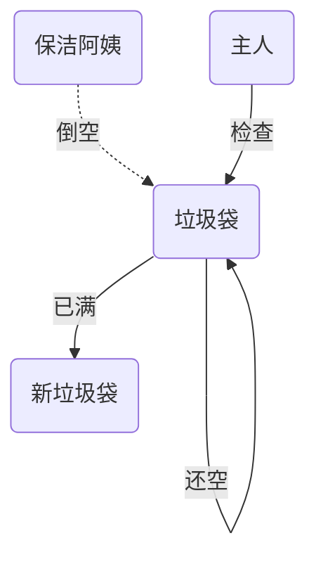

# 第四章 Java内存模型

很多人将【java 内存结构】与【java 内存模型】傻傻分不清，【java 内存模型】是 Java MemoryModel（JMM）的意思。

java内存模型(JMM)屏蔽掉各种硬件和操作系统的内存访问差异，以实现让java程序在各种平台下都能达到一致的并发效果。

Java内存模型规定所有的变量都存储在主内存中，包括实例变量，静态变量，但是不包括局部变量和方法参数。每个线程都有自己的工作内存，线程的工作内存保存了该线程用到的变量和主内存的副本拷贝，线程对变量的操作都在工作内存中进行。线程不能直接读写主内存中的变量。不同的线程之间也无法访问对方工作内存中的变量。线程之间变量值的传递均需要通过主内存来完成。

简单的说，JMM 定义了主存（共享信息存储位置）、工作内存（每个线程自己私有的内存信息）的抽象概念，底层对应着CPU寄存器、缓存、硬件内存、CPU指令优化等。

JMM体现在以下几个方面：

* 原子性：保证指令不会收到线程上下文切换的影响。
* 可见性：保证指令不会受到CPU缓存的影响。
* 有序性：保证指令不会收到CPU指令并行优化的影响。

## 4.1 原子性

* 原子性：保证指令不会收到线程上下文切换的影响。

原子性之前学习过。下面来个例子简单回顾一下：两个线程对初始值为 0 的静态变量一个做自增，一个做自减，各做 5000 次，结果是 0 吗？

```java
public class Demo01 {
    static int count = 0;
    public static void main(String[] args) throws InterruptedException {
        Thread t1 = new Thread(() -> {
            for (int i = 0; i < 5000; i++) {
                count++;
            }
        });

        Thread t2 = new Thread(() -> {
            for (int i = 0; i < 5000; i++) {
                count--;
            }
        });

        t1.start();
        t2.start();
        // 等待t1和t2线程运行完之后再打印count结果值
        t1.join();
        t2.join();
        System.out.println("count: " + count);
    }
}
```

以上的结果可能是正数、负数、零。为什么呢？因为 Java 中对静态变量的自增，自减并不是原子操作。

例如对于 i++ 而言（i 为静态变量），实际会产生如下的 JVM 字节码指令：

```java
getstatic i 				// 获取静态变量i的值
iconst_1 					// 准备常量1
iadd 						// 加法
putstatic i 				// 将修改后的值存入静态变量i
```

而对应 i-- 也是类似：

```java
getstatic i 				// 获取静态变量i的值
iconst_1 					// 准备常量1
isub					 	// 减法
putstatic i 				// 将修改后的值存入静态变量i
```

而 Java 的内存模型如下，完成静态变量的自增，自减需要在主存和线程内存中进行数据交换：


如果是单线程以上 8 行代码是顺序执行（不会交错）没有问题：

```java
// 假设i的初始值为0
getstatic i 		// 线程1-获取静态变量i的值 线程内i=0
iconst_1 			// 线程1-准备常量1
iadd 				// 线程1-自增 线程内i=1
putstatic i 		// 线程1-将修改后的值存入静态变量i 静态变量i=1
getstatic i 		// 线程1-获取静态变量i的值 线程内i=1
iconst_1 			// 线程1-准备常量1
isub 				// 线程1-自减 线程内i=0
putstatic i 		// 线程1-将修改后的值存入静态变量i 静态变量i=0
```


但多线程下这 8 行代码可能交错运行：

出现负数的情况：

```java
// 假设i的初始值为0
getstatic i 		// 线程2-获取静态变量i的值 线程内i=0
iconst_1 			// 线程2-准备常量1
isub 				// 线程2-自减 线程内i=-1
getstatic i 		// 线程1-获取静态变量i的值 线程内i=0
iconst_1 			// 线程1-准备常量1
iadd 				// 线程1-自增 线程内i=1
putstatic i 		// 线程1-将修改后的值存入静态变量i 静态变量i=1
putstatic i 		// 线程2-将修改后的值存入静态变量i 静态变量i=-1
```


出现正数的情况：

```java
// 假设i的初始值为0
getstatic i 			// 线程1-获取静态变量i的值 线程内i=0
iconst_1 				// 线程1-准备常量1
iadd 					// 线程1-自增 线程内i=1
getstatic i 			// 线程2-获取静态变量i的值 线程内i=0
iconst_1 				// 线程2-准备常量1
isub 					// 线程2-自减 线程内i=-1
putstatic i 			// 线程2-将修改后的值存入静态变量i 静态变量i=-1
putstatic i 			// 线程1-将修改后的值存入静态变量i 静态变量i=1
```


解决方法是使用`synchronized` （同步关键字） 。

`synchronized` （同步关键字） 语法

```java
synchronized( 对象 ) {
    要作为原子操作代码
}
```

用 `synchronized` 解决并发问题：

```java
static int i = 0;
static Object obj = new Object();
public static void main(String[] args) throws InterruptedException {
    Thread t1 = new Thread(() -> {
        for (int j = 0; j < 5000; j++) {
            synchronized (obj) {
                i++;
            }
        }
    });
    Thread t2 = new Thread(() -> {
        for (int j = 0; j < 5000; j++) {
            synchronized (obj) {
                i--;
            }
        }
    });
    t1.start();
    t2.start();
    t1.join();
    t2.join();
    System.out.println(i);
}
```

可以把 obj 想象成一个房间，线程 t1，t2 想象成两个人。

- 当线程 t1 执行到 `synchronized(obj)` 时就好比 t1 进入了这个房间，并反手锁住了门，在门内执行`i++` 代码。
- 这时候如果 t2 也运行到了 `synchronized(obj)` 时，它发现门被锁住了，只能在门外等待。
- 当 t1 执行完 `synchronized{}` 块内的代码，这时候才会解开门上的锁，从 obj 房间出来。t2 线程这时才可以进入 obj 房间，反锁住门，执行它的 `i--` 代码。

> 注意：上例中 t1 和 t2 线程必须用 synchronized 锁住同一个 obj 对象，如果 t1 锁住的是 m1 对 象，t2 锁住的是 m2 对象，就好比两个人分别进入了两个不同的房间，没法起到同步的效果。

## 4.2 可见性

* 可见性：保证指令不会受到CPU缓存的影响。

### 4.2.1 退不出的循环

先来看一个现象，main 线程对 run 变量的修改对于 t 线程不可见，导致了 t 线程无法停止：

```java
static boolean run = true;
public static void main(String[] args) throws InterruptedException {
    Thread t = new Thread(()->{
        while(run){
            // ....
            if (!run) break;
        }
    });
    t.start();
    Thread.sleep(1000);
    run = false; // 线程t不会如预想的停下来
}
```

为什么呢？分析一下：

1. 初始状态， t 线程刚开始从主内存读取了 run 的值到工作内存。

   

2. 因为 t 线程要频繁从主内存中读取 run 的值，JIT 编译器会将 run 的值缓存至自己工作内存中的高速缓存中，减少对主存中 run 的访问，提高效率

   

3. 1 秒之后，main 线程修改了 run 的值，并同步至主存，而 t 是从自己工作内存中的高速缓存中读取这个变量的值，结果永远是旧值

   

解决方法方法就是使用`volatile（易变关键字）`。它可以用来修饰成员变量和静态成员变量，可以避免线程从自己的工作缓存中查找变量的值，必须到主存中获取它的值，线程操作 `volatile` 变量都是直接操作主存。

```java
    volatile static boolean run = true;

    public static void main(String[] args) throws InterruptedException {
        Thread t = new Thread(() -> {
            while (run) {
                // ....
                if (!run) break;
            }
        });
        t.start();
        Thread.sleep(1000);
        run = false; // 线程t这时就会停下
    }
```

当然加上synchronized也可以：

```java
	static boolean run = true;
    static Object obj = new Object();
    public static void main(String[] args) throws InterruptedException {
        Thread t = new Thread(() -> {
            while (run) {
                // ....
                synchronized (obj) {
                    if (!run) break;
                }
            }
        });
        t.start();
        Thread.sleep(1000);
        run = false; // 线程t这时就会停下
    }
```

虽然`volatile`和`synchronized`都可以，但是在可见性上面更推荐`volatile`，因为它更轻量。

### 4.2.2 可见性VS原子性

前面例子体现的实际就是可见性，它保证的是在多个线程之间，一个线程对 `volatile` 变量的修改对另一个线程可见， 不能保证原子性，仅用在一个写线程，多个读线程的情况：

上例从字节码理解是这样的：

```java
getstatic run 		// 线程 t 获取 run true
getstatic run 		// 线程 t 获取 run true
getstatic run		// 线程 t 获取 run true
getstatic run 		// 线程 t 获取 run true
putstatic run 		// 线程 main 修改 run 为 false， 仅此一次
getstatic run 		// 线程 t 获取 run false
```

比较一下之前我们在线程安全时举的例子：有两个线程运行，一个 `i++` 一个 `i--`。这时候不能够使用`volatile`，因为`volatile`只能保证看到最新值，不能解决指令交错：

```java
// 假设i的初始值为0
getstatic i 		// 线程1-获取静态变量i的值 线程内i=0
getstatic i 		// 线程2-获取静态变量i的值 线程内i=0
iconst_1 			// 线程1-准备常量1
iadd 				// 线程1-自增 线程内i=1
putstatic i 		// 线程1-将修改后的值存入静态变量i 静态变量i=1
iconst_1 			// 线程2-准备常量1
isub 				// 线程2-自减 线程内i=-1
putstatic i 		// 线程2-将修改后的值存入静态变量i 静态变量i=-1
```

`synchronized` 语句块既可以保证代码块的原子性，也同时保证代码块内变量的可见性。但缺点是`synchronized`是属于重量级操作，性能相对更低。`volatile`更轻量级，但是只能够保证可见性，不能够保证原子性。

如果在前面示例的死循环中加入 `System.out.println()` 会发现即使不加 `volatile` 修饰符，线程 t 也能正确看到对 run 变量的修改了，这是因为 `System.out.println()` 源码也是用了`synchronized`关键字。

```java
public void println(int x) {
    synchronized (this) {
        print(x);
        newLine();
    }
}
```

### 4.2.3 两阶段终止模式优化

之前是学过两阶段终止模式的，可以看看前面的笔记。下面来使用volatile将其优化一下：

```java
@Slf4j
class Monitor {
    Thread thread;
    private volatile boolean flag = false;

    public void start() {
        thread = new Thread(() -> {
            while (true) {
                if (flag) {
                    log.debug("料理后事");
                    return;
                }
                log.debug("监视线程运行中");
                try {
                    Thread.sleep(1000);
                } catch (InterruptedException e) {
                    log.debug("被打断了");
                }
            }

        });
        thread.start();
    }

    public void stop() {
        flag = true;
        thread.interrupt();
    }
}
```

```java
public class Demo01 {
    public static void main(String[] args) throws InterruptedException {
        Monitor monitor = new Monitor();
        monitor.start();
        Thread.sleep(3500);
        monitor.stop();
    }
}
```

### 4.2.4 同步模式之Balking

Balking （犹豫）模式用在一个线程发现另一个线程或本线程已经做了某一件相同的事，那么本线程就无需再做 了，直接结束返回。

例如上面的案例中，如果调用多次start()方法，那么就会产生多个线程，但是监视器线程其实只需要一个就可以了。所以这就造成了资源浪费了。

所以我们需要来使用Balking犹豫模式来改进一下：

```java
@Slf4j
class Monitor {
    Thread thread;
    private volatile boolean flag = false;
    // 判断是否执行过start方法
    private boolean strating = false;

    public void start() {
        // 避免出现线程安全问题-多个线程调用start方法
        synchronized (this) {
            // 如果为真那么代表执行过start方法 那么直接返回就行
            if (strating) {
                return;
            }
            strating = true;
        }
        thread = new Thread(() -> {
            while (true) {
                if (flag) {
                    log.debug("料理后事");
                    return;
                }
                log.debug("监视线程运行中");
                try {
                    Thread.sleep(1000);
                } catch (InterruptedException e) {
                    log.debug("被打断了");
                }
            }

        });
        thread.start();
    }

    public void stop() {
        flag = true;
        thread.interrupt();
    }
}
```

```java
public class Demo01 {
    public static void main(String[] args) throws InterruptedException {
        Monitor monitor = new Monitor();
        // 调用多次也不会有任何问题 这就是Balking犹豫模式
        monitor.start();
        monitor.start();
        monitor.start();
        Thread.sleep(3500);
        monitor.stop();
    }
}
```

Balking犹豫模式还可以用来实现线程安全的单例：

```java
public final class Singleton {
    private Singleton() {
    }
    private static Singleton INSTANCE = null;
    public static synchronized Singleton getInstance() {
        if (INSTANCE != null) {
            return INSTANCE;
        }

        INSTANCE = new Singleton();
        return INSTANCE;
    }
}
```

对比一下保护性暂停模式：保护性暂停模式用在一个线程等待另一个线程的执行结果，当条件不满足时线程等待。

## 4.3 有序性

* 有序性：保证指令不会收到CPU指令并行优化的影响。

### 4.3.1 诡异的结果

```java
int num = 0;
boolean ready = false;
// 线程1 执行此方法
public void actor1(I_Result r) {
    if(ready) {
        r.r1 = num + num;
    } else {
        r.r1 = 1;
    }
}
// 线程2 执行此方法
public void actor2(I_Result r) {
    num = 2;
    ready = true;
}
```

I_Result 是一个对象，有一个属性 r1 用来保存结果，可能的结果有几种？

- 情况1：线程1 先执行，这时 ready = false，所以进入 else 分支结果为 1

- 情况2：线程2 先执行 num = 2，但没来得及执行 ready = true，线程1 执行，还是进入 else 分支，结果为1

- 情况3：线程2 执行到 ready = true，线程1 执行，这回进入 if 分支，结果为 4（因为 num 已经执行过了）


但是实际上还有一种可能是0：线程2 执行 ready = true，切换到线程1，进入 if 分支，相加为 0，再切回线程2 执行num = 2。

这种现象叫做指令重排，是 JIT 编译器在运行时的一些优化，这个现象需要通过大量测试才能复现：借助 java 并发压测工具 jcstress https://wiki.openjdk.java.net/display/CodeTools/jcstress

```apl
mvn archetype:generate -DinteractiveMode=false -
DarchetypeGroupId=org.openjdk.jcstress -DarchetypeArtifactId=jcstress-java-testarchetype -DgroupId=org.sample -DartifactId=test -Dversion=1.0
```

创建 maven 项目，提供如下测试类

```java
@JCStressTest
@Outcome(id = {"1", "4"}, expect = Expect.ACCEPTABLE, desc = "ok")			// 结果是1和4输出
@Outcome(id = "0", expect = Expect.ACCEPTABLE_INTERESTING, desc = "!!!!")	 // 结果是0的输出
@State
public class ConcurrencyTest {
    int num = 0;
    boolean ready = false;
    @Actor
    public void actor1(I_Result r) {
        if(ready) {
            r.r1 = num + num;
        } else {
            r.r1 = 1;
        }
    }
    @Actor
    public void actor2(I_Result r) {
        num = 2;
        ready = true;
    }
}
```

执行

```apl
mvn clean install
java -jar target/jcstress.jar
```

会输出我们感兴趣的结果，摘录其中一次结果：

```apl
*** INTERESTING tests
	Some interesting behaviors observed. This is for the plain curiosity.
	
	2 matching test results.
		[OK] test.ConcurrencyTest
		(JVM args: [-XX:-TieredCompilation])
	Observed state Occurrences Expectation Interpretation
			0 1,729 ACCEPTABLE_INTERESTING !!!!
			1 42,617,915 ACCEPTABLE ok
			4 5,146,627 ACCEPTABLE ok
		[OK] test.ConcurrencyTest
		(JVM args: [])
	Observed state Occurrences Expectation Interpretation
			0 1,652 ACCEPTABLE_INTERESTING !!!!
			1 46,460,657 ACCEPTABLE ok
			4 4,571,072 ACCEPTABLE ok
```

可以看到，出现结果为 0 的情况有 652次，虽然次数相对很少，但毕竟是出现了。

解决方法就是使用`volatile` 关键字。`volatile` 修饰的变量，可以禁用指令重排。`volatile`加在了`ready`这个属性上面，可以避免其上方代码指令重排序，也就是actor2方法里面的。

```java
@JCStressTest
@Outcome(id = {"1", "4"}, expect = Expect.ACCEPTABLE, desc = "ok")
@Outcome(id = "0", expect = Expect.ACCEPTABLE_INTERESTING, desc = "!!!!")
@State
public class ConcurrencyTest {
    int num = 0;
    volatile boolean ready = false;
    @Actor
    public void actor1(I_Result r) {
        if(ready) {
            r.r1 = num + num;
        } else {
            r.r1 = 1;
        }
    }
    @Actor
    public void actor2(I_Result r) {
        num = 2;
        ready = true;
    }
}
```

结果为：

```apl
*** INTERESTING tests
	Some interesting behaviors observed. This is for the plain curiosity.
	0 matching test results.
```

### 4.3.2 有序性理解

JVM 会在不影响正确性的前提下，可以调整语句的执行顺序，思考下面一段代码

```java
static int i;
static int j;
// 在某个线程内执行如下赋值操作
i = ...; // 较为耗时的操作
j = ...;
```

可以看到先执行 i 还是先执行 j ，对最终的结果不会产生影响。所以，上面代码真正执行时，可以是下面两种情况：

```java
i = ...; // 较为耗时的操作
j = ...;
```

```java
j = ...;
i = ...; // 较为耗时的操作
```

这种特性称之为『指令重排』，多线程下『指令重排』会影响正确性，例如著名的 `double-checked locking`模式实现单例

```java
public final class Singleton {
    private Singleton() { }
    private static Singleton INSTANCE = null;
    
    public static Singleton getInstance() {
        // 实例没创建，才会进入内部的 synchronized代码块
        if (INSTANCE == null) {
            synchronized (Singleton.class) {
                // 也许有其它线程已经创建实例，所以再判断一次
                if (INSTANCE == null) {
                    INSTANCE = new Singleton();
                }
            }
        }
        return INSTANCE;
    }
}
```

以上的实现特点是：

- 懒惰实例化
- 首次使用 `getInstance()` 才使用 `synchronized` 加锁，后续使用时无需加锁

但在多线程环境下，上面的代码是有问题的， `INSTANCE = new Singleton()` 对应的字节码为：

```java
0: new 				#2 			// class cn/itcast/jvm/t4/Singleton
3: dup
4: invokespecial 	 #3 		 // Method "<init>":()V
7: putstatic 		 #4			// Field INSTANCE:Lcn/itcast/jvm/t4/Singleton;
```

其中 4 7 两步的顺序不是固定的，也许 jvm 会优化为：先将引用地址赋值给 INSTANCE 变量后，再执行构造方法，如果两个线程 t1，t2 按如下时间序列执行：

```apl
时间1 t1 线程执行到 INSTANCE = new Singleton();
时间2 t1 线程分配空间，为Singleton对象生成了引用地址（0 处）
时间3 t1 线程将引用地址赋值给 INSTANCE，这时 INSTANCE != null（7 处）
时间4 t2 线程进入getInstance() 方法，发现 INSTANCE != null（synchronized块外），直接返回 INSTANCE
时间5 t1 线程执行Singleton的构造方法（4 处）
```

这时 t1 还未完全将构造方法执行完毕，如果在构造方法中要执行很多初始化操作，那么 t2 拿到的是将是一个未初始化完毕的单例

对 `INSTANCE` 使用 `volatile` 修饰即可，可以禁用指令重排，但要注意在 JDK 5 以上的版本的 volatile 才会真正有效。

### 4.3.3 指令级并行原理

首先来介绍一下名词：

- **Clock Cycle Time** ：主频的概念大家接触的比较多，而 CPU 的 `Clock Cycle Time`（时钟周期时间），等于主频的倒数，意思是 CPU 能够识别的最小时间单位。比如说 4G 主频的 CPU 的 `Clock Cycle Time` 就是 0.25 ns，作为对比，我们墙上挂钟的 `Cycle Time` 是 1s。例如，运行一条加法指令一般需要一个时钟周期时间。

- **CPI**：有的指令需要更多的时钟周期时间，所以引出了 CPI （Cycles Per Instruction）指令平均时钟周期数

- **IPC**：IPC（`Instruction Per Clock Cycle`） 即 CPI 的倒数，表示每个时钟周期能够运行的指令数。

- **CPU 执行时间** 程序的 CPU 执行时间，即我们前面提到的 user + system 时间，可以用下面的公式来表示

  ```apl
  程序 CPU 执行时间 = 指令数 * CPI * Clock Cycle Time 
  ```

方便理解，可以先看一个鱼罐头的例子：


可以将每个鱼罐头的加工流程细分为 5 个步骤：

- 去鳞清洗 10分钟
- 蒸煮沥水 10分钟
- 加注汤料 10分钟
- 杀菌出锅 10分钟
- 真空封罐 10分钟


即使只有一个工人，最理想的情况是：他能够在 10 分钟内同时做好这 5 件事，因为对第一条鱼的真空装罐，不会 影响对第二条鱼的杀菌出锅...

**指令重排序优化**

事实上，现代处理器会设计为一个时钟周期完成一条执行时间最长的 CPU 指令。为什么这么做呢？可以想到指令还可以再划分成一个个更小的阶段，例如，每条指令都可以分为： `取指令` - `指令译码` - `执行指令` - `内存访问` - `数据写回` 这 5 个阶段。

五个阶段的术语：

- instruction fetch (IF) ：取指令。
- instruction decode (ID) ：指令译码。
- execute (EX) ：执行指令。
- memory access (MEM) ：内存访问。
- register write back (WB)：数据写回。


在不改变程序结果的前提下，这些指令的各个阶段可以通过**重排序**和**组合**来实现指令级并行，这一技术在 80's（80世纪） 中叶到 90's（90世纪） 中叶占据了计算架构的重要地位。

> 分阶段，分工是提升效率的关键！

指令重排的前提是，重排指令不能影响结果，例如

```java
// 可以重排的例子
int a = 10; // 指令1
int b = 20; // 指令2
System.out.println( a + b );

// 不能重排的例子
int a = 10; // 指令1
int b = a - 5; // 指令2
```

**支持流水线的处理器**

现代 CPU 支持多级指令流水线，例如支持同时执行 `取指令` - `指令译码` - `执行指令` - `内存访问` - `数据写回` 的处理器，就可以称之为五级指令流水线。这时 CPU 可以在一个时钟周期内，同时运行五条指令的不同阶段（相当于一条执行时间最长的复杂指令），IPC = 1，本质上，流水线技术并不能缩短单条指令的执行时间，但它变相地提高了指令地吞吐率。

> 奔腾四（Pentium 4）支持高达 35 级流水线，但由于功耗太高被废弃


## 4.4 Volatile原理

volatile的底层实现原理是**内存屏障**，Memory Barrier（Memory Fence）

- 对 volatile 变量的写指令后会加入写屏障
- 对 volatile 变量的读指令前会加入读屏障

### 4.4.1 内存屏障

对于可见性而言：

- 写屏障（sfence）保证在该屏障之前的，对共享变量的改动，都同步到主存当中。
- 读屏障（lfence）保证在该屏障之后，对共享变量的读取，加载的是主存中新数据。

对于有序性而言：

- 写屏障会确保指令重排序时，不会将写屏障之前的代码排在写屏障之后。
- 读屏障会确保指令重排序时，不会将读屏障之后的代码排在读屏障之前。

### 4.4.2 保证可见性

- 写屏障（sfence）保证在该屏障之前的，对共享变量的改动，都同步到主存当中

  ```java
  public void actor2(I_Result r) {
      num = 2;
      ready = true; // ready 是 volatile 赋值带写屏障
      // 写屏障
  }
  ```

- 而读屏障（lfence）保证在该屏障之后，对共享变量的读取，加载的是主存中新数据

  ```java
  public void actor1(I_Result r) {
      // 读屏障
      // ready 是 volatile 读取值带读屏障
      if(ready) {
          r.r1 = num + num;
      } else {
          r.r1 = 1;
      }
  }
  ```


### 4.4.3 保证有序性

- 写屏障会确保指令重排序时，不会将写屏障之前的代码排在写屏障之后

  ```java
  public void actor2(I_Result r) {
      num = 2;
      ready = true; // ready 是 volatile 赋值带写屏障
      // 写屏障
  }
  ```

- 读屏障会确保指令重排序时，不会将读屏障之后的代码排在读屏障之前

  ```java
  public void actor1(I_Result r) {
      // 读屏障
      // ready 是 volatile 读取值带读屏障
      if(ready) {
          r.r1 = num + num;
      } else {
          r.r1 = 1;
      }
  }
  ```


**但是不能解决指令交错问题**

- 写屏障仅仅是保证之后的读能够读到新的结果，但不能保证读跑到它前面去
- 而有序性的保证也只是保证了**本线程内**相关代码不被重排序

### 4.4.4 dcl问题

`double-checked locking` 问题，以著名的 `double-checked locking` 单例模式为例：

```java
public final class Singleton {
    private Singleton() { }
    private static Singleton INSTANCE = null;
    
    public static Singleton getInstance() { 
        if(INSTANCE == null) { // t2
            // 首次访问会同步，而之后的使用没有 synchronized
            synchronized(Singleton.class) {
                if (INSTANCE == null) { // t1
                    INSTANCE = new Singleton();
                } 
            }
        }
        return INSTANCE;
    }
}
```

以上的实现特点是：

- 懒惰实例化
- 首次使用 getInstance() 才使用 synchronized 加锁，后续使用时无需加锁
- 有隐含的，但很关键的一点：第一个 if 使用了 INSTANCE 变量，是在同步块之外

但在多线程环境下，上面的代码是有问题的，getInstance 方法对应的字节码为：

```java
Code:
      stack=2, locals=1, args_size=0
         0: getstatic     #10                 // Field INSTANCE:Lcom/linxuan/demo01/Singleton;
         3: ifnonnull     35
         6: ldc           #1                  // class com/linxuan/demo01/Singleton
         8: dup
         9: astore_0
        10: monitorenter
        11: getstatic     #10                 // Field INSTANCE:Lcom/linxuan/demo01/Singleton;
        14: ifnonnull     27
        17: new           #1                  // class com/linxuan/demo01/Singleton
        20: dup
        21: invokespecial #20                 // Method "<init>":()V
        24: putstatic     #10                 // Field INSTANCE:Lcom/linxuan/demo01/Singleton;
        27: aload_0
        28: monitorexit
        29: goto          35
        32: aload_0
        33: monitorexit
        34: athrow
        35: getstatic     #10                 // Field INSTANCE:Lcom/linxuan/demo01/Singleton;
```

其中：

- 17 表示创建对象，将对象引用入栈，new Singleton。
- 20 表示复制一份对象引用，引用地址。
- 21 表示利用一个对象引用，调用构造方法，更具引用地址调用。
- 24 表示利用一个对象引用，赋值给 static INSTANCE

也许 jvm 会优化为：先执行 24，再执行 21。如果两个线程 t1，t2 按如下时间序列执行：


关键在于 0: getstatic 这行代码在 monitor 控制之外，它就像之前举例中不守规则的人，可以越过 monitor 读取
INSTANCE 变量的值

这时 t1 还未完全将构造方法执行完毕，如果在构造方法中要执行很多初始化操作，那么 t2 拿到的是将是一个未初
始化完毕的单例。

> synchronized可以保证原子性、可见性、有序性。但是是有前提的，这个变量必须全部在synchronized代码块里面。上面的例子中，INSTANCE 变量有的在外面不受保护了。

**解决`double-checked locking`问题**

对 INSTANCE 使用 volatile 修饰即可，可以禁用指令重排，但要注意在 JDK 5 以上的版本的 volatile 才会真正有效。

字节码上看不出来 volatile 指令的效果，所以我们从读写屏障来看一下：

```java
Code:
      stack=2, locals=1, args_size=0
         // ----------------------> 加入对 INSTANCE 变量的读屏障
         0: getstatic     #10                 // Field INSTANCE:Lcom/linxuan/demo01/Singleton;
         3: ifnonnull     35
         6: ldc           #1                  // class com/linxuan/demo01/Singleton
         8: dup
         9: astore_0
        10: monitorenter               // ----------------------> 保证原子性 可见性
        11: getstatic     #10                 // Field INSTANCE:Lcom/linxuan/demo01/Singleton;
        14: ifnonnull     27
        17: new           #1                  // class com/linxuan/demo01/Singleton
        20: dup
        21: invokespecial #20                 // Method "<init>":()V
        24: putstatic     #10                 // Field INSTANCE:Lcom/linxuan/demo01/Singleton;
        // -------------------------------------> 加入对 INSTANCE 变量的写屏障
        27: aload_0
        28: monitorexit                // ------------------------> 保证原子性、可见性
        29: goto          35
        32: aload_0
        33: monitorexit
        34: athrow
        35: getstatic     #10                 // Field INSTANCE:Lcom/linxuan/demo01/Singleton;
```


如上面的注释内容所示，读写 volatile 变量时会加入内存屏障（Memory Barrier（Memory Fence）），保证可见性和有序性。

更底层是读写变量时使用 lock 指令来多核 CPU 之间的可见性与有序性。

## 4.5 happens-before规则

happens-before 规定了哪些写操作对其它线程的读操作可见，它是可见性与有序性的一套规则总结，抛开以下 happens-before 规则，JMM 并不能保证一个线程对共享变量的写，对于其它线程对该共享变量的读可见。

* 线程解锁 m 之前对变量的写，对于接下来对 m 加锁的其它线程对该变量的读可见

  ```java
  static int x;
  static Object m = new Object();
  new Thread(()->{
      synchronized(m) {
          x = 10;
      }
  },"t1").start();
  new Thread(()->{
      synchronized(m) {
          System.out.println(x);
      }
  },"t2").start();
  ```

* 线程对 volatile 变量的写，对接下来其它线程对该变量的读可见

  ```java
  volatile static int x;
  new Thread(()->{
      x = 10;
  },"t1").start();
  new Thread(()->{
      System.out.println(x);
  },"t2").start();
  
  ```

* 线程 start 前对变量的写，对该线程开始后对该变量的读可见

  ```java
  static int x;
  x = 10;
  new Thread(()->{
      System.out.println(x);
  },"t2").start();
  ```

* 线程结束前对变量的写，对其它线程得知它结束后的读可见（比如其它线程调用 `t1.isAlive()` 或 `t1.join()`等待它结束）

  ```java
  static int x;
  Thread t1 = new Thread(()->{
      x = 10;
  },"t1");
  
  t1.start();
  t1.join();
  System.out.println(x);
  ```

* 线程 t1 打断 t2（`interrupt`）前对变量的写，对于其他线程得知 t2 被打断后对变量的读可见（通过`t2.interrupted` 或 `t2.isInterrupted`）

  ```java
  static int x;
  public static void main(String[] args) {
      Thread t2 = new Thread(()->{
          while(true) {
              if(Thread.currentThread().isInterrupted()) {
                  System.out.println(x);
                  break;
              }
          }
      },"t2");
      
      t2.start();
      
      new Thread(()->{
          try {
              Thread.sleep(1000);
          } catch (InterruptedException e) {
              e.printStackTrace();
          }
          x = 10;
          t2.interrupt();
      },"t1").start();
      
      while(!t2.isInterrupted()) {
          Thread.yield();
      }
      
      System.out.println(x);
  }
  ```
  
* 对变量默认值（0，false，null）的写，对其它线程对该变量的读可见。

* 具有传递性，如果 x hb-> y 并且 y hb-> z 那么有 x hb-> z。

  ```java
  volatile static int x;
  static int y;
  
  new Thread(()->{ 
      y = 10;
      x = 20;
  },"t1").start();
  
  new Thread(()->{
      // x=20 对 t2 可见, 同时 y=10 也对 t2 可见 写屏障会把写屏障之前的操作同步到主存。
      System.out.println(x); 
  },"t2").start();
  ```

变量都是指成员变量或静态成员变量。

## 4.6 习题讲解

### 4.6.1 balking模式习题

希望 `doInit()` 方法仅被调用一次，下面的实现是否有问题，为什么？

```java
public class TestVolatile {
    volatile boolean initialized = false;
    void init() {
        if (initialized) { 
            return;
        } 
        doInit();
        initialized = true;
    }
    private void doInit() {
    }
} 
```

有问题，volatile并不能保证Java代码运行时的原子性。

* 有可能线程t1运行到`doInit();`的时候，线程t2运行`if (initialized)`，这时候仍然是false，所以线程t2也可以向下运行，也可以运行`doInit();`。
* 所以不可以使用volatile，这样存在线程安全问题。volatile只能够保证可见性和有序性，而synchronized可以保证原子性，可见性和有序性。该用synchronized的时候就要用它。

### 4.6.2 线程安全单例习题

单例模式有很多实现方法，饿汉、懒汉、静态内部类、枚举类，试分析每种实现下获取单例对象（即调用getInstance）时的线程安全，并思考注释中的问题

> 饿汉式：类加载就会导致该单实例对象被创建 
>
> 懒汉式：类加载不会导致该单实例对象被创建，而是首次使用该对象时才会创建

实现1：

```java
// 问题1：为什么加 final     防止其他类继承该类，覆盖重写其中的方法，破坏其单例
// 问题2：如果实现了序列化接口, 还要做什么来防止反序列化破坏单例
public final class Singleton implements Serializable {
    // 问题3：为什么设置为私有? 是否能防止反射创建新的实例?  防止其他类调用该构造方法 不能防止，反射很强大
    private Singleton() {}
    // 问题4：这样初始化是否能保证单例对象创建时的线程安全?  能，静态成员变量初始化在类加载阶段，JVM保证安全
    private static final Singleton INSTANCE = new Singleton();
    // 问题5：为什么提供静态方法而不是直接将 INSTANCE 设置为 public, 说出你知道的理由
    	// 方法意味着有更好的封装性、懒惰的初始化方式、泛型的控制等等
    public static Singleton getInstance() {
        return INSTANCE;
    }
    
    // 问题二的解决方法 这样如果反序列化生成的对象也是该对象
    public Object readResolve() {
        return INSTANCE;
    }
}
```

实现2：

```java
// 问题1：枚举单例是如何限制实例个数的     也是静态成员变量
// 问题2：枚举单例在创建时是否有并发问题   没有，它也是静态成员变量，并没有
// 问题3：枚举单例能否被反射破坏单例       不能，反射不能破坏
// 问题4：枚举单例能否被反序列化破坏单例   枚举类默认实现了序列化接口，但是内部已经避免了被反序列化破坏单例 
// 问题5：枚举单例属于懒汉式还是饿汉式     饿汉式，也是静态成员变量
// 问题6：枚举单例如果希望加入一些单例创建时的初始化逻辑该如何做    加一个构造方法就可以了
enum Singleton { 
    INSTANCE; 
}
```

实现3：

```java
public final class Singleton {
    private Singleton() { }
    private static Singleton INSTANCE = null;
    // 分析这里的线程安全, 并说明有什么缺点
    // 线程安全的，缺点就是锁的范围有点大
    public static synchronized Singleton getInstance() {
        if( INSTANCE != null ){
            return INSTANCE;
        } 
        INSTANCE = new Singleton();
        return INSTANCE;
    }
}
```

> synchronized不能够在非final类型的成员变量上面使用，更不能锁住值为NULL的变量。我们知道synchronized本质就是一个monitor，在内存中找一个对象关联，这样值是NULL，那么根本找不到。

实现4：DCL

```java
public final class Singleton {
    private Singleton() { }
    // 问题1：解释为什么要加 volatile ? 防止synchronized代码块里面指令重排序
    private static volatile Singleton INSTANCE = null;

    // 问题2：对比实现3, 说出这样做的意义 
    public static Singleton getInstance() {
        if (INSTANCE != null) { 
            return INSTANCE;
        }
        synchronized (Singleton.class) { 
            // 问题3：为什么还要在这里加为空判断, 之前不是判断过了吗 为了防止首次创建单例对象的时候并发问题
            if (INSTANCE != null) { // t2 
                return INSTANCE;
            }
            INSTANCE = new Singleton(); 
            return INSTANCE;
        } 
    }
}
```

实现5：

```java
public final class Singleton {
    private Singleton() { }
    // 问题1：属于懒汉式还是饿汉式  懒汉式
    private static class LazyHolder {
        static final Singleton INSTANCE = new Singleton();
    }
    // 问题2：在创建时是否有并发问题  不会，类加载时JVM保证线程安全问题
    public static Singleton getInstance() {
        return LazyHolder.INSTANCE;
    }
}
```

# 第五章 共享模型之无锁

先来看一个例子：

有如下需求，保证 `account.withdraw` 取款方法的线程安全

```java
interface Account {
    // 获取余额
    Integer getBalance();
    // 取款
    void withdraw(Integer amount);
    
    /**
     * 方法内会启动 1000 个线程，每个线程做 -10 元 的操作
     * 如果初始余额为 10000 那么正确的结果应当是 0
     */
    static void demo(Account account) {
        List<Thread> ts = new ArrayList<>();
        long start = System.nanoTime();
        
        for (int i = 0; i < 1000; i++) {
            ts.add(new Thread(() -> {
                account.withdraw(10);
            }));
        }
        ts.forEach(Thread::start);
        ts.forEach(t -> {
            try {
                t.join();
            } catch (InterruptedException e) {
                e.printStackTrace();
            }
        });
        
        long end = System.nanoTime();
        System.out.println(account.getBalance() 
                           + " cost: " + (end-start)/1000_000 + " ms");
    }
}
```

非线程安全的实现：

```java
class AccountUnsafe implements Account {
    private Integer balance;
    
    public AccountUnsafe(Integer balance) {
        this.balance = balance;
    }
    
    @Override
    public Integer getBalance() {
        return balance;
    }
    
    @Override
    public void withdraw(Integer amount) {
        balance -= amount;
    }
}
```

```java
public static void main(String[] args) {
    Account.demo(new AccountUnsafe(10000));
}
```

```java
330 cost: 306 ms 
```

线程安全的实现有两种方式：

* 使用`synchronized`

  ```java
  class AccountUnsafe implements Account {
      private Integer balance;
      
      public AccountUnsafe(Integer balance) {
          this.balance = balance;
      }
      
      @Override
      public Integer getBalance() {
  		synchronized(this) {
              return balance;
          }    
      }
      
      @Override
      public void withdraw(Integer amount) {
          synchronized(this) {
              balance -= amount;
          }
      }
  }
  ```

* 不加锁，使用原子整数

  ```java
  class AccountCas implements Account {
  	//使用原子整数
  	private AtomicInteger balance;
  
  	public AccountCas(int balance) {
  		this.balance = new AtomicInteger(balance);
  	}
  
  	@Override
  	public Integer getBalance() {
  		//得到原子整数的值
  		return balance.get();
  	}
  
  	@Override
  	public void withdraw(Integer amount) {
  		while(true) {
  			//获得修改前的值
  			int prev = balance.get();
  			//获得修改后的值
  			int next = prev-amount;
  			//比较并设值
  			if(balance.compareAndSet(prev, next)) {
  				break;
  			}
  		}
  	}
  }
  ```

## 5.1 CAS与volatile

前面看到的 AtomicInteger 的解决方法，内部并没有用锁来保护共享变量的线程安全。那么它是如何实现的呢？

```java
public void withdraw(Integer amount) {
    // 需要不断尝试，直到成功为止
    while (true) {
        // 比如拿到了旧值 1000
        int prev = balance.get();
        // 在这个基础上 1000-10 = 990
        int next = prev - amount;

        /*
            compareAndSet 正是做这个检查，在 set 前，先比较 prev 与当前值
                 - 不一致了，next 作废，返回 false 表示失败
                 	比如，别的线程已经做了减法，当前值已经被减成了 990
                 	那么本线程的这次 990 就作废了，进入 while 下次循环重试
                 - 一致，以 next 设置为新值，返回 true 表示成功
             */
        if (balance.compareAndSet(prev, next)) {
            break;
        }
    }
    
    // 或者也可以使用
    // balance.addAndGet(-1 * amount);
}
```

其中的关键是 `compareAndSwap`（比较并设置值），它的简称就是 `CAS` （也有 `Compare And Swap` 的说法），它必须是原子操作。


- 其实 CAS 的底层是 `lock cmpxchg` 指令（X86 架构），在单核 CPU 和多核 CPU 下都能够保证【比较-交换】的原子性。
- 在多核状态下，某个核执行到带 lock 的指令时，CPU 会让总线锁住，当这个核把此指令执行完毕，再开启总线。这个过程中不会被线程的调度机制所打断，保证了多个线程对内存操作的准确性，是原子的。

### 5.1.1 CAS借助volatile

获取共享变量时，为了保证该变量的可见性，需要使用 volatile 修饰。

来看一下原子整数的部分源码：

```java
public class AtomicInteger extends Number implements java.io.Serializable {
    private static final long serialVersionUID = 6214790243416807050L;

    // setup to use Unsafe.compareAndSwapInt for updates
    private static final Unsafe unsafe = Unsafe.getUnsafe();
    private static final long valueOffset;

    static {
        try {
            valueOffset = unsafe.objectFieldOffset
                (AtomicInteger.class.getDeclaredField("value"));
        } catch (Exception ex) { throw new Error(ex); }
    }

    private volatile int value;
    
    // 省略部分源码
}
```

它可以用来修饰成员变量和静态成员变量，可以避免线程从自己的工作缓存中查找变量的值，必须到主存中获取它的值，线程操作 `volatile` 变量都是直接操作主存。即一个线程对 volatile 变量的修改，对另一个线程可见。

> volatile 仅仅保证了共享变量的可见性，让其它线程能够看到新值，但不能解决指令交错问题（不能保证原子性）

CAS 必须借助 volatile 才能读取到共享变量的新值来实现【比较并交换】的效果。

### 5.1.2 无锁效率

一般情况下，使用无锁比使用加锁的效率更高。我们来分析一下原因：

- 无锁情况下，即使重试失败，线程始终在高速运行，没有停歇，而 synchronized 会让线程在没有获得锁的时候，发生上下文切换，进入阻塞。
- 线程就好像高速跑道上的赛车，高速运行时，速度超快，一旦发生上下文切换，就好比赛车要减速、熄火，等被唤醒又得重新打火、启动、加速... 恢复到高速运行，代价比较大。
- 但无锁情况下，因为线程要保持运行，所以需要额外 CPU 的支持。CPU 在这里就好比高速跑道，如果没有额外的跑道，也就是没有额外的CPU支持，那么线程想高速运行也无从谈起。这时线程虽然不会进入阻塞，但由于没有分到时间片，仍然会进入可运行状态，还是会导致上下文切换。

### 5.1.3 CAS特点

结合 `CAS` 和 `volatile` 可以实现无锁并发，适用于线程数少、多核 CPU 的场景下。

- `CAS` 是基于乐观锁的思想：乐观的估计，不怕别的线程来修改共享变量，就算改了也没关系，我吃亏点再重试呗。

- `synchronized` 是基于悲观锁的思想：悲观的估计，得防着其它线程来修改共享变量，我上了锁你们都别想改，我改完了解开锁，你们才有机会。

- CAS 体现的是无锁并发、无阻塞并发。

  - 因为没有使用 `synchronized`，所以线程不会陷入阻塞，这是效率提升的因素之一
- 但如果竞争激烈，可以想到重试必然频繁发生，反而效率会受影响

## 5.2 原子整数

上面的CAS方法如果我们自己来写有点麻烦，需要while循环，然后操作。现在已经有API来实现这些方法了。

`juc（java.util.concurrent）`中提供了原子操作类，可以提供线程安全的操作，例如：`AtomicInteger`、`AtomicBoolean`、`AtomicLong`等，它们底层就是采用 `CAS 技术 + volatile` 来实现的。

以 AtomicInteger 为例

```java
 AtomicInteger i = new AtomicInteger(0);
 
// 获取并自增（i = 0, 结果 i = 1, 返回 0），类似于 i++ System.out.println(i.getAndIncrement());
 
// 自增并获取（i = 1, 结果 i = 2, 返回 2），类似于 ++i System.out.println(i.incrementAndGet());
 
// 自减并获取（i = 2, 结果 i = 1, 返回 1），类似于 --i System.out.println(i.decrementAndGet());
 
// 获取并自减（i = 1, 结果 i = 0, 返回 1），类似于 i--
System.out.println(i.getAndDecrement());
 
// 获取并加值（i = 0, 结果 i = 5, 返回 0） 
System.out.println(i.getAndAdd(5));
 
// 加值并获取（i = 5, 结果 i = 0, 返回 0） 
System.out.println(i.addAndGet(-5));
 
// 获取并更新（i = 0, p 为 i 的当前值, 结果 i = -2, 返回 0） 
// 其中函数中的操作能保证原子，但函数需要无副作用 
System.out.println(i.getAndUpdate(p -> p - 2));
 
// 更新并获取（i = -2, p 为 i 的当前值, 结果 i = 0, 返回 0）
// 其中函数中的操作能保证原子，但函数需要无副作用 
System.out.println(i.updateAndGet(p -> p + 2));
 
// 获取并计算（i = 0, p 为 i 的当前值, x 为参数1, 结果 i = 10, 返回 0） 
// 其中函数中的操作能保证原子，但函数需要无副作用 // getAndUpdate 如果在 lambda 中引用了外部的局部变量，要保证该局部变量是 final 的 
// getAndAccumulate 可以通过 参数1 来引用外部的局部变量，但因为其不在 lambda 中因此不必是 
final System.out.println(i.getAndAccumulate(10, (p, x) -> p + x));
 
// 计算并获取（i = 10, p 为 i 的当前值, x 为参数1, 结果 i = 0, 返回 0） 
// 其中函数中的操作能保证原子，但函数需要无副作用
System.out.println(i.accumulateAndGet(-10, (p, x) -> p + x));
```

看一下`getAndUpdate`方法的源码：

```java
public final int getAndUpdate(IntUnaryOperator updateFunction) {
    int prev, next;
    do {
        prev = get();
        next = updateFunction.applyAsInt(prev);
    } while (!compareAndSet(prev, next));
    return prev;
}
```

底层使用的都是CAS。

## 5.3 原子引用

为什么需要原子引用类型？引用类型呗！

- `AtomicReference`
- `AtomicStampedReference`
- `AtomicMarkableReference`

```java
public interface DecimalAccount {
    // 获取余额
    BigDecimal getBalance();
    // 取款
    void withdraw(BigDecimal amount);
    
    /**
     * 方法内会启动 1000 个线程，每个线程做 -10 元 的操作
     * 如果初始余额为 10000 那么正确的结果应当是 0
     */
    static void demo(DecimalAccount account) {
        List<Thread> ts = new ArrayList<>();
        
        for (int i = 0; i < 1000; i++) {
            ts.add(new Thread(() -> {
                account.withdraw(BigDecimal.TEN);
            }));
        }
        ts.forEach(Thread::start);
        ts.forEach(t -> {
            try {
                t.join();
            } catch (InterruptedException e) {
                e.printStackTrace();
            }
        });
        
        System.out.println(account.getBalance());
    }
}
```

```java
public class DecimalAccountSafeCas implements DecimalAccount {

    AtomicReference<BigDecimal> ref;

    public DecimalAccountSafeCas(BigDecimal balance) {
        ref = new AtomicReference<>(balance);
    }

    @Override
    public BigDecimal getBalance() {
        return ref.get();
    }

    @Override
    public void withdraw(BigDecimal amount) {
        while (true) {
            BigDecimal prev = ref.get();
            BigDecimal next = prev.subtract(amount);
            if (ref.compareAndSet(prev, next)) {
                break;
            }
        }
    }
}
```

```java
public class Demo01 {
    public static void main(String[] args) {
        DecimalAccount.demo(new DecimalAccountSafeCas(new BigDecimal("10000")));
    }
}
```

### 5.3.1 ABA问题

来看下面一段代码：

```java
@Slf4j
public class Demo01 {

    static AtomicReference<String> atomicReference = new AtomicReference<>("A");

    public static void main(String[] args) {
        log.debug("start...");
        String pre = atomicReference.get();
        Sleeper.sleep(1);
        System.out.println("change A->C " + atomicReference.compareAndSet(pre, "C"));
    }
}
```

这段代码有问题吗？没有，因为只有一个线程，这个线程对其进行修改不会有任何问题。

那么问题来了，如果我们加上一个线程呢？

```java
@Slf4j
public class Demo01 {

    static AtomicReference<String> atomicReference = new AtomicReference<>("A");

    public static void main(String[] args) {
        log.debug("start...");
        String pre = atomicReference.get();
        other();
        Sleeper.sleep(1);
        log.debug("change A->C " + atomicReference.compareAndSet(pre, "C"));
    }

    public static void other() {
        new Thread(() -> {
            log.debug("change A->B " + atomicReference.compareAndSet(atomicReference.get(), "B"));
        }, "t1").start();
        new Thread(() -> {
            log.debug("change B->A " + atomicReference.compareAndSet(atomicReference.get(), "A"));
        }, "t2").start();
    }
}
```

在主线程运行的时候加上两个线程去修改共享变量的值，这时候有问题吗？看一下运行结果：

```java
15:12:31.270 [main] DEBUG com.linxuan.demo01.Demo01 - start...
15:12:31.319 [t1] DEBUG com.linxuan.demo01.Demo01 - change A->B true
15:12:31.319 [t2] DEBUG com.linxuan.demo01.Demo01 - change B->A true
15:12:32.328 [main] DEBUG com.linxuan.demo01.Demo01 - change A->C true
```

主线程并不知道其他线程已经动过共享变量了，实际上已经动过了，只是又改回原样了！

主线程仅能判断出共享变量的值与初值 A 是否相同，不能感知到这种从 A 改为 B 又 改回 A 的情况，如果主线程希望：只要有其它线程【动过了】共享变量，那么自己的 cas 就算失败，这时，仅比较值是不够的，需要再加一个版本号。

### 5.3.2 ABA问题解决

如果我们想要避免这种情况，那么就可以使用`AtomicStampedReference`或者`AtomicMarkableReference`这两个原子引用。

**`AtomicStampedReference`**

```java
@Slf4j
public class Demo01 {
    static AtomicStampedReference<String> ref = new AtomicStampedReference<>("A", 0);

    public static void main(String[] args) {
        log.debug("start...");
        // 获取值
        String pre = ref.getReference();
        // 获取版本号
        int stamp = ref.getStamp();
        other();
        Sleeper.sleep(1);
        log.debug("change A->C " + ref.compareAndSet(pre, "C", stamp, stamp + 1));
    }

    public static void other() {
        new Thread(() -> {
            int stamp = ref.getStamp();
            log.debug("change A->B "
                    + ref.compareAndSet(ref.getReference(), "B", stamp, stamp + 1));
        }, "t1").start();

        new Thread(() -> {
            int stamp = ref.getStamp();
            log.debug("change B->A "
                    + ref.compareAndSet(ref.getReference(), "B", stamp, stamp + 1));
        }, "t2").start();
    }
}
```

**`AtomicMarkableReference`**

`AtomicStampedReference` 可以给原子引用加上版本号，追踪原子引用整个的变化过程，如： `A -> B -> A -> C` ，通过`AtomicStampedReference`，我们可以知道，引用变量中途被更改了几次。

但是有时候，并不关心引用变量更改了几次，只是单纯的关心是否更改过，所以就有了`AtomicMarkableReference`。



```java
class GarbageBag {
    String desc;
    public GarbageBag(String desc) {
        this.desc = desc;
    }
    public void setDesc(String desc) {
        this.desc = desc;
    }
    @Override
    public String toString() {
        return super.toString() + " " + desc;
    }
}
```

```java
@Slf4j
public class TestABAAtomicMarkableReference {
    public static void main(String[] args) throws InterruptedException {
        GarbageBag bag = new GarbageBag("装满了垃圾");
        // 参数2 mark 可以看作一个标记，表示垃圾袋满了
        AtomicMarkableReference<GarbageBag> ref = new AtomicMarkableReference<>(bag, true);
        log.debug("主线程 start...");
        
        GarbageBag prev = ref.getReference();
        log.debug(prev.toString());
        
        new Thread(() -> {
            log.debug("打扫卫生的线程 start...");
            bag.setDesc("空垃圾袋");
            while (!ref.compareAndSet(bag, bag, true, false)) {}
            log.debug(bag.toString());
        }).start();
        
        Thread.sleep(1000);
        log.debug("主线程想换一只新垃圾袋？");
        
        boolean success = ref.compareAndSet(prev, new GarbageBag("空垃圾袋"), true, false);
        log.debug("换了么？" + success);
        log.debug(ref.getReference().toString());
    }
}
```

**两者的区别**

- `AtomicStampedReference` 需要我们传入整型变量作为版本号，来判定是否被更改过
- `AtomicMarkableReference`需要我们传入布尔变量作为标记，来判断是否被更改过

## 5.4 原子数组

- `AtomicIntegerArray`
- `AtomicLongArray`
- `AtomicReferenceArray`

```java
/**
 参数1，提供数组、可以是线程不安全数组或线程安全数组
 参数2，获取数组长度的方法
 参数3，自增方法，回传 array, index
 参数4，打印数组的方法
*/
// supplier 提供者 无中生有 ()->结果
// function 函数 一个参数一个结果 (参数)->结果 , BiFunction (参数1,参数2)->结果
// consumer 消费者 一个参数没结果 (参数)->void, BiConsumer (参数1,参数2)->
private static <T> void demo(
        Supplier<T> arraySupplier,
        Function<T, Integer> lengthFun,
        BiConsumer<T, Integer> putConsumer,
        Consumer<T> printConsumer) {

    List<Thread> ts = new ArrayList<>();
    T array = arraySupplier.get();
    int length = lengthFun.apply(array);

    for (int i = 0; i < length; i++) {
        // 每个线程对数组作 10000 次操作
        ts.add(new Thread(() -> {
            for (int j = 0; j < 10000; j++) {
                putConsumer.accept(array, j % length);
            }
        }));
    }

    ts.forEach(t -> t.start()); // 启动所有线程

    ts.forEach(t -> {
        try {
            t.join();
        } catch (InterruptedException e) {
            e.printStackTrace();
        }
    }); // 等所有线程结束

    printConsumer.accept(array);
}
```

首先来看不安全的数组：

```java
public static void main(String[] args) {
    demo(
        () -> {return new int[10];},
        (array) -> {return array.length;},
        (array, index) -> {array[index]++;},
        (array) -> {System.out.println(Arrays.toString(array));}
    );
}
```

结果为：`[7241, 7224, 7222, 7236, 7210, 7148, 7193, 7215, 7248, 7245]`。

再来看安全的数组：

```java
public static void main(String[] args) {
    demo(
        () -> {return new AtomicIntegerArray(10);},
        (array) -> array.length(),
        (array, index) -> array.getAndIncrement(index),
        (array) -> System.out.println(array)
    );
}
```

结果为：`[10000, 10000, 10000, 10000, 10000, 10000, 10000, 10000, 10000, 10000]`。

## 5.5 原子更新器

- `AtomicReferenceFieldUpdater` // 域 字段
- `AtomicIntegerFieldUpdater`
- `AtomicLongFieldUpdate`

利用字段更新器，可以针对对象的某个域（Field）进行原子操作，只能配合 volatile 修饰的字段使用，否则会出现异常 `Exception in thread "main" java.lang.IllegalArgumentException: Must be volatile type`。

原子更新器用于帮助我们改变某个对象中的某个属性

```java
@Data
class Student {
   volatile String name;
}
```

```java
public class Demo1 {
   public static void main(String[] args) {
      Student student = new Student();
       
      // 获得原子更新器
      // 参数1 持有属性的类 参数2 被更新的属性的类 参数3 为属性的名称
      AtomicReferenceFieldUpdater<Student, String> updater = 
          			AtomicReferenceFieldUpdater.newUpdater(Student.class, String.class, "name");
       
      // 修改 参数分别为：对象，原来的值，要修改的值
      updater.compareAndSet(student, null, "Nyima");
      System.out.println(student);
   }
}

```

从上面的例子可以看出，原子更新器是通过newUpdater来获取实例的。其中传入了三个参数：拥有属性的类的Class、属性的Class、属性的名称。

可以轻易的发现，初始化过程肯定用到了反射，要不然不会传入它的Class类对象。让我们看看源码来验证一下这个猜测。

```java
public static <U,W> AtomicReferenceFieldUpdater<U,W> newUpdater(Class<U> tclass,
                                                                Class<W> vclass,
                                                                String fieldName) {
    // 返回了一个AtomicReferenceFieldUpdaterImpl实例
    return new AtomicReferenceFieldUpdaterImpl<U,W>
        (tclass, vclass, fieldName, Reflection.getCallerClass());
}
```

`AtomicReferenceFieldUpdater`为抽象类，该类内部有一个自己的实现类AtomicReferenceFieldUpdaterImpl

```java
private static final class AtomicReferenceFieldUpdaterImpl<T,V>
        extends AtomicReferenceFieldUpdater<T,V>
```

`AtomicReferenceFieldUpdaterImpl`构造方法如下：

```java
AtomicReferenceFieldUpdaterImpl(final Class<T> tclass,
                                final Class<V> vclass,
                                final String fieldName,
                                final Class<?> caller) {
    // 用于保存要被修改的属性
    final Field field;
    
    // 属性的Class
    final Class<?> fieldClass;
    
    // field的修饰符
    final int modifiers;
    try {
        // 反射获得属性
        field = AccessController.doPrivileged(
            new PrivilegedExceptionAction<Field>() {
                public Field run() throws NoSuchFieldException {
                    // tclass为传入的属性的Class，可以通过它来获得属性
                    return tclass.getDeclaredField(fieldName);
                }
            });
        
        // 获得属性的修饰符，主要用于判断
        // 1、vclass 与 属性确切的类型是否匹配
        // 2、是否为引用类型
        // 3、被修改的属性是否加了volatile关键字
        modifiers = field.getModifiers();
        sun.reflect.misc.ReflectUtil.ensureMemberAccess(
            caller, tclass, null, modifiers);
        ClassLoader cl = tclass.getClassLoader();
        ClassLoader ccl = caller.getClassLoader();
        if ((ccl != null) && (ccl != cl) &&
            ((cl == null) || !isAncestor(cl, ccl))) {
            sun.reflect.misc.ReflectUtil.checkPackageAccess(tclass);
        }
        
        // 获得属性类的Class
        fieldClass = field.getType();
    } catch (PrivilegedActionException pae) {
        throw new RuntimeException(pae.getException());
    } catch (Exception ex) {
        throw new RuntimeException(ex);
    }

    if (vclass != fieldClass)
        throw new ClassCastException();
    if (vclass.isPrimitive())
        throw new IllegalArgumentException("Must be reference type");

    if (!Modifier.isVolatile(modifiers))
        throw new IllegalArgumentException("Must be volatile type");

    // Access to protected field members is restricted to receivers only
    // of the accessing class, or one of its subclasses, and the
    // accessing class must in turn be a subclass (or package sibling)
    // of the protected member's defining class.
    // If the updater refers to a protected field of a declaring class
    // outside the current package, the receiver argument will be
    // narrowed to the type of the accessing class.
 	// 对类中的属性进行初始化
    this.cclass = (Modifier.isProtected(modifiers) &&
                   tclass.isAssignableFrom(caller) &&
                   !isSamePackage(tclass, caller))
                  ? caller : tclass;
    this.tclass = tclass;
    this.vclass = vclass;
    // 获得偏移量
    this.offset = U.objectFieldOffset(field);
}
```

可以看出，原子引用更新器确实使用了反射。

## 5.6 原子累加器

虽然使用原子整数的API可以，但是原子累加器的API性能更为高效。

我们来对比一下他们的性能：

```java
private static <T> void demo(Supplier<T> adderSupplier, Consumer<T> action) {
    T adder = adderSupplier.get();
    long start = System.nanoTime();
    List<Thread> ts = new ArrayList<>();
    
    // 4 个线程，每线程累加 50 万
    for (int i = 0; i < 40; i++) {
        ts.add(new Thread(() -> {
            for (int j = 0; j < 500000; j++) {
                action.accept(adder);
            }
        }));
    }
    
    ts.forEach(t -> t.start());
    ts.forEach(t -> {
        try {
            t.join();
        } catch (InterruptedException e) {
            e.printStackTrace();
        }
    });
    
    long end = System.nanoTime();
    System.out.println(adder + " cost:" + (end - start)/1000_000);
}
```

比较 `AtomicLong` 与 `LongAdder`

```java
public static void main(String[] args) {
    System.out.println("使用AtomicLong的耗时为：");
    for (int i = 0; i < 5; i++) {
        demo(() -> new AtomicLong(), adder -> adder.getAndIncrement());
    }

    System.out.println("使用LongAdder的耗时为：");
    for (int i = 0; i < 5; i++) {
        demo(() -> new LongAdder(), adder -> adder.increment());
    }
}
```

输出

```java
使用AtomicLong的耗时为：
2000000 cost:59
2000000 cost:57
2000000 cost:36
2000000 cost:41
2000000 cost:40
使用LongAdder的耗时为：
2000000 cost:27
2000000 cost:14
2000000 cost:19
2000000 cost:27
2000000 cost:12
```

性能提升的原因很简单，就是在有竞争时，设置多个累加单元，Therad-0 累加 `Cell[0]`，而 `Thread-1` 累加`Cell[1]...` 最后将结果汇总。这样它们在累加时操作的不同的 `Cell` 变量，因此减少了 `CAS` 重试失败，从而提高性能。

LongAdder 分为 base 和 cells 两部分。没有并发争用的时候或者是 cells 数组正在初始化的时候，会使用 CAS 来累加值到 base，有并发争用，会初始化 cells 数组，数组有多少个 cell，就允许有多少线程并行修改，最后将数组中每个 cell 累加，再加上 base 就是最终的值。

## 5.7 LongAdder原理

LongAdder 是并发大师 @author Doug Lea （大哥李）的作品，设计的非常精巧。

LongAdder 类有几个关键域

```java
// 累加单元数组, 懒惰初始化
transient volatile Cell[] cells;

// 基础值, 如果没有竞争, 则用 cas 累加这个域
transient volatile long base;

// 在 cells 创建或扩容时, 置为 1, 表示加锁
transient volatile int cellsBusy;
```

### 5.7.1 cas锁

```java
// 不要用于生产实践！！！
public class LockCas {
    private AtomicInteger state = new AtomicInteger(0);
    
    public void lock() {
        while (true) {
            if (state.compareAndSet(0, 1)) {
                break;
            }
        }
    }
    
    public void unlock() {
        log.debug("unlock...");
        state.set(0);
    }
}
```

```java
LockCas lock = new LockCas();

new Thread(() -> {
    log.debug("begin...");
    lock.lock();
    try {
        log.debug("lock...");
        sleep(1);
    } finally {
        lock.unlock();
    }
}).start();

new Thread(() -> {
    log.debug("begin...");
    lock.lock();
    try {
        log.debug("lock...");
    } finally {
        lock.unlock();
    }
}).start();
```

```java
18:27:07.198 c.Test42 [Thread-0] - begin... 
18:27:07.202 c.Test42 [Thread-0] - lock... 
18:27:07.198 c.Test42 [Thread-1] - begin... 
18:27:08.204 c.Test42 [Thread-0] - unlock... 
18:27:08.204 c.Test42 [Thread-1] - lock... 
18:27:08.204 c.Test42 [Thread-1] - unlock... 
```

### 5.7.2 原理之伪共享

其中 Cell 即为累加单元

```java
// 防止缓存行伪共享
@sun.misc.Contended
    static final class Cell {
        volatile long value;
        Cell(long x) { value = x; }

        // 最重要的方法, 用来 cas 方式进行累加, prev 表示旧值, next 表示新值
        final boolean cas(long prev, long next) {
            return UNSAFE.compareAndSwapLong(this, valueOffset, prev, next);
        }
        // 省略不重要代码
    }
```

缓存行伪共享得从缓存说起，缓存与内存的速度比较：


| 从 cpu 到 | 大约需要的时钟周期               |
| --------- | -------------------------------- |
| 寄存器    | 1 cycle (4GHz 的 CPU 约为0.25ns) |
| L1        | 3~4 cycle                        |
| L2        | 10~20 cycle                      |
| L3        | 40~45 cycle                      |
| 内存      | 120~240 cycle                    |

因为 CPU 与 内存的速度差异很大，需要靠预读数据至缓存来提升效率。

而缓存以缓存行为单位，每个缓存行对应着一块内存，一般是 64 byte（8 个 long）。

缓存的加入会造成数据副本的产生，即同一份数据会缓存在不同核心的缓存行中。

CPU 要保证数据的一致性，如果某个 CPU 核心更改了数据，其它 CPU 核心对应的整个缓存行必须失效。


因为 Cell 是数组形式，在内存中是连续存储的，一个 Cell 为 24 字节（16 字节的对象头和 8 字节的 value），因此缓存行可以存下 2 个的 Cell 对象。这样问题来了：

- Core-0 要修改 `Cell[0]`
- Core-1 要修改 `Cell[1]`

无论谁修改成功，都会导致对方 Core 的缓存行失效，

比如 Core-0 中 `Cell[0]=6000` ,`Cell[1]=8000` 要累加 `Cell[0]=6001`, `Cell[1]=8000` ，这时会让 Core-1 的缓存行失效。

`@sun.misc.Contended` 用来解决这个问题，它的原理是在使用此注解的对象或字段的前后各增加 128 字节大小的 `padding`（空白），从而让 CPU 将对象预读至缓存时占用不同的缓存行，这样，不会造成对方缓存行的失效。


累加主要调用以下方法

```java
public void add(long x) {
    Cell[] as; long b, v; int m; Cell a;
    if ((as = cells) != null || !casBase(b = base, b + x)) {
        boolean uncontended = true;
        if (as == null || (m = as.length - 1) < 0 ||
            (a = as[getProbe() & m]) == null ||
            !(uncontended = a.cas(v = a.value, v + x)))
            longAccumulate(x, null, uncontended);
    }
}
```


## 5.8 Unsafe

Unsafe对象并非是不安全的意思，它是直接操作底层的，是不建议我们这些初级程序员使用的，所以命名为Unsafe.

Unsafe 对象提供了非常底层的，操作内存、线程的方法，Unsafe 对象不能直接调用，只能通过反射获得

```java
import sun.misc.Unsafe;

@Slf4j
public class Demo01 {

    public static void main(String[] args) throws Exception {
        Field theUnsafe = Unsafe.class.getDeclaredField("theUnsafe");
        theUnsafe.setAccessible(true);
        Unsafe unsafe = (Unsafe) theUnsafe.get(null);

        System.out.println(unsafe);
    }
}
```


```java
@Data
class Person {
    // 配合CAS操作，必须用volatile修饰
 	volatile String name;
}
```

```java
public class GetUnsafe {
	public static void main(String[] args) throws NoSuchMethodException, IllegalAccessException, InvocationTargetException, InstantiationException, NoSuchFieldException {
		// 通过反射获得Unsafe对象
		Class unsafeClass = Unsafe.class;
		// 获得构造函数，Unsafe的构造函数为私有的
		Constructor constructor = unsafeClass.getDeclaredConstructor();
		// 设置为允许访问私有内容
		constructor.setAccessible(true);
		// 创建Unsafe对象
		Unsafe unsafe = (Unsafe) constructor.newInstance();
		
		// 创建Person对象
		Person person = new Person();
		// 获得其属性 name 的偏移量
		Field field = Person.class.getDeclaredField("name");
		long offset = unsafe.objectFieldOffset(field);

		// 通过unsafe的CAS操作改变值
		unsafe.compareAndSwapObject(person, offset, null, "Nyima");
		System.out.println(person);
	}
}
```
