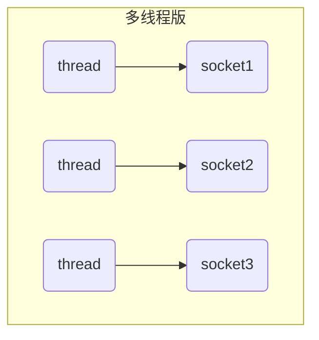
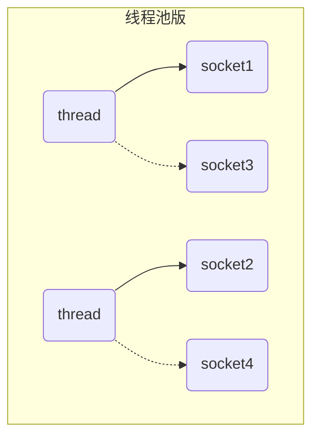
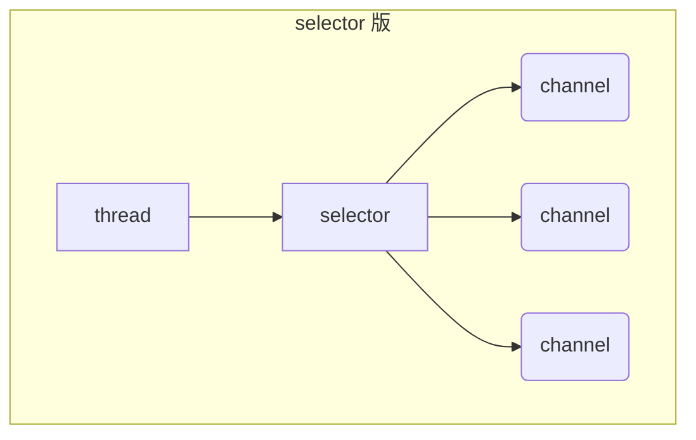

<!-- non-blocking io 非阻塞IO -->

# 第一章 三大组件

## 1.1 Channel & Buffer

channel 有一点类似于 stream，它就是读写数据的**双向通道**，可以从 channel 将数据读入 buffer，也可以将 buffer 的数据写入 channel，而之前的 stream 要么是输入，要么是输出，channel 比 stream 更为底层。


常见的 Channel 有

* `FileChannel`
* `DatagramChannel`
* `SocketChannel`
* `ServerSocketChannel`

buffer 则用来缓冲读写数据，常见的 buffer 有

* `ByteBuffer`
  * `MappedByteBuffer`
  * `DirectByteBuffer`
  * `HeapByteBuffer`
* `ShortBuffer`
* `IntBuffer`
* `LongBuffer`
* `FloatBuffer`
* `DoubleBuffer`
* `CharBuffer`

## 1.2 Selector

<!--selector 选择器-->

selector 单从字面意思不好理解，需要结合服务器的设计演化来理解它的用途。

**多线程版设计**

最早开发服务器端的程序的时候，就是使用的这种设计方式。服务器端的开发就是处理客户端的通信，这种方式的思路就是使用多个线程，每个线程来处理一个客户端的通信。


对于这种情况：

* 内存占用高，线程也需要占用空间，多个客户端的请求会导致大量的线程被创建，从而内存飙升。
* 线程上下文切换成本高，CPU不够导致线程之间的切换频率增加，这样会导致线程上下文切换成本增加。
* 只适合连接数少的场景

**线程池版设计**

线程数量不能够创建太多，那么我们可以使用线程池来设计。所以就有了这种线程池版设计。但是由于是线程池所以如果需要该线程去处理别的socket通信，那么必须之前的socket通信完成，让Thread给释放了才能够去做通信。所以这种就产生了阻塞请款！


对于这种情况：

* 阻塞模式下，线程仅能处理一个 socket 连接
* 仅适合短连接场景

**selector 版设计**

selector 的作用就是配合一个线程来管理多个 channel，获取这些 channel 上发生的事件，这些 channel 工作在非阻塞模式下，不会让线程吊死在一个 channel 上。适合连接数特别多，但流量低的场景（low traffic）



调用 selector 的 `select()` 会阻塞直到 channel 发生了读写就绪事件。这些事件发生，select 方法就会返回这些事件交给 thread 来处理。

# 第二章 ByteBuffer

首先来导入一下这个项目用的Maven坐标：

```xml
<dependencies>
    <!-- 日志 -->
    <dependency>
        <groupId>ch.qos.logback</groupId>
        <artifactId>logback-classic</artifactId>
        <version>1.4.4</version>
    </dependency>
    <!-- guava google的工具类合集 -->
    <dependency>
        <groupId>com.google.guava</groupId>
        <artifactId>guava</artifactId>
        <version>19.0</version>
    </dependency>
    <!-- json格式数据转换 -->
    <dependency>
        <groupId>io.github.jglrxavpok.hephaistos</groupId>
        <artifactId>gson</artifactId>
        <version>2.5.3</version>
    </dependency>
    <!-- 简化实体类开发 -->
    <dependency>
        <groupId>org.projectlombok</groupId>
        <artifactId>lombok</artifactId>
        <version>1.18.24</version>
    </dependency>
    <dependency>
        <groupId>io.netty</groupId>
        <artifactId>netty-all</artifactId>
        <version>5.0.0.Alpha2</version>
    </dependency>
    <!-- 单元测试 -->
    <dependency>
        <groupId>junit</groupId>
        <artifactId>junit</artifactId>
        <version>4.11</version>
        <scope>test</scope>
    </dependency>
</dependencies>
```

在项目下面创建一个`data.txt`文件，内容为：`1234567890abcd`。

使用 FileChannel 来读取文件内容：

```java
public static void main(String[] args) {
    try (FileChannel fileChannel = new FileInputStream("data.txt").getChannel()) {
        // 准备一个缓冲区 通道向缓冲区写数据 然后缓冲区数据打印出来
        ByteBuffer byteBuffer = ByteBuffer.allocate(10);
        // 从Channel读取数据 向buffer写入
        while (fileChannel.read(byteBuffer) != -1) {
            // 打印buffer内容
            byteBuffer.flip(); // 切换至读模式
            while (byteBuffer.hasRemaining()) { // byteBuffer中是否有剩余未读去的数据
                System.out.print((char) byteBuffer.get() + " ");
            }
            byteBuffer.clear(); // 切换至写模式
            System.out.println();
        }

    } catch (Exception e) {
    }
}
```

```apl
1 2 3 4 5 6 7 8 9 0
a b c d
```

ByteBuffer 正确使用姿势：

1. 向 buffer 写入数据，例如调用 `fileChannel.read(buffer)`
2. 调用 `flip()` 切换至读模式
3. 从 buffer 读取数据，例如调用 `buffer.get()`
4. 调用 `clear()` 或 `compact()` 切换至写模式
5. 重复 1~4 步骤


