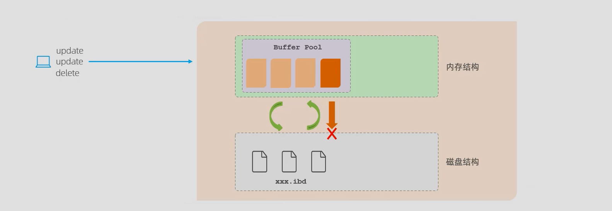
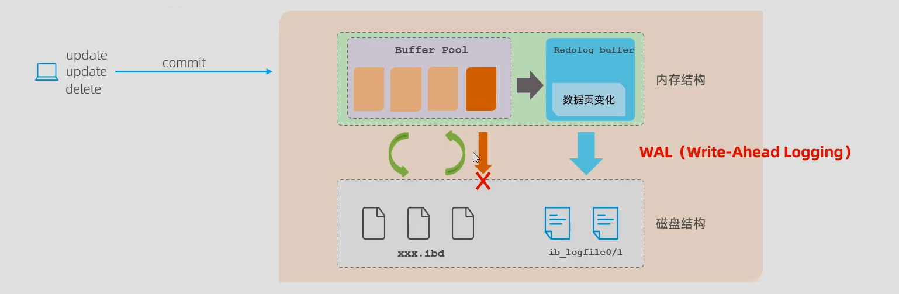
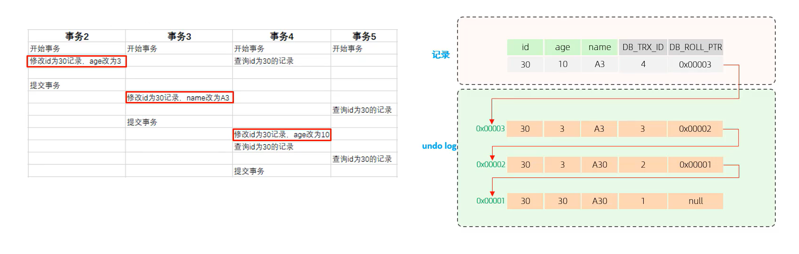

# 第一章 存储引擎介绍

先介绍一下MySQL体系结构：


简单介绍一下MySQL体系结构：

* 连接层：最上层是一些客户端和链接服务，包含本地 socket 通信和大多数基于客户端/服务端工具实现的类似于 TCP/IP的通信。
  主要完成一些类似于连接处理、授权认证及相关的安全方案。在该层上引入了线程池的概念，为通过认证安全接入的客户端提供线程。同样在该层上可以实现基于SSL的安全链接。服务器也会为安全接入的每个客户端验证它所具有的操作权限。
* 服务层：第二层架构主要完成大多数的核心服务功能，如SQL接口，并完成缓存的查询，SQL的分析和优化，部分内置函数的执行。所有跨存储引擎的功能也在这一层实现，如过程、函数等。
  在该层，服务器会解析查询并创建相应的内部解析树，并对其完成相应的优化如确定表的查询的顺序，是否利用索引等， 最后生成相应的执行操作。如果是select语句，服务器还会查询内部的缓存，如果缓存空间足够大， 这样在解决大量读操作的环境中能够很好的提升系统的性能。
* 引擎层：存储引擎层， 存储引擎真正的负责了MySQL中数据的存储和提取，服务器通过API和存储引擎进行通信。不同的存储引擎具有不同的功能，这样我们可以根据自己的需要，来选取合适的存储引擎。数据库中的索引是在存储引擎层实现的。
  和其他数据库相比，MySQL有点与众不同，它的架构可以在多种不同场景中应用并发挥良好作用。主要体现在存储引擎上，插件式的存储引擎架构，将查询处理和其他的系统任务以及数据的存储提取分离。 这种架构可以根据业务的需求和实际需要选择合适的存储引擎。
* 存储层：数据存储层， 主要是将数据(如: redolog、undolog、数据、索引、二进制日志、错误日志、查询 日志、慢查询日志等)存储在文件系统之上，并完成与存储引擎的交互。

存储引擎就是存储数据、建立索引、更新/查询数据等技术的实现方式 。存储引擎是基于表的，而不是基于库的，所以存储引擎也可被称为表类型。MySQL 存储引擎采用的是插件式架构，支持多种存储引擎，我们可以在创建表的时候，来指定选择的存储引擎，如果没有指定将自动选择默认的存储引擎。默认的存储引擎是InnoDB。

简单来说，存储引擎就是指表的类型以及表在计算机上的存储方式。

```sql
-- 查询当前数据库支持的存储引擎
show engines;

-- 创建表的时候指定存储引擎
CREATE TABLE 表名(
    字段1 字段1类型 [ COMMENT 字段1注释 ] ,
    ......
    字段n 字段n类型 [COMMENT 字段n注释 ]
) ENGINE = INNODB [ COMMENT 表注释 ] ;
```

## 1.1 三大存储引擎

官网5.7版本支持的10种存储引擎，这里介绍三种：

- InnoDB：InnoDB是一种兼顾高可靠性和高性能的通用存储引擎，在MySQL5.5之后，InnoDB是默认的MySQL存储引擎，默认使用`B+TREE`数据结构存储索引。InnoDB的优势在于提供了良好的事务处理、崩溃修复能力和并发控制。缺点是读写效率较差，占用的数据空间相对较大。
- MyISAM：MyISAM 是 MySQL 早期的默认存储引擎。拥有较高的插入和查询速度，但不支持事务和外键。
- Memory：所有数据置于内存的存储引擎，拥有极高的插入，更新和查询效率。但是会占用和数据量成正比的内存空间。并且其内容会在Mysql重新启动时丢失。默认采用hash索引。

在选择存储引擎时，应该根据应用系统的特点选择合适的存储引擎。对于复杂的应用系统，还可以根据实际情况选择多种存储引擎进行组合。

- InnoDB：如果应用对事物的完整性有比较高的要求，在并发条件下要求数据的一致性，数据操作除了插入和查询之外，还包含很多的更新、删除操作，则 InnoDB 是比较合适的选择。
- MyISAM：如果应用是以读操作和插入操作为主，只有很少的更新和删除操作，并且对事务的完整性、并发性要求不高，那这个存储引擎是非常合适的。
- Memory：将所有数据保存在内存中，访问速度快，通常用于临时表及缓存。Memory 的缺陷是对表的大小有限制，太大的表无法缓存在内存中，而且无法保障数据的安全性

电商中的足迹和评论适合使用 MyISAM 引擎，缓存适合使用 Memory 引擎。

| 存储引擎特点 | InnoDB              | MyISAM | Memory |
| ------------ | ------------------- | ------ | ------ |
| 存储限制     | 64TB                | 有     | 有     |
| 事务安全     | 支持                | -      | -      |
| 锁机制       | 行锁                | 表锁   | 表锁   |
| B+tree索引   | 支持                | 支持   | 支持   |
| Hash索引     | -                   | -      | 支持   |
| 全文索引     | 支持（5.6版本之后） | 支持   | -      |
| 空间使用     | 高                  | 低     | N/A    |
| 内存使用     | 高                  | 低     | 中等   |
| 批量插入速度 | 低                  | 高     | 高     |
| 支持外键     | 支持                | -      | -      |

## 1.2 存储引擎Q&A

**MyISAM 和 InnoDB 有什么区别？**

MySQL 5.5 之前，MyISAM 引擎是 MySQL 的默认存储引擎。虽然，MyISAM 的性能还行，各种特性也还不错（比如全文索引、压缩、空间函数等）。但是，MyISAM 不支持事务和行级锁，而且最大的缺陷就是崩溃后无法安全恢复。MySQL 5.5 版本之后，InnoDB 是 MySQL 的默认存储引擎。

区别如下：

* InnoDB 提供事务支持，MyISAM 不提供事务支持。
* InnoDB 支持外键，MyISAM 不支持外键。
* InnoDB 支持行级锁(row-level locking)和表级锁，默认为行级锁。MyISAM 只有表级锁(table-level locking)。MyISAM 一锁就是锁住了整张表，这在并发写的情况下性能浪费过大。
* InnoDB 支持数据库异常崩溃后的安全恢复，MyISAM 不支持。使用 InnoDB 的数据库在异常崩溃后，数据库重新启动的时候会保证数据库恢复到崩溃前的状态。这个恢复的过程依赖于 `redo log` 。
* InnoDB 和MyISAM都采用 B+Tree 作为索引结构，但是两者的实现方式不太一样。InnoDB是聚集索引，数据文件本身就是索引文件，通过主键索引效率很高。MyISAM是非聚集索引，数据文件是分离的，索引保存的是数据文件的指针，主键索引和辅助索引是独立的。
* InnoDB 的性能比 MyISAM 更强大。

# 第二章 索引INDEX

索引（index）是帮助MySQL高效获取数据的数据结构。在数据之外，数据库系统还维护着满足特定查找算法的数据结构，这些数据结构以某种方式指向数据，这样就可以在这些数据结构上实现查找算法，这些数据结构就是索引。

- 优点：提高数据检索效率，降低数据库的IO成本。通过索引列对数据进行排序，降低数据排序的成本，降低CPU的消耗。

- 缺点：索引列也是要占用空间的。索引大大提高了查询效率，但降低了增删改的速度。

```sql
-- 创建索引 如果 CREATE 后面不加索引类型参数，则创建的是常规索引
CREATE [ UNIQUE | FULLTEXT ] INDEX index_name ON table_name (index_col_name, ...);
-- 创建索引的名称index_name的规范：idx_表名_字段名
create index idx_user_name on tb_user(name);
-- 查看索引
SHOW INDEX FROM table_name;
-- 删除索引
DROP INDEX index_name ON table_name;
```

在MySQL数据库，将索引的具体类型主要分为以下几类：主键索引、唯一索引、常规索引、全文索引。

| 分类     | 含义                                                 | 特点               | 关键字   |
| -------- | ---------------------------------------------------- | ------------------ | -------- |
| 主键索引 | 针对于表中主键创建的索引                             | 自动创建，只有一个 | PRIMARY  |
| 唯一索引 | 避免同一个表中某数据列中的值重复                     | 可以有多个         | UNIQUE   |
| 常规索引 | 快速定位特定数据                                     | 可以有多个         |          |
| 全文索引 | 全文索引查找的是文本中的关键词，而不是比较索引中的值 | 可以有多个         | FULLTEXT |

## 2.1 索引结构

MySQL的索引是在存储引擎层实现的，不同的存储引擎有不同的索引结构，主要包含以下几种：

| 索引结构            | 描述                                                         |
| ------------------- | ------------------------------------------------------------ |
| B+Tree              | 最常见的索引类型，大部分引擎都支持B+树索引。                 |
| Hash                | 底层数据结构是用哈希表实现，只有精确匹配索引列的查询才有效，不支持范围查询 |
| R-Tree(空间索引)    | 空间索引是 MyISAM 引擎的一个特殊索引类型，主要用于地理空间数据类型，使用较少 |
| Full-Text(全文索引) | 是一种通过建立倒排索引，快速匹配文档的方式，类似于 Lucene、Solr、ES |

来看看不同的存储引擎对于索引结构的支持情况：

| 索引       | InnoDB        | MyISAM | Memory |
| ---------- | ------------- | ------ | ------ |
| B+Tree索引 | 支持          | 支持   | 支持   |
| Hash索引   | 不支持        | 不支持 | 支持   |
| R-Tree索引 | 不支持        | 支持   | 不支持 |
| Full-text  | 5.6版本后支持 | 支持   | 不支持 |

**B+Tree索引**

B+ 树是 B 树的一种变体：

* B 树的所有节点既存放键也存放数据，而 B+树只有叶子节点存放 key 和 data，其他内节点只存放 key。
* B 树的叶子节点都是独立的，B+树的叶子节点有一条引用链指向与它相邻的叶子节点。
* B 树的检索的过程相当于对范围内的每个节点的关键字做二分查找，可能还没有到达叶子节点，检索就结束了。而 B+树的检索效率就很稳定了，任何查找都是从根节点到叶子节点的过程，叶子节点的顺序检索很明显。


上述的结构是标准的B+Tree的数据结构。MySQL 索引数据结构对经典的 B+Tree 进行了优化。在原 B+Tree 的基础上，增加一个指向相邻叶子节点的链表指针，就形成了带有顺序指针的 B+Tree，提高区间访问的性能。


B+Tree 对比于B树索引结构好处：

- B+ 树的磁盘读写代价更低。B+ 树的数据都集中在叶子节点，分支节点只负责指针（索引）；B 树的分支节点既有指针也有数据 。这将导致B+ 树的层高会小于B 树的层高，也就是说B+ 树平均的Io次数会小于B 树。

- B+ 树的查询效率更加稳定。B+ 树的数据都存放在叶子节点，故任何关键字的查找必须走一条从根节点到叶子节点的路径。所有关键字的查询路径相同，每个数据查询效率相当。

- B+树更便于遍历。由于B+树的数据都存储在叶子结点中，分支结点均为索引，遍历只需要扫描一遍叶子节点即可；B树因为其分支结点同样存储着数据，要找到具体的数据，需要进行一次中序遍历按序来搜索。

- B+树更擅长范围查询。B+树叶子节点存放数据，数据是按顺序放置的双向链表。B树范围查询只能中序遍历。Hash索引不支持范围匹配和排序操作。

- B+ 树占用内存空间小。B+ 树索引节点没有数据，比较小。在内存有限的情况下，相比于B树索引可以加载更多B+ 树索引。 

**Hash索引**

哈希索引就是采用一定的hash算法，将键值换算成新的hash值，映射到对应的槽位上，然后存储在hash表中。如果两个（或多个）键值，映射到一个相同的槽位上，他们就产生了hash冲突，可以通过链表来解决。

查询效率高，通常只需要一次检索就可以了，效率通常要高于 B+Tree 索引。但是Hash索引只能用于对等比较（=、in），不支持范围查询（betwwn、>、<、...），无法利用索引完成排序操作。


在MySQL中，支持hash索引的是Memory存储引擎。 而InnoDB中具有自适应hash功能，hash索引是 InnoDB存储引擎根据B+Tree索引在指定条件下自动构建的。

Hash索引的限制和弊端：

- Hash 索引仅仅能满足等值查询，不能使用范围查询。经过相应的 Hash 算法处理之后的 Hash 值的大小关系，并不能保证和Hash运算前完全一样。

- Hash 索引无法被用来数据的排序操作。经过相应的 Hash 算法处理之后的 Hash 值的大小关系，并不能保证和Hash运算前完全一样。

- Hash 索引不能利用部分索引键查询。对于组合索引，Hash 索引在计算 Hash 值的时候是组合索引键合并后再一起计算 Hash 值，而不是单独计算 Hash 值，所以通过组合索引的前面一个或几个索引键进行查询的时候，Hash 索引也无法被利用。

- Hash 索引在任何时候都不能避免表扫描。前面已经知道，Hash 索引是将索引键通过 Hash 运算之后，将 Hash运算结果的 Hash 值和所对应的行指针信息存放于一个 Hash 表中，由于不同索引键存在相同 Hash 值，所以即使取满足某个 Hash 键值的数据的记录条数，也无法从 Hash 索引中直接完成查询，还是要通过访问表中的实际数据进行相应的比较，并得到相应的结果。

- Hash 索引遇到大量Hash值相等的情况后性能并不一定就会比B+Tree索引高。对于选择性比较低的索引键，如果创建 Hash 索引，那么将会存在大量记录指针信息存于同一个 Hash 值相关联。这样要定位某一条记录时就会非常麻烦，会浪费多次表数据的访问，而造成整体性能低下

## 2.2 索引分类

在 InnoDB 存储引擎中，根据索引的存储形式，可以分为以下两种：

| 分类                      | 含义                                                       | 特点         |
| ------------------------- | ---------------------------------------------------------- | ------------ |
| 聚集索引(Clustered Index) | 将数据存储与索引放一块，索引结构的叶子节点保存了行数据     | 只有一个     |
| 二级索引(Secondary Index) | 将数据与索引分开存储，索引结构的叶子节点关联的是对应的主键 | 可以存在多个 |

如果存在主键，主键索引就是聚集索引。如果不存在主键，将使用第一个唯一（UNIQUE）索引作为聚集索引。 如果表没有主键，或没有合适的唯一索引，则InnoDB会自动生成一个`rowid`作为隐藏的聚集索引。

聚集索引的叶子节点下面存储的是这一行的数据。而二级索引下面存储的是对应的ID。


```sql
-- 备注：id为主键，name字段创建的有索引
-- 第一条语句的执行效率高
select * from user where id = 10;
-- 这条语句相比于第一条较慢，这是因为回表查询。
select * from user where name = 'Arm';
```

我们来看一下这条语句在MySQL中的查询流程：`select * from user where name = 'Arm';`。首先在二级索引里面查找到Arm，然后就可以得到ID。最后根据ID就可以查出来这一行数据了。这叫做回表查询，步骤如下：


## 2.3 查询使用索引情况

<!-- explain 解释，说明，阐明 -->

EXPLAIN或者DESC命令获取执行SELECT语句的信息，包括SELECT语句执行过程中表如何连接和连接的顺序。

```sql
-- 直接在select语句之前加上关键字 explain / desc
EXPLAIN SELECT 字段列表 FROM 表名 WHERE 条件 ;
```


Explain 执行计划中各个字段的含义：

- `id`：select 查询的序列号，表示查询中执行 select 子句或者操作表的顺序（id相同，执行顺序从上到下；id不同，值越大越先执行）
- `select_type`：表示 SELECT 的类型，常见取值有 SIMPLE（简单表，即不适用表连接或者子查询）、PRIMARY（主查询，即外层的查询）、UNION（UNION中的第二个或者后面的查询语句）、SUBQUERY（SELECT/WHERE之后包含子查询）等
- `type`：表示连接类型，性能由好到差的连接类型为 NULL、system、const、eq_ref、ref、range、index、all，尽量将性能提升到const就可以了。
- `possible_keys`：可能应用在这张表上的索引，一个或多个
- `Key`：实际使用的索引，如果为 NULL，则没有使用索引
- `Key_len`：表示索引中使用的字节数，该值为索引字段最大可能长度，并非实际使用长度，在不损失精确性的前提下，长度越短越好
- `rows`：MySQL认为必须要执行的行数，在InnoDB引擎的表中，是一个估计值，可能并不总是准确的
- `filtered`：表示返回结果的行数占需读取行数的百分比，filtered的值越大越好。

## 2.4 单列索引多条件查询

多条件联合查询时，MySQL优化器会评估哪个字段的索引效率更高，会选择该索引完成本次查询。在业务场景中，如果存在多个查询条件，考虑针对于查询字段建立索引时，建议建立联合索引，而非单列索引。

- 单列索引：即一个索引只包含单个列
- 联合索引：即一个索引包含了多个列

```sql
# 创建一个表tb_user，查看表中字段
CREATE TABLE tb_user(
	id INT PRIMARY KEY AUTO_INCREMENT,
	NAME VARCHAR(50) NOT NULL,
	phone VARCHAR(11) NOT NULL,
	email VARCHAR(100),
	profession VARCHAR(11),
	age TINYINT UNSIGNED,
	gender CHAR(1),
	STATUS CHAR(1),
	createtime DATETIME
);

# 查看表中字段
mysql> desc tb_user;
+------------+------------------+------+-----+---------+----------------+
| Field      | Type             | Null | Key | Default | Extra          |
+------------+------------------+------+-----+---------+----------------+
| id         | int              | NO   | PRI | NULL    | auto_increment |
| name       | varchar(50)      | NO   | MUL | NULL    |                |
| phone      | varchar(11)      | NO   | UNI | NULL    |                |
| email      | varchar(100)     | YES  |     | NULL    |                |
| profession | varchar(11)      | YES  | MUL | NULL    |                |
| age        | tinyint unsigned | YES  |     | NULL    |                |
| gender     | char(1)          | YES  |     | NULL    |                |
| status     | char(1)          | YES  |     | NULL    |                |
| createtime | datetime         | YES  |     | NULL    |                |
+------------+------------------+------+-----+---------+----------------+
```

```sql
-- 在tb_user表里面存在着phone和name的单列索引
explain select * from tb_user where phone = "17799990010" and name = "韩信";

+----------------------------+--------------+
| possible_keys              | key          | -- 预计使用到的索引：idx_user_pho，idx_user_name
+----------------------------+--------------+ -- 使用到的索引：idx_user_pho，MySQL评估该索引效率高
| idx_user_pho,idx_user_name | idx_user_pho | 
+----------------------------+--------------+
```

## 2.5 SQL提示指定索引

SQL提示，是优化数据库的一个重要手段。简单来说，就是在SQL语句中加入一些人为的提示来达到优化操作的目的。有时候我们查询一个字段，但是与该字段相关联的索引有多个，这个时候我们就可以来指定索引了。

```sql
-- 为profession创建一个联合索引及单列索引
-- 给字段profession，age，status添加联合索引。
create index idx_user_pro_age_sta on tb_user(profession, age, status);
-- 给字段profession创建单列索引
create index idx_user_pro on tb_user(profession);

-- 查询该语句索引使用情况
explain select * from tb_user where profession = "软件工程";
-- 可能用到的索引有两个：idx_user_pro_age_sta, idx_user_pro
-- 实际用到的索引为 idx_user_pro_age_sta 联合索引
+------+-----------------------------------+----------------------+
| type | possible_keys                     | key                  |	
+------+-----------------------------------+----------------------+	
| ref  | idx_user_pro_age_sta,idx_user_pro | idx_user_pro_age_sta |
+------+-----------------------------------+----------------------+
```

这时候我们可以利用SQL提示来指定使用的索引了：

```sql
-- 建议使用该索引
explain select * from tb_user use index(idx_user_pro) where profession="软件工程";
-- 不使用该索引
explain select * from tb_user ignore index(idx_user_pro) where profession="软件工程";
-- 必须使用该索引
explain select * from tb_user force index(idx_user_pro) where profession="软件工程";
```

## 2.6 最左前缀法则

如果该索引关联了多列（联合索引），要遵守最左前缀法则，最左前缀法则指的是查询从索引的最左列开始，并且不跳过索引中的列。如果跳跃某一列，索引将部分失效（后面的字段索引失效）。最左前缀法则中最左，是指在查询时联合索引中最左边的字段。

```sql
-- 给字段profession，age，status添加索引。
create index idx_user_pro_age_sta on tb_user(profession, age, status);
-- 查看索引
show index from tb_user;
```

根据索引来查询，测试

```sql
explain select * from tb_user where profession = '软件工程' and age = 31 and status = '0';

+----------------------+----------------------+---------+
| possible_keys        | key                  | key_len |	-- 预计使用索引：idx_user_pro_age_sta
+----------------------+----------------------+---------+	-- 使用索引：idx_user_pro_age_sta
| idx_user_pro_age_sta | idx_user_pro_age_sta | 54      |	-- 索引长度：54
+----------------------+----------------------+---------+
```

```sql
explain select * from tb_user where profession = '软件工程' and age = 31; -- 跳过某一列 索引部分失效

+----------------------+----------------------+---------+	    
| possible_keys        | key                  | key_len |	-- 预计使用索引：idx_user_pro_age_sta 
+----------------------+----------------------+---------+	-- 使用索引：idx_user_pro_age_sta
| idx_user_pro_age_sta | idx_user_pro_age_sta | 49      |	-- 索引长度：49
+----------------------+----------------------+---------+
```

```sql
explain select * from tb_user where profession = '软件工程';   -- 跳过某一列，索引部分失效

+----------------------+----------------------+---------+
| possible_keys        | key                  | key_len |	-- 预计使用索引：idx_user_pro_age_sta
+----------------------+----------------------+---------+	-- 使用索引：idx_user_pro_age_sta
| idx_user_pro_age_sta | idx_user_pro_age_sta | 47      |	-- 索引长度：47
+----------------------+----------------------+---------+
```

```sql
explain select * from tb_user where age = 31 and status = '0';	-- 没有最左索引，因此索引失效

+---------------+------+---------+
| possible_keys | key  | key_len |			-- 预计使用索引：NULL
+---------------+------+---------+			-- 使用索引：NULL
| NULL          | NULL | NULL    |			-- 索引长度：NULL
+---------------+------+---------+
```

```sql
-- 查询顺序与索引顺序不容，当然没有任何问题，依然使用索引查询。
explain select * from tb_user where age = 31 and status = '0' and profession = "软件工程";

+----------------------+----------------------+---------+
| possible_keys        | key                  | key_len |	-- 预计使用索引：idx_user_pro_age_sta
+----------------------+----------------------+---------+	-- 使用索引：idx_user_pro_age_sta
| idx_user_pro_age_sta | idx_user_pro_age_sta | 54      |	-- 索引长度：54
+----------------------+----------------------+---------+
```

联合索引中，出现范围查询（<, >），范围查询右侧的列索引失效。可以用>=或者<=来规避索引失效问题。

## 2.7 覆盖索引

覆盖索引是指查询使用了索引，并且在该索引中能够全部找到需要返回的列。尽量使用覆盖索引，减少`select *`。 使用`select *` 查询返回所有字段值，很容易就会造成回表查询。除非是根据主键查询，此时只会扫描聚集索引。

```sql
-- 给字段profession，age，status添加索引。
create index idx_user_pro_age_sta on tb_user(profession, age, status);
-- 查看索引
show index from tb_user;

-- 查看该语句使用情况
explain select id, profession, age, status from tb_user where profession = "软件工程" and age = 31 and status = '0';
-- using where; using index; 查找使用了索引，但是需要的数据都在索引列中能找到，所以不需要回表查询
-- tb_user表中有一个联合索引idx_user_pro_age_sta，该索引是二级索引，当我们查询返回的数据在索引中已经全部存在，那么直接走二级索引就可以返回数据了，不需要再进行回表查询。
+--------------------------+
| Extra                    |
+--------------------------+
| Using where; Using index |
+--------------------------+
```

```sql
-- 查询的字段比上面多了一个gender，联合索引里面并没有gender
explain select id, profession, age, status, gender from tb_user where profession = "软件工程" and age = 31 and status = '0'; 

-- using index condition 查找使用了索引，但是需要回表查询数据
-- tb_user表中有一个联合索引idx_user_pro_age_sta，该索引是二级索引，查询的字段超出索引的范围了。需要拿到主键id，再去扫描聚集索引，再获取额外的数据了，这个过程就是回表。
+-----------------------+
| Extra                 |
+-----------------------+
| Using index condition |
+-----------------------+
```

## 2.8 前缀索引

当字段类型为字符串（varchar, text等）时，有时候需要索引很长的字符串，这会让索引变得很大，查询时，浪费大量的磁盘IO，影响查询效率。此时可以只将字符串的一部分前缀建立索引，这样可以大大节约索引空间，从而提高索引效率。

前缀长度：可以根据索引的选择性来决定。选择性是指不重复的索引值（基数）和数据表的记录总数的比值，索引选择性越高则查询效率越高。唯一索引的选择性是1，这是最好的索引选择性，性能也是最好的。

```sql
-- 前缀索引语法
create index idx_xxxx on table_name(columnn(n));

-- 查看选择性：不重复的索引值（基数）和数据表的记录总数的比值
-- 查看整个emial字符串的选择性。这个选择性是高，但是这样的话索引的字符串就太大了，浪费IO。
select count(distinct email) / count(*) from tb_user;
-- 查看1~5个字符串的选择性，感觉可以就选这个了。
select count(distinct substring(email, 1, 5)) / count(*) from tb_user;
```

show index 里面的sub_part可以看到截取的长度

```sql
-- 创建email字段的前缀索引 长度为5
create index idx_user_email_5 on tb_user(email(5));		
 -- 查看所有索引。语法为：SHOW INDEX FROM table_name;
show index from tb_user \G;
*************************** 7. row ***************************	-- 第7个索引
        Table: tb_user
   Non_unique: 1
     Key_name: idx_user_email_5
 Seq_in_index: 1
  Column_name: email
    Collation: A
  Cardinality: 23
     Sub_part: 5		-- 索引截取长度
       Packed: NULL
         Null: YES
   Index_type: BTREE
      Comment: 
Index_comment: 
      Visible: YES
   Expression: NULL
```


## 2.9 索引失效情况

索引失效情况如下：

* 在索引列上进行运算操作，索引将失效。
* 字符串类型字段使用时，不加引号，索引将失效。
* 模糊查询中，如果仅仅是尾部模糊匹配，索引不会是失效；如果是头部模糊匹配，索引失效。
* 用 or 分割开的条件，如果 or 其中一个条件的列没有索引，那么涉及的索引都不会被用到。
* 如果 MySQL 评估使用索引比全表更慢，则不使用索引。

```sql
-- 对phone字段添加一个唯一索引。查询后两位为15的phone。这样会导致索引失效，因为用到了函数进行运算操作
explain select * from tb_user where substring(phone, 10, 2) = '15';	

-- 索引失效 phone字段是varchar(11)，可是并没有加上引号。因此索引失效
explain select * from tb_user where phone = 17799990015;

-- 模糊查询，头部模糊查询，索引失效
explain select * from tb_user where profession like '%工程';

-- 用 or 分割开的条件，如果 or 其中一个条件的列没有索引，那么涉及的索引都不会被用到。
-- phone有索引，但是age没有索引 所以不走索引。全表扫描
explain select * from tb_user where phone = '17799990017' or age = 23;
```

## 2.10 设计原则

1. 针对于数据量较大，且查询比较频繁的表建立索引
2. 针对于常作为查询条件（where）、排序（order by）、分组（group by）操作的字段建立索引
3. 尽量选择区分度高的列作为索引，尽量建立唯一索引，区分度越高，使用索引的效率越高
4. 如果是字符串类型的字段，字段长度较长，可以针对于字段的特点，建立前缀索引
5. 尽量使用联合索引，减少单列索引。查询时，联合索引很多时候可以覆盖索引，节省存储空间，避免回表，提高查询效率
6. 要控制索引的数量，索引并不是多多益善，索引越多，维护索引结构的代价就越大，会影响增删改的效率
7. 如果索引列不能存储NULL值，请在创建表时使用NOT NULL约束它。当优化器知道每列是否包含NULL值时，它可以更好地确定哪个索引最有效地用于查询。

# 第三章 InnoDB存储引擎

InnoDB是一种兼顾高可靠性和高性能的通用存储引擎，在MySQL5.5之后，InnoDB是默认的MySQL存储引擎，默认使用`B+TREE`数据结构存储索引。InnoDB的优势在于提供了良好的事务处理、崩溃修复能力和并发控制。缺点是读写效率较差，占用的数据空间相对较大。

- 支持事务，DML操作遵循 ACID 事务四大特性。
- 支持行级锁(row-level locking)和表级锁，默认为行级锁，提高并发访问性能。
- 支持外键约束，保证数据的完整性和正确性

InnoDB存储引擎逻辑存储结构：


表空间（TableSpace）：InnoDB存储引擎逻辑结构的最高层。如果用户启用了参数 `innodb_file_per_table`（在8.0版本中默认开启），则每张表都会有一个表空间`xxx.ibd`文件，否则多张表共用一个表空间文件。`xxx.ibd`中`xxx`是表名称，该文件用来存储该表的表结构（frm、sdi）、数据和索引。

段（Segment）：段分为数据段（Leaf node segment）、索引段（Non-leaf node segment）、回滚段（Rollback segment）。InnoDB是索引组织表，数据段就是B+树的叶子节点，索引段即为B+树的非叶子节点。

区（Extent）：表空间的单元结构，每个区的大小为1M。

页（Page）：InnoDB 存储引擎磁盘管理的最小单元，每个页的大小默认为 16KB，即一个区中一共有64个连续的页。为了保证页的连续性，InnoDB 存储引擎每次从磁盘申请 4-5 个区。

行（Row）：InnoDB 存储引擎数据是按行进行存放的。 在行中默认有两个隐藏字段：`Trx_id`和`Roll_pointer`。

- `Trx_id`：每次对某条记录进行改动时，都会把对应的事务id赋值给`trx_id`隐藏列。
- `Roll_pointer`：每次对某条引记录进行改动时，都会把旧的版本写入到undo日志中，然后这个隐藏列就相当于一个指针，可以通过它来找到该记录修改前的信息。

```sql
-- 查看 Mysql 变量，在8.0版本中，该变量是打开的状态。
mysql> select @@innodb_file_per_table;
+-----------------------+-------+
| Variable_name         | Value |
+-----------------------+-------+
| innodb_file_per_table | 1   |
+-----------------------+-------+
1 row in set, 1 warning (0.03 sec)
```

## 3.1 InnoDB架构

下面是InnoDB架构图，左侧为内存结构，右侧为磁盘结构。


### 3.1.1 内存结构

在左侧的内存结构中，主要分为这么四大块儿： 缓冲池Buffer Pool、更改缓冲区Change Buffer、自适应hash索引Adaptive Hash Index、日志缓冲区Log Buffer。 

**缓冲池Buffer Pool**

缓冲池 Buffer Pool：是主内存中的一个区域，里面可以缓存磁盘上经常操作的真实数据。在执行增删改查操作时，先操作缓冲池中的数据；若缓冲池没有数据，则从磁盘加载并缓存。然后再以一定频率刷新到磁盘，从而减少磁盘IO，加快处理速度。

缓冲池以Page页为单位，底层采用链表数据结构管理Page。根据状态将Page分为三种类型：

-  `free page`：空闲page，未被使用。
-  `clean page`：被使用page，数据没有被修改过。
-  `dirty page`：脏页，被使用page，数据被修改过，内存中数据与磁盘的数据产生了不一致。

```sql
-- 查看缓冲池信息。在专用服务器上，通常将多达80％的物理内存分配给缓冲池 。
mysql> select @@innodb_buffer_pool_size;
+---------------------------+
| @@innodb_buffer_pool_size |
+---------------------------+
|                 134217728 |
+---------------------------+
1 row in set (0.00 sec)
```

**更改缓冲区Change Buffer**

更改缓冲区Change Buffer：针对于非唯一二级索引页。在执行DML语句时，如果这些数据Page没有在Buffer Pool中，不会直接操作磁盘，而会将数据变更存在更改缓冲区 Change Buffer 中。未来数据被读取时，将数据合并恢复到 Buffer Pool 中，再将合并后的数据刷新到磁盘中。

与聚集索引不同，二级索引通常是非唯一的，并且以相对随机的顺序插入二级索引。同样，删除和更新可能会影响索引树中不相邻的二级索引页，如果每一次都操作磁盘，会造成大量的磁盘IO。有了ChangeBuffer之后，我们可以在缓冲池中进行合并处理，减少磁盘IO。


**自适应hash索引Adaptive Hash Index**

自适应hash索引，用于优化对Buffer Pool数据的查询。MySQL的innoDB引擎中虽然没有直接支持hash索引，但是给我们提供了一个功能就是这个自适应hash索引。hash索引在进行等值匹配时，一般性能是要高于B+树的，因为hash索引一般只需要一次IO即可，而B+树，可能需要几次匹配，所以hash索引的效率要高，但是hash索引又不适合做范围查询、模糊匹配。

InnoDB存储引擎会监控对表上各索引页的查询，如果观察到在特定的条件下hash索引可以提升速度，则建立hash索引，称之为自适应hash索引。自适应哈希索引，无需人工干预，是系统根据情况自动完成。

```sql
mysql> show variables like '%hash%';
+----------------------------------+-------+
| Variable_name                    | Value |
+----------------------------------+-------+
| innodb_adaptive_hash_index       | ON    |
| innodb_adaptive_hash_index_parts | 8     |
+----------------------------------+-------+
2 rows in set, 1 warning (0.01 sec)
```

**日志缓冲区Log Buffer**

日志缓冲区Log Buffer：用来保存要写入到磁盘中的log日志数据（redo log 、undo log），默认大小为 16MB。日志缓冲区的日志会定期刷新到磁盘中。如果需要更新、插入或删除许多行的事务，增加日志缓冲区的大小可以节省磁盘 I/O。

```sql
-- 查看日志缓冲区大小
mysql> show variables like '%log_buffer_size%';
+------------------------+---------+
| Variable_name          | Value   |
+------------------------+---------+
| innodb_log_buffer_size | 1048576 |
+------------------------+---------+
1 row in set, 1 warning (0.00 sec)

-- 查看日志刷新到磁盘的时机。
mysql> show variables like '%flush_log_at_trx_commit%';
+--------------------------------+-------+
| Variable_name                  | Value |
+--------------------------------+-------+ -- 1 日志在每次事务提交时写入并刷新到磁盘，默认值。
| innodb_flush_log_at_trx_commit | 1     | -- 0 每秒将日志写入并刷新到磁盘一次。
+--------------------------------+-------+ -- 2 日志在每次事务提交后写入，并每秒刷新到磁盘一次。
1 rows in set, 1 warning (0.00 sec)
```

### 3.1.2 磁盘结构

数据是以表空间来维护和存放的。在表空间中包含数据，结构，索引等信息，如何有效使用表空间对于MySQL来说非常重要。

数据库的表空间是用来存储数据的逻辑空间，也是存储数据的最大逻辑单元，其下还有段、区、页等逻辑数据类型。表空间设计是为了提升更高的IO，不同处理数据的解耦，便于管理。

目前MySQL8.0 版本Tablespaces，从原有的共享表空间，数据表空间分成如下5中表空间：系统表空间System Tablespace、独立表空间File-Per-Table Tablespaces、通用表空间General Tablespaces、撤销表空间Undo Tablespaces、临时表空间Temporary Tablespaces。


由上图可以发现大概有七个区域：系统表空间System Tablespace、独立表空间File-Per-Table Tablespaces、通用表空间General Tablespaces、撤销表空间Undo Tablespaces、临时表空间Temporary Tablespaces、双写缓冲区Doublewrite Buffer Files、重做日志Redo Log。

**系统表空间System Tablespace**

系统表空间是更改缓冲区change buffer的存储区域。如果表在系统表空间创建的，而不是在独立表空间File-Per-Table Tablespaces或通用表空间General Tablespaces中创建的，那么它还包含表和索引数据。在MySQL5.x版本中还包含InnoDB数据字典、undolog等

```sql
-- 查看系统表空间变量
mysql> show variables like '%innodb_data_file_path%';
+-----------------------+------------------------+
| Variable_name         | Value                  |
+-----------------------+------------------------+ -- 系统表空间，默认的文件名叫 ibdata1
| innodb_data_file_path | ibdata1:12M:autoextend |
+-----------------------+------------------------+
1 row in set, 1 warning (0.00 sec)
```

**独立表空间File-Per-Table Tablespaces**

独立表空间包含单个InnoDB表的数据和索引，并存储在文件系统中自己的数据文件中。如果用户启用了参数 `innodb_file_per_table`（在8.0版本中默认开启），则每张表都会有一个表空间`xxx.ibd`文件，否则多张表共用一个表空间文件。`xxx.ibd`中`xxx`是表名称，该文件用来存储该表的表结构（frm、sdi）、数据和索引。 

```sql
-- 查看独立表空间参数
mysql> show variables like '%innodb_file_per_table%';
+-----------------------+-------+
| Variable_name         | Value |
+-----------------------+-------+
| innodb_file_per_table | ON    |
+-----------------------+-------+
1 row in set, 1 warning (0.00 sec)
```

**通用表空间General Tablespaces**

通用表空间，通过理解就是共享表空间的扩展，但只对于业务表。独立于MySQL数据目录的目录中，可以在共享表空间，独立表空间，通用表空间数据转移。可以方便迁移数据，特别是空间不够的情况。

通用表空间，需要通过`CREATE TABLESPACE` 语法创建通用表空间，在创建表时，可以指定该表空间。

```sql
-- 创建表空间
CREATE TABLESPACE ts_name ADD DATAFILE 'file_name' ENGINE = InnoDB;
-- 创建表的时候指定表空间
CREATE TABLE xxx ... TABLESPACE ts_name
```

**撤销表空间Undo Tablespaces**

撤销表空间。Undo表空间包含Undo日志，它是Undo日志记录的集合，其中包含关于如何撤销事务对聚集索引记录的信息。Undo日志段包含在回滚段中。MySQL实例在初始化时会自动创建两个默认的undo表空间（初始大小16M），用于存储undo log日志。

```sql
mysql> show variables like '%undo%';
+--------------------------+------------+
| Variable_name            | Value      |
+--------------------------+------------+
| innodb_max_undo_log_size | 1073741824 | -- 控制对undo表空间进行truncate的操作 默认值是1024MB = 1GB。
| innodb_undo_directory    | .\         |
| innodb_undo_log_encrypt  | OFF        |
| innodb_undo_log_truncate | ON         | -- 超过 1GB(上面定义的) 的大小限制的undo表空间将会被截断
| innodb_undo_tablespaces  | 2          | -- 自动创建两个默认的undo表空间
+--------------------------+------------+
5 rows in set, 1 warning (0.01 sec)
```

**临时表空间Temporary Tablespaces**

InnoDB 使用会话临时表空间和全局临时表空间，存储用户创建的临时表等数据。当InnoDB被配置为磁盘内部临时表的存储引擎时，会话临时表空间存储了用户创建的临时表和优化器创建的内部临时表。

**双写缓冲区Doublewrite Buffer Files**

双写缓冲区，innoDB引擎将数据页从Buffer Pool刷新到磁盘前，先将数据页写入双写缓冲区文件中，便于系统异常时恢复数据。

**重做日志Redo Log**

重做日志，是用来实现事务的持久性。该日志文件由两部分组成：重做日志缓冲（redo logbuffer）以及重做日志文件（redo log），前者是在内存中，后者在磁盘中。当事务提交之后会把所有修改信息都会存到该日志中，用于在刷新脏页到磁盘发生错误时，进行数据恢复使用。

以循环方式写入重做日志文件，涉及两个文件：`ib_logfile0`和`ib_logfile1`。

## 3.2 四种后台线程

<!--purge 净化，清除，清洗-->


InnoDB的后台线程一共分为4类，分别是：核心后台线程Master Thread 、IO线程IO Thread、净化线程Purge Thread、净化清理Page Cleaner Thread。

**核心后台线程Master Thread**

核心后台线程，负责调度其他线程，还负责将缓冲池中的数据异步刷新到磁盘中，保持数据的一致性，还包括脏页的刷新、合并插入缓存、undo页的回收 。

**IO线程IO Thread**

在InnoDB存储引擎中大量使用了AIO来处理IO请求, 这样可以极大地提高数据库的性能，而IOThread主要负责这些IO请求的回调。

| 线程类型             | 默认个数 | 职责                         |
| -------------------- | -------- | ---------------------------- |
| Read thread          | 4        | 负责读操作                   |
| Write thread         | 4        | 负责写操作                   |
| Log thread           | 1        | 负责将日志缓冲区刷新到磁盘   |
| Insert buffer thread | 1        | 负责将写缓冲区内容刷新到磁盘 |

我们可以通过以下的这条指令，查看到InnoDB的状态信息，其中就包含IO Thread信息。

```sql
show engine innodb status \G;
```

**Purge Thread** 

主要用于回收事务已经提交了的undo log，在事务提交之后，undo log可能不用了，就用它来回收。

**Page Cleaner Thread**

协助 Master Thread 刷新脏页到磁盘的线程，它可以减轻 Master Thread 的工作压力，减少阻塞。

## 3.3 事务原理

<!-- redo 重做，undo 撤销 -->

事务是一组操作的集合，它是一个不可分割的工作单位，事务会把所有的操作作为一个整体一起向系统提交或撤销操作请求，即这些操作要么同时成功，要么同时失败。

事务的四大特性：`ACID`

* A原子性(atomicity)：事务中的所有操作，要么全部成功，要么全部失败。或称不可分割性。
* C一致性(consistency)：要保证数据库内部完整性约束、声明性约束。
* I隔离性(isolation)：对同一资源操作的事务不能够同时发生。又称独立性。
* D持久性(durability)：对数据库做出的一切修改将永久保存，不管是否出现故障。

那实际上，我们研究事务的原理，就是研究MySQL的InnoDB引擎是如何保证事务的这四大特性的。

总的来说，InnoDB存储引擎的原子性是通过undo log来保证，事务的持久性是通过redo log来实现的，事务的隔离性是通过读写锁+MVCC机制来实现的。原子性、持久性、隔离性都只是手段，其目的是为了实现一致性。MySQL满足的是其自身内部数据的一致性，而对于具体业务的一致性，还需要应用程序本身遵守一致性规约。

MySQL事务实现的机制是WAL（Write-ahend logging，预写式日志）：在事务提交的时候，必须先将该事务的所有事务日志写入到磁盘上的redo log file和undo log file中进行持久化。在MySQL服务异常奔溃后，使用WAL，可以在系统重启之后，通过比较日志和系统状态来决定继续之前的操作或者是撤销之前的操作。

除了`WAL(预写式日志)`外，还有`Commit Logging(提交日志)`和`Shadow Paging(影子分页)`都可以实现事务的原子性和持久性。


- redo log：每当操作时，在磁盘数据变更之前，将操作写入redo log，这样当系统奔溃重启后可以继续执行。
- undo log：当一个事务执行一半无法继续执行时，可以根据回滚日志将之前的修改恢复到变更之前的状态。

### 3.3.1 重做日志redo log

重做日志redo log记录事务提交时数据页的物理修改，用来实现事务的持久性。

该日志文件由两部分组成：重做日志缓冲（redo logbuffer）以及重做日志文件（redo log），前者是在内存中，后者在磁盘中。当事务提交之后会把所有修改信息都会存到该日志中，用于在刷新脏页到磁盘发生错误时，进行数据恢复使用。


在InnoDB引擎中的内存结构中，主要的内存区域就是缓冲池，在缓冲池中缓存了很多的数据页。 在一个事务中，执行多个增删改的操作时，InnoDB引擎会先操作缓冲池Buffer Pool中的数据，如果缓冲池没有对应的数据，会通过后台线程将磁盘中的数据加载出来，存放在缓冲区Change Buffer中，然后将缓冲池中的数据修改，修改后的数据页我们称为脏页。 

脏页会在一定的时机，通过后台线程刷新到磁盘中，从而保证缓冲区与磁盘的数据一致。 而缓冲区的脏页数据并不是实时刷新的，而是一段时间之后将缓冲区的数据刷新到磁盘中，假如刷新到磁盘的过程出错了，提示给用户事务提交成功，而数据却没有持久化下来，这就出现问题了，没有保证事务的持久性。



在InnoDB中提供了一份重做日志 redo log，通过它就可以解决这个问题。

有了redolog之后，当对缓冲区的数据进行增删改之后，会首先将操作的数据页的变化记录在redolog buffer中。在事务提交时，会将redolog buffer中的数据刷新到redo log磁盘文件中。过一段时间之后，如果刷新缓冲区的脏页到磁盘时发生错误，此时就可以借助于redo log进行数据恢复，这样就保证了事务的持久性。 而如果脏页成功刷新到磁盘或者涉及到的数据已经落盘，此时redolog就没有作用了，就可以删除了，所以存在的两个redolog文件`ib_logfile0`和`ib_logfile1`是循环写的。

每一次提交事务，刷新redo log 到磁盘中，而不是直接将buffer pool中的脏页刷新到磁盘，这是因为效率的问题：

* redo日志占用的空间非常小。存储表空间ID、页号、偏移量以及需要更新的值所需的存储空间是很小的。
* redo日志是顺序写入磁盘的。业务操作是随机读写磁盘的，如果每次修改一条数据，就把整个内存页数据刷新到磁盘是非常浪费的，由于一个事务可能包含了多个执行语句，而执行语句对应的数据可能分散在不同的数据页，这样写磁盘就是多次随机IO操作，性能是非常低下的。顺序写的效率，要远大于随机写。

这种先写日志的方式，称之为 WAL（Write-Ahead Logging）。



### 3.3.2 回滚日志undo log

回滚日志undo log：用于记录数据被修改前的信息。提供回滚（保证事务的原子性）和MVCC。

undo log和redo log记录物理日志不一样，它是逻辑日志。可以认为当delete一条记录时，undolog中会记录一条对应的insert记录，反之亦然，当update一条记录时，它记录一条对应相反的update记录。当执行rollback时，就可以从undo log中的逻辑记录读取到相应的内容并进行回滚。

undo log在事务执行时产生，事务提交时并不会立即删除undo log，因为这些日志可能还用于MVCC。当insert的时候，产生的undo log日志只在回滚时需要，在事务提交后，可被立即删除。而update、delete的时候，产生的undo log日志不仅在回滚时需要，在快照读时也需要，不会立即被删除。

undolog版本链：

- `DB_TRX_ID`: 代表最近修改事务ID，记录插入这条记录或最后一次修改该记录的事务ID，是自增的。
- `DB_ROLL_PTR`：回滚指针，指向这条记录的上一个版本，用于配合undo log，指向上一个版本。

不同事务或相同事务对同一条记录进行修改，会导致该记录的undolog生成一条记录版本链表，链表的头部是最新的旧记录，链表尾部是最早的旧记录。



### 3.3.3 三大隐藏字段


当我们创建了上面的这张表，我们在查看表结构的时候，就可以显式的看到这三个字段。 实际上除了这三个字段以外，InnoDB还会自动的给我们添加三个隐藏字段及其含义分别是：

| 隐藏字段    | 含义                                                         |
| ----------- | ------------------------------------------------------------ |
| DB_TRX_ID   | 最近修改事务ID，记录插入这条记录或最后一次修改该记录的事务ID，是自增的。 |
| DB_ROLL_PTR | 回滚指针，指向这条记录的上一个版本，用于配合undo log，指向上一个版本。 |
| DB_ROW_ID   | 隐藏主键，如果表结构没有指定主键，将会生成该隐藏字段。       |

上述的前两个字段是肯定会添加的， 是否添加最后一个字段`DB_ROW_ID`，得看当前表有没有主键， 如果有主键，则不会添加该隐藏字段。

**事务ID**

事务可以是只读事务，也可以是读写事务。使用`BEGIN、START TRANSACTION`语句开启的事务默认算是读写事务。

- 对于只读事务来说，它不能对普通的表进行增删改的操作，但是可以对创建的临时表执行增删改操作，且只有在第一次执行增删改操作时，这个事务才会给分配一个事务id，否则的话是不分配事务id的。
- 对于读写事务来说，只有在它第一次对某个表（包括用户创建的临时表）执行增删改操作时才会为这个事务分配一个事务id，否则的话也是不分配事务id的。

事务id本质上就是一个数字，它的分配策略和隐藏列`DB_ROW_ID`的分配策略大抵相同：

- 服务器会在内存中维护一个全局变量，每当需要为某个事务分配一个事务id时，就会把该变量的值当作事务id分配给该事务，并且把该变量自增1。
- 每当这个变量的值为256的倍数时，就会将该变量的值刷新到系统表空间的页号为5的页面中一个称之为`Max Trx ID`的属性处，这个属性占用8个字节的存储空间。
- 当系统下一次重新启动时，会将上边提到的`Max Trx ID`属性加载到内存中，将该值加上256之后赋值给我们前边提到的全局变量（因为在上次关机时该全局变量的值可能大于Max Trx ID属性值）。

这样就可以保证整个系统中分配的事务id值是一个递增的数字。先被分配id的事务得到的是较小的事务id，后被分配id的事务得到的是较大的事务id。

**DB_ROLL_PTR**

DB_ROLL_PTR本质上就是一个指向数据对应的undo日志的一个指针。

比方说我们向表里插入了2条数据，每条数据都有与其对应的一条undo日志。记录被存储到了类型为数据页中，undo日志被存放到了类型为FIL_PAGE_UNDO_LOG（系统表空间或者撤销表空间）的页面中。那么指针指的就是这个地址。

### 3.4.3 读视图readview

`Read View`就是事务进行`快照读`操作的时候生产的读视图。在该事务执行的快照读的那一刻，会生成数据库系统当前的一个快照，记录并维护系统当前活跃事务的ID（未提交的事务ID）。

- 当前读：读取的是记录的最新版本，读取时还要保证其他并发事务不能修改当前记录，会对读取的记录进行加锁。对于我们日常的操作，如：`select ... lock in share mode(共享锁)`，`select ...for update、update、insert、delete(排他锁)`都是一种当前读。当前读实际上是一种加锁的操作，是悲观锁的实现。
- 快照读：不加锁的select操作就是快照读，即不加锁的非阻塞读。快照读可能读到的并不一定是数据的最新版本，而有可能是之前的历史版本。对于不同的事务隔离级别而言快照读读取的数据都不一样：`Read Committed`每次查询操作都生成一个快照读、`Repeatable Read`开启事务后第一个查询语句、`Serializable`快照读会退化为当前读。

`Read View`主要是用来做可见性判断的，即当我们某个事务执行快照读的时候，对该记录创建一个`Read View`读视图，把它比作条件用来判断当前事务能够看到哪个版本的数据，既可能是当前最新的数据，也有可能是该行记录的`undo log`里面的某个版本的数据。

不同的隔离级别，生成ReadView的时机不同：

* RC`READ COMMITTED` 在事务中每一次执行快照读时生成ReadView。
* RR`REPEATABLE READ`仅在事务中第一次执行快照读时生成ReadView，后续复用该ReadView。

ReadView中包含了四个核心字段：

| 字段           | 含义                                                 |
| -------------- | ---------------------------------------------------- |
| m_ids          | 当前活跃的事务ID集合                                 |
| min_trx_id     | 当前活跃事务ID中最小活跃事务ID                       |
| max_trx_id     | 预分配事务ID，当前最大事务ID+1（因为事务ID是自增的） |
| creator_trx_id | ReadView创建者的事务ID                               |

在readview中规定了版本链数据的访问规则：`trx_id` 代表当前undolog版本链对应事务ID。

| 条件                                   | 是否可以访问                                   | 说明                                       |
| -------------------------------------- | ---------------------------------------------- | ------------------------------------------ |
| trx_id == creator_trx_id               | 可以访问该版本                                 | 成立，说明数据是当前这个事务更改的。       |
| trx_id < min_trx_id                    | 可以访问该版本                                 | 成立，说明数据已经提交了。                 |
| trx_id > max_trx_id                    | 不可以访问该版本                               | 成立，说明该事务是在ReadView生成后才开启。 |
| min_trx_id <= trx_id<br/><= max_trx_id | 如果trx_id不在m_ids中，<br/>是可以访问该版本的 | 成立，说明数据已经提交。                   |

### 3.4.4 多版本并发控制MVCC

数据库并发场景有三种，分别为：

- `读-读`：不存在任何问题，也不需要并发控制
- `读-写`：有线程安全问题，可能会造成事务隔离性问题，可能遇到脏读，幻读，不可重复读
- `写-写`：有线程安全问题，可能会存在更新丢失问题，比如第一类更新丢失（事务A撤销时，把已经提交的事务B的更新数据覆盖了），第二类更新丢失（事务A覆盖事务B已经提交的数据，造成事务B所做的操作丢失）。

MVCC（Multi-Version Concurrency Control）：多版本并发控制。一种用来解决`读-写冲突`的无锁并发控制，为事务分配单向增长的时间戳，为每个修改保存一个版本，版本与事务时间戳关联，读操作只读该事务开始前的数据库的快照。就是维护一个数据的多个版本，使得读写操作没有冲突。

来看一下整体的步骤：

* 事务2对某行数据执行了快照读，数据库为该行数据生成一个`Read View`读视图。假设当前事务ID为`2`，此时还有事务1和事务3在活跃中，事务4在事务2快照读前一刻提交更新了。

  | 事务1    | 事务2    | 事务3    | 事务4        |
  | -------- | -------- | -------- | ------------ |
  | 事务开始 | 事务开始 | 事务开始 | 事务开始     |
  | …        | …        | …        | 修改且已提交 |
  | 进行中   | 快照读   | 进行中   |              |
  | …        | …        | …        |              |

* `Read View`中`m_ids`记录系统当前活跃事务的ID集合，这里就是`1、3`。`min_trx_id`记录活跃事务ID中最小的ID，这里就是1。`max_trx_id`记录预分配事务ID，就是当前最大事务ID+1，这里就是`4 + 1 = 5`。

* 事务4修改过记录，并在事务2执行快照读前，就提交了事务，所以当前该行数据的`undo log`如下图所示；

  

* 事务2在快照读该行记录的时候，就会拿该行记录的`DB_TRX_ID`当前事务ID去跟`min_trx_id`最小活跃事务ID、`max_trx_id`预分配事务ID和`m_ids`活跃事务ID列表进行比较，判断当前事务2能看到该记录的版本是哪个。

* 当前事务ID`4`去跟`Read View`的`min_trx_id`最小活跃事务ID`1`比较，看是否小于`min_trx_id`，不符合条件。

* 当前事务ID`4`去跟`Read View`的`max_trx_id`预分配事务ID`5`比较，看是否大于`max_trx_id`，不符合条件。

* 当前事务ID`4`是否处于`m_ids`中的活跃事务，发现不处于活跃事务集合，符合可见性条件。

* 所以事务4修改后提交的最新结果对事务2快照读时是可见的，所以事务2能读到的最新数据记录是事务4所提交的版本，而事务4提交的版本也是全局角度上最新的版本。

如果`DB_TRX_ID`跟`Read View`的属性做了某些比较，不符合可见性，那就通过`DB_ROLL_PTR`回滚指针去取出`Undo Log`中的`DB_TRX_ID`再比较，即遍历链表的`DB_TRX_ID`（从链首到链尾，即从最近的一次修改查起），直到找到满足特定条件的`DB_TRX_ID`, 那么这个`DB_TRX_ID`所在的旧记录就是当前事务能看见的最新老版本。

**当前读和快照读在RR级别下的区别**

| 表1事务A                    | 表1事务B                                   |
| --------------------------- | ------------------------------------------ |
| 开启事务                    | 开启事务                                   |
| 快照读(无影响)查询金额为500 | 快照读查询金额为500                        |
| 更新金额为400               |                                            |
| 提交事务                    |                                            |
|                             | select `快照读`金额为500                   |
|                             | select lock in share mode`当前读`金额为400 |

在上表的顺序下，事务B的在事务A提交修改后的快照读是旧版本数据，而当前读是实时新数据400。

| 表2事务A                      | 表2事务B                                   |
| ----------------------------- | ------------------------------------------ |
| 开启事务                      | 开启事务                                   |
| 快照读（无影响）查询金额为500 |                                            |
| 更新金额为400                 |                                            |
| 提交事务                      |                                            |
|                               | select `快照读`金额为400                   |
|                               | select lock in share mode`当前读`金额为400 |

在表2这里的顺序中，事务B在事务A提交后的快照读和当前读都是实时的新数据400。这里与上表的唯一区别仅仅是表1的事务B在事务A修改金额前`快照读`过一次金额数据，而`表2`的事务B在事务A修改金额前没有进行过快照读。

所以我们知道事务中快照读的结果是非常依赖该事务首次出现快照读的地方，即某个事务中首次出现快照读的地方非常关键，它有决定该事务后续快照读结果的能力。

RR`REPEATABLE READ`仅在事务中第一次执行快照读时生成ReadView，后续复用该ReadView。
