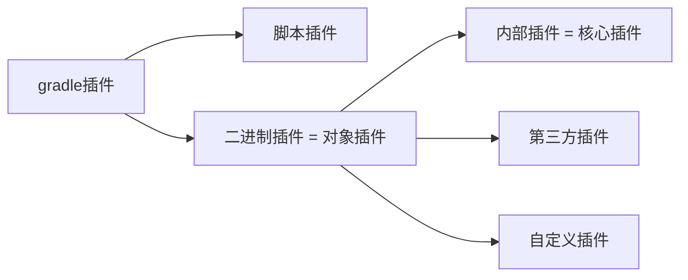

# 第一章 Gradle基础

Gradle 是一款Google 推出的基于 JVM、通用灵活的项目构建工具，支持 Maven，JCenter 多种第三方仓库；支持传递性依赖管理、废弃了繁杂的xml 文件，转而使用简洁的、支持多种语言(例如：java、groovy 等)的 build 脚本文件。

Gradle官网：https://gradle.org/
Gradle官方下载安装教程页面：https://gradle.org/install/
Gradle官方用户手册：https://docs.gradle.org/current/userguide/userguide.html

虽然目前市面上常见的项目构建工具有Ant、Maven、Gradle，主流还是Maven，但是未来趋势是Gradle。详细介绍一下他们：

* Ant：2000 年 Apache 推出的纯Java 编写构建工具，通过 `xml[build.xml]`文件管理项目。
  优点：使用灵活，速度快(快于 gradle 和 maven)。
  缺点：Ant 没有强加任何编码约定的项目目录结构，开发人员需编写繁杂XML 文件构建指令，对开发人员是一个挑战。
* Maven：2004 年Apache 组织推出的再次使用xml 文件`[pom.xml]`管理项目的构建工具。
  优点: 遵循一套约定大于配置的项目目录结构，使用统一的GAV 坐标进行依赖管理，侧重于包管理。
  缺点：项目构建过程僵化，配置文件编写不够灵活、不方便自定义组件，构建速度慢于 gradle。
* Gradle：2012 年Google 推出的基于Groovy 语言的全新项目构建工具，集合了Ant 和 Maven 各自的优势。
  优点：集 Ant 脚本的灵活性+Maven 约定大于配置的项目目录优势，支持多种远程仓库和插件，侧重于大项目构建。
  缺点：学习成本高、资料少、脚本灵活、版本兼容性差等。

| 自动化构建工具对比   | Ant             | Maven       | Gradle                       |
| -------------------- | --------------- | ----------- | ---------------------------- |
| **构建性能**         | 最高            | 最低        | 居中                         |
| **仓库**             | 开发者自己处理  | maven仓库   | 支持多种远程仓库             |
| **依赖管理**         | ivy管理         | GAV坐标管理 | GNV坐标管理                  |
| **插件支持**         | 实现方便        | 实现较难    | 实现方便                     |
| **遵循特定目录结构** | No              | 遵循        | 同Maven                      |
| **配置管理**         | xml文件最为繁琐 | xml文件     | 代码脚本，便于写业务逻辑     |
| **侧重点**           | 小型项目构建    | 项目包管理  | 大型项目构建                 |
| **目前地位**         | 使用少          | 目前主流    | 未来趋势（Spring使用的就是） |

## 1.1 安装与配置

SpringBoot 官方文档明确指出，目前SpringBoot 的 Gradle 插件需要gradle6.8 版本及以上，所以我们这里选择 7.x 版本。

SpringBoot 与Gradle 存在版本兼容问题，Gradle 与Idea 也存在兼容问题，所以考虑到 java 程序员会使用SpringBoot，所以要选择 6.8 版本及高于 6.8 版本的Gradle，那么相应的idea 版本也要升级，不能太老。我们可以进入一下Idea的目录查看一下需要安装Gradle的版本：`E:\Idea\IntelliJ IDEA 2022.3.1\plugins\gradle\lib`，`gradle-api-7.5.1`，这代表了我们需要安装7.5.1版本的。

具体参考文档:https://docs.spring.io/spring-boot/docs/2.5.0/gradle-plugin/reference/htmlsingle/#getting-started

安装过程如下：

1. 安装JDK。要求Jdk 为 1.8 或者 1.8 版本以上。
2. 官网下载软件并解压到指定目录。https://gradle.org/releases/，然后找到7.5.1版本下载rcomplete (checksums)完整版。我们下载到了：`E:\Gradle`目录下面。

   ```apl
   gradle-7.5.1目录如下：
        |-- bin：可执行程序目录，
        |-- docs: 文档
        |-- init.d：可以在配置一些想要预先加载的操作
        |-- lib：运行所需库的存放目录
        |-- src：源码文件
   ```
3. 配置环境变量。`GRADLE_HOME:E:\Gradle\gradle-7.5.1`、`path:%GRADLE_HOME%\bin`
4. 进入cmd，键入`gradle -v`。检测是否安装成功 
5. 这里我们接着再配置一个 `GRADLE_USER_HOME` 环境变量:`E:\Maven\apache-maven-3.6.0\mvn_repository`。`GRALE_USER_HOME` 相当于配置 Gradle 本地仓库位置和 Gradle Wrapper缓存目录。Gradle本地仓库可以和Maven本地仓库目录一致，所以这里我们将其设置为一个位置。

安装完毕！接下来来更改一下jar包下载的源。

Gradle 自带的Maven源地址是国外的，该Maven源在国内的访问速度是很慢的，除非使用了特别的手段。一般情况下，我们建议使用国内的第三方开放的Maven源或企业内部自建Maven源。

我们可以在gradle 的下载目录下面的`init.d` 目录下创建以`.gradle` 结尾的文件。`init.gradle` 里面的文件会在每个项目 build 之前被调用，用于做一些初始化的操作，它主要有如下作用：配置内部的仓库信息（如公司的 maven仓库信息，我们配置了阿里云的仓库）、配置一些全局属性、配置用户名及密码信息（如公司仓库的用户名和密码信息）。

`.gradle`文件可以在build 开始之前执行，所以可以在配置一些想要预先加载的操作。在`init.d` 文件夹创建`init.gradle` 文件。

```groovy
allprojects {
    repositories { 
        // 指定使用maven本地仓库，本地仓库在配置maven时settings文件指定的仓库位置。
        mavenLocal() 
        // 指定maven仓库，一般用私有仓库地址或其它的第三方库【比如阿里镜像仓库地址】
        maven { name "Alibaba" ; url "https://maven.aliyun.com/repository/public" } 
        maven { name "Bstek" ; url "https://nexus.bsdn.org/content/groups/public/" } 
        // 这是Maven的中央仓库，无需配置，直接声明就可以使用。
        mavenCentral()
    }

    buildscript {
        repositories { 
            maven { name "Alibaba" ; url 'https://maven.aliyun.com/repository/public' } 
            maven { name "Bstek" ; url 'https://nexus.bsdn.org/content/groups/public/' } 
            maven { name "M2" ; url 'https://plugins.gradle.org/m2/' }
        }
    }
}
```

gradle可以通过指定仓库地址为本地maven仓库地址和远程仓库地址相结合的方式，避免每次都会去远程仓库下载依赖库。

如果本地maven仓库有这个依赖，就会从直接加载本地依赖。如果本地仓库没有该依赖，那么还是会从远程下载。但是下载的jar不是存储在本地maven仓库中，而是放在自己的缓存目录中，默认在`USER_HOME/.gradle/caches`目录。如果配置过`GRADLE_USER_HOME`环境变量，则会放在`GRADLE_USER_HOME/caches`目录。那么可不可以将gradle caches指向maven repository。我们说这是不行的，这是因为caches下载文件不是按照maven仓库中存放的方式。

阿里云仓库地址请参考：https://developer.aliyun.com/mvn/guide

## 1.2 创建项目

Gradle 项目默认目录结构和Maven 项目的目录结构一致，都是基于约定大于配置【Convention Over Configuration】。其完整项目目录结构如下所示：

```apl
项目的根目录:
      |-- build # 封装编译后的字节码、打的包、测试报告等信息
      |-- gradle # 封装包装器文件夹
      |    |-- wrapper
      |         |-- gradle-wrapper.jar
      |         |-- gradle-wrapper.properties
      |
      |-- src # 源码
      |    |-- main # 主工程代码
      |    |    |-- java # 业务逻辑代码
      |    |    |-- resources # 业务逻辑代码配置文件
      |    |    |-- webapp # web项目的资源目录。例如:jps/html/css/js
      |    |          |-- WEB-INF # 存放的是一些编译后的class文件和运行所必须的配置文件
      |    |                |-- web.xml文件
      |    |          |-- index.jsp/html/css/js # 存放前端资源文件
      |    |
      |    |-- test # 测试代码
      |         |-- java # 测试代码
      |         |-- resources # 测试代码所需要的配置文件
      |
      |-- gradlew
      |-- gradlew.bat # 包装器启动脚本
      |-- build.gradle # 构建脚本，类似于pom.xml
      |-- settings.gradle # 设置文件，定义项目及子项目名称信息
```

注意：gradlew与gradlew.bat执行的指定wrapper版本中的gradle指令，不是本地安装的gradle指令。

接下来我们来创建我们的gradle项目：

1. 借助于 spring 脚手架：https://start.spring.io/

   

2. 使用cmd命令行来创建。新创建一个文件夹`gradle02`，在下面执行命令：

   ```cmd
   E:\Gradle\测试案例\gradle02>gradle init
   Starting a Gradle Daemon (subsequent builds will be faster)
   
   Select type of project to generate:
     1: basic
     2: application # 应用
     3: library # lib库
     4: Gradle plugin
   Enter selection (default: basic) [1..4] 2
   
   Select implementation language:
     1: C++
     2: Groovy
     3: Java
     4: Kotlin
     5: Scala
     6: Swift
   Enter selection (default: Java) [1..6] 3
   
   Split functionality across multiple subprojects?:
     1: no - only one application project # 单应用
     2: yes - application and library projects # 多模块应用
   Enter selection (default: no - only one application project) [1..2] 1
   
   Select build script DSL: # 脚本语言
     1: Groovy
     2: Kotlin
   Enter selection (default: Groovy) [1..2] 1
   
   Select test framework: # 测试框架
     1: JUnit 4
     2: TestNG
     3: Spock
     4: JUnit Jupiter
   Enter selection (default: JUnit Jupiter) [1..4] 1
   
   Project name (default: gradle02): # 项目名称，默认文件夹名称
   Source package (default: gradle02): com.linxuan.gradle # 源码包名称，启动类所在的位置
   
   > Task :init
   Get more help with your project: https://docs.gradle.org/7.1/samples/sample_building_java_applications.html
   
   BUILD SUCCESSFUL in 1m 53s
   2 actionable tasks: 2 executed
   ```

Gradle 常用命令说明：

| 常用gradle指令       | 作用                                                        |
| -------------------- | ----------------------------------------------------------- |
| gradle clean         | 清空build目录                                               |
| gradle classes       | 编译业务代码和配置文件                                      |
| gradle test          | 编译测试代码，生成测试报告。目录为/build/reports/tests/test |
| gradle build         | 构建项目。默认执行前面的指令，也就是依赖于前面的指令。      |
| gradle build -x test | 跳过测试构建                                                |

## 1.3 Wrapper 包装器 

Gradle Wrapper 实际上就是对 Gradle 的一层包装，用于解决实际开发中可能会遇到的不同的项目需要不同版本的 Gradle。

假如把自己的代码共享给其他人使用，可能出现如下情况：对方电脑没有安装 gradle或者安装的 gradle版本老旧。这时候，我们就可以考虑使用 Gradle Wrapper 了。实际上有了 Gradle Wrapper 之后，我们本地是可以不配置 Gradle 的，下载Gradle 项目后，使用 gradle 项目自带的wrapper 操作也是可以的。

项目中的`gradlew`、`gradlew.bat`脚本用的就是wrapper中规定的gradle版本，`gradlew`是其他系统，`gradlew.bat`脚本是Windows系统使用的。

```sh
# 本地gradle版本是Gradle 7.5.1
E:\Gradle\测试案例\gradle01>gradle -v
------------------------------------------------------------
Gradle 7.5.1
------------------------------------------------------------

# wrapper中gradle版本是7.6
E:\Gradle\测试案例\gradle01>gradlew.bat -v
------------------------------------------------------------
Gradle 7.6
------------------------------------------------------------

# wrapper中的gradle版本是7.6，打开 项目路径/gradle/wrapper/gradle-wrapper.properties文件可以看到
distributionUrl=https\://services.gradle.org/distributions/gradle-7.6-bin.zip
```

`gradlew`、`gradlew.bat`的使用方式与gradle使用方式完全一致，只不过把gradle指令换成了gradlew指令。当然，我们也可以在终端执行 `gradlew` 指令时指定一些参数，来控制 Wrapper 的生成，比如依赖的版本等。如下：

| 参数名称                  | 说明                              |
| ------------------------- | --------------------------------- |
| --gradle-version          | 用于指定使用的Gradle版本          |
| --gradle-distribution-url | 用于指定下载Gradle发行版的url地址 |

具体操作如下所示 ：

```sh
# 升级wrapper版本号 只是修改gradle.properties中wrapper版本，未实际下载
gradle wrapper --gradle-version=7.5.1 
# 关联源码用
gradle wrapper --gradle-version 5.2.1 --distribution-type all 
```

GradleWrapper 的执行流程： 

1. 第一次执行 `./gradlew build` 命令的时候，gradlew会读取 `gradle-wrapper.properties` 文件的配置信息。
2. 准确的将指定版本的 gradle 下载并解压到指定的位置(`GRADLE_USER_HOME`目录下的`wrapper/dists`目录中)
3. 构建本地缓存(`GRADLE_USER_HOME`目录下的`caches`目录中)，这样下载再使用相同版本的gradle就不用下载
4. 之后执行的 `./gradlew` 所有命令都是使用指定的 gradle 版本。

`gradle-wrapper.properties` 文件内容如下：

```properties
# 下载的Gradle压缩包解压后存储的主目录
distributionBase=GRADLE_USER_HOME
# 相对于distributionBase的解压后的Gradle压缩包的路径
distributionPath=wrapper/dists
# 同distributionBase，只不过是存放zip压缩包的
distributionUrl=https\://services.gradle.org/distributions/gradle-7.6-bin.zip
# 同distributionPath，只不过是存放zip压缩包的
zipStoreBase=GRADLE_USER_HOME
# Gradle发行版压缩包的下载地址
zipStorePath=wrapper/dists
```

新建一个项目时使用gradle指令。下载别人的项目或者使用操作以前自己写的不同版本的gradle项目时候用Gradle wrapper，也就是gradlew。


# 第二章 Gradle 与 Idea 整合

## 2.1 Groovy脚本语言

Groovy 可以被视为Java 的一种脚本化改良版，Groovy 也是运行在 JVM 上，它可以很好地与 Java代码及其相关库进行交互操作。它是一种成熟的面向对象编程语言，既可以面向对象编程，又可以用作纯粹的脚本语言。大多数有效的 Java 代码也可以转换为有效的 Groovy 代码，Groovy 和 Java 语言的主要区别是：完成同样的任务所需的Groovy 代码比 Java 代码更少。


下载地址 https://groovy.apache.org/download.html。步骤如下：

1. 下载：`apache-groovy-binary-4.0.2.zip`

2. 解压到`E:\Groovy`目录下面。配置环境变量：`GROOVY_HOME:E:\Groovy\groovy-4.0.2`、`Path:%GROOVY_HOME%\bin`。

3. 打开命令行，测试。

   ```sh
   C:\Windows\System32>groovy -v
   Groovy Version: 4.0.2 JVM: 1.8.0_144 Vendor: Oracle Corporation OS: Windows 10
   ```

基于Idea创建 Groovy 项目


Groovy 是基于Java 语言的，所以完全兼容Java 语法，所以对于java 程序员学习成本较低。详细了解请参考：http://www.groovy-lang.org/documentation.html。

和脚本语言相同的有：

* Groovy中语句末尾的分号可以省略，以换行作为结束。

和Java语法相同的有：

* Groovy中的注释和Java一样，单行注释是`//`，多行注释是`/**/`

* 支持各种运算符：算术、关系、位、赋值、范围运算符。

* Groovy 支持顺序结构从上向下依次解析、分支结构、循环结构(if..else、if..else if ..else..、switch..case、for、while、do..while)。具体参考官网：http://www.groovy-lang.org/semantics.html

* Groovy 中的异常处理和 java 中的异常处理是一样的。参考官网地址： http://www.groovy-lang.org/semantics.html#_try_catch_finally

* Groovy 遵循 Java 允许 import 语句解析类引用的概念。Groovy 语言默认提供的导入，这样做是为这些包中的类最常用。通过导入这些样板代码减少了。参考官网地址：http://www.groovy-lang.org/structure.html#_imports

  ```java
  import java.lang.*
  import java.util.*
  import java.io.*
  import java.net.*
  import groovy.lang.*
  import groovy.util.*
  import java.math.BigInteger
  import java.math.BigDecimal
  ```

* Groovy和Java一样，有着List集合和Map集合。可以把不同的基本类型添加到同一集合中。

  |  List集合方法   |                  功能                   |
  | :-------------: | :-------------------------------------: |
  |      add()      |              添加某个元素               |
  |     plus()      |            添加某个list 集合            |
  |    remove()     |           删除指定下标的元素            |
  | removeElement() |           删除某个指定的元素            |
  |   removeAll()   |          移除某个集合中的元素           |
  |      pop()      |       弹出list 集合中最后一个元素       |
  |     putAt()     |           修改指定下标的元素            |
  |     each()      |                  遍历                   |
  |     size()      |        获取list 列表中元素的个数        |
  |   contains()    | 判断列表中是否包含指定的值，则返回 true |

  | Map集合方法 |                 功能                 |
  | :---------: | :----------------------------------: |
  |    put()    |           向map 中添加元素           |
  |  remove()   | 根据某个键做移除，或者移除某个键值对 |
  |    +、-     |       支持 map 集合的加减操作        |
  |   each()    |             遍历map 集合             |

和Java语法不同的有：

1. Groovy权限修饰符：`public`、`protected`、`private` ，就是去除了`default`。默认类、方法、属性都是public修饰的。

2. 基本类型也是对象，可以直接调用对象的方法。Groovy 中的类型有: 原生数据类型及包装类（去除byte类型之后的七种以及他们的包装类）、类、内部类、抽象类、接口、注解、`Trait`(可以看成是带有方法实现的接口)。

3. Groovy是基于Java语言的，所以完全兼容Java语法，可以作为面向对象编程语言（定义类），也可以作为脚本行语言（文件定义中不出现类）。

   ```groovy
   package com.linxuan.demo01
   
   class HelloWorld {
       static void main(String[] args) {
           print("林炫")
       }
   }
   ```

   ```groovy
   // Demo01.groovy
   package com.linxuan.demo01
   
   def name = "林炫"
   print(name)
   ```

4. 在一个Groovy文件中可以混合类的定义和脚本的定义，但是此时不要再定义一个和文件同名称的类。

   

5. Groovy中使用`def`定义变量、方法，不建议使用具体的数据类型。变量引用的时候，在不引起歧义的前提下`{}`可以省略。

   ```groovy
   package com.linxuan.demo01
   
   class Demo02 {
       def name = "123"
       def age = 12
   
       public def getUserName() {
           println("${name}")
           return "$name"
       }
   }
   ```

6. 对象的属性操作。给对象属性赋值：`对象.属性名称 = xxx`、`对象的setter方法`、`具名构造器（Groovy类自己带的）`。对象属性读取操作：`对象.属性名称`、`对象["属性名称"]`、`对象.getter方法`。对类属性的操作本质是通过属性对应的`getter`、`setter`方法完成的。可以为属性自动生成`getter`、`setter`方法。

   ```groovy
   // Demo01.groovy
   package com.linxuan.demo01
   
   class Test {
       def username = "林炫"
       def age = 20
   }
   
   // new一个对象，同时使用具名构造器为属性赋值
   def obj = new Test(username: "云双端")
   // 默认会为其属性生成getter、setter方法
   println(obj.getUsername())
   // 给对象属性赋值
   obj.username = "陈沐阳"
   print(obj["username"])
   ```

7. 方法。声明方法的时候，方法的参数类型、返回值类型、`return`关键字可以省略，默认使用方法最后一行的返回值作为方法的返回值。调用方法的时候在不引起歧义的地方`()`可以省略。

   ```groovy
   package com.linxuan.demo01
   
   class Test {
       // 定义函数，省略参数类型、返回值类型、return关键字
       def printUserName(username){
           // 默认使用方法最后一行的返回值作为方法的返回值。
           "${username} 你的名字是$username"
       }
   }
   
   // 构建对象，然后调用方法。在不引起歧义的地方()可以省略。
   def obj = new Test()
   def userName = obj.printUserName"陈沐阳"
   println(userName)
   
   // 这里就不能够省略，因为会引起歧义，不知道这时printUserName方法调用参数还是print方法的参数。
   print(new Test().printUserName("林炫"))
   ```

8. Groovy中的字符串有单引号（作为字符串常量使用，没有运算能力）、双引号（可以引用变量`${}`，有运算能力）、三个引号（模板字符串，支持换行）。

   ```groovy
   def test = "测试"
   def str1 = '单引号，不支持变量引用，不支持换行操作 ${test}'
   def str2 = "双引号，支持变量引用，不支持换行操作 ${test}"
   def str3 = '''三引号，不支持变量引用，支持换行
                       操作 ${test}'''
   
   // 单引号，不支持变量引用，不支持换行操作 ${test}，类型为：class java.lang.String
   println(str1 + "，类型为：" +  str1.getClass().toString())
   // 双引号，支持变量引用，不支持换行操作 测试，类型为：class org.codehaus.groovy.runtime.GStringImpl
   println(str2 + "，类型为：" +  str2.getClass().toString())
   // 三引号，不支持变量引用，支持换行
   //                    操作 ${test}，类型为：class java.lang.String
   println(str3 + "，类型为：" +  str3.getClass().toString())
   ```

9. 闭包。Groovy 中的闭包`Closure`是一个开放的、匿名的代码块，它可以接受参数、也可以有返回值。闭包可以引用其周围作用域中声明的变量。

   其语法为`{ [closureParameters -> ] statements }`，其中`[ closureParameters-> ]`是一个可选的逗号分隔的参数列表，参数后面是  Groovy 语句。参数类似于方法参数列表， 这些参数可以是类型化的，也可以是非类型化的。当指定参数列表时，需要使用`->` 字符，用于将参数与闭包体分离。

   闭包调用方式：`闭包对象(参数)`、`闭包对象.call(参数)`。可以把闭包当作一个对象，作为参数传递给方法使用参考：http://www.groovy-lang.org/closures.html

   ```groovy
   def Calculate(Closure closure) {
       println("开始")
       closure()
       println("结束")
   }
   
   // 闭包作为参数在方法中间传递
   Calculate({println("中间")})
   // 闭包作为最后一个参数，那么可以写在外面
   Calculate(){println("中间")}
   // 方法调用的时候 ()可以省略
   Calculate {println("中间")}
   ```

类型转换：当需要时，类型之间会自动发生类型转换: 字符串（String）、基本类型(如int) 和类型的包装类 (如Integer)

类说明：如果在一个groovy 文件中没有任何类定义，它将被当做 script 来处理，也就意味着这个文件将被透明的转换为一个 Script 类型的类，这个自动转换得到的类将使用原始的 groovy 文件名作为类的名字。groovy 文件的内容被打包进run 方法，另外在新产生的类中被加入一个main 方法以进行外部执行该脚本。

```java
// 例如最上面的Demo01.groovy编译后就是这样的
public class Demo01 extends Script {
    public Demo01() {
    }

    public Demo01(Binding context) {
        super(context);
    }

    public static void main(String... args) {
        InvokerHelper.class.invoke<invokedynamic>(InvokerHelper.class, Demo01.class, args);
    }

    public Object run() {
        Object name = "林炫";
        return this.invoke<invokedynamic>(this, name);
    }
}
```

## 2.2 idea创建工程《问题》

**idea创建java工程**

1. 创建由Gradle 管理的项目

   

2. 修改当前项目使用本地安装的gradle：可以加快下载项目依赖jar 包的速度【配置了私服地址】。

   

在Terminal 中执行以`gradlew` 开头的命令和操作图形化的IDEA 使用Gradle 版本不一定是同一个版本，Terminal中以`gradlew`开头指令用的是Wrapper规定的gradle版本，wrapper中规定版本默认和idea插件中规定的版本一致。idea插件中规定的版本在`E:\Idea\IntelliJ IDEA 2022.3.1\plugins\gradle\lib`是`7.5.1`。图形化的IDEA使用Gradle是本地安装在`E:\Gradle`是`7.5.1`。

当我们在`gradle.build`文件添加依赖之后，这些依赖会在下载到`GRADLE_USER_HOME/caches/modules-2/files-2.1`目录下面，所以这里的`GRADLE_USER_HOME`相当于 Gradle 的本地仓库，当然也可以如下方式找到jar 包位置：


**在 idea 中创建 web 工程**

在idea 新版本的创建项目中，无法自己选择创建项目是普通 java 工程还是 web 工程了【IDEA 旧版本是可以的】，所以我们如果想创建 web 工程，只需要自己在 `src/main/`目录下添加`webapp/WEB-INF/web.xml` 及页面即可。

1. 在`build.gradle`文件的`plugins`里面添加war插件

   ```groovy
   plugins {
       id 'java'
   }
   ```

2. 添加依赖

   ```
   
   ```

**项目部署**

当我们将一个 java 项目打成war 包之后，就需要部署到服务器运行，这里有两种方式：

- 我们将项目打成 war 包，部署到本地tomcat

- 使用 Gretty 插件中内置服务器方式部署项目。

**构建项目**

构建一个项目用于以后的测试：

```apl
# gradle 中有工程树的概念，类似于 maven 中的project 与module。
root project # 父项目
    |-- subproject01 # 子模块
    |-- subproject01 # 子模块
    |-- subproject01 # 子模块
```


## 2.3 生命周期及Hook 

Gradle 项目的生命周期分为三大阶段：`Initialization`(初始化阶段) -> `Configuration`(配置阶段) -> `Execution`(执行阶段)。每个阶段都有自己的职责。

* `Initialization` 阶段主要目的是初始化构建。它又分为两个子过程，一个是执行 `Init Script`也就是我们`GRADLE_HOME/init.d/`目录下面的脚本文件`init.gradle`，另一个是执行`Setting Script`也就是当前项目目录下面的`settings.gradle`文件。

* `Configuration` 阶段：这个阶段开始加载项目中所有模块的 Build Script。所谓 "加载" 就是执行 `build.gradle` 中的语句，根据脚本代码创建对应的 task，最终根据所有 task 生成由 Task 组成的有向无环图(Directed Acyclic Graphs)，从而构成有向无环树。有向无环图如下:

  

* `Execution` 阶段：这个阶段会根据上个阶段构建好的有向无环图，按着顺序执行 Task【Action 动作】。

生命周期中的这些钩子函数都是由 gradle 自动回调完成的,利用这些钩子函数可以帮助我们实现一些我们想要的功能。


Gradle 在生命周期各个阶段都提供了用于回调的钩子函数。

Gradle 初始化阶段：

- 在 settings.gradle 执行完后，会回调 Gradle 对象的 settingsEvaluated 方法
- 在构建所有 build.gradle 对应的Project 对象后，初始化阶段完毕会回调 Gradle 对象的projectsLoaded方法。

Gradle 配置阶段：

- Gradle 会循环执行每个工程的 build.gradle 脚本文件
- 在执行当前工程build.gradle 前,会回调Gradle 对象的 beforeProject 方法和当前Project 对象的 beforeEvaluate 方法, 虽然 beforeEvalute 属于 project 的生命周期, 但是此时 build script 尚未被加载, 所以 beforeEvaluate 的设置依 然要在 init script 或 setting script 中进行,不要在 build script 中使用 project.beforeEvaluate 方法。
- 在执行当前工程 build.gradle 后,会回调 Gradle 对象的afterProject 方法和当前Project 对象的 afterEvaluate 方法
- 在所有工程的 build.gradle 执行完毕后，会回调 Gradle 对象的 projectsEvaluated 方法
- 在构建 Task 依赖有向无环图后,也就是配置阶段完毕,会回调TaskExecutionGraph 对象的 whenReady 方法

Gradle 执行阶段:

- Gradle 会循环执行Task 及其依赖的 Task
- 在当前 Task 执行之前,会回调 TaskExecutionGraph 对象的 beforeTask 方法
- 在当前 Task 执行之后,会回调 TaskExecutionGraph 对象的 afterTask 方法当所有的 Task 执行完毕后，会回调 Gradle 对象的 buildFinish 方法。

Gradle 执行脚本文件的时候会生成对应的实例，主要有如下几种对象：

1. Gradle 对象：在项目初始化时构建，全局单例存在，只有这一个对象
2. Project 对象：**每一个build.gradle文件** 都会转换成一个 Project 对象,类似于maven中的pom.xml文件
3. Settings 对象：settings.gradle 会转变成一个 settings  对象,和整个项目是一对一的关系,一般只用到include方法
4. Task对象: 从前面的有向无环图中，我们也可以看出，gradle最终是基于Task的,一个项目可以有一个或者多个Task

## 2.4 Gradle test测试

执行`Gradle test`指令的时候，测试任务自动检测并执行测试源集中的所有单元测试。测试执行完成后会生成一个报告。支持JUnit 和 TestNG 测试。

执行`Gradle test`指令后标准输出后的目录如下：

```apl
build
  |-- classes 
  |    |-- main # 业务逻辑代码编译后的文件
  |    |-- test # 测试代码编译后的文件
  |
  |-- reports 
  |    |-- test # 生成的测试报告，浏览器打开index.html即可查看
  |
  |-- test-results 
```

Gradle 支持Junit4.x版本和Junit5.x 版本。我们只需在包含`build.gradle`文件的目录下执行`gradle test` 指令，gradle 就会帮我们执行所有的加了`@Test` 注解的测试，并生成测试报告。前面说过执行`gradle build`默认会执行`gradle test`指令。

在idea中执行这些命令直接在控制面板上面点击就行了：`最右侧Gradle` -> `项目名称` -> `Tasks` -> `build` -> `指令名称`。

Gradle 对于 Junit4.x 支持

```groovy
dependencies {
    testImplementation group: 'junit' ,name: 'junit', version: '4.12' 
}

test {
    useJUnit()
}
```

Gradle 对于 Junit5.x 版本支持

```groovy
dependencies {
    testImplementation 'org.junit.jupiter:junit-jupiter-api:5.8.1' 
    testRuntimeOnly 'org.junit.jupiter:junit-jupiter-engine:5.8.1' 
}

test {
    useJUnitPlatform()
}
```

gradle 在junit 中的批量测试，可以设置包含或者排除某些特定测试。

```groovy
test {
    // 开启测试构建，如果为false那么就等于gradle build -x test
    enabled true 
    // 使用junit4
    useJUnit()
    // 构建测试目录的包包含com目录下面
    include 'com/**' 
    // 构建测试目录的包排除com/abc目录下面
    exclude 'com/abc/**' 
}
```

## 2.5 项目publishing发布

将写好的模块发布发布到公司的私服以供别人使用，如下所示：

```groovy
// 添加插件
plugins {
    // 如果发布war包，需要war插件 java-library插件支持带源码、文档发布
    id 'java-library' 
    id 'maven-publish' 
}
```

```groovy
//带源码和javadoc的发布:需要'java-library'插件支持:它是java的升级版，java插件的功能java-library都有
//javadoc.options.encoding="UTF-8" 
//java {
// withJavadocJar()
// withSourcesJar()
//}
publishing {
    publications { 
        myLibrary(MavenPublication) {
            // 指定GAV坐标信息
            groupId = 'com.linxuan.plugin' 
            artifactId = 'library' 
            version = '1.1'
            // 发布jar包。如果是from components.web，那么就需要引入war插件 发布war包
            from components.java
        }
    }
    repositories {
        // 发布到项目根目录下的lib/release目录下面
        // maven { url "$rootDir/lib/release" }
        // 发布项目到私服中
        maven { 
            // name属性可选,表示仓库名称，url必填
            name = 'myRepo' 
            // 发布地址:可以是本地仓库或者maven私服
            // url = layout.buildDirectory.dir("repo")
            // change URLs to point to your repos, e.g. http://my.org/repo 
            def releasesRepoUrl = layout.buildDirectory.dir('repos/releases')
            def snapshotsRepoUrl = layout.buildDirectory.dir('repos/snapshots') 
            url = version.endsWith('SNAPSHOT') ? snapshotsRepoUrl : releasesRepoUrl
            // 认证信息:用户名和密码
            // credentials {
            // username = 'joe' // password = 'secret' 
            // }
        }
    }
}
```

使用Idea控制面板点击publish或者执行publish指令，发布到本地仓库或者远程仓库。常见的发布指令有：

- `generatePomFileForPubNamePublication`：生成 pom 文件
- `publishPubNamePublicationToRepoNameRepository`：发布项目到指定仓库。如果没有仓库名，默认为 maven
- `publishPubNamePublicationToMavenLocal`：将 PubName 发布复制到本地 Maven 仓库中包括 POM 文件和其他元数据。
- `publish`：发布到 repositories 中指定的仓库(为比如 Maven 私服)
- `publishToMavenLocal`：执行所有发布任务中的操作发布到本地 maven 仓库【默认在用户家目录下的.m2/repository】。

## 2.6 settings.gradle文件 

settings 文件主要是配置了当前的项目名称以及子项目名称，并且初始化了一次构建所参与的所有模块。

该文件名称必须为`settings.gradle`，不能发生变化。必须放在根工程目录下，不能放在子模块目录下面。与 `org.gradle.api.initialization.Settings` 实例是一一对应的关系。每个项目只有一个settings 文件。

```groovy
rootProject.name = 'root'
include 'subproject01'
include 'subproject02'
include 'subproject03'
```

`settings.gradle`文件定义了当前 gradle 项目及子 project 的项目名称。一个子工程只有在settings文件中配置了才会被 gradle 识别，这样在构建的时候才会被包含进去。使用相对路径`:`引入子工程，项目名称中 `:` 代表项目的分隔符， 类似路径中的`/`，如果以`:`开头则表示相对于 `root project` 。

## 2.7 build.gradle文件

build.gradle 是一个gradle 的构建脚本文件，支持java、groovy 等语言。每个project 都会有一个build.gradle 文件，该文件是项目构建的入口，可配置版本、插件、依赖库等信息。对build.gradle 文件配置，本质就是设置Project 实例的属性和方法。group+name+version 类似于 maven 的 group+artifactId+version。

build 文件中常见的属性和方法如下所示：


**常见属性代码**

```groovy
// 指定使用什么版本的JDK语法编译源代码,跟编译环境有关,在有java插件时才能用
sourceCompatibility = 1.8
// 指定生成特定于某个JDK版本的class文件:跟运行环境有关,在有java插件时才能用
targetCompatibility = 1.8
// 业务编码字符集,注意这是指定源码解码的字符集[编译器]
compileJava.options.encoding "UTF-8"
// 测试编码字符集,注意这是指定源码解码的字符集[编译器]
compileTestJava.options.encoding "UTF-8"
// 编译JAVA文件时采用UTF-8:注意这是指定源码编码的字符集【源文件】
tasks.withType(JavaCompile) { 
    options.encoding = "UTF-8"
}
//编译JAVA文件时采用UTF-8:注意这是指定文档编码的字符集【源文件】
tasks.withType(Javadoc) { 
    options.encoding = "UTF-8"
}
```

**Repositories**

```groovy
repositories {
    // gradle中会按着仓库配置的顺序，从上往下依次去对应的仓库中找所需要的jar包: 
    // 如果找到，则停止向下搜索，如果找不到，继续在下面的仓库中查找
    // 指定去本地某个磁盘目录中查找:使用本地file文件协议:一般不用这种方式
    maven {
        url 'file:///D:/repos/mavenrepos3.5.4'
    }
    maven {
        url "$rootDir/lib/release"
    }
    // 指定去maven的本地仓库查找
    mavenLocal()
    // 指定去maven的私服或者第三方镜像仓库查找
    maven {
        name "Alibaba";
        url "https://maven.aliyun.com/repository/public"
    }
    maven {
        name "Bstek";
        url "https://nexus.bsdn.org/content/groups/public/"
    }
    // 指定去maven的远程仓库查找:即 https://repo.maven.apache.org/maven2/ mavenCentral()
    // 去google仓库查找
    google()
}
```

因为 Gradle 没有自己的远程仓库，而是使用 Maven、jcenter、jvy、google 这些远程仓库。

**Subprojects 与 Allprojects**

allprojects 是对所有 project(包括 Root Project+ child Project[当前工程和所有子工程])的进行统一配置，而subprojects 是对所有 Child Project 的进行统一配置。

如果是直接在根 project 配置 repositories 和 dependencies 则只针对根工程有效。

我们也可以在对单个 Project 进行单独配置：

```groovy
// 这里面不支持DSL编写
project('subject01') {
    task subject01 {
        println 'for subject01' 
    }
}
```

**ext 用户自定义属性**

Project 和 Task 都允许用户添加额外的自定义属性，要添加额外的属性，通过应用所属对象的 ext 属性即可实现。添加之后可以通过 ext 属性对自定义属性读取和设置，如果要同时添加多个自定义属性，可以通过 ext 代码块：

```groovy
// 自定义一个Project的属性
ext.age = 18
// 通过代码块同时自定义多个属性
ext {
    phone = 19292883833
    name="林炫"
}
task extCustomProperty {
    // 在task中自定义属性
    ext {
        desc = "加油"
    }
    doLast {
        println "年龄是：${age}"
        println "电话是：${phone}"
        println "姓名是：${name}"
        println "林炫：${desc}"
    }
}
```

**Buildscript**

buildscript 里是 gradle 脚本执行所需依赖，分别是对应的 maven 库和插件。

`buildscript{}`必须在 build.gradle 文件的最前端。对于多项目构建，项目的`buildscript()`方法声明的依赖关系可用于其所有子项目的构建脚本。构建脚本依赖可能是 Gradle 插件。

```groovy
//老式apply插件的引用方式,使用apply+buildscript
buildscript {
    ext {
        springBootVersion = "2.3.3.RELEASE" 
    }
    repositories { 
        mavenLocal() 
        maven { 
            url 'http://maven.aliyun.com/nexus/content/groups/public' 
        }
        jcenter()     
    }
    //此处引入插件
    dependencies {
        classpath("org.springframework.boot:spring-boot-gradle-plugin:${springBootVersion}")
    }
}
// 核心插件，无需事先引入
apply plugin: 'java' 
// 社区插件，需要事先引入,才能应用，不必写版本号
apply plugin: 'org.springframework.boot' 
```

## 2.8 gradle.properties

gradle.properties 中一般定义 系统属性、环境变量、项目属性、JVM相关配置信息。在项目的根目录创建该文件。

```properties
# gradle.properties里面定义的属性是全局的，可以在各个模块的build.gradle里面直接引用
# 当有一些数据我们传到git又不想要给别人看的时候，可以配置到该文件，然后不传输这个文件。也可以在项目中对一些属性进行统一配置，提高开发效率。
# Jvm堆内存大小，要是想要运行快一点，可以修改大一点。
org.gradle.jvmargs=-Xmx5120m -XX:MaxPermSize=1280m -Dfile.encoding=UTF-8
# 开启守护进程，下一次构建的时候，将会要连接这个守护进程进行构建，而不是重新fork一个gradle构建进程
org.gradle.daemon=true
# 按需要加载
org.gradle.configureondemand=true
# 进行编译
org.gradle.parallel=true
# 开启gradle缓存
org.gradle.caching=true
```

# 第三章 Gradle进阶

## 3.1 文件操作

**本地文件**

使用 `Project.file(java.lang.Object)`方法，通过指定文件的相对路径或绝对路径来对文件的操作，其中相对路径为相对当前 `project[根 project 或者子 project]`的目录。其实使用 `Project.file(java.lang.Object)`方法创建的 File 对象就是 Java 中的 File 对象，我们可以使用它就像在 Java 中使用一样。示例代码如下

```groovy
//使用相对路径
File configFile = file('src/conf.xml') 
configFile.createNewFile(); 
// 使用绝对路径
configFile = file('D:\\conf.xml')
println(configFile.createNewFile())
// 使用一个文件对象
configFile = new File('src/config.xml')
println(configFile.exists())
```

**文件集合**

文件集合就是一组文件的列表，在Gradle中，文件集合用`FileCollection` 接口表示。我们可以使用`Project.files(java.lang.Object[])`方法来获得一个文件集合对象。对于文件集合我们可以遍历它；也可以把它转换成 java 类型；同时还能使用`+`来添加一个集合，或使用`-`来删除集合。

如下代码创建一个 `FileCollection` 实例：

```groovy
def collection = files('src/test1.txt',new File('src/test2.txt'),['src/test3.txt', 'src/test4.txt']) collection.forEach() { File it ->
    it.createNewFile() // 创建该文件
    println it.name // 输出文件名
}
Set set1 = collection.files // 把文件集合转换为java中的Set类型
Set set2 = collection as Set
List list = collection as List // 把文件集合转换为java中的List类型
for (item in list) {
    println item.name 
}
def union = collection + files('src/test5.txt') // 添加或者删除一个集合
def minus = collection - files('src/test3.txt') 
union.forEach(){ File it ->
    println it.name
}
```

**文件树**

文件树是有层级结构的文件集合，一个文件树它可以代表一个目录结构或ZIP 压缩包中的内容结构。文件树是从文件集合继承过来的，所以文件树具有文件集合所有的功能。我们可以使用 `Project.fileTree(java.util.Map)`方法来创建文件树对象，还可以使用过虑条件来包含或排除相关文件。示例代码如下：

```groovy
// 第一种方式:使用路径创建文件树对象，同时指定包含的文件
tree = fileTree('src/main').include('**/*.java') 
//第二种方式:通过闭包创建文件树: 
tree = fileTree('src/main') {
    include '**/*.java' 
}
//第三种方式:通过路径和闭包创建文件树：具名参数给map传值
tree = fileTree(dir: 'src/main', include: '**/*.java') 
tree = fileTree(dir: 'src/main', includes: ['**/*.java', '**/*.xml'], exclude: '**/*test*/**')
// 遍历文件树的所有文件
tree.each {File file -> 
    println file println file.name
}
```

**文件拷贝**

我们可以使用 Copy 任务来拷贝文件，通过它可以过虑指定拷贝内容，还能对文件进行重命名操作等。Copy 任务必须指定一组需要拷贝的文件和拷贝到的目录，这里使用 `CopySpec.from(java.lang.Object[])`方法指定原文件；使用 `CopySpec.into(java.lang.Object)`方法指定目标目录。

```groovy
task copyTask(type: Copy) {
    from 'src/main/resources' 
    into 'build/config' 
}
```

**归档文件**

通常一个项目会有很多的 Jar 包，我们希望把项目打包成一个 WAR，ZIP 或 TAR 包进行发布，这时我们就可以使用 Zip，Tar，Jar，War 和 Ear 任务来实现，它们的用法都一样。

创建一个 Zip 压缩文件，并指定压缩文件名称：

```groovy
apply plugin: 'java' 
version=1.0
task myZip(type: Zip) {
    from 'src/main‘ into ‘build’ //保存到build目录中
    baseName = 'myGame' 
}
println myZip.archiveName
```

执行命令 gradle -q myZip，输出结果

```groovy
> gradle -q myZip
myGame-1.0.zip
```

## 3.2 依赖及依赖冲突

当执行 `build` 命令时，gradle 就会去配置的依赖仓库中下载对应的 Jar，并应用到项目中。Gradle 中的依赖分别为本地 jar 依赖、项目依赖、直接依赖。

```groovy
dependencies {
    // 本地jar依赖：直接依赖本地的某个jar文件
    implementation files('libs/foo.jar', 'libs/bar.jar')
    // 本地jar依赖：配置某文件夹作为依赖项
    implementation fileTree(dir: 'libs', include: ['*.jar'])

    // 项目依赖：依赖当前项目下的某个模块[子工程]。被依赖的模块需要在setting.gradle文件配置
    implementation project(':subject01')

    // 直接依赖：依赖类型 依赖的组名 依赖的名称 依赖的版本号
    implementation 'org.apache.logging.log4j:log4j:2.17.2' 
    // 完整版的直接依赖
    implementation group: 'org.apache.logging.log4j', name: 'log4j', version: '2.17.2'
}
```

类似于 Maven 的 scope 标签，gradle 也提供了依赖的类型，具体如下所示：

| 类型               | 作用                                                         |
| ------------------ | ------------------------------------------------------------ |
| compileOnly        | 由java插件提供，适用于编译期需要而不需要打包的情况           |
| runtimeOnly        | 由 java 插件提供，只在运行期有效，编译时不需要，比如mysql 驱动包。 |
| implementation     | 由 java 插件提供，针对源码[src/main 目录]。在编译、运行时都有效。 |
| testCompileOnly    | 由 java 插件提供，用于编译测试的依赖项，运行时不需要。       |
| testRuntimeOnly    | 由 java 插件提供，只在测试运行时需要，而不是在测试编译时需要。 |
| testImplementation | 由 java 插件提供，针对测试代码[src/test 目录]。              |
| providedCompile    | war 插件提供支持，编译、测试阶段代码需要依赖此类jar 包，而运行阶段容器已经提供了相应的支持，所以无需将这些文件打入到war 包中了。例如servlet-api.jar、jsp-api.jar |
| api                | java-library插件提供支持，这些依赖项可以传递性地导出给使用者，用于编译时和运行时。 |
| compileOnlyApi     | java-library插件提供支持，声明模块和使用者在编译时需要的依赖项，但在运行时不需要。 |

> java 插件提供的功能，java-library 插件都提供

**api 与 implementation的区别**

|          | api                                       | implementation                               |
| -------- | ----------------------------------------- | -------------------------------------------- |
| 编译时   | 进行依赖传递，底层变全部要变，编译速度慢  | 不进行依赖传递，底层变不用全部变，编译速度快 |
| 运行时   | 运行时会加载，所有的模块的class都要被加载 | 运行时会加载，所有的模块的class都要被加载    |
| 应用场景 | 适用于多模块传递，避免重复依赖模块        | 多数情况下使用implementation                 |

除非涉及到多模块依赖，为了避免重复依赖，咱们会使用 api，其它情况我们优先选择 implementation，拥有大量 的 api 依赖项会显著增加构建时间。

**依赖冲突及解决方案**

默认下，Gradle 会使用最新版本的 jar 包【考虑到新版本的 jar 包一般都是向下兼容的】，实际开发中，还是建议使用官方自带的这种解决方案。当然除此之外，Gradle 也为我们提供了一系列的解决依赖冲突的方法: exclude 移除一个依赖，不允许依赖传递，强制使用某个版本。

导入一下jar包`implementation 'org.hibernate:hibernate-core:3.6.3.Final'`，这个jar包依赖于`slf4j1.6.1`。如果这时候想要使用自己导入的`slf4j1.4.0`那么就要解决依赖冲突了：

* exclude 移除一个依赖

  ```groovy
  dependencies {
      implementation('org.hibernate:hibernate-core:3.6.3.Final') {
          // 排除某一个库(slf4j)依赖:如下三种写法都行
          exclude group: 'org.slf4j' 
          exclude module: 'slf4j-api' 
          exclude group: 'org.slf4j', module: 'slf4j-api' 
      }
      // 排除之后,使用手动的引入即可。
      implementation 'org.slf4j:slf4j-api:1.4.0'
  }
  ```

* 不允许依赖传递

  ```groovy
  dependencies {
      mplementation('org.hibernate:hibernate-core:3.6.3.Final') {
          //不允许依赖传递，一般不用。表示关闭依赖传递。即内部的所有依赖将不会添加到编译和运行时的类路径。
          transitive(false)
      }
      //排除之后,使用手动的引入即可
      implementation 'org.slf4j:slf4j-api:1.4.0' 
  }
  ```

* 强制使用某个版本

  ```groovy
  dependencies {
      testImplementation 'org.junit.jupiter:junit-jupiter-api:5.8.1'
      testRuntimeOnly 'org.junit.jupiter:junit-jupiter-engine:5.8.1' 
      mplementation('org.hibernate:hibernate-core:3.6.3.Final')
      // 强制使用某个版本!!【官方建议使用这种方式】
      implementation('org.slf4j:slf4j-api:1.4.0!!')
      // 这种效果和上面那种一样,强制指定某个版本
      implementation('org.slf4j:slf4j-api:1.4.0') { 
          version{
              strictly("1.4.0")
          }
      }
  }
  ```

我们可以先查看当前项目中到底有哪些依赖冲突：

```groovy
// 下面我们配置，当 Gradle 构建遇到依赖冲突时，就立即构建失败
configurations.all() {
    Configuration configuration ->
    // 当遇到版本冲突时直接构建失败
    configuration.resolutionStrategy.failOnVersionConflict()
}
```

## 3.3 Gradle插件

```groovy
// 这就是插件
plugins {
    id 'java'
}
```

在项目构建过程中做很多事情，把插件应用到项目中，通常可以完成：

1. 可以添加任务【task】到项目中，从而帮助完成测试、编译、打包等。
2. 可以添加依赖配置到项目中。
3. 可以向项目中拓展新的扩展属性、方法等。
4. 可以对项目进行一些约定，如应用 Java 插件后，约定 src/main/java 目录是我们的源代码存在位置，编译时编译这个目录下的 Java源码文件。

### 3.3.1 插件的分类和使用

gradle插件如下：



**脚本插件**

脚本插件的本质就是一个脚本文件，使用脚本插件时通过 `apply from:`将脚本加载进来就可以了，后面的脚本文件可以是本地的也可以是网络上的脚本文件。脚本文件是模块化的基础，可按功能把我们的脚本拆分成一个个公用、职责分明的文件，然后在主脚本文件引用。比如：将很多共有的库版本号一起管理、应用构建版本一起管理等。

下面定义一段脚本，我们在 build.gradle 文件中使用它，具体如下：

```groovy
// 根目录地下创建一个version.gradle文件
ext {
    name = "林炫"
    cfgs = [
            compileSdkVersion: JavaVersion.VERSION_1_8
    ]
    spring = [
            version: '5.0.0'
    ]
}
```

```groovy
// build.gradle文件
// 引入脚本插件
apply from: 'version.gradle'
task taskVersion {
    doLast {
        println "名称为：${name}，使用的JDK版本是${cfgs.compileSdkVersion}，版本号是${spring.version}"
    }
}
```

```apl
# 可以使用命令行执行，也可以直接在IDEA里面左键绿标执行
D:\Java\IdeaProjects\root>gradle -q tV
名称为：taskVersion，使用的JDK版本是1.8，版本号是5.0.0
```

**二进制插件(对象插件)**

二进制插件(对象插件)就是实现了`org.gradle.api.Plugin`接口的插件。二进制插件(对象插件)一共有三种：内部插件(核心插件)、第三方插件、自定义插件。

第一种：对象插件之内部插件[核心插件]。Gradle 中提供的核心插件可参考: https://docs.gradle.org/current/userguide/plugin_reference.html。对于 Gradle 自带的核心插件都有唯一的 `plugin id`，其中 `java` 是Java 插件的 `plugin id`，可使用应用包名来保证`plugin id`的唯一性。可通过如下方式使用一个 Java 插件： 

```groovy
// apply是project的方法，调用API是void apply(Map<String, ?> var1); 使用map具名参数的方式引入核心插件。
// key的值为plugin，value的值为插件id、全类名、简类名
// 使用方式1，插件的id作为value
apply (plugin: 'java') // 调用方法时在不引起歧义的地方括号可以省略。apply plugin: 'java'
// 使用方式2，插件的全类名作为value 不要使用引号
apply plugin: org.gradle.api.plugins.JavaPlugin
// 使用方式3：插件的简类名作为value  org.gradle.api.plugins默认导入了，所以可以直接输入简类名。
apply plugin: JavaPlugin

// 也可以使用闭包作为project.apply方法的一个参数
apply {
    plugin 'java'
}

// 或者使用plugins DSL语句
plugins {
    id 'java'
}
```

第二种：对象插件之第三方插件。第三方插件顾名思义就是该插件不是由Gradle提供的，而是第三方的插件。该插件的使用方式有两种：传统方式和DSL方式（DSL使用前提是插件已经被托管在 https://plugins.gradle.org/ ）。使用这种第三方插件直接在这个https://plugins.gradle.org/ 网站查找即可，里面有使用的方式。如下：

```groovy
// 使用传统的应用方式 老式插件方式buildscript{}要放在build.gradle文件的最前面.新式plugins{}没有该限制
buildscript {
    repositories {
        maven {
            url "https://plugins.gradle.org/m2/"
        }
    }
    // 此处先引入插件
    dependencies {
        classpath "org.springframework.boot:spring-boot-gradle-plugin:3.0.2"
    }
}
// 再应用插件
apply plugin: "org.springframework.boot"
```

```groovy
// DSL方式
plugins {
    id "org.springframework.boot" version "3.0.2"
}
```

第三种：对象插件之用户自定义插件。使用方式https://docs.gradle.org/current/userguide/custom_plugins.html。来介绍一种简单的：

```groovy
// build.gradle添加
class GreetingPlugin implements Plugin<Project> {
    void apply(Project project) {
        project.task('hello') {
            doLast {
                println 'Hello from the GreetingPlugin'
            }
        }
    }
}
// 应用插件
apply plugin: GreetingPlugin
```

我们直接执行 hello 任务`./gradle hello`即可，这种方式实现的插件一般不使用。因为这种方式局限性太强，只能本Project使用。

### 3.3.2 buildSrc自定义插件

buildSrc是Gradle 默认的插件目录，编译 Gradle 的时候会自动识别这个目录，将其中的代码编译为插件。使用步骤如下：

1. 首先先建立一个名为 buildSrc 的模块，该模块在项目目录的下面。然后将 buildSrc 从settings.gradle文件中的 included modules 移除，重新构建。最后只保留`build.gradle`文件和`src/main`目录，其他全部删掉。注意名字一定是 buildSrc，不然会找不到插件。

   

2. 然后修改buildSrc模块中build.gradle文件中的内容。

   ```groovy
   apply plugin: 'groovy'
   apply plugin: 'maven-publish'
   
   // 依赖信息
   dependencies {
       implementation gradleApi()
       implementation localGroovy()
   }
   // 仓库信息
   repositories {
       google()
       jcenter()
       mavenCentral()
   }
   // 把项目入口设置为src/main/groovy
   sourceSets {
       main {
           groovy {
               srcDir 'src/main/groovy'
           }
       }
   }
   ```

3. 创建入口目录及配置文件。在src/main下创建代码入口目录，resources目录创建配置文件，如下：

   ```apl
   buildSrc
       |-- .gradle目录
       |-- build目录
       |-- src
            |-- main
                 |-- groovy
                 |    |-- com
                 |         |-- linxuan
                 |              |-- Text.groovy
                 |-- java目录
                 |-- resources目录
                      |-- META-INF
                           |-- gradle-plugins
                                |-- com.linxuan.plugin.properties # 命名随意 但是要以.properties结尾
   ```

   并且在Text.groovy中实现插件代码

   ```groovy
   package com.linxuan
   
   import org.gradle.api.Plugin
   import org.gradle.api.Project
   
   class Text implements Plugin<Project> {
       @Override
       void apply(Project project) {
           project.task("linxuan") {
               doLast {
                   println("自定义linxuan插件")
               }
           }
       }
   }
   ```

   在properties 文件中指明我们实现插件的全类名 

   ```properties
   implementation-class=com.linxuan.Text
   ```

   到目前为止插件项目已经写完了。

4. 在想要引入插件的模块引入该插件并执行Task。例如在父工程root的模块中引入插件。

   ```groovy
   // 这里使用的是ID，就是properties的名称
   apply plugin:'com.linxuan.plugin'
   ```

   ```apl
   # 执行任务
   D:\Java\IdeaProjects\root>gradle -q linxuan
   自定义linxuan插件
   ```

这种形式的写法，在我们整个工程的module 都可以使用，但也只是限制在本工程，其他工程不能使用。

这种方式只能在本工程中使用，而其他的项目工程不能使用，有时候我们需要一个插件在多个工程中使用， 这时候我们就需要把插件上传maven 中。步骤如下：

1. 将上述buildSrc目录复制一份，修改文件夹名称为buildSrc-copy。在settings.gradle文件中使用include引入。

   

2. 第二步：修改buildSrc-copy模块的build.gradle 文件，发布到maven 仓库中

   ```groovy
   apply plugin: 'groovy' // 必须
   apply plugin: 'maven-publish'
   dependencies {
       implementation gradleApi() // 必须
       implementation localGroovy() // 必须
   }
   repositories {
       google()
       jcenter()
       mavenCentral() // 必须
   }
   // 把项目入口设置为src/main/groovy
   sourceSets {
       main {
           groovy {
               srcDir "src/main/groovy"
           }
       }
   }
   
   publishing {
       publications {
           myLibrary(MavenPublication) {
               // 指定GAV坐标信息
               groupId = 'com.linxuan.plugin'
               artifactId = 'library'
               version = '1.1'
               // 发布jar包。如果是from components.web，那么就需要引入war插件 发布war包
               from components.java
           }
       }
       repositories {
           // 发布到项目根目录地下的lib/release目录下面，现在没有，一会创建
           maven { url "$rootDir/lib/release" }
           // 发布项目到私服中
           // maven {
           //     name = 'myRepo' // name属性可选,表示仓库名称，url必填
           //     // 发布地址:可以是本地仓库或者maven私服
           //     // url = layout.buildDirectory.dir("repo")
           //     // change URLs to point to your repos, e.g. http://my.org/repo
           //     // 认证信息:用户名和密码
           //     // url='http://my.org/repo'
           //     credentials {
           //         username = 'joe'
           //         password = 'secret'
           //     }
           // }
       }
   }
   ```

3. 使用Idea控制面板点击publish或者执行publish指令，发布到根 project 或者maven 私服仓库。

   

4. 使用插件,在项目级 build.gradle 文件中将插件添加到 classpath：

   ```groovy
   // 放在最前面
   buildscript {
       repositories {
           maven { url "$rootDir/lib/release" }
       }
       dependencies {
           classpath "com.linxuan.plugin:library:1.1"
       }
   }
   
   // 是在 linxuanplugin 中定义的插件 ID
   apply plugin: 'com.linxuan.plugin'
   ```

## 3.4 创建 Springboot 项目

Spring Boot Gradle 插件在 Gradle 提供 Spring Boot 支持。它允许您打包可执行 jar 或 war 归档文件，运行 SpringBoot 应用程序，并使用 Spring-Boot-dependencies 提供的依赖管理。

相关文档参考：https://docs.spring.io/spring-boot/docs/current/gradle-plugin/reference/htmlsingle/#running-your-application

1. 创建一个项目gradle-SpringBoot，修改当前项目使用本地安装的gradle，可以加快下载项目依赖jar 包的速度【配置了私服地址】。

2. 引入springboot 插件

   ```groovy
   plugins {
       // 维护springboot版本号,不单独使用,和下面两个插件一起用
       id 'org.springframework.boot' version '2.3.7.RELEASE'
       // 该插件等于Maven中<dependencymanagement>。只进行依赖管理，不做实际导入依赖。
       id 'io.spring.dependency-management' version '1.0.10.RELEASE'
       
       id 'java'
   }
   ```

3. 引入所需要的依赖

   ```groovy
   dependencies {
       // 引入spring-boot-starter-web依赖。省略版本，上面的插件已经管理好了版本了。
       implementation 'org.springframework.boot:spring-boot-starter-web' 
   }
   ```
   
4. 创建主启动类和Controller类

   ```java
   package com.linxuan;
   
   @SpringBootApplication
   public class App {
       public static void main(String[] args) {
           SpringApplication.run(App.class, args);
       }
   }
   ```

   ```java
   package com.linxuan.controller;
   
   @RestController
   @RequestMapping("/user")
   public class UserController {
   
       @GetMapping("/name")
       public String getUserName() {
           return "林炫";
       }
   }
   ```

5. 运行当前Springboot 项目。直接执行gradle bootRun 指令或者点击控制面板Tasks--> application--> bootRun即可。当然如果想让当前项目打成可执行jar 包，只需执行： gradle bootJar 指令即可。

Cloud 项目创建也可以借助于脚手架创建，与Boot 项目类似。之前的时候创建过，但是这种方式创建最好不要直接引入，而是将build.gradle文件导入。我们主要需要的就是插件以及依赖信息。

可以发现在上面引入插件的时候，插件的版本仍然需要我们手动添加，并且还不一致。如果想要他们直接被管理，那么就需要用到spring-boot-gradle-pluginc插件了。

```groovy
// 原始添加的SpringBoot插件需要添加版本并且两个插件版本不一致
plugins {
    // 维护springboot版本号,不单独使用,和下面两个插件一起用
    id 'org.springframework.boot' version '2.3.7.RELEASE'
    // 该插件等于Maven中<dependencymanagement>。只进行依赖管理，不做实际导入依赖。
    id 'io.spring.dependency-management' version '1.0.10.RELEASE'
    
    id 'java'
}
```

这时候添加spring-boot-gradle-pluginc插件，将上面的插件删除，修改为下面

```groovy
// buildscript必须弄到最上面
buildscript {
    repositories {
        maven { url 'https://maven.aliyun.com/repository/public' }
    }
    dependencies {
        classpath 'org.springframework.boot:spring-boot-gradle-plugin:2.4.1'
    }
}
// 这样引入插件的时候无需指定版本了
apply plugin: 'org.springframework.boot'
apply plugin: 'io.spring.dependency-management'
apply plugin: 'java'
```

# 第四章 任务Task

项目实质上是 Task 对象的集合。一个 Task 表示一个逻辑上较为独立的执行过程，比如编译Java 源代码，拷贝文件， 打包Jar 文件，甚至可以是执行一个系统命令。另外，一个 Task 可以读取和设置Project 的Property 以完成特定的操作。可参考官方文档：[https://docs.gradle.org/current/userguide/tutorial_using_tasks.html ](https://docs.gradle.org/current/userguide/tutorial_using_tasks.html)

```java
// task方法API，闭包作为最后一个参数可以提到外面
Task task(String var1, Closure var2);
// task方法API，闭包作为最后一个参数可以提到外面
Task task(Map<String, ?> var1, String var2, Closure var3);
```

看一个例子：

```groovy
// 在gradle.build文件中添加如下代码
def map = new HashMap<String, Object>();
// 闭包作为最后一个参数可以提到外面，value是闭包
map.put("action") {
    println("task one")
}

task(map, "task1") {
    // 任务的配置段：在配置阶段执行
    println "这是最简单的任务"
    // 任务的行为：在执行阶段执行，doFirst会在doLast之前执行
    doFirst {
        println "task doFirst..."
    }
    doLast {
        println "task doLast..."
    }
}

task1.doFirst {
    println "task doFirst outer..."
}
task1.doLast {
    println "task doLast outer..."
}
```

打开Terminal，键入`gradle -i task1`。

```apl
# -i的意思是输出日志级别为INFO
D:\Java\IdeaProjects\root>gradle -i task1
Initialized native services in: E:\Maven\apache-maven-3.6.0\mvn_repository\native
Initialized jansi services in: E:\Maven\apache-maven-3.6.0\mvn_repository\native
The client will now receive all logging from the daemon (pid: 13284). The daemon log file: E:\Maven\apache-maven-3.6.0\mvn_
repository\daemon\7.5.1\daemon-13284.out.log
Starting 6th build in daemon [uptime: 12 mins 3.141 secs, performance: 96%, non-heap usage: 25% of 256 MiB]
Using 8 worker leases.
Now considering [D:\Java\IdeaProjects\root] as hierarchies to watch
Watching the file system is configured to be enabled if available
File system watching is active
Starting Build
# 加载settings.gradle'和父工程build.gradle文件
Settings evaluated using settings file 'D:\Java\IdeaProjects\root\settings.gradle'.
Projects loaded. Root project using build file 'D:\Java\IdeaProjects\root\build.gradle'.
Included projects: [root project 'root', project ':subproject01', project ':subproject02', project ':subproject03']        

# 配置阶段，首先执行父工程build.gradle文件
> Configure project :
Evaluating root project 'root' using build file 'D:\Java\IdeaProjects\root\build.gradle'.
Compiling build file 'D:\Java\IdeaProjects\root\build.gradle' using SubsetScriptTransformer.
Compiling build file 'D:\Java\IdeaProjects\root\build.gradle' using BuildScriptTransformer.
# 执行任务的配置段
这是最简单的任务

# 然后依次加载子工程build.gradle文件
> Configure project :subproject01
Evaluating project ':subproject01' using build file 'D:\Java\IdeaProjects\root\subproject01\build.gradle'.

# 然后依次加载子工程build.gradle文件
> Configure project :subproject02
Evaluating project ':subproject02' using build file 'D:\Java\IdeaProjects\root\subproject02\build.gradle'.

# 然后依次加载子工程build.gradle文件
> Configure project :subproject03
Evaluating project ':subproject03' using build file 'D:\Java\IdeaProjects\root\subproject03\build.gradle'.
All projects evaluated.
Task name matched 'task1'
Selected primary task 'task1' from project :
Tasks to be executed: [task ':task1']
Tasks that were excluded: []
Resolve mutations for :task1 (Thread[Execution worker Thread 2,5,main]) started.
Resolve mutations for :task1 (Thread[Execution worker Thread 2,5,main]) completed. Took 0.0 secs.
:task1 (Thread[Execution worker Thread 4,5,main]) started.

> Task :task1
Caching disabled for task ':task1' because:
  Build cache is disabled
Task ':task1' is not up-to-date because:
  Task has not declared any outputs despite executing actions.
# 执行任务的行为
task doFirst outer...
task doFirst...
task one
task doLast...
task doLast outer...
:task1 (Thread[Execution worker Thread 4,5,main]) completed. Took 0.005 secs.

BUILD SUCCESSFUL in 1s
1 actionable task: 1 executed
Watched directory hierarchies: []
```

任务的行为输出可以看到如下：

```apl
task doFirst outer...
task doFirst...
task one
task doLast...
task doLast outer...
```

无论是定义任务自身的 action，还是添加的doFirst、doLast方法，其实底层都被放入到一个Action 的List 中了，最初这个 action List 是空的，当我们设置了 action【任务自身的行为】，它先将action 添加到列表中，此时列表中只有一个action，后续执行doFirst 的时候在action 前面添加，执行 doLast 的时候在action 后面添加。


> `<<`代表doLast，在gradle5.x 版本之后就废弃，不能使用了。

## 4.1 定义任务及分配属性

任务定义方式总体分为两大类：通过 Project 中的`task()`方法以及通过tasks 对象的 `create` 或者`register` 方法。

Project 中的`task()`方法：

```groovy
// 任务名称,闭包都作为参数
task('A', {
    println "taskA..."
})
// 闭包作为最后一个参数可以直接从括号中拿出来
task('B') {
    println "taskB..."
}
// 任务命名的方式，可以单引号，可以双引号，也可以不加上引号
// groovy语法支持省略方法括号:上面三种本质是一种
task C {
    println "taskC..."
}

def map = new HashMap<String, Object>(); 
map.put("action", { println "taskD.." }) 
task(map, "D"); 
```

tasks 对象的 `create` 或者`register` 方法：

```java
// create方法
T create(String var1, Closure var2) throws InvalidUserDataException;
// register方法
NamedDomainObjectProvider<T> register(String var1, Action<? super T> var2) throws InvalidUserDataException;
```

```groovy
// 使用tasks的create方法
tasks.create('E') {
    println "taskE.."
}
// register执行的是延迟创建。也即只有当task被需要使用的时候才会被创建。
tasks.register('f') { 
    println "taskF...."
}
```

gradle任务名支持驼峰式命名风格的任务名缩写。如`connectTask`简写为`cT`，执行任务 `gradle cT`。

在定义任务时也可以给任务分配属性，定义任务的时候可以直接指定任务属性，也可以给已有的任务动态分配属性。常用的属性如下：

| 配置项      | 描述                                                         | 默认值      |
| ----------- | ------------------------------------------------------------ | ----------- |
| type        | 基于一个存在的Task来创建，和类继承差不多                     | DefaultTask |
| overwrite   | 是否替换存在的Task，这个和type配合起来使用                   | false       |
| dependsOn   | 用于配置任务的依赖                                           | []          |
| action      | 添加到任务中的一个Action或者一个闭包                         | null        |
| description | 用于配置任务的描述                                           | null        |
| group       | 用于配置任务的分组                                           | null        |
| enabled     | 任务是否开启于关闭。设置为 false 不执行任务。禁用的任务将标记为“跳过” | true        |
| timeout     | 任务的超时时间。任务达到超时，其任务执行线程将被中断。该任务标记为失败。 |             |

分配任务属性三种方式如下：

1. 以参数方式指定任务的属性信息

   ```groovy
   task(group: "linxuan", description: "this is task B", "F")
   ```

2. 定义任务的同时，在内部直接指定属性信息

   ```groovy
   task("H") {
       group("linxuan")
       description("this is the task H")
   }
   ```

3. 在外部直接指定属性信息

   ```groovy
   task "y"
   y.group="linxuan"
   ```

## 4.2 任务依赖关系的设置

执行任务之前需要执行一下该任务依赖的任务。当一个 Task 依赖多个Task 的时候，被依赖的Task 之间如果没有依赖关系，那么它们的执行顺序是随机的，并无影响。重复依赖的任务只会执行一次，比如任务A依赖任务B和任务C、任务B依赖任务C，那么执行任务A的时候任务C只会执行一次。

Task 之间的依赖关系可以在以下几部分设置：参数依赖、内部依赖、外部依赖。

参数依赖

```groovy
// 任务命名的方式，可以单引号，可以双引号，也可以不加上引号
task A {
    doLast {
        println "TaskA.."
    }
}
task 'B' {
    doLast {
        println "TaskB.."
    }
}
// 参数方式依赖: dependsOn后面用冒号。执行任务C前会先执行任务A和任务B。
task 'C'(dependsOn: ['A', 'B']) {
    doLast {
        println "TaskC.."
    }
}
```

内部依赖

```groovy
task 'C'() {
    // 内部依赖：dependsOn后面用 = 号
    dependsOn = ['A', 'B']
    doLast {
        println "TaskC.."
    }
}
```

外部依赖

```groovy
// 外部依赖:可变参数,引号可加可不加 这也是用设置属性的方式来定义依赖
C.dependsOn(B,'A')
```

task也支持跨项目依赖，比如在subproject01工程的`build.gradle`文件中定义Task A，在subproject02 工程的 `build.gradle` 文件中定义Task B并且依赖于Task A。

```groovy
// subproject01工程的build.gradle文件中定义Task A
task A {
    doLast {
        println "TaskA.." 
    }
}
```

```groovy
// 在subproject02 工程的build.gradle文件中定义Task B并且依赖于Task A
task B {
    // 依赖根工程下的subject01中的任务A ：跨项目依赖。
    dependsOn(":subproject01:A") 
    doLast {
        println "TaskB.." 
    }
}
```

## 4.3 执行任务的命令语法

任务执行语法：`gradle [taskName...] [--option-name...]`。 这些指令可以在命令行输入，也可以利用Idea中gradle的图形化。

可以直接在IDEA里面任务旁边的绿色图标这样就执行了。如果执行的时候出现乱码情况，那么就需要修改一下Idea的配置文件，打开HELP下边的`edit custom vm options`，添加配置`-Dfile.encoding=UTF-8`就可以了。

常见的任务

| 命令                               | 作用                                                         |
| ---------------------------------- | ------------------------------------------------------------ |
| gradle build                       | 构建项目，编译、测试、打包等操作                             |
| gradle run                         | 运行一个服务，需要 application 插件支持，并且指定了主启动类才能运行 |
| gradle clean                       | 请求清理当前项目的 build 目录，不会清理子项目                |
| gradle init                        | 初始化 gradle 项目使用                                       |
| gradle wrapper                     | 生成 wrapper 文件夹的。                                      |
| gradle wrapper 升级 wrapper 版本号 | gradle wrapper --gradle-version=4.4                          |

```groovy
// 演示gradle run命令。builde.gradle文件添加
plugins {
    id 'java'
    // 添加一个插件
    id 'application'
}
// 指定主启动类名称
mainClassName="com.linxuan.gradle.Demo01"
```

项目报告相关任务：

| 命令                            | 作用                                                         |
| ------------------------------- | ------------------------------------------------------------ |
| gradle projects                 | 列出所选项目及子项目列表，以层次结构的形式显示               |
| gradle tasks                    | 列出所选项目(当前project，不包含父、子)的已分配给任务组的那些任务。 |
| gradle tasks --all              | 列出所选项目的所有任务。                                     |
| gradle tasks --group="任务组名" | 列出所选项目中指定分组中的任务。                             |
| gradle help --task 任务名       | 显示某个任务的详细信息                                       |
| gradle dependencies             | 查看整个项目的依赖信息，以依赖树的方式显示                   |
| gradle properties               | 列出所选项目的属性列表                                       |

```groovy
task A {
    // 分配任务组，这样执行gradle tasks命令的时候才会显示。并且会在右侧gradle控制面板的Tasks下添加一个任务组
    // 默认创建的任务是不会分配任务组的，所以执行gradle tasks命令的时候并不会显示
    group "abc"
    println("123")
}
```

调试相关选项：

| 选项                                  | 作用                                                  |
| ------------------------------------- | ----------------------------------------------------- |
| -h,--help                             | 查看帮助信息                                          |
| -v, --version                         | 打印 Gradle、 Groovy、 Ant、 JVM 和操作系统版本信息。 |
| -S, --full-stacktrace                 | 打印出所有异常的完整(非常详细)堆栈跟踪信息。          |
| -s,--stacktrace                       | 打印出用户异常的堆栈跟踪(例如编译错误)。              |
| -Dorg.gradle.daemon.debug=true        | 调试 Gradle 守护进程。                                |
| -Dorg.gradle.debug=true               | 调试 Gradle 客户端(非 daemon)进程。                   |
| -Dorg.gradle.debug.port=(port number) | 指定启用调试时要侦听的端口号。默认值为 5005。         |

守护进程选项

| 选项                                               | 作用                                            |
| -------------------------------------------------- | ----------------------------------------------- |
| --daemon, --no-daemon                              | 使用 Gradle 守护进程运行构建。默认是 on         |
| --foreground                                       | 在前台进程中启动 Gradle 守护进程。              |
| -Dorg.gradle.daemon.idletimeout=(milliseconds毫秒) | Gradle Daemon 将在毫秒数之后停止自己。默认3小时 |

日志选项

| 选项                                                         | 作用                               |
| ------------------------------------------------------------ | ---------------------------------- |
| -Dorg.gradle.logging.level=(quiet,warn,lifecycle,info,debug) | 通过 Gradle 属性设置日志记录级别。 |
| -q, --quiet                                                  | 只能记录错误信息                   |
| -w, --warn                                                   | 设置日志级别为 warn                |
| -i, --info                                                   | 将日志级别设置为 info              |
| -d, --debug                                                  | 登录调试模式(包括正常的堆栈跟踪)   |

其他

| 命令/选项                  | 作用                                                         |
| -------------------------- | ------------------------------------------------------------ |
| gradle build -x test       | 跳过测试构建                                                 |
| gradle build --rerun-tasks | 强制执行任务，忽略 up-to-date，常见                          |
| gradle build --continue    | 忽略失败的任务，继续执行。每个遇到的故障都将在构建结束时报告。 |
| gradle init --type pom     | 将 maven 项目转换为 gradle 项目(根目录执行)                  |
| gradle [taskName]          | 执行自定义任务                                               |

前面提到的Gradle指令本质上都是一个个的task[任务]，Gradle中所有操作都是基于任务完成的。更详细的可以参考：https://docs.gradle.org/current/userguide/command_line_interface.html#sec:command_line_executing_tasks

gradle 默认各指令之间相互的依赖关系：


## 4.4 任务类型和动态分配

**任务类型**

前面我们定义的task 都是DefaultTask 类型的，如果要完成某些具体的操作完全需要我们自己去编写gradle 脚本。Gradle 给出了一些现成的任务类型帮助我们快速完成想要的任务，我们只需要在创建任务的时候，指定当前任务的类型即可，然后即可使用这种类型中的属性和API 方法了。官方文档: https://docs.gradle.org/current/dsl/index.html

| 常见任务类型             | 该类型任务的作用                                             |
| ------------------------ | ------------------------------------------------------------ |
| Delete                   | 删除文件或目录                                               |
| Copy                     | 将文件复制到目标目录中。此任务还可以在复制时重命名和筛选文件。 |
| CreateStartScripts       | 创建启动脚本                                                 |
| Exec                     | 执行命令行进程                                               |
| GenerateMavenPom         | 生成 Maven 模块描述符(POM)文件。                             |
| GradleBuild              | 执行 Gradle 构建                                             |
| Jar                      | 组装 JAR 归档文件                                            |
| JavaCompile              | 编译 Java 源文件                                             |
| Javadoc                  | 为 Java 类 生 成 HTML API 文 档                              |
| PublishToMavenRepository | 将 MavenPublication  发布到 mavenartifactrepostal。          |
| Tar                      | 组装 TAR 存档文件                                            |
| Test                     | 执行 JUnit (3.8.x、4.x 或 5.x)或 TestNG 测试。               |
| Upload                   | 将 Configuration 的构件上传到一组存储库。                    |
| War                      | 组装 WAR 档案。                                              |
| Zip                      | 组装 ZIP 归档文件。默认是压缩 ZIP 的内容。                   |

```groovy
// 在命令行执行 gradle myClean 发现就可以将当前 project 的 build 目录删除。	
tasks.register('myClean', Delete) {
    delete buildDir 
}
```

**任务动态分配**

gradle 的强大功能不仅仅用于定义任务的功能。可以使用它在循环中注册同一类型的多个任务

```groovy
4.times { 
    counter ->
        tasks.register("task$counter") {
            doLast {
                println "I'm task number $counter" }
        }
}
```

刷新，然后可以在`other`组里面看到四个任务。这样就循环注册了四个任务，名称分别为`task0`、`task1`、`task2`、`task3`。然后再让`task0`强依赖于`task2`和`task3`，这样执行`task0`之前就会执行`task2`和`task3`。

```groovy
tasks.named('task0') { 
    dependsOn('task2', 'task3') 
}
```

## 4.5 任务的查找与规则

**任务的查找**

定义一个任务`task linxuan`，名称为`linxuan`，行为没有。常用的任务查找方法有：

* 根据任务名查找`tasks.findByName()`以及`tasks.getByName("")`，不能够查找父项目或者子项目的任务。

  ```groovy
  // 根据任务名查找
  tasks.findByName("linxuan").doFirst({ println "你好1" })
  tasks.getByName("linxuan").doFirst({ println "你好2" })
  ```

* 根据任务路径查找【相对路径】`tasks.findByPath()`以及`tasks.getByPath()`

  ```groovy
  // 根据任务路径查找【相对路径】
  tasks.findByPath(":linxuan").doFirst({ println "你好3" })
  tasks.getByPath(":linxuan").doFirst({ println "你好4" })
  ```

执行`linxuan`任务

```apl
D:\Java\IdeaProjects\root>gradle linxuan

> Task :linxuan
你好4
你好3
你好2
你好1

BUILD SUCCESSFUL in 1s
1 actionable task: 1 executed
```

**任务的规则**

当我们执行、依赖一个不存在的任务时，Gradle 会执行失败，报错误信息。我们可以对其改进，当执行一个不存在的任务时不是报错而是打印提示信息：

```groovy
task hello {
    doLast {
        println 'hello'
    }
}
tasks.addRule("对该规则的一个描述，便于调试、查看等") {
    String taskName ->
        task(taskName) {
            doLast {
                println "该${taskName}任务不存在，请查证后再执行"
            }
        }
}
```

```apl
# hi这个task并不存在，正常来说会报错，但是我们这里定义规则了，并不会报错了。
D:\Java\IdeaProjects\root>gradle hi hello 

> Task :hi
该hi任务不存在，请查证后再执行

> Task :hello
hello

BUILD SUCCESSFUL in 1s
2 actionable tasks: 2 executed
```

## 4.6 断言与默认任务

**断言**

断言就是一个条件表达式。Task 有一个 onlyIf 方法。它接受一个闭包作为参数，如果该闭包返回 true 则该任务执行， 否则跳过。这有很多用途，比如控制程序哪些情况下打什么包，什么时候执行单元测试，什么情况下执行单元测试的时候不执行网络测试等。

```groovy
task hello {
    doLast {
        println 'hello' 
    }
}
hello.onlyIf { !project.hasProperty('linxuan') }
```

通过`-P` 为 Project 添加 `linxuan`

```apl
# 执行任务，执行行为
D:\Java\IdeaProjects\root>gradle hello

> Task :hello
hello 

BUILD SUCCESSFUL in 1s
1 actionable task: 1 executed
# 添加属性为linxuan
D:\Java\IdeaProjects\root>gradle hello -Plinxuan

BUILD SUCCESSFUL in 1s
```

**默认任务**

Gradle 允许定义一个或多个在没有指定其他任务时执行的默认任务。代码如下所示：

```groovy
defaultTasks 'myClean', 'myRun' 
tasks.register('myClean') {
    doLast {
        println 'Default Cleaning!' 
    }
}
tasks.register('myRun') {
    doLast {
        println 'Default Running!' 
    }
}
tasks.register('other') {
    doLast {
        println "I'm not a default task!" 
    }
}
```

测试及结果如下：

```apl
# -q, --quiet只能记录错误信息
> gradle -q
Default Cleaning!
Default Running
```

# 
