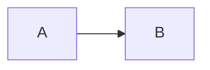
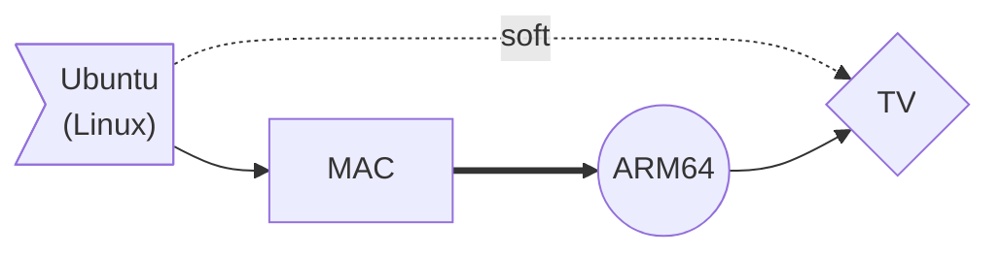
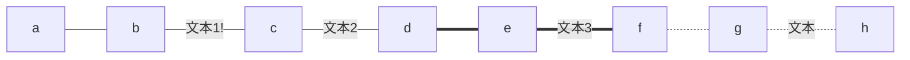
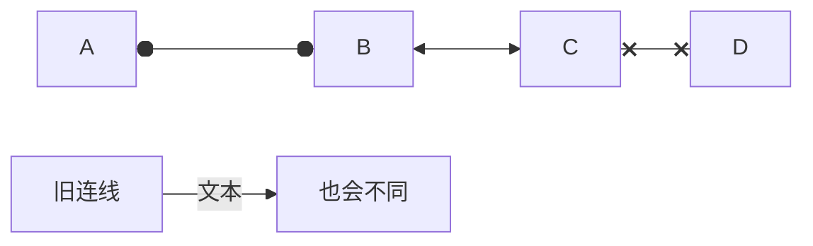
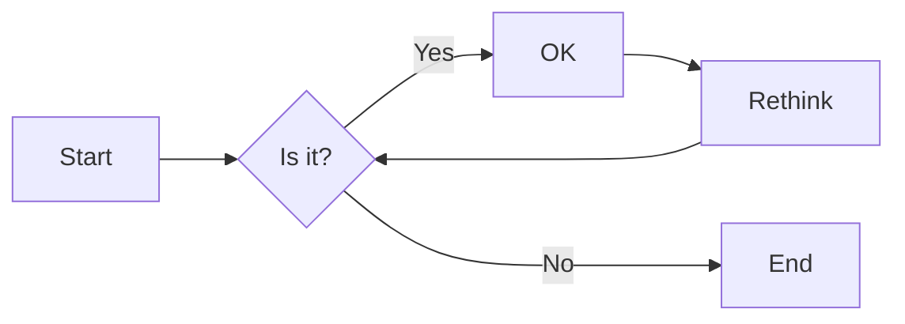
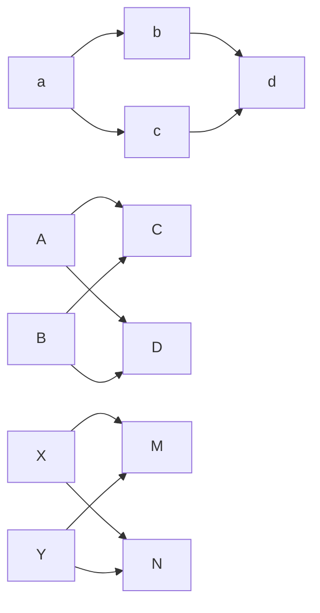
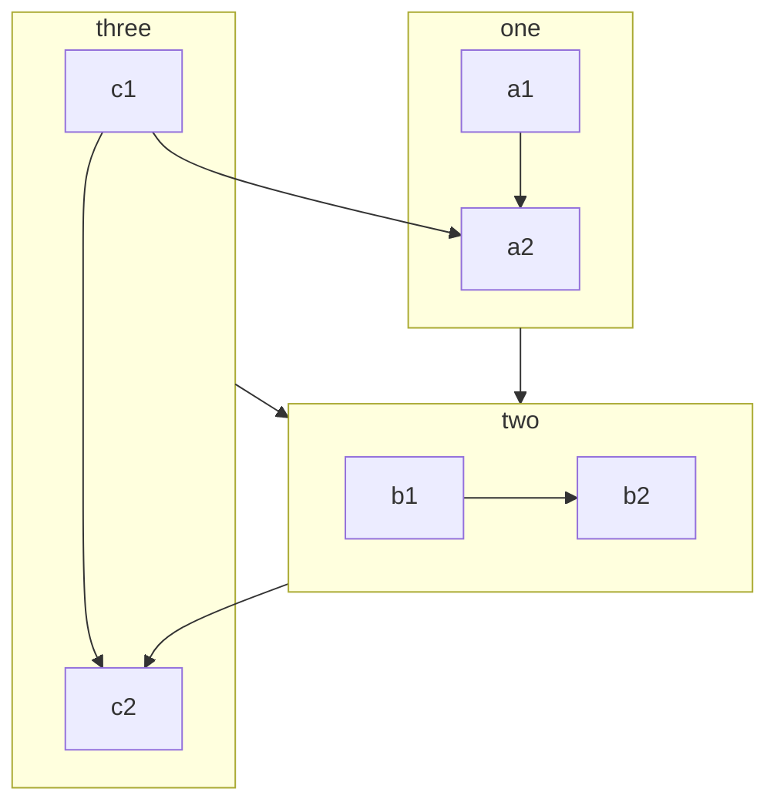

# 第一章 Win10基础

## 1.1 快捷键

| 快捷键            | 作用             | 快捷键   | 作用           |
| ----------------- | ---------------- | -------- | -------------- |
| F5                | 刷新             | win + G  | 可以控制音量   |
| F2                | 重命名           | win + Q  | 调出搜索框     |
| Backspace         | 返回上一级       | win + v  | 调出来剪切板   |
| Esc               | 取消             | win + D  | 快速回到桌面   |
|                   |                  | win + E  | 打开资源文件夹 |
|                   |                  | Win + L  | 锁屏           |
| Tab               | 制表符，自动补全 | win + ↓  | 缩小页面       |
| win + shift + s   | 截图             | win + +  | 放大镜         |
| Ctrl + Shift + N  | 新建文件夹       | Ctrl + Z | 撤销           |
| Ctrl + Shift + C  | 纯字符复制       | Ctrl + Y | 撤销撤销       |
| Alt + Tab         | 切换窗口         | Ctrl + X | 剪切           |
| Alt + Shift + Tab | 反向切换窗口     | Ctrl + C | 复制           |
| Shift + F10       | 等于右键         | Ctrl + V | 粘贴           |
| ALT+F4            | 关闭当前软件     | Ctrl + A | 全选           |
| ALT + 空格 + N    | 最小化软件       | Ctrl + S | 保存           |
| ALT + 空格 + M    | 选择当前窗口     | Ctrl + W | 关闭当前窗口   |
|                   |                  | Ctrl + F | 搜索           |
|                   |                  | Ctrl + D | 选择这段文字   |

鼠标双击才会选取一个单词，三击会选取整段

选取文件按住Ctrl会多选，按住Shirt中间的也会选择。

按住shift键再右键会出来复制文件地址

## 1.2 CMD命令

| 命令                    | 作用               | 快捷键及命令      | 作用             |
| ----------------------- | ------------------ | ----------------- | ---------------- |
| e:                      | 切换E盘            | ↑ ↓               | 查看历史记录     |
| cd                      | 显示当前目录       | F7                | 查看完整历史记录 |
| cd..                    | 返回上一级         | Tab               | 自动补全         |
| cd \                    | 返回根目录         | Esc               | 清除当前命令行   |
| dir                     | 显示当前目录下文件 | Ctrl + C          | 强行中止命令执行 |
| start 文件名字          | 打开文件夹或文件   |                   |                  |
| notepad++ 文件名字      | notepad++打开文件  | exit              | 退出cmd          |
| mkdir 文件夹名字        | 新建文件夹         | cls               | 清屏             |
| cd. > a.txt             | 新建空白文件       | ping ww.baidu.com | 测试网络         |
| echo [文件内容] > a.txt | 新建文件           | 命令 -help        | 查看使用帮助     |
| del 文件名称            | 删除文件名称       | ipconfig          | 查看IP地址       |
| rd 文件夹名称           | 删除文件夹         |                   |                  |

## 1.3 转义字符

| 转义字符 | 意义                                | ASCII码值（十进制） |
| -------- | ----------------------------------- | ------------------- |
| \a       | 响铃(BEL)                           | 007                 |
| \b       | 退格(BS) ，将当前位置移到前一列     | 008                 |
| \f       | 换页(FF)，将当前位置移到下页开头    | 012                 |
| \n       | 换行(LF) ，将当前位置移到下一行开头 | 010                 |
| \r       | 回车(CR) ，将当前位置移到本行开头   | 013                 |
| \t       | 水平制表(HT) （跳到下一个TAB位置）  | 009                 |
| \v       | 垂直制表(VT)                        | 011                 |
| \\       | 代表一个反斜线字符''\'              | 092                 |
| \'       | 代表一个单引号（撇号）字符          | 039                 |
| \"       | 代表一个双引号字符                  | 034                 |
| \?       | 代表一个问号                        | 063                 |
| \0       | 空字符(NUL)                         | 000                 |
| \ddd     | 1到3位八进制数所代表的任意字符      | 三位八进制          |
| \xhh     | 十六进制所代表的任意字符            | 十六进制            |

## 1.4 HTML转义字符

```
&copy;      版权      
&reg;       注册商标
&trade;     商标
&nbsp;      空格
&amp;       和号
&quot;      引号
&apos;      撇号
&lt;        小于号
&gt;        大于号
&ne;        不等号
&le;        小于等于
&ge;        大于等于
&cent;      分
&pound;     磅
&euro;      欧元
&yen;       元
&sect;      节
&times;     乘号
&divide;    除号
&plusmn;    正负号
```

&copy;      版权      
&reg;       注册商标
&trade;     商标
&nbsp;      空格
&amp;       和号
&quot;      引号
&apos;      撇号
&lt;        小于号
&gt;        大于号
&ne;        不等号
&le;        小于等于
&ge;        大于等于
&cent;      分
&pound;     磅
&euro;      欧元
&yen;       元
&sect;      节
&times;     乘号
&divide;    除号
&plusmn;    正负号


# 第二章 软件

## 2.1 Chrome

**快捷键**

| 快捷键      | 作用       | 快捷键   | 作用       |
| ----------- | ---------- | -------- | ---------- |
| Ctrl + T    | 新建标签页 | Alt + F4 | 关闭该软件 |
| Ctrl + W    | 关闭标签页 |          |            |
| Ctrl + Tab  | 切换标签页 |          |            |
| Ctrl + 数字 | 切换标签页 |          |            |

## 2.1 Idea

**快捷键**

| 快捷键                 | 作用                                   |
| ---------------------- | -------------------------------------- |
| Alt + Enter            | 导入包，自动修正代码                   |
| Ctrl + D               | 复制光标所在行的内容，插入光标位置下面 |
| Ctrl + Alt +L          | 格式化代码                             |
| Ctrl + /               | 单行注释，再取消注释                   |
| Ctrl + Shift + /       | 选中代码注释，多行注释，再按取消注释   |
| Alt + Ins              | 自动生成代码，toString, get, set等方法 |
| Alt + Shift + 上下箭头 | 移动当前代码行                         |
|                        |                                        |
| Shift + ENTER          | 新建一行，光标移到下一行               |
| CTRL + ALT + ENTER     | 新建上边一行，光标移到上一行           |
| Shift + F6             | 修改名称                               |
| ALT + insert           | 新建 可以新建一切东西                  |

Alt键加鼠标                     换行选中

Alt加斜杠		      代码快捷补全

CTRL+p		      显示参数列表

CTRL + SHIFT + R           替换参数

CTRL + ALT + T	      surround with 把选中的代码块装进一些带有{}的语句中，比如if，try，for等等

CTRL + ALT + V	      生成对象

CTRL + X  	      删除一整行

shift + esc	      将run窗口隐藏

CTRL + SHIFT + N  	      搜索左侧文件

CTRL + F4	      关闭上方文件

CTRL + TABLE	      对上方文件进行切换

ALT + 1 和ESC	      文件去和编辑区切换


CTRL +N		　　搜索类

CTRL + ALT + -	      折叠当前代码块

CTRL + SHIFT+ -           折叠所有代码块


## 2.2 VSCode

**快捷键**

SHIFT + ESC	     显示控制台
CTRL + F12	     显示该类所有方法

Ctrl + Alt + Z	     编辑 构造方法 生成对象   【自己修改过】
Ctrl + Alt + X	     折叠所有注释 【自己修改过】

## 2.4 笔记软件Typora

### 2.4.1 MarkDown语法

### 2.4.2 Mermaid画图

Mermaid 是一个用于画流程图、状态图、时序图、甘特图的库，广泛集成于许多 Markdown 编辑器中。Typora也不例外。Mermaid 作为一个使用 JS 渲染的库，生成的不是一个“图片”，而是一段 HTML 代码。

官网：https://mermaidjs.github.io/。GitHub项目地址：https://github.com/knsv/mermaid

```apl
graph LR; # 其中LR指的是方向
	A --> B # 不同的箭头表示
```



| 方向用词 graph x; | 含义     | 箭头       | 含义           |
| ----------------- | -------- | ---------- | -------------- |
| `TB`              | 从上到下 | `>`        | 添加尾部箭头   |
| `BT`              | 从下到上 | `-`        | 不添加尾部箭头 |
| `RL`              | 从左到右 | `--`       | 单线           |
| `LR`              | 从右到左 | `--text--` | 单线加文字     |
|                   |          | `==`       | 粗线           |
|                   |          | `==text==` | 粗线加文字     |
|                   |          | `-.-`      | 虚线           |
|                   |          | `-.text.-` | 虚线加文字     |

```apl
节点默认方形
    id1[方形]
    id2(圆边矩形)
    id3([体育场形])
    id4[[子程序形]]
    id5[(圆柱形)]
    id6((圆形))
    id1{菱形}
    id2{{六角形}}
    id3[/平行四边形/]
    id4[\反向平行四边形\]
    id5[/梯形\]
    id6[\反向梯形/]
```

**示例1**

```apl
graph LR;
	A>"Ubuntu<br>(Linux)"] -.soft.-> C{TV}
	B["MAC"] ==> D((ARM64))
	D--> C
	A --> B
```



**示例2**

```apl
graph LR
	a---b
	b--文本1!---c
	c---|文本2|d
	d===e
	e==文本3===f
	f-.-g
	g-.文本.-h
```



**示例3**

```apl
flowchart LR
    A o--o B
    B <--> C
    C x--x D
    
    旧连线 --文本--> 也会不同

```




**示例4**

延长连线：
增加相应字符即可，如下图中的B到E，连线中增加了一个 `-` 。字符可多次添加。

```apl
graph LR
    A[Start] --> B{Is it?};
    B -->|Yes| C[OK];
    C --> D[Rethink];
    D --> B;
    B --->|No| E[End];

```



多重链

```apl
graph LR
   a --> b & c--> d
   
   A & B--> C & D
   
    X --> M
    X --> N
    Y --> M
    Y --> N

```




**示例5**

- 注释 `%%这是一条注释，在渲染图中不可见`
- 子图

```apl
%%这是一条注释，在渲染图中不可见
flowchart TB
    c1-->a2
    subgraph one
    a1-->a2
    end
    subgraph two
    b1-->b2
    end
    subgraph three
    c1-->c2
    end
    one --> two
    three --> two
    two --> c2

```




# 第六章 通用知识

## 6.2 分析报错信息

错误信息从下往上依次查看，因为上面的错误大都是对下面错误的一个包装，最核心错误是在最下面。

## 6.1 正则表达式

正则表达式：定义字符串的组成规则。

1. 单个字符：`[ ]`

   例如：`[a]、[ab]、[a-z]、[a-zA-Z0-9_]`

   由于这样写很麻烦，所以有着特殊符号代表特殊含义的单个字符

   * `\d`：单个数字字符 `[0-9]`
   * `\w`：单个单词字符 `[a-zA-Z0-9_]`

2. 量词符号：

   * `?`：表示出现0次或者1次。
   * `*`：表示出现0次或者多次。
   * `+`：表示出现1次或者多次。
   * `{m, n}`：表示出现大于m次，小于n次。
     * 如果缺少m, `{, n}`：代表最多n次。
     * 如果缺少n, `{m, }`：代表最少m次。

3. 开始和结束符号：

   * `^`：开始符号
   * `$`：结束符号

4. 字符类 

   - `[abc]` `a`、`b` 或 `c`（简单类）
   - `[^abc]` 任何字符，除了 `a`、`b` 或 `c`（否定）
   - `[a-zA-Z]` `a` 到 `z` 或 `A` 到  `Z`，两头的字母包括在内（范围）
   - `[a-d[m-p]]` `a` 到 `d` 或 `m` 到  `p`：`[a-dm-p]`（并集）
   - `[a-z&&[def]]` `d`、`e` 或 `f`（交集） 
   - `[a-z&&[^bc]]` `a` 到 `z`，除了 `b` 和  `c`：`[ad-z]`（减去）
   - `[a-z&&[^m-p]]` `a` 到 `z`，而非 `m` 到  `p`：`[a-lq-z]`（减去）


[abc] 表示a或b或c
[a-zA-Z] 表示a到z或A到Z（包括两头字母）
\d 表示数字[0-9]
\D 表示非数字
\w 表示单词字符[a-zA-Z_0-9]
\W 表示非单词字符
\s 表示空白字符（如空格、制表位\t、换行\n等）
x{n} 表示x，恰好n次
x{n,} 表示x，至少n次
x{m,n} 表示至少m次，但是不超过n次

## 6.2 实体类型


## 6.3 ASCII码表

在计算机的内部都是二进制的0、1数据，如何让计算机可以直接识别人类文字的问题呢？就产生出了编码表的概念。

编码表 ：就是将人类的文字和一个十进制数进行对应起来组成一张表格。

将所有的英文字母，数字，符号都和十进制进行了对应，因此产生了世界上第一张编码表ASCII（American Standard Code for Information Interchange 美国标准信息交换码）。

| 字符 | 数值 |
| ---- | ---- |
| 0    | 48   |
| 9    | 57   |
| A    | 65   |
| Z    | 90   |
| a    | 97   |
| z    | 122  |

```java
public static void main(String[] args) {
    // 字符类型变量
    char c = 'a';
    int i = 1;
    // 字符类型和int类型计算
    System.out.println(c + i);// 输出结果是98
}
```

在char类型和int类型计算的过程中，char类型的字符先查询编码表，得到97，再和1求和，结果为98。char类型提升 为了int类型。char类型内存2个字节，int类型内存4个字节。


# 第七章 智力面试题

智力面试题如下：

1. 水桶装水（两个无刻度的水桶，一个可以装6L水，一个可以装5L水，如何在桶里装入3L的水？）
2. 选出最快的马（25匹马，5个赛道，每次只能同时有5匹马跑，最少比赛几次选出前三名的马？）
3. 找出有毒的药（1000瓶药水中1瓶有毒，毒发时间24小时，需要多少只老鼠能在24小时后试出毒药？）
4. 

**水桶装水（两个无刻度的水桶，一个可以装6L水，一个可以装5L水，如何在桶里装入3L的水？）**

答：只要这两个水壶的容量互质（即两个数没有共同的质因子），我们就能找出一种倒水的顺序组合，量出1到2个水壶容量总和（含）之间的任意水量。6的质因子是2、3、6，5的质因子是5，所以可以找出来。

1. 先将5L的桶装满，将5L的桶的水倒入6L的桶中。这时5L的桶是空的，6L的桶中有5L的水。

2. 再将5L的桶装满，倒入6L的桶中。这时5L的桶有4L的水，6L的桶是满的。

3. 将6L的桶中的水倒掉，5L的桶的水倒入6L的桶中。这时5L的桶是空的，6L的桶中有4L的水。

4. 将5L的桶装满，倒入6L的桶中。这时5L的桶还有3L的水，6L的桶是满的。

```apl
5L水杯      6L水杯
 0            0    # 两个水桶为空
 5            0    # 将5L的桶装满
 0            5    # 将5L的桶的水倒入6L的桶中。这时5L的桶是空的，6L的桶中有5L的水。
 5            5    # 再将5L的桶装满
 4            6    # 倒入6L的桶中。这时5L的桶有4L的水，6L的桶是满的。
 4            0    # 将6L的桶中的水倒掉
 0            4    # 5L的桶的水倒入6L的桶中。这时5L的桶是空的，6L的桶中有4L的水。
 5            4    # 将5L的桶装满
 3            6    # 倒入6L的桶中。这时5L的桶还有3L的水，6L的桶是满的。
```

```apl
# 如果换成5L和3L的，那么就需要现在5L的桶中灌水了
3L水杯      5L水杯
 0            0
 3            0
 0            3
 3            3
 1            5
 1            0
 0         	  1
 3            1
 0            4
```

**选出最快的马（25匹马，5个赛道，每次只能同时有5匹马跑，最少比赛几次选出前三名的马？）**

**答案**

> 大概思想就是先分5组跑，跑出每组第一名，将每组第一名放到一起跑，找出25匹马的第一名，然后找出2、3名，一共需要7次。
>
> 前五次：将25匹马放到5个赛道比赛，找出每个赛道的第一名。假设A1、B1、C1、D1、E1分别为每组的第一名，如下图：
>
> 
>
> 第六次：将A1、B1、C1、D1、E1放到一个赛道上找出第一名，假设为A1，其他四名分别为B1、C1、D1、E1。这时第一名已经找到了，还需找到二、三名。因为C1的速度比D1和E1的速度快，所以赛道D和赛道E的所有马都被淘汰了。有机会成为二、三名的马为A2、A3、B1、B2、C1这五匹马，即前五名在这个区域，并且第一名为A1。
>
> 
>
> 第七次：将A2、A3、B1、B2、C1放到一个赛道找出前两名，再加上A1，这就找到前三名了。


## 11. 蓝色眼睛的人

有个岛上住着一群人，有一天来了个游客，定了一条奇怪的规矩：所有蓝眼睛的人都必须尽快离开这个岛。每晚8点会有一个航班离岛。每个人都看得见别人眼睛的颜色，但不知道自己的（别人也不可以告知）。此外，他们不知道岛上到底有多少人是蓝眼睛的，只知道至少有一个人的眼睛是蓝色的。所有蓝眼睛的人要花几天才能离开这个岛？

**答案**

> 下面将采用简单构造法。假定这个岛上一共有n人，其中c人有蓝眼睛。由题目可知，c > 0。
>
> 1. 情况c = 1：只有一人是蓝眼睛的
>
>    假设岛上所有人都是聪明的，蓝眼睛的人四处观察之后，发现没有人是蓝眼睛的。但他知道至少有一人是蓝眼睛的，于是就能推导出自己一定是蓝眼睛的。因此，他会搭乘当晚的飞机离开。
>
> 2. 情况c = 2：只有两人是蓝眼睛的
>
>    两个蓝眼睛的人看到对方，并不确定c是1还是2，但是由上一种情况，他们知道，如果c = 1，那个蓝眼睛的人第一晚就会离岛。因此，发现另一个蓝眼睛的人仍在岛上，他一定能推断出c = 2，也就意味着他自己也是蓝眼睛的。于是，两个蓝眼睛的人都会在第二晚离岛。
>
> 3. 情况c > 2：一般情况
>
>    逐步提高c时，我们可以看出上述逻辑仍旧适用。如果c = 3，那么，这三个人会立即意识到有2到3人是蓝眼睛的。如果有两人是蓝眼睛的，那么这两人会在第二晚离岛。因此，如果过了第二晚另外两人还在岛上，每个蓝眼睛的人都能推断出c = 3，因此这三人都有蓝眼睛。他们会在第三晚离岛。
>
> 不论c为什么值，都可以套用这个模式。所以，如果有c人是蓝眼睛的，则所有蓝眼睛的人要用c晚才能离岛，且都在同一晚离开。

## 13. 扔鸡蛋

有栋建筑物高100层。若从第N层或更高的楼层扔下来，鸡蛋就会破掉。若从第N层以下的楼层扔下来则不会破掉。给你2个鸡蛋，请找出N，并要求最差情况下扔鸡蛋的次数为最少。

**答案**

> 我们发现，无论怎么扔鸡蛋1（Egg 1），鸡蛋2（Egg 2）都必须在“破掉那一层”和下一个不会破掉的最高楼层之间，逐层扔下楼（从最低的到最高的）。例如，若鸡蛋1从5层和10层楼扔下没破掉，但从15层扔下时破掉了，那么，在最差情况下，鸡蛋2必须尝试从11、12、13和14层扔下楼。
>
> 具体做法如下：
>
> - 首先，让我们试着从10层开始扔鸡蛋，然后是20层，等等。
> - 如果鸡蛋1第一次扔下楼（10层）就破掉了，那么，最多需要扔10次。
> - 如果鸡蛋1最后一次扔下楼（100层）才破掉，那么，最多要扔19次（10、20、…、90、100层，然后是91到99层）。
>
> 这么做也挺不错，但我们只考虑了绝对最差情况。我们应该进行“负载均衡”，让这两种情况下扔鸡蛋的次数更均匀。
>
> 我们的目标是设计一种扔鸡蛋的方法，使得扔鸡蛋1时，不论是在第一次还是最后一次扔下楼才破掉，次数越稳定越好。
>
> 1. 完美负载均衡的方法应该是，扔鸡蛋1的次数加上扔鸡蛋2的次数，不论什么时候都一样，不管鸡蛋1是从哪层楼扔下时破掉的。
> 2. 若有这种扔法，每次鸡蛋1多扔一次，鸡蛋2就可以少扔一次。
> 3. 因此，每丢一次鸡蛋1，就应该减少鸡蛋2可能需要扔下楼的次数。例如，如果鸡蛋1先从20层往下扔，然后从30层扔下楼，此时鸡蛋2可能就要扔9次。若鸡蛋1再扔一次，我们必须让鸡蛋2扔下楼的次数降为8次。也就是说，我们必须让鸡蛋1从39层扔下楼。
> 4. 由此可知，鸡蛋1必须从X层开始往下扔，然后再往上增加X&#61485;1层……直至到达100层。
> 5. 求解方程式X + (X&#61485;1) + (X&#61485;2) + … + 1 = 100，得到X (X + 1) / 2 = 100 → X = 14。
>
> 我们先从14层开始，然后是27层，接着是39层，依此类推，最差情况下鸡蛋要扔14次。
>
> 正如解决其他许多最大化/最小化的问题一样，这类问题的关键在于“平衡最差情况”。

## 14. 开柜子

走廊上有100个关上的储物柜。有个人先是将100个柜子全都打开。接着，每数两个柜子关上一个。然后，在第三轮时，再每隔两个就切换第三个柜子的开关状态（也就是将关上的柜子打开，将打开的关上）。照此规律反复操作100次，在第i轮，这个人会每数i个就切换第i个柜子的状态。当第100轮经过走廊时，只切换第100个柜子的开关状态，此时有几个柜子是开着的？

**答案**

> 要解决这个问题，我们必须弄清楚所谓切换储物柜开关状态是什么意思。这有助于我们推断最终哪些柜子是开着的。
>
> 1. 问题：柜子会在哪几轮切换状态（开或关）？
>
>    柜子n会在的每个因子（包括1和n本身）对应的那一轮切换状态。也就是说，柜子15会在第1、3、5和15轮开或关一次。
>
> 2. 问题：柜子什么时候还是开着的？
>
>    如果因子个数（记作x）为奇数，则这个柜子是开着的。你可以把一对因子比作开和关，若还剩一个因子，则柜子就是开着的。
>
> 3. 问题：x什么时候为奇数？
>
>    若n为完全平方数，则x的值为奇数。理由如下：将n的两个互补因子配对。例如，如n为36，则因子配对情况为：(1, 36)、(2, 18)、(3, 12)、(4, 9)、(6, 6)。注意，(6, 6)其实只有一个因子，因此n的因子个数为奇数。
>
> 4. 问题：有多少个完全平方数？
>
>    一共有10个完全平方数，你可以数一数（1、4、9、16、25、36、49、64、81、100），或者，直接列出1到10的平方：1*1, 2*2, 3*3, …, 10*10
>
> 因此，最后共有10个柜子是开着的。

## 15. 抓兔子

有五个山洞，一字排开，一只狐狸住在某个洞，每天晚上会换住到相邻的洞中，一个猎人只能每天早上去一个洞，怎么样确保抓住兔子？

**答案**

> 234432，最多六天。
>
> - 第一次抓第二个，不在二中，则在一三四五中，晚上只能跑到二三四五中，
> - 第二次抓第三个，不在三中，则在二四五中，晚上跑到一三四五中，
> - 第三次抓第四个，不在四中，则在一三五中，晚上跑到二四中，
> - 第四次抓第四个，不在四中，则在二中，晚上跑到一三中，
> - 第五次抓第三个，不在三中，则在一中，晚上跑到二中，
> - 第六次抓第二个，一定能抓到。
>
> 综上，最多六次就可以抓到


## 16. 瞎子摸牌

给一个瞎子52张扑克牌，并告诉他里面恰好有10张牌是正面朝上的。要求这个瞎子把牌分成两堆，使得每堆牌里正面朝上的牌的张数一样多。瞎子应该怎么做？（瞎子摸不出牌是正面或者是反面，但是却可以随意翻动每一张牌）

**答案**

> 将52张牌分为2堆，一堆10张，另一堆42张，将10张的那一堆全部翻起来就行了。

## 17. 保险箱的钥匙

财务部有三名工作人员和A.B.C三个保险箱，每个保险箱有两把钥匙。怎样处理6把钥匙才能使这三名工作人员中？

**答案**

> 甲拿A钥匙，乙拿B钥匙，丙拿C钥匙。
>
> 另一把A钥匙放在C保险箱中，另一把B钥匙放在A保险箱中，另一把C钥匙放在B保险箱中

## 18. 保证最后一个

桌上有100个苹果，你和另一个人一起拿，一人一次，每次拿的数量大于等于1小于等于5，问：如何拿能保证最后一个苹果由你来拿？

**答案**

> 只需要你先拿，第一次拿4个，以后看对方拿的个数，根据对方拿的个数，保证每轮对方和你拿的加起来是6就行了，其实就是保证你拿到4，还要拿到10,16…直到94。


## 3. 找出有毒的药

1000瓶药水里面只有1瓶是有毒的，毒发时间为24个小时，问需要多少只老鼠才能在24小时后试出那瓶有毒？

**答案**

> 需要老鼠的数量为10
>
> 为了简化问题，可以先假设只有8瓶药水，其中有一瓶有毒，根据公式需要3个老鼠。
>
> 先将瓶子进行编号为0-7号，用位数表示老鼠。 
>
> 如下图示意：
>
> - 将4、5、6、7号药水混合到一起喂给老鼠3，将2、3、6、7号药水混合喂给老鼠2，将1、3、5、7药水混合喂给老鼠1，观察老鼠是否中毒。
> - 中毒的老鼠标号为1，未中毒的老鼠标号为0，将三只老鼠标号组合到一起即为有毒药水的标号。
>
> 
>
> 回到正题，如果有1000瓶药水，则需要10只老鼠，因为10位二进制足以表示0-999。

## 4. 女孩概率

家里有两个孩子，一个是女孩，另一个也是女孩的概率是多少？

**答案**

> 这是一个概率问题，答案是二分之一，看到这里脑瓜子嗡嗡的吧。
>
> 已知家里有两个孩子Ａ和Ｂ，**其中一个是女孩**，关键问题就在其中一个是女陔这句话上。
>
> - 如果你理解为这个是指定了一个孩子为女孩，例如Ａ为女孩，那么Ｂ也是女孩的概率显然为二分之一。
> - 如果你理解为Ａ或Ｂ有一个孩子是女孩，问另一个孩子也是女陔的概率，这就是三分之一了。因为两个孩子的性别只有男男、男女、女男、女女四种组合，男男被排除了，剩下三种组合均符合题意，所以是三分之一。
>
> 其实，题目本身应该是第二种理解的意思，告诉你有一个是女孩并未明确说哪个是。但很多人看到题目就会先入为主，先指定了一个孩子为女孩，那另一个孩子为女孩的概率肯定是二分之一了，这是不正确的。

## 5. 烧绳子

烧一根不均匀的绳，从头烧到尾总共需要1个小时。现在有若干条材质相同的绳子，问如何用烧绳的方法来计时一个小时十五分钟呢？

**答案**

> 这个问题的关键就是要知道绳子可以从两头烧。
>
> - 将绳子１从一端开始烧，同时将绳子２从两端烧，绳子２在半小时后烧完。
> - 这时开始计时，将绳子１的另一端点燃，从计时开始绳子１烧完后是15分钟，然后点燃绳子3的一端，绳子3烧完需要一个小时。加上刚才的15分钟正好是1小时15分钟。

### 沙漏计时

一个4分钟沙漏，一个7分钟沙漏，如何计算出9分钟？

**答案**

> 简单的方法（没有从头计时）：
>
> - 4分钟沙漏和7分钟沙漏同时流，4分钟沙漏流完时，7分钟沙漏还有3分钟，将4分钟的沙漏翻转
> - 7分钟沙漏流完时，4分钟沙漏还有1分钟，从此刻开始计时
> - 当4分钟沙漏流完时，再次翻转两次4分钟的沙漏，即1+4+4=9分钟
>
> 从头计时的方法：
>
> - 4分钟和7分钟的两个沙漏开始同时计时，4分钟后，4分钟的沙漏漏完了，7分钟沙漏还余3分钟
> - 把4分钟的沙漏倒过来，继续计时，3分钟后，7分钟的沙漏也漏完了，4分钟沙漏还余1分钟
> - 把7分钟的倒过来，当4分钟的沙漏又漏完时，这时正好过去8分钟，七分钟的沙漏这时计时正好过去1分钟
> - 然后再次把7分钟的沙漏倒过来，当它漏完之后，刚好9分钟

### 烧蚊香

一圈蚊香烧完要用1个小时，如何用两圈蚊香识别45分钟？

> - 同时点燃第一圈的一头和第二圈的两头，第二圈烧完时过去了30分钟
> - 立即点燃第一圈的另一头，第一圈烧完时又过去了15分钟，共计45分钟

## 6. 找不同重量的球

一共12个一样的小球， 其中只有一个重量与其它不一样(未知轻重)，给你一个天平，找出那个不同重量的球？

**答案**

> 这个问题的思想是采用分治的思想。
>
> - 将12个小球分为三组（因为分成两组不能找到重量不一样的球在哪组），为A组、B组、C组。
> - 将三组球分别两两称重，找到重量和另外两组不同的那一组（只要有两组可以使天平平衡，重量不一致的球必然在第三组）。假设坏的球在C组。
> - 将C组的球分成两组C1和C2，每组两个球，这时从A组和B组里找到两个正常的球，分别和C1和C2去称，天平不能平衡说明重量不一致的球就在哪组。假设在C1。
> - 将C1组的球分别和正常的球去称，天平不平衡时就能找到重量与其他不一致的球。

球的重量

八个球，其中有一个是其余球重量的1.5倍，只称两次，如何找出来？

**答案**

> - 在这八个球中，随机抽取两组，每组的球的数量是3个，对这两组称重
> - 如果天平平衡，则重的球在剩下的两个球中。将剩下的两个球放入天平的两端即可找出重的球
> - 如果天平不平衡，在重的那一组的3个球中，再取出两个放到天平两端进行比较
> - 如果天平平衡，则重的球是最后剩下的球，否则天平较低那一端的则为重的球

## 7. 找变质的药

有10瓶药，每瓶有10粒药，其中有一瓶是变质的。好药每颗重1克，变质的药每颗比好药重0.1克。问怎样用天平称一次找出变质的那瓶药？

**答案**

> 将这10瓶药标好号1-10。
>
> 然后按照瓶子的标号取药，1号药瓶取1粒药，2号药瓶取2粒药，3号药瓶取3粒药，以此类推，取完10瓶药一起放到天平上去称。如果没有变质的药，重量应该是55克，这时多出几克，几号药瓶就是变质的。例如55.3克，那么变质的药就是3号药瓶的。

## 8. 红球的概率

你有两个罐子，50个红色弹球，50个蓝色弹球，如何将这100个球放入到两个罐子，随机选出一个罐子取出的球为红球的概率最大？

**答案**

> 将一个红球放到一个罐子中，另一个罐子放49个红球和50个蓝球。
>
> 这样随便选出一个罐子取出红球的概率是1/2 * 1 + 1/2 * 49 /（49+50），接近0.75。

## 9. 多米诺骨牌盖住棋盘

有个8×8棋盘，其中对角的角落上，两个方格被切掉了。给定31块多米诺骨牌，一块骨牌恰好可以覆盖两个方格。用这31块骨牌能否盖住整个棋盘？请证明你的答案（提供范例，或证明为什么不可能）。

**答案**

> 乍一看，似乎是可以盖住的。棋盘大小为8×8，共有64个方格，但其中两个方格已被切掉，因此只剩62个方格。31块骨牌应该刚好能盖住整个棋盘，对吧？
>
> 可是答案是不可能的：
>
> - 尝试用骨牌盖住第1行，而第1行只有7个方格，因此有一块骨牌必须铺至第2行。而用骨牌盖住第2行时，我们又必须将一块骨牌铺至第3行。
> - 要盖住每一行，总有一块骨牌必须铺至下一行。无论尝试多少次、多少种方法，我们都无法成功铺下所有骨牌。
>
> 其实，还有更简洁更严谨的证明说明为什么不可能。
>
> * 棋盘原本有32个黑格和32个白格。将对角角落上的两个方格（相同颜色）切掉，棋盘只剩下30个同色的方格和32个另一种颜色的方格。为方便论证起见，我们假定棋盘上剩下30个黑格和32个白格。
>
> - 放在棋盘上的每块骨牌必定会盖住一个白格和一个黑格。因此，31块骨牌正好盖住31个白格和31个黑格。然而，这个棋盘只有30个黑格和32个白格，所以，31块骨牌盖不住整个棋盘。

## 10 抛硬币

两个人玩抛硬币的游戏，谁先抛到正面就获胜。那么先抛的人获胜概率为（）。

2/3  

  第1把胜 1/2 （A正）


  第2把胜 1/2 * 1/2 * 1/2 （A反B反A正） 

  第n把胜 1/2^(2n-1) 

  A胜的概论，就是上述概率之和。 

  按等比数列求和公式，当 n 无穷大时，其值是 2/3。


### 场景题以及智力题（可以通过google去搜索解决问题，锻炼搜索能力~）

- 书籍
  - 《数据密集型应用系统设计》
- 场景题资源
  - 面试系列 场景题与智力题收集
    - https://zhuanlan.zhihu.com/p/359538568
  - 写一个面试中场景题的总结
    - https://blog.51cto.com/u_15076209/4244803
  - 后端场景题
    - https://blog.csdn.net/qq_37574623/article/details/117255234
  - 面试场景题：如何设计一个排行榜？
    - https://www.1024sou.com/article/783326.html
  - 其他问题
    - 假如有 10 亿个数，只有一个重复，内存只能放下 5 亿个数，怎么找到这个重复的数字？
    - 如何设计一个秒杀系统（服务端、数据库、分布式）？分布式系统的设计？
    - 有一个服务器专门接收大量请求，怎么设计？
    - 如果让你自己设计 RPC 框架你会如何设计？
    - 怎么快速出现一个 stackoverflow 错误？
  - 大厂面试助手(十二)：场景和设计
    - https://juejin.cn/post/6909437717596241927
- 智力题资源
  - 【盘点】面试中常常看见的智力题 烫
    - https://www.nowcoder.com/discuss/262595
  - 【智力题】大厂最爱问的智力题
    - https://chowdera.com/2022/01/202201071409493219.html
  - 互联网大厂最爱问的智力题总结（带详细答案） 烫
    - https://www.nowcoder.com/discuss/754712?type=1&channel=-1&source_id=discuss_terminal_discuss_hot_nctrack

### 简历编写
