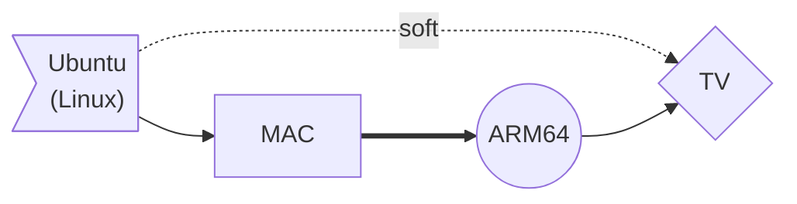
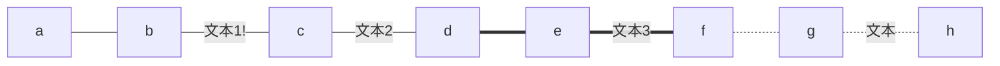
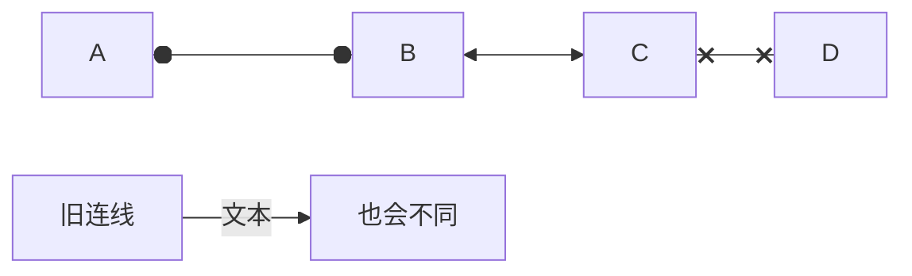
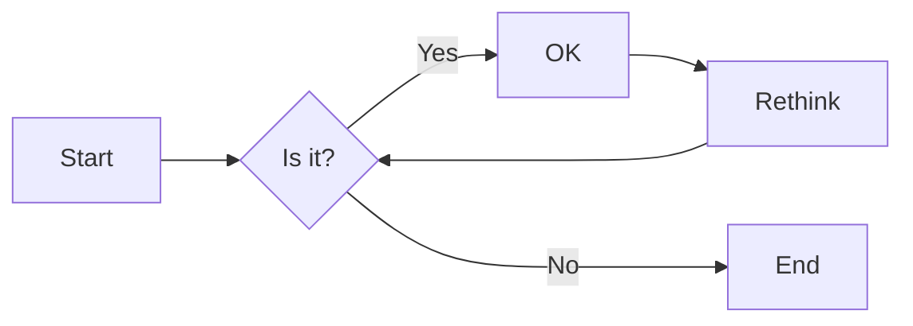
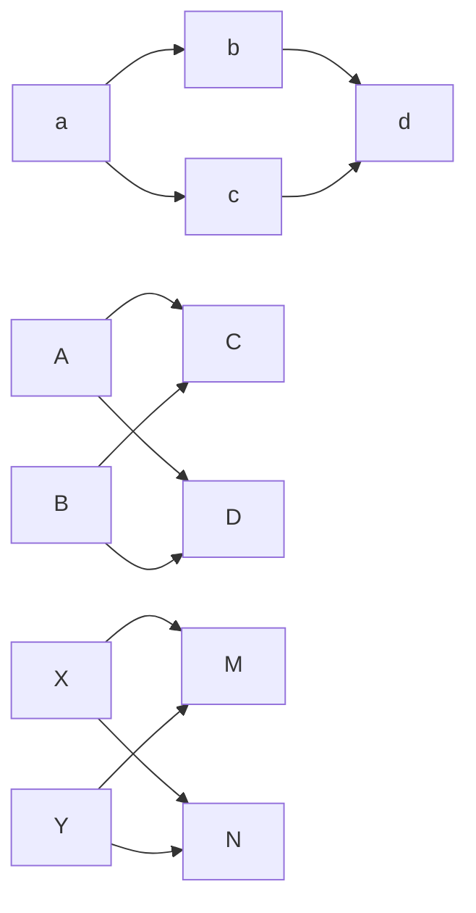
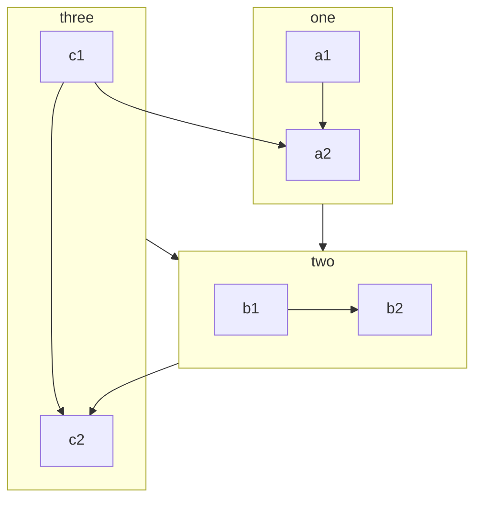

# 第一章 Win10基础

## 1.1 快捷键

| 快捷键            | 作用             | 快捷键   | 作用           |
| ----------------- | ---------------- | -------- | -------------- |
| F5                | 刷新             | win + G  | 可以控制音量   |
| F2                | 重命名           | win + Q  | 调出搜索框     |
| Backspace         | 返回上一级       | win + v  | 调出来剪切板   |
| Esc               | 取消             | win + D  | 快速回到桌面   |
|                   |                  | win + E  | 打开资源文件夹 |
|                   |                  | Win + L  | 锁屏           |
| Tab               | 制表符，自动补全 | win + ↓  | 缩小页面       |
| win + shift + s   | 截图             | win + +  | 放大镜         |
| Ctrl + Shift + N  | 新建文件夹       | Ctrl + Z | 撤销           |
| Ctrl + Shift + C  | 纯字符复制       | Ctrl + Y | 撤销撤销       |
| Alt + Tab         | 切换窗口         | Ctrl + X | 剪切           |
| Alt + Shift + Tab | 反向切换窗口     | Ctrl + C | 复制           |
| Shift + F10       | 等于右键         | Ctrl + V | 粘贴           |
| ALT+F4            | 关闭当前软件     | Ctrl + A | 全选           |
| ALT + 空格 + N    | 最小化软件       | Ctrl + S | 保存           |
| ALT + 空格 + M    | 选择当前窗口     | Ctrl + W | 关闭当前窗口   |
|                   |                  | Ctrl + F | 搜索           |
|                   |                  | Ctrl + D | 选择这段文字   |

鼠标双击才会选取一个单词，三击会选取整段

选取文件按住Ctrl会多选，按住Shirt中间的也会选择。

按住shift键再右键会出来复制文件地址

## 1.2 CMD命令

| 命令                    | 作用               | 快捷键及命令      | 作用             |
| ----------------------- | ------------------ | ----------------- | ---------------- |
| e:                      | 切换E盘            | ↑ ↓               | 查看历史记录     |
| cd                      | 显示当前目录       | F7                | 查看完整历史记录 |
| cd..                    | 返回上一级         | Tab               | 自动补全         |
| cd \                    | 返回根目录         | Esc               | 清除当前命令行   |
| dir                     | 显示当前目录下文件 | Ctrl + C          | 强行中止命令执行 |
| start 文件名字          | 打开文件夹或文件   |                   |                  |
| notepad++ 文件名字      | notepad++打开文件  | exit              | 退出cmd          |
| mkdir 文件夹名字        | 新建文件夹         | cls               | 清屏             |
| cd. > a.txt             | 新建空白文件       | ping ww.baidu.com | 测试网络         |
| echo [文件内容] > a.txt | 新建文件           | 命令 -help        | 查看使用帮助     |
| del 文件名称            | 删除文件名称       | ipconfig          | 查看IP地址       |
| rd 文件夹名称           | 删除文件夹         |                   |                  |

## 1.3 转义字符

| 转义字符 | 意义                                | ASCII码值（十进制） |
| -------- | ----------------------------------- | ------------------- |
| \a       | 响铃(BEL)                           | 007                 |
| \b       | 退格(BS) ，将当前位置移到前一列     | 008                 |
| \f       | 换页(FF)，将当前位置移到下页开头    | 012                 |
| \n       | 换行(LF) ，将当前位置移到下一行开头 | 010                 |
| \r       | 回车(CR) ，将当前位置移到本行开头   | 013                 |
| \t       | 水平制表(HT) （跳到下一个TAB位置）  | 009                 |
| \v       | 垂直制表(VT)                        | 011                 |
| \\       | 代表一个反斜线字符''\'              | 092                 |
| \'       | 代表一个单引号（撇号）字符          | 039                 |
| \"       | 代表一个双引号字符                  | 034                 |
| \?       | 代表一个问号                        | 063                 |
| \0       | 空字符(NUL)                         | 000                 |
| \ddd     | 1到3位八进制数所代表的任意字符      | 三位八进制          |
| \xhh     | 十六进制所代表的任意字符            | 十六进制            |

## 1.4 HTML转义字符

```
&copy;      版权      
&reg;       注册商标
&trade;     商标
&nbsp;      空格
&amp;       和号
&quot;      引号
&apos;      撇号
&lt;        小于号
&gt;        大于号
&ne;        不等号
&le;        小于等于
&ge;        大于等于
&cent;      分
&pound;     磅
&euro;      欧元
&yen;       元
&sect;      节
&times;     乘号
&divide;    除号
&plusmn;    正负号
```

&copy;      版权      
&reg;       注册商标
&trade;     商标
&nbsp;      空格
&amp;       和号
&quot;      引号
&apos;      撇号
&lt;        小于号
&gt;        大于号
&ne;        不等号
&le;        小于等于
&ge;        大于等于
&cent;      分
&pound;     磅
&euro;      欧元
&yen;       元
&sect;      节
&times;     乘号
&divide;    除号
&plusmn;    正负号


# 第二章 软件

## 2.1 Chrome

**快捷键**

| 快捷键      | 作用       | 快捷键   | 作用       |
| ----------- | ---------- | -------- | ---------- |
| Ctrl + T    | 新建标签页 | Alt + F4 | 关闭该软件 |
| Ctrl + W    | 关闭标签页 |          |            |
| Ctrl + Tab  | 切换标签页 |          |            |
| Ctrl + 数字 | 切换标签页 |          |            |

## 2.1 Idea

**快捷键**

| 快捷键                 | 作用                                   |
| ---------------------- | -------------------------------------- |
| Alt + Enter            | 导入包，自动修正代码                   |
| Ctrl + D               | 复制光标所在行的内容，插入光标位置下面 |
| Ctrl + Alt +L          | 格式化代码                             |
| Ctrl + /               | 单行注释，再取消注释                   |
| Ctrl + Shift + /       | 选中代码注释，多行注释，再按取消注释   |
| Alt + Ins              | 自动生成代码，toString, get, set等方法 |
| Alt + Shift + 上下箭头 | 移动当前代码行                         |
|                        |                                        |
| Shift + ENTER          | 新建一行，光标移到下一行               |
| CTRL + ALT + ENTER     | 新建上边一行，光标移到上一行           |
| Shift + F6             | 修改名称                               |
| ALT + insert           | 新建 可以新建一切东西                  |

Alt键加鼠标                     换行选中

Alt加斜杠		      代码快捷补全

CTRL+p		      显示参数列表

CTRL + SHIFT + R           替换参数

CTRL + ALT + T	      surround with 把选中的代码块装进一些带有{}的语句中，比如if，try，for等等

CTRL + ALT + V	      生成对象

CTRL + X  	      删除一整行

shift + esc	      将run窗口隐藏

CTRL + SHIFT + N  	      搜索左侧文件

CTRL + F4	      关闭上方文件

CTRL + TABLE	      对上方文件进行切换

ALT + 1 和ESC	      文件去和编辑区切换


CTRL +N		　　搜索类

CTRL + ALT + -	      折叠当前代码块

CTRL + SHIFT+ -           折叠所有代码块


## 2.2 VSCode

**快捷键**

SHIFT + ESC	     显示控制台
CTRL + F12	     显示该类所有方法

Ctrl + Alt + Z	     编辑 构造方法 生成对象   【自己修改过】
Ctrl + Alt + X	     折叠所有注释 【自己修改过】

## 2.4 笔记软件Typora

### 2.4.1 MarkDown语法

### 2.4.2 Mermaid画图

Mermaid 是一个用于画流程图、状态图、时序图、甘特图的库，广泛集成于许多 Markdown 编辑器中。Typora也不例外。Mermaid 作为一个使用 JS 渲染的库，生成的不是一个“图片”，而是一段 HTML 代码。

官网：https://mermaidjs.github.io/。GitHub项目地址：https://github.com/knsv/mermaid

```apl
graph LR; # 其中LR指的是方向
	A --> B # 不同的箭头表示
```


| 方向用词 graph x; | 含义     | 箭头       | 含义           |
| ----------------- | -------- | ---------- | -------------- |
| `TB`              | 从上到下 | `>`        | 添加尾部箭头   |
| `BT`              | 从下到上 | `-`        | 不添加尾部箭头 |
| `RL`              | 从左到右 | `--`       | 单线           |
| `LR`              | 从右到左 | `--text--` | 单线加文字     |
|                   |          | `==`       | 粗线           |
|                   |          | `==text==` | 粗线加文字     |
|                   |          | `-.-`      | 虚线           |
|                   |          | `-.text.-` | 虚线加文字     |

```apl
节点默认方形
    id1[方形]
    id2(圆边矩形)
    id3([体育场形])
    id4[[子程序形]]
    id5[(圆柱形)]
    id6((圆形))
    id1{菱形}
    id2{{六角形}}
    id3[/平行四边形/]
    id4[\反向平行四边形\]
    id5[/梯形\]
    id6[\反向梯形/]
```

**示例1**

```apl
graph LR;
	A>"Ubuntu<br>(Linux)"] -.soft.-> C{TV}
	B["MAC"] ==> D((ARM64))
	D--> C
	A --> B
```



**示例2**

```apl
graph LR
	a---b
	b--文本1!---c
	c---|文本2|d
	d===e
	e==文本3===f
	f-.-g
	g-.文本.-h
```



**示例3**

```apl
flowchart LR
    A o--o B
    B <--> C
    C x--x D
    
    旧连线 --文本--> 也会不同

```




**示例4**

延长连线：
增加相应字符即可，如下图中的B到E，连线中增加了一个 `-` 。字符可多次添加。

```apl
graph LR
    A[Start] --> B{Is it?};
    B -->|Yes| C[OK];
    C --> D[Rethink];
    D --> B;
    B --->|No| E[End];

```



多重链

```apl
graph LR
   a --> b & c--> d
   
   A & B--> C & D
   
    X --> M
    X --> N
    Y --> M
    Y --> N

```




**示例5**

- 注释 `%%这是一条注释，在渲染图中不可见`
- 子图

```apl
%%这是一条注释，在渲染图中不可见
flowchart TB
    c1-->a2
    subgraph one
    a1-->a2
    end
    subgraph two
    b1-->b2
    end
    subgraph three
    c1-->c2
    end
    one --> two
    three --> two
    two --> c2

```




# 第六章 通用知识

## 6.1 Debug追踪

**使用IDEA的断点调试功能，查看程序的运行过程**

1. 在有效代码行，点击行号右边的空白区域，设置断点，程序执行到断点将停止，我们可以手动来运行程序 	

   

2. 点击Debug运行模式       

                                                                                                                                                                         

3. 程序停止在断点上不再执行，而IDEA最下方打开了Debug调试窗口  

   

   

4. Debug调试窗口介绍

   

5. 快捷键F8，代码向下执行一行,第九行执行完毕，执行到第10行（第10行还未执行）

   

6. 切换到控制台面板，控制台显示 请录入一个字符串： 并且等待键盘录入

   

7. 快捷键F8，程序继续向后执行，执行键盘录入操作，在控制台录入数据 ababcea

   

   回车之后效果：

   

   调试界面效果：

   

8. 此时到达findChar方法，快捷键F7，进入方法findChar

   

9. 快捷键F8 接续执行，创建了map对象，变量区域显示

   

10. 快捷键F8 接续执行，进入到循环中，循环变量i为 0,F8再继续执行，就获取到变量c赋值为字符‘a’ 字节值97

    

11. 快捷键F8 接续执行，进入到判断语句中，因为该字符 不在Map集合键集中，再按F8执行，进入该判断中

     

12. 快捷键F8 接续执行，循环结束，进入下次循环，此时map中已经添加一对儿元素

     

13. 快捷键F8 接续执行，进入下次循环，再继续上面的操作，我们就可以看到代码每次是如何执行的了

     

14. 如果不想继续debug,那么可以使用快捷键F9,程序正常执行到结束，程序结果在控制台显示

     

## 6.1 正则表达式

正则表达式：定义字符串的组成规则。

1. 单个字符：`[ ]`

   例如：`[a]、[ab]、[a-z]、[a-zA-Z0-9_]`

   由于这样写很麻烦，所以有着特殊符号代表特殊含义的单个字符

   * `\d`：单个数字字符 `[0-9]`
   * `\w`：单个单词字符 `[a-zA-Z0-9_]`

2. 量词符号：

   * `?`：表示出现0次或者1次。
   * `*`：表示出现0次或者多次。
   * `+`：表示出现1次或者多次。
   * `{m, n}`：表示出现大于m次，小于n次。
     * 如果缺少m, `{, n}`：代表最多n次。
     * 如果缺少n, `{m, }`：代表最少m次。

3. 开始和结束符号：

   * `^`：开始符号
   * `$`：结束符号

4. 字符类 

   - `[abc]` `a`、`b` 或 `c`（简单类）
   - `[^abc]` 任何字符，除了 `a`、`b` 或 `c`（否定）
   - `[a-zA-Z]` `a` 到 `z` 或 `A` 到  `Z`，两头的字母包括在内（范围）
   - `[a-d[m-p]]` `a` 到 `d` 或 `m` 到  `p`：`[a-dm-p]`（并集）
   - `[a-z&&[def]]` `d`、`e` 或 `f`（交集） 
   - `[a-z&&[^bc]]` `a` 到 `z`，除了 `b` 和  `c`：`[ad-z]`（减去）
   - `[a-z&&[^m-p]]` `a` 到 `z`，而非 `m` 到  `p`：`[a-lq-z]`（减去）

## 6.2 实体类型


## 6.3 ASCII码表

在计算机的内部都是二进制的0、1数据，如何让计算机可以直接识别人类文字的问题呢？就产生出了编码表的概念。

编码表 ：就是将人类的文字和一个十进制数进行对应起来组成一张表格。

将所有的英文字母，数字，符号都和十进制进行了对应，因此产生了世界上第一张编码表ASCII（American Standard Code for Information Interchange 美国标准信息交换码）。

| 字符 | 数值 |
| ---- | ---- |
| 0    | 48   |
| 9    | 57   |
| A    | 65   |
| Z    | 90   |
| a    | 97   |
| z    | 122  |

```java
public static void main(String[] args) {
    // 字符类型变量
    char c = 'a';
    int i = 1;
    // 字符类型和int类型计算
    System.out.println(c + i);// 输出结果是98
}
```

在char类型和int类型计算的过程中，char类型的字符先查询编码表，得到97，再和1求和，结果为98。char类型提升 为了int类型。char类型内存2个字节，int类型内存4个字节。


