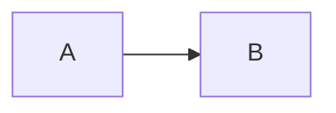
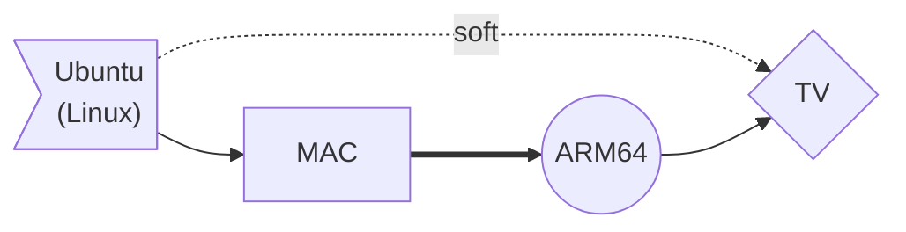
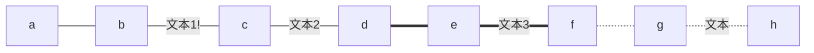
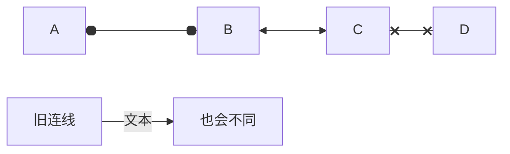
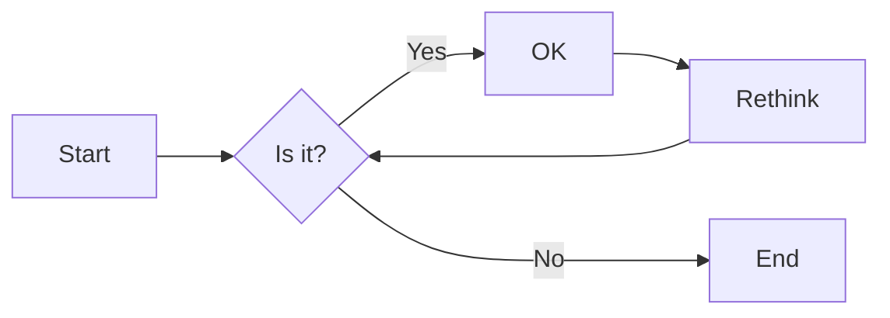
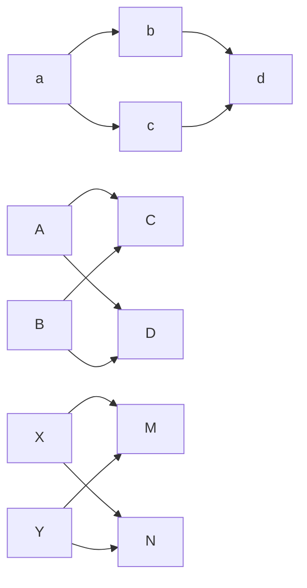
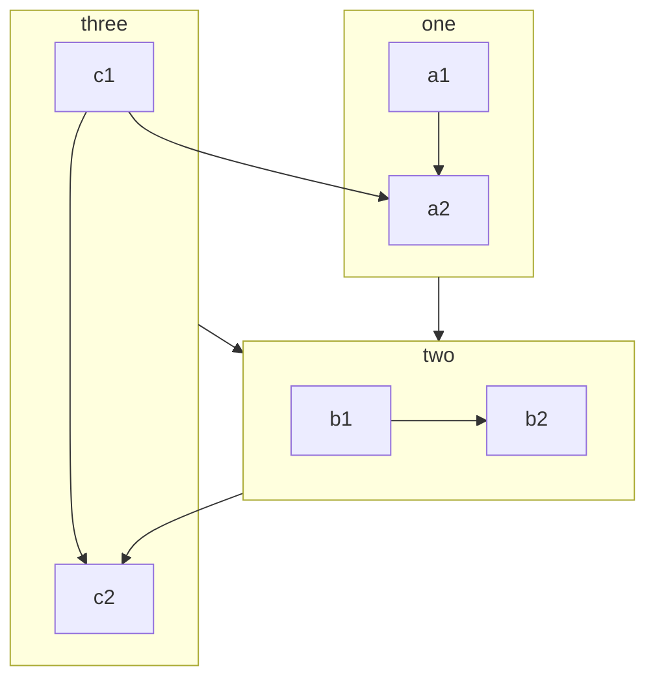

# 第一章 学习笔记介绍

我的Java学习笔记

- 第一阶段：Java基础
- 第二阶段：JavaWeb
- 第三阶段：Java框架
- 第四阶段：微服务
- 第五阶段：扩展

## 1.1 Java基础

加上了JVM和JUC的知识。

## 1.2 JavaWeb

JavaWeb知识点

## 1.3 Java框架

框架和一些中间件

## 1.4 微服务

分布式、微服务

## 1.5 扩展

编程四大件+设计模式。

# 第二章 学习路线

## 2.2 黑马程序员

入门： Java SE基础 → Java Web(含数据库+H5+js+vue)

中级： Maven → Git → SSM框架 → MybatisPlus → Spring Boot→ 《传智健康》项目实战 → 《瑞吉外卖》项目实战

进阶： Spring Cloud(微服务开发,学这一套就够了) 也可以按照以下技术点学： 
Dubbo → Zookeeper → RabbitMQ → RocketMQ → Docker → Redis → MongoDB → 搜索技术Elasticsearch → MySQL进阶

项目： 《SaaSiHRM》企业服务 → 《好客租房》生活服务 → 权限管理一体化解决方案 → 短信网关平台

面试： Java大厂面试专题课 → Java百度地图 

黑马程序员 https://www.bilibili.com/read/cv9965357?spm_id_from=333.999.0.0 

## 2.3 尚硅谷

JavaSE --> MySQL--> JDBC --> JavaWeb --> Spring5 --> SpringMVC --> MyBatis--> Maven --> Ssm框架整合案例 --> Git/GitHub --> Redis6 --> MySQL高级优化 --> MyBatisPlus --> Spring注解驱动开发 -->  ZooKeeper --> Dubbo --> 消息中间件ActiveMQ --> RabbitMQ -->RocketMQ-->SpringBoot2 -->  SpringCloud --> 尚筹网项目 --> 在线教育项目 --> 谷粒商城项目 --> 尚医通项目 --> 尚融宝项目--> 高频面试题第一季 --> 大厂面试题第二季 --> 大厂面试题第三季  

尚硅谷 https://www.bilibili.com/read/cv5216534?spm_id_from=333.999.0.0 

# 第三章 mermaid

Mermaid 是一个用于画流程图、[状态图](https://so.csdn.net/so/search?q=状态图&spm=1001.2101.3001.7020)、时序图、甘特图的库，使用 JS 进行本地渲染，广泛集成于许多 Markdown 编辑器中。

Mermaid 作为一个使用 JS 渲染的库，生成的不是一个“图片”，而是一段 HTML 代码。

[点击进入官网](https://mermaidjs.github.io/)
[点击进入Github 项目地址](https://github.com/knsv/mermaid)

```apl
graph LR; # 其中LR指的是方向
	A --> B # 不同的箭头表示
```



## 3.1 方向和箭头

| 用词 graph x; | 含义     | 箭头       | 含义           |
| ------------- | -------- | ---------- | -------------- |
| `TB`          | 从上到下 | `>`        | 添加尾部箭头   |
| `BT`          | 从下到上 | `-`        | 不添加尾部箭头 |
| `RL`          | 从左到右 | `--`       | 单线           |
| `LR`          | 从右到左 | `--text--` | 单线加文字     |
|               |          | `==`       | 粗线           |
|               |          | `==text==` | 粗线加文字     |
|               |          | `-.-`      | 虚线           |
|               |          | `-.text.-` | 虚线加文字     |

## 3.2 节点

```apl
默认方形
    id1[方形]
    id2(圆边矩形)
    id3([体育场形])
    id4[[子程序形]]
    id5[(圆柱形)]
    id6((圆形))
    id1{菱形}
    id2{{六角形}}
    id3[/平行四边形/]
    id4[\反向平行四边形\]
    id5[/梯形\]
    id6[\反向梯形/]
```

## 3.3 示例

### 3.3.1 示例1

```apl
graph LR;
	A>"Ubuntu<br>(Linux)"] -.soft.-> C{TV}
	B["MAC"] ==> D((ARM64))
	D--> C
	A --> B
```



### 3.3.2 示例2

```apl
graph LR
	a---b
	b--文本1!---c
	c---|文本2|d
	d===e
	e==文本3===f
	f-.-g
	g-.文本.-h
```



### 3.3.3 示例3

```apl
flowchart LR
    A o--o B
    B <--> C
    C x--x D
    
    旧连线 --文本--> 也会不同

```




### 3.3.4 示例4

延长连线：
增加相应字符即可，如下图中的B到E，连线中增加了一个 `-` 。字符可多次添加。

```apl
graph LR
    A[Start] --> B{Is it?};
    B -->|Yes| C[OK];
    C --> D[Rethink];
    D --> B;
    B --->|No| E[End];

```



多重链

```apl
graph LR
   a --> b & c--> d
   
   A & B--> C & D
   
    X --> M
    X --> N
    Y --> M
    Y --> N

```




### 3.3.5 示例5

- 注释 `%%这是一条注释，在渲染图中不可见`
- 子图

```apl
%%这是一条注释，在渲染图中不可见
flowchart TB
    c1-->a2
    subgraph one
    a1-->a2
    end
    subgraph two
    b1-->b2
    end
    subgraph three
    c1-->c2
    end
    one --> two
    three --> two
    two --> c2

```



